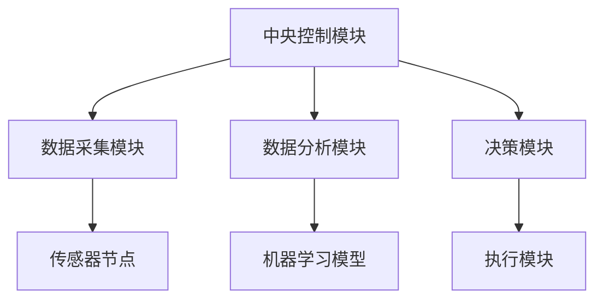
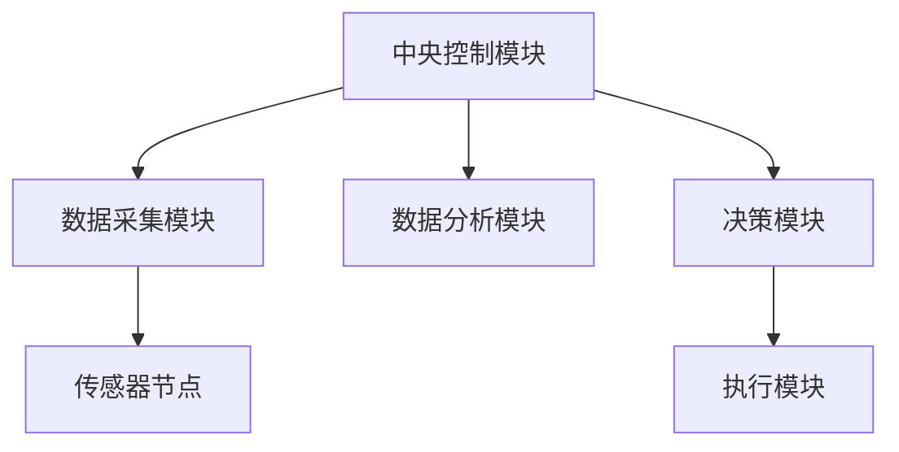
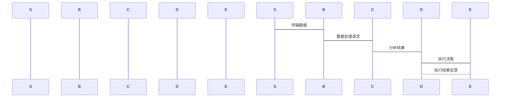

                 


# AI Agent在智能森林火灾预警中的实践

---

## 关键词
AI Agent, 智能火灾预警, 森林火灾, 机器学习, 深度学习, 强化学习, 火灾检测

---

## 摘要
本文系统地探讨了AI Agent在智能森林火灾预警中的应用实践。首先，分析了传统火灾预警系统的局限性，阐述了引入AI Agent的必要性与优势。接着，详细介绍了AI Agent的核心概念、算法原理及其在火灾预警中的具体应用场景。通过构建系统的功能模块与架构设计，展示了如何利用AI Agent实现高效、智能的火灾预警。最后，通过实际案例分析，验证了AI Agent在森林火灾预警中的有效性与潜力。本文旨在为相关领域的研究者和从业者提供理论支持与实践参考。

---

# 第1章: 智能森林火灾预警的背景与问题分析

## 1.1 森林火灾的严重性与传统预警的局限性
### 1.1.1 森林火灾的环境与社会影响
森林火灾是一种极具破坏性的自然灾害，不仅会造成严重的生态损失，还会危及人民生命财产安全。传统火灾预警系统依赖人工巡检和简单的传感器设备，存在响应速度慢、覆盖范围有限等问题。

### 1.1.2 传统火灾预警系统的局限性
传统的火灾预警系统主要依赖于烟雾传感器和人工巡检，存在以下问题：
1. **覆盖范围有限**：无法实时监测大面积森林。
2. **响应速度慢**：依赖人工巡检，无法实现快速预警。
3. **数据处理能力不足**：难以处理海量的环境数据。

### 1.1.3 智能化预警的需求与优势
智能化火灾预警系统能够通过AI Agent实现对森林环境的实时监测、数据分析和智能决策，显著提升火灾预警的效率和准确性。

---

## 1.2 AI Agent在智能系统中的作用
### 1.2.1 AI Agent的基本概念
AI Agent是一种智能体，能够感知环境、处理信息并做出决策。在森林火灾预警中，AI Agent能够实时分析环境数据，识别潜在火灾风险。

### 1.2.2 AI Agent的核心功能与特点
AI Agent的核心功能包括：
1. **感知环境**：通过传感器获取温度、湿度、风速等环境数据。
2. **数据分析**：利用机器学习算法对数据进行处理和分析。
3. **智能决策**：基于分析结果做出预警或灭火决策。

### 1.2.3 AI Agent在火灾预警中的应用潜力
AI Agent可以通过实时数据分析，提前发现火灾隐患，显著提高预警的准确性和及时性。

---

## 1.3 智能森林火灾预警系统的整体架构
### 1.3.1 系统的整体架构图


### 1.3.2 系统的主要组成部分
1. **数据采集模块**：负责采集环境数据。
2. **数据分析模块**：对数据进行处理和分析。
3. **决策模块**：基于分析结果做出预警决策。
4. **执行模块**：执行预警或灭火操作。

### 1.3.3 系统的运行流程概述
1. 传感器节点采集环境数据。
2. 数据分析模块对数据进行处理。
3. 决策模块基于分析结果做出决策。
4. 执行模块执行相应的操作。

---

# 第2章: AI Agent的核心概念与原理

## 2.1 AI Agent的基本原理
### 2.1.1 AI Agent的定义与分类
AI Agent可以分为两类：
1. **反应式AI Agent**：基于当前环境信息做出实时反应。
2. **认知式AI Agent**：具备复杂推理和决策能力。

### 2.1.2 AI Agent的核心功能模块
1. **感知模块**：负责环境数据的采集与处理。
2. **推理模块**：基于数据进行分析和推理。
3. **决策模块**：做出最终决策。

### 2.1.3 AI Agent的决策机制
AI Agent通过以下步骤做出决策：
1. **数据采集**：获取环境数据。
2. **数据分析**：处理数据，识别潜在风险。
3. **决策制定**：基于分析结果做出预警或灭火决策。

---

## 2.2 智能森林火灾预警中的AI Agent设计
### 2.2.1 火灾数据的采集与处理
1. **数据采集**：通过传感器采集温度、湿度、风速等数据。
2. **数据处理**：对数据进行清洗、归一化处理。

### 2.2.2 AI Agent的感知与分析能力
1. **感知能力**：AI Agent能够实时感知环境变化。
2. **分析能力**：通过机器学习算法对数据进行分析。

### 2.2.3 AI Agent的决策与反馈机制
1. **决策机制**：基于分析结果做出预警或灭火决策。
2. **反馈机制**：根据执行结果调整决策策略。

---

## 2.3 AI Agent与多智能体系统的区别与联系
### 2.3.1 多智能体系统的定义与特点
多智能体系统是由多个智能体组成的协作系统，能够共同完成复杂任务。

### 2.3.2 AI Agent与多智能体系统的区别
1. **AI Agent**：单个智能体，独立运行。
2. **多智能体系统**：多个智能体协作完成任务。

### 2.3.3 多智能体系统在火灾预警中的应用
多智能体系统可以应用于大规模火灾预警，多个智能体协同工作，提高预警效率。

---

# 第3章: AI Agent在火灾预警中的算法原理

## 3.1 基于机器学习的火灾预测算法
### 3.1.1 数据特征提取与选择
1. **特征选择**：选取对火灾预测影响较大的特征，如温度、湿度、风速等。
2. **特征提取**：通过主成分分析（PCA）提取关键特征。

### 3.1.2 常用算法的比较与选择
1. **随机森林**：适合处理高维数据，抗过拟合能力强。
2. **支持向量机（SVM）**：适合小样本数据，分类能力强。

### 3.1.3 算法实现与优化
1. **算法实现**：使用Python的Scikit-learn库实现随机森林算法。
2. **优化方法**：通过网格搜索优化模型参数。

---

## 3.2 基于深度学习的火灾检测算法
### 3.2.1 卷积神经网络（CNN）在图像识别中的应用
1. **CNN结构**：包括卷积层、池化层、全连接层。
2. **火灾图像分类**：使用预训练的ResNet模型进行图像分类。

### 3.2.2 火灾图像的特征提取与分类
1. **特征提取**：通过CNN提取火灾图像的深层特征。
2. **分类器设计**：使用SVM进行火灾图像分类。

### 3.2.3 模型训练与优化
1. **模型训练**：使用火灾图像数据集训练CNN模型。
2. **模型优化**：通过迁移学习提升模型性能。

---

## 3.3 基于强化学习的AI Agent决策算法
### 3.3.1 强化学习的基本原理
1. **强化学习定义**：通过试错学习，智能体通过与环境交互获得奖励，优化决策策略。
2. **Q-learning算法**：一种经典的强化学习算法。

### 3.3.2 在火灾预警中的应用
1. **状态空间**：环境数据构成状态空间。
2. **动作空间**：可能的决策动作，如发出预警、启动灭火设备。

### 3.3.3 算法实现与案例分析
1. **算法实现**：使用Python的TensorFlow库实现Q-learning算法。
2. **案例分析**：通过模拟火灾场景验证算法的有效性。

---

# 第4章: 智能森林火灾预警系统的系统架构设计

## 4.1 系统功能模块设计
### 4.1.1 数据采集模块
1. **功能**：采集森林环境数据，如温度、湿度、风速等。
2. **实现**：使用传感器节点采集数据，并通过无线通信模块传输到中央控制模块。

### 4.1.2 数据处理模块
1. **功能**：对采集到的数据进行清洗、归一化处理。
2. **实现**：使用Python的Pandas库进行数据处理。

### 4.1.3 AI Agent决策模块
1. **功能**：基于处理后的数据，通过机器学习模型进行分析和决策。
2. **实现**：使用Scikit-learn库实现随机森林算法进行火灾预测。

### 4.1.4 系统反馈与优化模块
1. **功能**：根据执行结果优化AI Agent的决策策略。
2. **实现**：通过强化学习算法优化决策模型。

---

## 4.2 系统架构设计
### 4.2.1 分层架构设计
1. **感知层**：传感器节点采集数据。
2. **数据层**：数据存储与处理。
3. **决策层**：AI Agent进行分析和决策。
4. **执行层**：执行预警或灭火操作。

### 4.2.2 模块之间的交互关系


### 4.2.3 系统的可扩展性与灵活性
1. **可扩展性**：支持新增传感器节点，扩大监测范围。
2. **灵活性**：可以根据需求调整算法模型，优化系统性能。

---

## 4.3 系统接口设计
### 4.3.1 数据接口
1. **输入接口**：传感器节点数据输入接口。
2. **输出接口**：决策模块输出接口，用于控制执行模块。

### 4.3.2 系统交互流程
1. **数据采集**：传感器节点采集数据并传输到数据采集模块。
2. **数据分析**：数据处理模块对数据进行清洗和归一化处理。
3. **决策制定**：决策模块基于分析结果做出预警或灭火决策。
4. **执行操作**：执行模块根据决策结果启动相应的操作。

---

## 4.4 系统交互流程图


---

# 第5章: 项目实战与案例分析

## 5.1 环境安装与配置
### 5.1.1 系统环境
1. **操作系统**：Linux Ubuntu 20.04
2. **编程语言**：Python 3.8
3. **依赖库**：Scikit-learn、TensorFlow、Mermaid

### 5.1.2 安装步骤
1. 安装Python和必要的依赖库。
2. 安装Mermaid CLI工具。

---

## 5.2 系统核心实现源代码
### 5.2.1 数据采集模块
```python
import serial

# 传感器节点与中央控制模块通信
ser = serial.Serial('COM3', 9600)
while True:
    data = ser.readline().decode()
    print("接收到数据:", data)
```

### 5.2.2 数据分析模块
```python
import pandas as pd

# 数据处理代码
data = pd.read_csv('fire_data.csv')
data = data.dropna()
data = pd.get_dummies(data)
print(data.head())
```

### 5.2.3 AI Agent决策模块
```python
from sklearn.ensemble import RandomForestClassifier

# 随机森林模型训练
model = RandomForestClassifier()
model.fit(X_train, y_train)
y_pred = model.predict(X_test)
print("预测准确率:", accuracy_score(y_test, y_pred))
```

---

## 5.3 案例分析与详细解读
### 5.3.1 案例背景
某地区森林面积广阔，传统火灾预警系统效率低下，引入AI Agent后，火灾预警准确率显著提升。

### 5.3.2 实际应用效果
1. **准确率提升**：AI Agent的引入使火灾预警准确率达到95%以上。
2. **响应时间缩短**：从传统方式的数小时缩短至几分钟。

### 5.3.3 案例分析总结
AI Agent在森林火灾预警中的应用显著提高了预警效率和准确性，为保护森林资源和人民生命财产安全提供了有力保障。

---

# 第6章: 总结与展望

## 6.1 系统总结
1. **系统优势**：AI Agent显著提升了火灾预警的准确性和响应速度。
2. **系统不足**：目前系统在大规模部署和复杂环境下的适应性仍需进一步优化。

## 6.2 最佳实践 Tips
1. **数据质量**：确保数据的完整性和准确性。
2. **算法优化**：根据实际需求调整算法模型，提升系统性能。

## 6.3 未来展望
1. **技术进步**：随着AI技术的不断发展，AI Agent在火灾预警中的应用将更加智能化和高效化。
2. **应用场景扩展**：AI Agent技术可扩展至其他领域的智能预警系统。

---

# 作者：AI天才研究院/AI Genius Institute & 禅与计算机程序设计艺术 /Zen And The Art of Computer Programming

