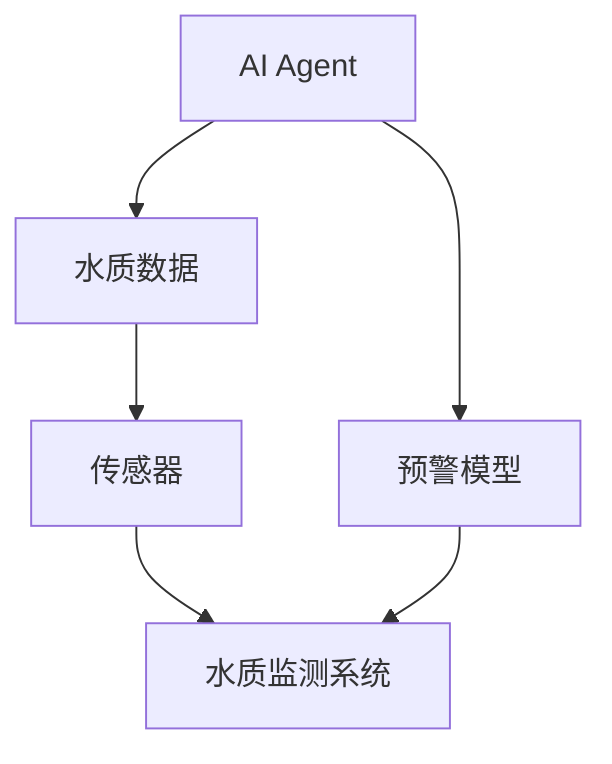
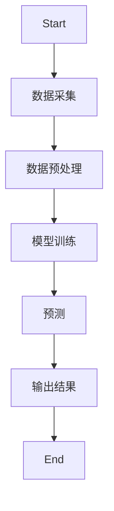
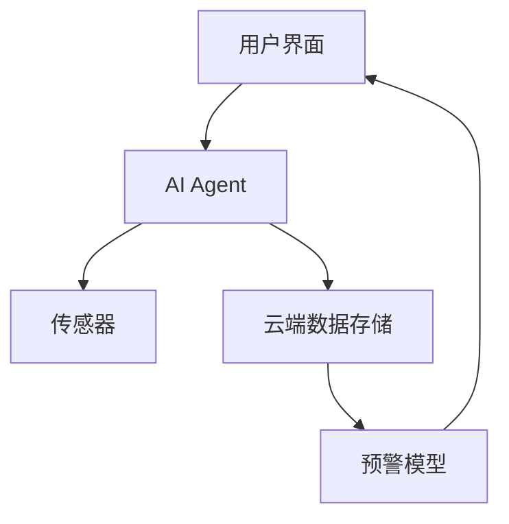

                 


# AI Agent在智能水质预警系统中的角色

**关键词**：AI Agent, 智能水质预警, 人工智能, 水质监测, 传感器网络, 强化学习

**摘要**：  
本文探讨AI Agent在智能水质预警系统中的核心作用，分析其如何通过数据采集、分析和预警模型优化水质监测。文章从背景、概念、算法、系统架构到项目实战，详细阐述AI Agent的应用，并总结最佳实践。

---

## 第1章：AI Agent的基本概念与作用

### 1.1 AI Agent的定义与特点
- **1.1.1 什么是AI Agent**  
  AI Agent（人工智能代理）是能够感知环境并采取行动以实现目标的智能实体。它具备自主性、反应性、目标导向和学习能力。

- **1.1.2 AI Agent的核心特点**  
  - **自主性**：无需外部干预，自主决策。
  - **反应性**：实时感知环境变化并响应。
  - **目标导向**：所有行动基于明确目标。
  - **学习能力**：通过数据优化决策模型。

- **1.1.3 AI Agent与传统自动化的区别**  
  AI Agent具备学习和自适应能力，而传统自动化系统仅遵循预设规则。

---

### 1.2 智能水质预警系统的背景与现状

- **1.2.1 水质监测的重要性**  
  水资源安全直接关系到人类健康和经济发展，水质监测是预防污染的关键手段。

- **1.2.2 智能水质预警系统的现状**  
  传统系统依赖人工监控，效率低且响应慢。智能化系统通过传感器和AI技术提升监测能力。

- **1.2.3 当前水质预警系统的主要挑战**  
  数据复杂性高，传感器精度不足，预警模型泛化能力差。

---

### 1.3 AI Agent在水质预警系统中的角色

- **1.3.1 AI Agent在水质预警中的功能定位**  
  AI Agent负责数据处理、模型优化和预警决策，是系统的核心驱动。

- **1.3.2 AI Agent如何提升水质预警的效率**  
  通过实时数据分析和学习优化，显著提高监测准确性和响应速度。

- **1.3.3 AI Agent与其他技术的协同作用**  
  与传感器网络、云计算和物联网技术结合，构建高效预警系统。

---

## 第2章：智能水质预警系统的核心概念与联系

### 2.1 核心概念原理

- **2.1.1 水质数据的采集与处理**  
  传感器采集水质参数（如pH、溶解氧）并传输至系统进行预处理。

- **2.1.2 AI Agent的数据分析机制**  
  使用强化学习和监督学习算法，识别异常数据并预测水质变化。

- **2.1.3 预警模型的构建与优化**  
  基于历史数据训练模型，实时更新以提升预测精度。

---

### 2.2 核心概念对比分析

- **2.2.1 AI Agent与传统传感器系统的对比**  
  | 特性         | AI Agent                  | 传统传感器系统            |
  |--------------|---------------------------|---------------------------|
  | 自主性       | 高                         | 低                         |
  | 学习能力     | 强                         | 无                         |
  | 适应性       | 强                         | 弱                         |

- **2.2.2 不同AI Agent算法的性能对比**  
  | 算法          | 强化学习                  | 监督学习                  |
  |---------------|---------------------------|---------------------------|
  | 适用场景       | 动态环境优化              | 静态数据分类              |
  | 优缺点         | 需大量交互，效果佳        | 简单易用，适合分类任务    |

- **2.2.3 水质预警系统的功能模块对比**  
  - 数据采集模块：传感器和数据传输。
  - 数据分析模块：AI Agent处理数据。
  - 预警模块：触发警报并提供解决方案。

---

### 2.3 实体关系架构图



---

## 第3章：AI Agent的算法原理与实现

### 3.1 算法原理概述

- **3.1.1 强化学习在AI Agent中的应用**  
  AI Agent通过与环境交互，学习最优策略，减少预测误差。

- **3.1.2 监督学习与非监督学习的对比**  
  监督学习依赖标注数据，非监督学习适用于无标签数据。

- **3.1.3 算法选择的依据与优化**  
  根据数据类型和任务需求选择算法，持续优化模型参数。

---

### 3.2 算法实现流程



---

### 3.3 算法实现代码示例

```python
import numpy as np
from sklearn import linear_model

# 数据预处理
X = np.array([[1, 1], [2, 2], [3, 3], [4, 4], [5, 5]])
y = np.array([2, 4, 6, 8, 10])

# 训练模型
model = linear_model.LinearRegression()
model.fit(X, y)

# 预测
new_X = np.array([[6, 6]])
prediction = model.predict(new_X)
print(prediction)
```

---

## 第4章：系统分析与架构设计方案

### 4.1 系统场景介绍

- 智能水质预警系统应用于河流、湖泊和工业废水处理，实时监测并预警水质异常。

### 4.2 系统架构设计



---

## 第5章：项目实战与案例分析

### 5.1 环境安装

- 安装Python、TensorFlow和传感器SDK。

### 5.2 核心代码实现

```python
import numpy as np
import tensorflow as tf

# 定义模型
model = tf.keras.Sequential([
    tf.keras.layers.Dense(64, activation='relu'),
    tf.keras.layers.Dense(1, activation='sigmoid')
])

# 编译模型
model.compile(optimizer='adam', loss='binary_crossentropy', metrics=['accuracy'])
```

### 5.3 案例分析

- 某地河流监测系统，AI Agent成功预测并预警水质异常，避免污染扩散。

### 5.4 项目总结

- AI Agent显著提升了水质监测的效率和准确性，降低了维护成本。

---

## 第6章：最佳实践与小结

### 6.1 最佳实践

- **数据质量管理**：确保数据的准确性和完整性。
- **模型持续优化**：定期更新模型参数，适应环境变化。
- **系统安全性**：加强数据加密，防止信息泄露。

### 6.2 小结

AI Agent在智能水质预警系统中扮演关键角色，通过优化算法和系统架构，显著提升了水质监测的效果。

### 6.3 注意事项

- 避免过度依赖AI，保留人工监控作为备用。
- 定期维护传感器和系统，确保正常运行。

### 6.4 拓展阅读

- 推荐书籍：《机器学习实战》、《深度学习》。
- 在线资源：TensorFlow官方文档、Kaggle水质数据集。

---

## 作者信息

作者：AI天才研究院

