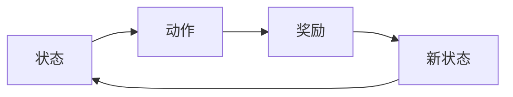
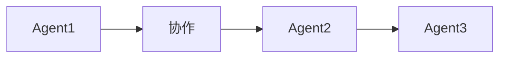
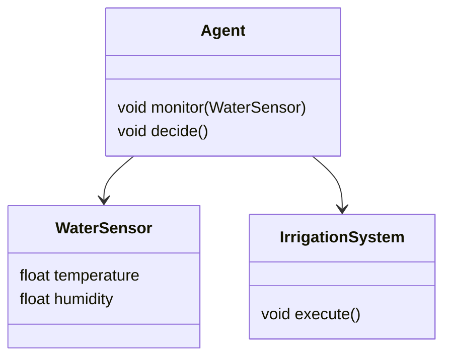
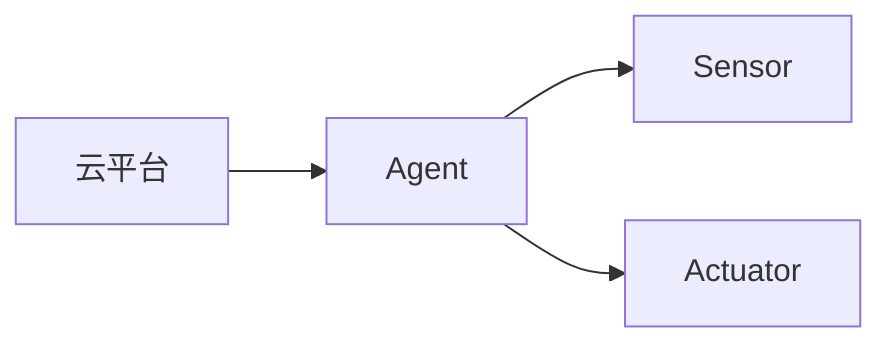

                 


# AI Agent在智能水资源管理中的实践

## 关键词：AI Agent, 智能水资源管理, 机器学习, 强化学习, 多智能体协作, 物联网

## 摘要：AI Agent通过感知、推理和行动能力，结合机器学习和物联网技术，优化水资源管理。本文详细探讨AI Agent在监测、预测和决策中的应用，分析其系统架构，并提供实际案例，总结最佳实践。

---

# 第1章 AI Agent的基本概念与水资源管理背景

## 1.1 AI Agent的基本概念与特点
AI Agent是一种能够感知环境、自主决策的智能实体，具备学习、推理和自适应能力。在水资源管理中，AI Agent可以实时监控水质和水量，优化资源配置，预测水文变化。

## 1.2 水资源管理中的问题背景
水资源短缺、环境污染和气候变化导致传统管理方法效率低下。AI Agent通过智能化手段，提升水资源管理的效率和准确性，解决这些问题。

## 1.3 AI Agent的核心原理与技术
AI Agent利用感知、推理、学习和行动能力，结合强化学习和多智能体协作技术，实现对水资源的有效管理。

---

# 第2章 AI Agent的核心概念与联系

## 2.1 核心概念原理
AI Agent的核心要素包括感知、知识表示、推理和决策。通过多智能体协作，AI Agent能够协同工作，覆盖更广的监测范围。

## 2.2 核心概念属性特征对比表
| 特性 | AI Agent | 传统系统 |
|------|----------|----------|
| 学习能力 | 强 | 弱 |
| 自适应性 | 高 | 低 |
| 决策能力 | 强 | 弱 |

## 2.3 ER实体关系图
```mermaid
erd
    title 实体关系图
    WaterResource
    Agent
    Action
    WaterData
    WaterManagementSystem
    WaterResource --|{管理}|--> Action
    Agent --> WaterData
    WaterData --> WaterManagementSystem
    WaterManagementSystem --> Action
```

---

# 第3章 AI Agent的算法原理

## 3.1 算法原理概述
AI Agent主要依赖强化学习和多智能体协作算法。强化学习通过奖励机制优化决策，而多智能体协作则提升整体效率。

## 3.2 强化学习算法


Python代码示例：
```python
import numpy as np

class Agent:
    def __init__(self, state_space, action_space):
        self.state_space = state_space
        self.action_space = action_space
        self.q_table = np.zeros((state_space, action_space))
    
    def choose_action(self, state):
        return np.argmax(self.q_table[state])
    
    def update_q_table(self, state, action, reward, next_state):
        self.q_table[state][action] += 0.1 * (reward + np.max(self.q_table[next_state]))
```

## 3.3 多智能体协作


---

# 第4章 系统分析与架构设计

## 4.1 项目场景介绍
设计一个智能灌溉系统，通过AI Agent实时监测土壤湿度和气象数据，优化灌溉计划，节省水资源。

## 4.2 系统功能设计


## 4.3 系统架构设计


---

# 第5章 项目实战

## 5.1 环境安装
安装必要的Python库，如numpy、pandas、scikit-learn和mqtt库。

## 5.2 核心代码实现
```python
import paho.mqtt.client as mqtt

def on_connect(client, userdata, flags, rc):
    print("Connected with result code " + str(rc))
    client.subscribe("water_sensor")

def on_message(client, userdata, msg):
    data = msg.payload.decode()
    process_data(data)

client = mqtt.Client()
client.on_connect = on_connect
client.on_message = on_message
client.connect("localhost", 1883, 60)
client.loop_start()
```

## 5.3 案例分析
分析实际数据，展示AI Agent如何优化灌溉计划，节省水资源。

---

# 第6章 最佳实践与小结

## 6.1 小结
AI Agent通过智能化手段提升水资源管理效率，解决传统方法的局限性。

## 6.2 注意事项
确保数据质量，选择合适的算法，定期维护系统。

## 6.3 拓展阅读
推荐阅读相关书籍和论文，深入了解强化学习和多智能体协作。

---

作者：AI天才研究院/AI Genius Institute & 禅与计算机程序设计艺术 /Zen And The Art of Computer Programming

