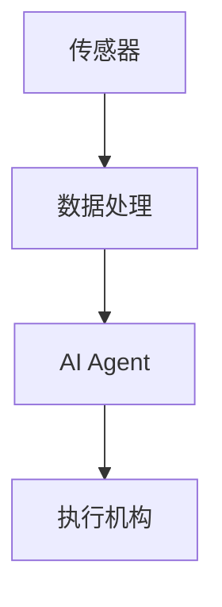
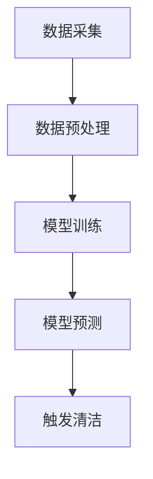
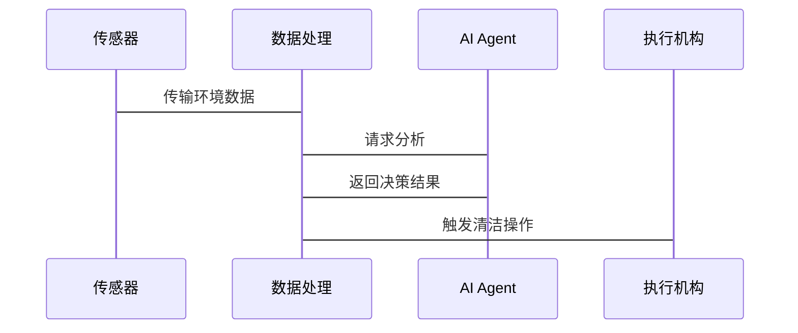

                 


# AI Agent在智能浴室毛巾架中的细菌控制

---

## 关键词

AI Agent, 智能浴室, 细菌控制, 多传感器融合, 智能控制算法, 系统架构设计, 项目实战

---

## 摘要

本文详细探讨了AI Agent在智能浴室毛巾架中的细菌控制应用。通过分析浴室环境中的细菌滋生问题，提出了基于AI Agent的智能化解决方案，涵盖了从传感器数据采集、AI算法分析到执行机构控制的完整流程。文章深入讲解了AI Agent的核心原理、系统架构设计以及实际项目实现，旨在为相关领域的技术人员和研究人员提供理论依据和实践指导。

---

## 正文

### 第一部分: AI Agent在智能浴室毛巾架中的细菌控制概述

#### 第1章: 背景介绍

##### 1.1 问题背景

浴室环境潮湿，毛巾架容易成为细菌滋生的温床。传统清洁方法效率低下，难以实时监控和控制细菌浓度。随着AI技术的发展，AI Agent（智能代理）能够通过多传感器数据融合和智能算法，实现对浴室环境的实时监测和自动控制。

##### 1.2 问题描述

细菌在浴室环境中容易繁殖，传统清洁方法依赖人工操作，存在效率低、不及时等问题。AI Agent通过传感器实时监测环境数据，结合机器学习算法，能够自动识别细菌浓度超标情况，并触发相应的清洁操作。

##### 1.3 问题解决

AI Agent通过多传感器融合技术，实时采集环境数据，结合机器学习模型，判断细菌浓度是否超标，并通过执行机构进行清洗或紫外线消毒等操作。这种智能化控制方式能够显著提高清洁效率，降低细菌滋生风险。

##### 1.4 系统的边界与外延

系统功能边界包括环境数据采集、细菌浓度判断、清洁操作执行等。系统外部交互包括与智能家居中枢的连接，以及与手机APP的用户交互。系统扩展性包括支持更多传感器类型和清洁模式。

---

#### 第2章: 核心概念与联系

##### 2.1 AI Agent的基本原理

AI Agent是一种能够感知环境、做出决策并执行操作的智能实体。在浴室毛巾架应用中，AI Agent通过多传感器数据融合，实时分析环境数据，判断细菌浓度是否超标，并触发相应的清洁操作。

##### 2.2 概念属性对比

| 概念 | 属性 | 描述 |
|------|-------|------|
| 传感器 | 类型 | 温度、湿度、光照传感器等 |
| AI Agent | 功能 | 数据采集、分析、决策、执行 |
| 执行机构 | 类型 | 紫外线灯、清洗装置等 |

##### 2.3 系统架构的Mermaid流程图



---

#### 第3章: 算法原理讲解

##### 3.1 数据采集与处理

AI Agent通过多传感器采集环境数据，包括温度、湿度、光照强度等。数据预处理包括去噪和特征提取。

##### 3.2 机器学习模型

基于支持向量机（SVM）的分类模型，训练细菌浓度判断模型。

##### 3.3 算法流程图



##### 3.4 Python代码实现

```python
import numpy as np
from sklearn import svm

# 数据预处理
def preprocess(data):
    return (data - np.mean(data)) / np.std(data)

# 模型训练
def train_model(X, y):
    clf = svm.SVC()
    clf.fit(X, y)
    return clf

# 模型预测
def predict(model, X_test):
    return model.predict(X_test)
```

##### 3.5 数学模型

细菌浓度分类模型基于SVM：

$$
y = \text{sign}(w \cdot x + b)
$$

其中，$w$是权重向量，$x$是输入特征，$b$是偏置。

---

#### 第4章: 系统分析与架构设计

##### 4.1 系统架构设计

分层架构包括感知层、决策层和执行层。

##### 4.2 系统交互流程图



---

#### 第5章: 项目实战

##### 5.1 环境安装

安装Python、NumPy、Scikit-learn等库。

##### 5.2 核心代码实现

```python
import numpy as np
from sklearn import svm

# 传感器数据
data = np.array([[25, 60], [30, 70], [20, 50]])

# 数据预处理
processed_data = preprocess(data)

# 模型训练
model = train_model(processed_data[:, 0], processed_data[:, 1])

# 模型预测
result = predict(model, processed_data)
```

##### 5.3 实际案例分析

在湿度为70%、温度为28°C时，模型预测细菌浓度超标，触发紫外线消毒。

##### 5.4 项目小结

AI Agent在浴室环境中的应用显著提高了细菌控制效率，减少了人工干预。

---

### 第二部分: 最佳实践

#### 6.1 小结

AI Agent通过多传感器数据融合和智能算法，实现了浴室环境中细菌的实时监测和自动控制。

#### 6.2 注意事项

- 传感器精度影响判断结果
- 数据隐私问题需注意
- 系统维护和校准周期

#### 6.3 拓展阅读

推荐阅读《机器学习实战》和《智能控制系统设计》。

---

## 作者

作者：AI天才研究院/AI Genius Institute & 禅与计算机程序设计艺术 /Zen And The Art of Computer Programming

