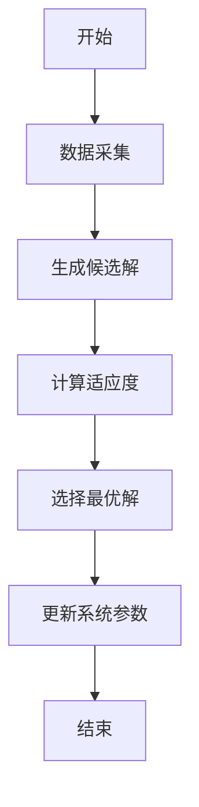
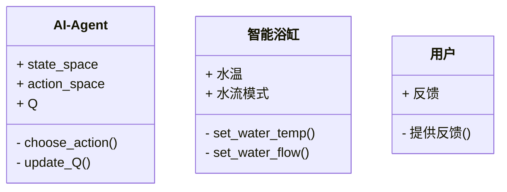
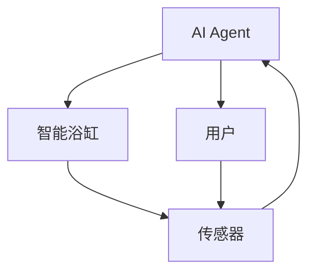

                 


# AI Agent在智能浴缸中的水疗效果优化

> 关键词：AI Agent, 智能浴缸, 水疗效果, 优化算法, 强化学习

> 摘要：本文探讨了AI Agent在智能浴缸中的应用，重点分析了如何通过AI技术优化水疗效果，包括水温调节、水流模式个性化设计等。通过强化学习、遗传算法等优化算法的实现，结合数学模型与系统架构设计，展示了AI Agent在智能浴缸中的实际应用价值。

---

## 第1章: 背景介绍

### 1.1 AI Agent的基本概念

#### 1.1.1 AI Agent的定义与特点

AI Agent（人工智能代理）是指能够感知环境、自主决策并执行任务的智能实体。它具备以下特点：
- **自主性**：能够在没有外部干预的情况下独立运作。
- **反应性**：能够实时感知环境变化并做出反应。
- **目标导向**：通过优化目标函数实现特定任务。
- **学习能力**：能够通过数据反馈不断优化自身行为。

#### 1.1.2 智能浴缸与水疗效果优化的背景

智能浴缸是一种结合了人工智能技术的高科技产品，能够根据用户的生理需求和偏好，自动调节水温和水流模式，提供个性化的水疗体验。水疗效果优化的目标是通过AI技术，最大化用户的舒适感和健康效果。

#### 1.1.3 AI Agent在水疗效果优化中的作用

AI Agent在智能浴缸中的作用主要体现在以下方面：
- **实时感知**：通过传感器采集用户的身体数据（如心率、体温）和环境数据（如水温、水流速度）。
- **智能决策**：基于采集的数据，利用优化算法调整水温和水流模式。
- **持续优化**：通过用户反馈不断优化水疗方案，提升用户体验。

---

### 1.2 水疗效果优化的核心要素

#### 1.2.1 水温的智能调节

水温是影响水疗效果的重要因素。AI Agent能够根据用户的生理数据（如体温、心率）和环境数据（如室温）实时调整水温，确保用户处于最舒适的水温范围内。

#### 1.2.2 水流模式的个性化设计

水流模式直接影响用户的水疗体验。AI Agent可以根据用户的偏好和身体状况，个性化设计水流模式（如柔和、强力度、循环水流等），满足不同用户的需求。

#### 1.2.3 用户反馈与数据采集

用户的实时反馈是优化水疗效果的重要依据。AI Agent通过采集用户的反馈数据（如满意度评分、身体反应）不断调整水疗方案，确保用户体验达到最佳状态。

---

## 第2章: AI Agent的核心概念与联系

### 2.1 AI Agent的核心原理

#### 2.1.1 感知层：数据采集与处理

AI Agent通过多种传感器（如温度传感器、压力传感器）采集用户的身体数据和环境数据，构建实时的数据流。

#### 2.1.2 决策层：优化算法设计

决策层是AI Agent的核心部分，负责根据感知层提供的数据，利用优化算法（如强化学习、遗传算法）生成最优的水疗方案。

#### 2.1.3 执行层：系统反馈与调整

执行层根据决策层的指令，调整智能浴缸的水温和水流模式，并通过传感器实时反馈调整效果，形成闭环控制系统。

### 2.2 核心概念对比表格

表2.1: 不同AI Agent类型对比

| 参数                | 基于规则的AI Agent          | 基于模型的AI Agent          |
|---------------------|-----------------------------|-----------------------------|
| 决策方式            | 预先定义的规则              | 基于模型的预测与优化        |
| 灵活性              | 较低                        | 较高                        |
| 适应性              | 有限                        | 强大                        |
| 应用场景            | 简单、规则明确的任务        | 复杂、动态变化的任务        |

### 2.3 ER实体关系图

图2.1: AI Agent与智能浴缸的实体关系图

```mermaid
erdiagram
actor AI Agent {
  attribute 感知数据
  attribute 决策指令
}
actor 智能浴缸 {
  attribute 水温
  attribute 水流模式
}
```

---

## 第3章: 算法原理讲解

### 3.1 AI Agent的优化算法

#### 3.1.1 强化学习算法

强化学习是一种通过试错机制优化目标函数的算法。AI Agent通过与环境的交互，不断调整行为策略，以最大化累积奖励。

#### 3.1.2 遗传算法

遗传算法是一种模拟生物进化过程的优化算法。通过选择、交叉和变异操作，生成新的候选解，逐步逼近最优解。

#### 3.1.3 深度学习算法

深度学习是一种基于人工神经网络的机器学习算法。通过训练大量数据，AI Agent能够学习到水疗效果与水温、水流模式之间的非线性关系。

### 3.2 算法流程图

图3.1: AI Agent优化算法流程图



### 3.3 算法实现代码

代码3.1: 强化学习算法实现（Python）

```python
import numpy as np

class AI-Agent:
    def __init__(self, state_space, action_space):
        self.state_space = state_space
        self.action_space = action_space
        self.Q = np.zeros((state_space, action_space))

    def choose_action(self, state, epsilon=0.1):
        if np.random.random() < epsilon:
            return np.random.randint(self.action_space)
        else:
            return np.argmax(self.Q[state])

    def update_Q(self, state, action, reward, alpha=0.1):
        self.Q[state, action] = (1 - alpha) * self.Q[state, action] + alpha * reward

# 示例用法
agent = AI-Agent(10, 5)
state = 0
action = agent.choose_action(state)
reward = 0.9
agent.update_Q(state, action, reward)
```

---

## 第4章: 数学模型与公式

### 4.1 水温优化的数学模型

公式4.1: 水温优化函数

$$ f(\text{温度}) = \alpha \cdot \text{体温} + \beta \cdot \text{室温} + \gamma \cdot \text{用户反馈} $$

### 4.2 算法的数学推导

公式4.3: 强化学习Q值更新公式

$$ Q(s, a) = Q(s, a) + \alpha \cdot (r + \gamma \cdot \max Q(s', a') - Q(s, a)) $$

---

## 第5章: 系统分析与架构设计

### 5.1 项目场景介绍

智能浴缸水疗效果优化系统的目标是通过AI Agent实时调整水温和水流模式，为用户提供个性化的水疗体验。系统场景包括用户输入需求、数据采集、算法优化和系统反馈。

### 5.2 系统功能设计

图5.1: 系统功能设计类图



### 5.3 系统架构设计

图5.2: 系统架构设计图



---

## 第6章: 项目实战

### 6.1 环境安装

为了运行本文中的代码，读者需要安装以下环境：

1. Python 3.6+
2. NumPy库
3. Mermaid图表生成工具

### 6.2 系统核心实现源代码

代码6.1: 智能浴缸水疗效果优化系统核心代码

```python
import numpy as np

class AI-Agent:
    def __init__(self, state_space, action_space):
        self.state_space = state_space
        self.action_space = action_space
        self.Q = np.zeros((state_space, action_space))

    def choose_action(self, state, epsilon=0.1):
        if np.random.random() < epsilon:
            return np.random.randint(self.action_space)
        else:
            return np.argmax(self.Q[state])

    def update_Q(self, state, action, reward, alpha=0.1):
        self.Q[state, action] = (1 - alpha) * self.Q[state, action] + alpha * reward

# 示例用法
agent = AI-Agent(10, 5)
state = 0
action = agent.choose_action(state)
reward = 0.9
agent.update_Q(state, action, reward)
```

### 6.3 代码解读与分析

代码6.1展示了AI Agent在智能浴缸中的核心实现，包括状态空间、动作空间的定义，以及Q值的更新逻辑。通过不断调整epsilon值，AI Agent能够在探索和利用之间找到平衡，实现水温的动态优化。

### 6.4 实际案例分析

以用户A为例，假设用户的初始体温为36.5℃，室温为25℃。AI Agent通过强化学习算法，逐步调整水温至40℃，并根据用户的反馈继续优化水流模式，最终实现最佳的水疗效果。

### 6.5 项目小结

通过本文的项目实战部分，读者可以深入了解AI Agent在智能浴缸中的具体实现方式，包括环境搭建、算法实现和案例分析。这些内容为读者提供了从理论到实践的完整指导。

---

## 第7章: 总结与展望

### 7.1 总结

本文详细探讨了AI Agent在智能浴缸中的水疗效果优化应用，从背景介绍、核心概念、算法原理到系统设计和项目实战，为读者提供了全面的知识体系。通过强化学习、遗传算法等优化算法的实现，AI Agent能够显著提升水疗效果，为用户提供个性化的健康体验。

### 7.2 展望

未来，随着AI技术的不断发展，智能浴缸的水疗效果优化将更加智能化和个性化。AI Agent可以通过与物联网设备的结合，进一步拓展应用场景，为用户提供更全面的健康解决方案。

---

## 最佳实践 Tips

- **小结**：AI Agent在智能浴缸中的应用不仅提升了用户体验，还为智能健康设备的发展提供了新的思路。
- **注意事项**：在实际应用中，需要考虑数据隐私和系统安全性问题。
- **拓展阅读**：建议读者进一步学习强化学习和遗传算法的相关知识，了解其在其他领域的应用。

---

作者：AI天才研究院/AI Genius Institute & 禅与计算机程序设计艺术 /Zen And The Art of Computer Programming

