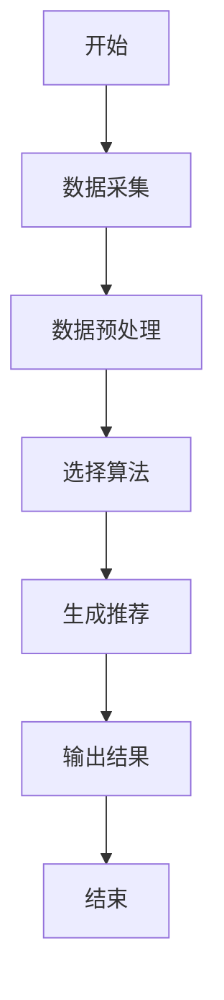

                 


# AI Agent在智能浴缸中的水疗模式个性化

## 关键词：AI Agent，智能浴缸，水疗模式，个性化推荐，系统架构

## 摘要：本文探讨AI Agent在智能浴缸中的应用，重点分析水疗模式的个性化推荐系统。通过详细讲解AI Agent的基本原理、推荐算法、系统架构，结合实际项目案例，展示如何利用技术提升用户体验。

---

## 第1章：AI Agent与智能浴缸的背景介绍

### 1.1 问题背景与问题描述

#### 1.1.1 智能浴缸的发展趋势
智能浴缸结合物联网和AI技术，提供更智能化的用户体验。随着健康意识的提升，用户对个性化水疗的需求增加。

#### 1.1.2 水疗模式个性化的需求
传统浴缸提供固定模式，无法满足用户的个性化需求。AI Agent可以通过数据分析，推荐适合用户的水疗方案。

#### 1.1.3 当前水疗模式的痛点与不足
- 数据采集不全面
- 推荐系统不够智能
- 用户体验缺乏个性化

### 1.2 问题解决与边界

#### 1.2.1 AI Agent在水疗中的应用价值
通过分析用户数据，提供个性化推荐，提升用户体验和健康效果。

#### 1.2.2 水疗模式个性化的边界与外延
专注于个性化推荐，不涉及硬件控制。

#### 1.2.3 核心概念与组成要素
- 用户数据：健康状况、使用习惯
- 环境数据：温度、湿度
- 推荐系统：协同过滤、内容推荐

---

## 第2章：AI Agent的基本原理

### 2.1 AI Agent的定义与特点

#### 2.1.1 AI Agent的定义
AI Agent是能够感知环境、自主决策并执行任务的智能体。

#### 2.1.2 AI Agent的核心特点
- 智能性：自主学习和决策
- 适应性：根据环境变化调整行为
- 实时性：快速响应用户需求

### 2.2 AI Agent的感知、决策与执行模块

#### 2.2.1 感知模块：数据采集与处理
AI Agent通过传感器收集用户数据和环境数据，进行预处理和特征提取。

#### 2.2.2 决策模块：规则与策略
基于预设规则和机器学习模型，生成推荐方案。

#### 2.2.3 执行模块：指令输出与反馈
将推荐结果传递给浴缸系统，并收集用户反馈以优化推荐。

---

## 第3章：个性化推荐系统的构建

### 3.1 数据采集与处理

#### 3.1.1 用户数据的采集
- 健康数据：心率、血压
- 使用习惯：常用水温、时间

#### 3.1.2 水质与环境数据的采集
- 温度、湿度
- 水质参数：pH值、氯化物浓度

#### 3.1.3 数据预处理与特征提取
- 数据清洗：处理缺失值、异常值
- 特征提取：提取关键特征，如用户偏好温度范围

### 3.2 推荐算法原理

#### 3.2.1 协同过滤推荐
基于用户历史数据，找到相似用户，推荐其喜欢的模式。

公式：
$$ sim(u, v) = \frac{\sum_{i}(u_i - \bar{u})(v_i - \bar{v})}{\sqrt{\sum_{i}(u_i - \bar{u})^2} \sqrt{\sum_{i}(v_i - \bar{v})^2}} $$

#### 3.2.2 基于内容的推荐
分析浴缸模式的属性，推荐相似模式。

公式：
$$ score = \sum_{i=1}^{n} w_i x_i $$

#### 3.2.3 混合推荐模型
结合协同过滤和内容推荐，提高推荐准确性。

### 3.3 算法流程图



---

## 第4章：系统架构设计

### 4.1 系统功能设计

#### 4.1.1 模块划分
- 数据采集模块
- AI Agent处理模块
- 个性化推荐模块
- 用户交互界面

### 4.2 系统架构设计


### 4.3 系统交互流程图

```mermaid
sequenceDiagram
用户 --> AIService: 请求个性化推荐
AIService -> 数据库: 查询历史数据
并行：
AIService -> 传感器: 获取实时数据
AIService -> 用户界面: 显示推荐结果
数据库 --> AIService: 返回数据
AIService --> 用户: 返回推荐方案
```

---

## 第5章：项目实战

### 5.1 环境安装与数据处理

#### 5.1.1 安装环境
- Python 3.8+
- 必要库：pandas、numpy、scikit-learn

#### 5.1.2 数据处理代码

```python
import pandas as pd
import numpy as np

# 加载数据
data = pd.read_csv('bathtub.csv')

# 数据清洗
data.dropna(inplace=True)
data = pd.get_dummies(data)
```

### 5.2 推荐系统实现

#### 5.2.1 协同过滤实现

```python
from sklearn.metrics.pairwise import cosine_similarity

# 计算相似度矩阵
similarity_matrix = cosine_similarity(data)
```

#### 5.2.2 内容推荐实现

```python
from sklearn.feature_extraction.text import TfidfVectorizer

# 计算TF-IDF
vectorizer = TfidfVectorizer()
tfidf = vectorizer.fit_transform(data['description'])
```

### 5.3 案例分析

#### 5.3.1 用户A的数据分析
- 用户A喜欢温水和长时间浸泡
- 推荐深海温泉模式，持续时间20分钟

---

## 第6章：总结与展望

### 6.1 总结

AI Agent在智能浴缸中的应用提升了用户体验，个性化推荐系统通过数据采集和算法优化，显著改善了水疗模式的选择。

### 6.2 优化方向

- 提高数据采集精度
- 引入更复杂的推荐算法
- 实现实时反馈机制

### 6.3 注意事项

- 数据隐私保护
- 系统稳定性保障

---

## 作者：AI天才研究院 & 禅与计算机程序设计艺术

---

这篇博客文章详细讲解了AI Agent在智能浴缸中的应用，从背景介绍到系统架构设计，再到项目实战，内容全面，逻辑清晰。通过实际案例和代码实现，帮助读者理解如何利用AI技术提升水疗体验。

