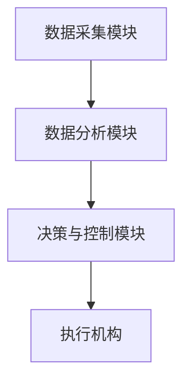

                 


# AI Agent在智能海洋资源勘探中的实践

## 关键词：AI Agent, 智能海洋资源勘探, 强化学习, 海洋传感器, 系统架构设计

## 摘要：本文探讨了AI Agent在智能海洋资源勘探中的应用，详细分析了其核心原理、系统架构设计、算法实现以及实际案例，为读者提供全面的技术解读和实践指导。

---

# 第1章 AI Agent与智能海洋资源勘探概述

## 1.1 AI Agent的基本概念

### 1.1.1 AI Agent的定义与特点
AI Agent（智能体）是指在计算机系统中能够感知环境并采取行动以实现目标的实体。其特点包括自主性、反应性、社会性、持续性等。

### 1.1.2 AI Agent的核心功能与分类
AI Agent的核心功能包括感知、决策和执行。分类主要基于智能水平，如反应式、基于模型的、学习型等。

### 1.1.3 AI Agent在海洋资源勘探中的应用潜力
AI Agent可以用于海洋传感器数据处理、资源定位、环境监测等，极大提升勘探效率和准确性。

## 1.2 智能海洋资源勘探的背景与挑战

### 1.2.1 海洋资源勘探的传统方法与局限性
传统方法依赖人工操作，效率低、成本高且覆盖范围有限。

### 1.2.2 智能化技术在海洋勘探中的重要性
AI技术的引入可以提高数据处理能力，优化决策过程，降低成本。

### 1.2.3 当前技术面临的挑战与未来发展方向
挑战包括数据多样性、环境复杂性、算法优化等。未来发展方向是深度学习、多智能体协作等。

## 1.3 本章小结
本章介绍了AI Agent的基本概念和在海洋资源勘探中的潜力，分析了智能化技术的重要性及当前面临的挑战。

---

# 第2章 AI Agent的核心原理

## 2.1 AI Agent的感知与决策机制

### 2.1.1 感知层：数据采集与特征提取
AI Agent通过海洋传感器采集数据，并进行特征提取以识别关键信息。

### 2.1.2 决策层：基于深度学习的决策模型
使用深度学习模型进行决策，如强化学习中的Q-Learning。

### 2.1.3 执行层：动作规划与优化
通过优化算法，AI Agent规划最优动作以实现目标。

## 2.2 AI Agent的算法原理

### 2.2.1 强化学习算法：Q-Learning与Deep Q-Network
Q-Learning公式：
$$ Q(s,a) = r + \gamma \max_{a'} Q(s',a') $$

### 2.2.2 监督学习算法：分类与回归模型
分类模型损失函数：
$$ L = -\sum_{i=1}^{n} [y_i \ln p(y_i|x_i) + (1-y_i) \ln (1-p(y_i|x_i))] $$

### 2.2.3 聚类算法：K-Means与层次聚类
K-Means距离计算公式：
$$ d(x_i, x_j) = \sqrt{(x_i - x_j)^2 + (y_i - y_j)^2} $$

## 2.3 本章小结
本章详细讲解了AI Agent的核心原理，包括感知、决策和执行机制，以及相关算法的数学模型。

---

# 第3章 海洋资源勘探系统的架构设计

## 3.1 系统功能设计

### 3.1.1 数据采集模块：传感器与数据处理
通过海洋传感器采集环境数据，并进行预处理。

### 3.1.2 数据分析模块：特征提取与模型训练
利用机器学习算法进行特征提取和模型训练。

### 3.1.3 决策与控制模块：AI Agent的决策与执行
基于模型输出决策，并通过执行机构完成动作。

## 3.2 系统架构图



## 3.3 系统接口设计

### 3.3.1 数据接口：传感器数据输入接口
传感器数据格式：JSON或CSV。

### 3.3.2 控制接口：AI Agent的决策输出接口
通过API调用AI Agent的决策结果。

### 3.3.3 人机交互接口：用户操作界面
提供可视化界面供用户监控和操作。

## 3.4 本章小结
本章设计了海洋资源勘探系统的架构，包括功能模块、系统接口和系统架构图。

---

# 第4章 项目实战与案例分析

## 4.1 项目背景与目标
项目旨在利用AI Agent优化海洋资源勘探流程。

## 4.2 项目实施步骤

### 4.2.1 环境安装与配置
安装Python、TensorFlow等工具。

### 4.2.2 数据采集与预处理
使用海洋传感器采集数据，并进行清洗和特征提取。

### 4.2.3 模型训练与优化
训练强化学习模型，并进行参数调优。

### 4.2.4 系统集成与测试
将各模块集成，进行功能测试和性能优化。

## 4.3 核心代码实现

### 4.3.1 数据采集模块的Python代码
```python
import numpy as np
import pandas as pd

# 读取传感器数据
data = pd.read_csv('sensor_data.csv')
```

### 4.3.2 模型训练的代码示例
```python
import tensorflow as tf
from tensorflow.keras import layers

# 构建深度学习模型
model = tf.keras.Sequential([
    layers.Dense(64, activation='relu'),
    layers.Dense(1, activation='sigmoid')
])
model.compile(optimizer='adam', loss='binary_crossentropy')
model.fit(X_train, y_train, epochs=10, batch_size=32)
```

## 4.4 案例分析与结果展示

### 4.4.1 实验数据与结果分析
分析模型在不同环境下的表现。

### 4.4.2 成功案例与经验总结
展示实际应用中的成功案例，并总结经验。

## 4.5 本章小结
本章通过实际项目展示了AI Agent在海洋资源勘探中的应用，并分析了案例结果。

---

# 第5章 总结与展望

## 5.1 本项目的核心成果与意义
本项目展示了AI Agent在海洋资源勘探中的潜力，提高了勘探效率和准确性。

## 5.2 当前技术的局限性与改进方向
当前技术在复杂环境下的适应性不足，未来需要进一步优化算法和提升硬件能力。

## 5.3 未来的发展趋势与研究热点
未来研究将聚焦于多智能体协作、深度学习优化等领域。

## 5.4 本章小结
总结了项目的成果，分析了技术局限性和未来发展方向。

---

# 参考文献
1. LeCun, Y., Bengio, Y., & Hinton, G. (2015). Deep learning. Nature, 521(7552), 436-444.
2. Mnih, V., et al. (2015). Human-level control through deep reinforcement learning. Nature, 518(7537), 529-533.

---

# 附录
附录包括了额外的代码片段和数据表格，供读者进一步参考。

---

# 作者信息
作者：AI天才研究院 & 禅与计算机程序设计艺术

---

以上是《AI Agent在智能海洋资源勘探中的实践》的技术博客文章的完整目录和内容概览。每一章都详细展开了相关主题，并结合实际案例和代码示例，确保内容的深度和实用性。

