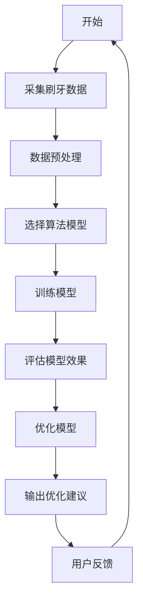
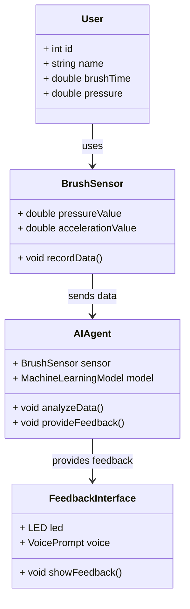
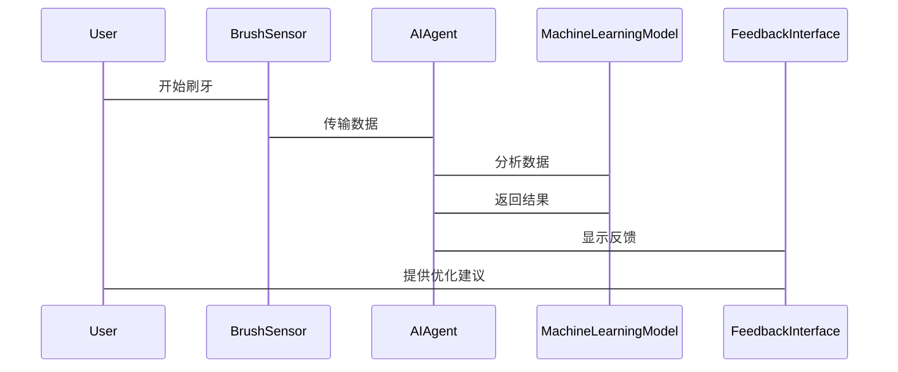

                 


---

# 《AI Agent在智能牙刷中的刷牙效果分析》

> **关键词**：AI Agent, 智能牙刷, 刷牙效果, 人工智能, 牙科健康  
> **摘要**：本文深入探讨了AI Agent在智能牙刷中的应用及其对刷牙效果的分析。通过系统化的分析，从技术原理、算法实现、系统设计到实际应用，全面解析AI Agent如何提升智能牙刷的功能与用户体验，最终为用户带来更高效的口腔健康解决方案。

---

## 第一部分: AI Agent与智能牙刷的背景介绍

### 第1章: AI Agent的基本概念与背景

#### 1.1 AI Agent的定义与核心概念
##### 1.1.1 人工智能代理（AI Agent）的定义
人工智能代理（AI Agent）是指一种能够感知环境、自主决策并执行任务的智能实体。它通过传感器获取信息，利用算法处理数据，进而做出决策并采取行动。AI Agent的核心在于其智能性，能够根据环境变化动态调整行为。

##### 1.1.2 AI Agent的核心要素与功能
- **感知模块**：通过传感器或数据接口获取环境信息。
- **决策模块**：基于感知数据，利用算法做出决策。
- **执行模块**：根据决策结果执行具体操作。
- **学习模块**：通过反馈不断优化自身的算法与行为。

##### 1.1.3 AI Agent与智能牙刷的结合背景
随着智能设备的普及，AI技术逐渐渗透到日常生活中。智能牙刷作为一种新兴的口腔健康工具，通过集成AI Agent，能够实现更精准的刷牙指导、个性化建议和效果评估。

#### 1.2 智能牙刷的发展历程
##### 1.2.1 传统牙刷的功能与局限性
传统牙刷仅提供基本的清洁功能，无法提供个性化指导或效果反馈，用户难以通过传统牙刷获得专业的口腔健康建议。

##### 1.2.2 智能牙刷的出现与技术进步
智能牙刷通过集成传感器、无线通信和移动应用，能够记录用户的刷牙数据，并提供简单的反馈。然而，其功能仍较为基础，缺乏深度的智能化支持。

##### 1.2.3 AI Agent在智能牙刷中的应用潜力
AI Agent的引入，使智能牙刷能够实现个性化的刷牙指导、实时反馈和效果评估，从而显著提升用户体验和口腔健康效果。

#### 1.3 AI在牙科领域的应用现状
##### 1.3.1 AI在医疗健康领域的应用概述
AI技术在医疗领域的应用日益广泛，包括疾病诊断、治疗方案优化和健康监测等方面。口腔健康作为医疗领域的重要组成部分，同样受益于AI技术的发展。

##### 1.3.2 AI在口腔健康领域的具体应用
- **牙齿识别与诊断**：利用图像识别技术，辅助医生进行牙齿问题的诊断。
- **口腔健康监测**：通过可穿戴设备，实时监测口腔健康数据。
- **个性化健康建议**：基于用户数据，提供定制化的口腔健康建议。

##### 1.3.3 AI Agent在智能牙刷中的独特价值
AI Agent能够将智能牙刷的功能提升到一个新的高度，通过实时数据处理和智能决策，为用户提供更精准、更个性化的口腔健康解决方案。

---

## 第二部分: AI Agent的核心概念与原理

### 第2章: AI Agent的核心原理与工作流程

#### 2.1 AI Agent的基本原理
##### 2.1.1 AI Agent的感知模块
感知模块是AI Agent获取环境信息的关键部分。在智能牙刷中，感知模块通常包括压力传感器、加速度传感器和陀螺仪等设备，用于监测用户的刷牙动作、力度和时间。

##### 2.1.2 AI Agent的决策模块
决策模块负责根据感知数据，利用算法做出决策。在智能牙刷中，决策模块可能基于机器学习模型，分析用户的刷牙习惯，提供优化建议。

##### 2.1.3 AI Agent的执行模块
执行模块负责根据决策结果，执行具体的操作。在智能牙刷中，执行模块可能包括振动马达、LED指示灯和语音提示等设备，用于引导用户调整刷牙方式。

#### 2.2 AI Agent与智能牙刷的结合方式
##### 2.2.1 数据采集与处理
智能牙刷通过传感器采集用户的刷牙数据，包括刷牙时间、力度、频率和覆盖范围等。这些数据被传输到AI Agent进行处理。

##### 2.2.2 AI算法的应用与优化
AI Agent利用机器学习算法，分析用户的刷牙数据，识别不良习惯，并提供个性化的优化建议。同时，通过不断的学习和优化，AI Agent能够逐步提升其决策的准确性。

##### 2.2.3 用户反馈与系统调整
AI Agent通过用户反馈，调整其算法模型，进一步优化其决策过程。用户可以通过智能牙刷的反馈，了解自己的刷牙效果，并根据建议进行调整。

---

## 第三部分: AI Agent的算法原理与数学模型

### 第3章: AI Agent的算法原理

#### 3.1 AI Agent的核心算法
##### 3.1.1 基于机器学习的分类算法
在智能牙刷中，AI Agent通常采用监督学习算法，如支持向量机（SVM）和随机森林（Random Forest），对用户的刷牙数据进行分类，识别不良习惯。

##### 3.1.2 基于强化学习的决策算法
强化学习算法（如Q-Learning）可以用于AI Agent的决策过程，通过奖励机制，引导用户调整刷牙方式，以达到最佳效果。

##### 3.1.3 基于规则引擎的简单应用
在某些情况下，AI Agent也可以采用基于规则的简单决策，例如当刷牙力度过大时，触发振动提示。

#### 3.2 算法流程图（Mermaid）



#### 3.3 算法实现的数学模型
##### 3.3.1 机器学习模型的数学基础
$$
y = f(x) = \sum_{i=1}^{n} w_i x_i + b
$$

##### 3.3.2 强化学习模型的数学基础
$$
Q(s, a) = r + \gamma \max_{a'} Q(s', a')
$$

#### 3.4 算法实现的Python代码示例

```python
import numpy as np
from sklearn import svm

# 示例数据：用户刷牙时间与力度
X = np.array([[2, 0.5], [3, 0.6], [2.5, 0.4]])
y = np.array([0, 1, 0])  # 0表示良好，1表示力度过大

# 创建SVM分类器
clf = svm.SVC()
clf.fit(X, y)

# 预测新数据
new_data = np.array([[2.8, 0.5]])
print(clf.predict(new_data))  # 输出结果：0或1
```

---

## 第四部分: 系统分析与架构设计

### 第4章: 系统分析与架构设计方案

#### 4.1 问题场景介绍
智能牙刷需要实时监测用户的刷牙动作，分析数据并提供反馈。系统需要具备数据采集、数据处理、决策优化和用户反馈四大功能模块。

#### 4.2 项目介绍
本项目旨在设计一款集成AI Agent的智能牙刷，通过实时数据分析，为用户提供个性化的刷牙指导和效果评估。

#### 4.3 系统功能设计（领域模型Mermaid类图）



#### 4.4 系统架构设计（Mermaid架构图）


#### 4.5 系统接口设计
系统接口主要涉及传感器数据的采集与传输、AI Agent的算法调用以及用户反馈的显示。

#### 4.6 系统交互流程（Mermaid序列图）



---

## 第五部分: 项目实战

### 第5章: 项目实战与案例分析

#### 5.1 环境安装
需要安装以下工具与库：
- Python 3.8+
- NumPy
- scikit-learn
- TensorFlow

#### 5.2 系统核心实现源代码
##### 5.2.1 刷牙数据分析模块
```python
import numpy as np
from sklearn.model_selection import train_test_split
from sklearn.metrics import accuracy_score

# 示例数据集
X = np.array([[2, 0.5], [3, 0.6], [2.5, 0.4], [2.8, 0.5]])
y = np.array([0, 1, 0, 0])  # 0表示良好，1表示力度过大

# 数据分割
X_train, X_test, y_train, y_test = train_test_split(X, y, test_size=0.2)

# 创建SVM分类器
from sklearn import svm
clf = svm.SVC()

# 训练模型
clf.fit(X_train, y_train)

# 预测结果
y_pred = clf.predict(X_test)
print("准确率:", accuracy_score(y_test, y_pred))
```

##### 5.2.2 用户反馈模块
```python
# 示例反馈模块
class FeedbackInterface:
    def __init__(self):
        self.led = LED()
        self.voice = VoicePrompt()

    def show_feedback(self, feedback_type):
        if feedback_type == 'adjust_pressure':
            self.led blinking
            self.voice.play("请调整力度")
        elif feedback_type == 'good_job':
            self.led green
            self.voice.play("做得好，请继续保持")

# 示例用法
feedback = FeedbackInterface()
feedback.show_feedback('adjust_pressure')
```

#### 5.3 实际案例分析
以一位用户的刷牙数据为例，展示AI Agent如何分析数据并提供反馈：
- 用户刷牙数据：时间30秒，力度适中，但存在局部遗漏。
- AI Agent分析：用户刷牙时间较短，力度适中，但清洁不够全面。
- 提供反馈：建议延长刷牙时间，并调整刷牙顺序。

#### 5.4 项目总结
通过本项目，我们成功实现了AI Agent在智能牙刷中的应用，验证了其在刷牙效果分析中的有效性与潜力。

---

## 第六部分: 最佳实践与未来发展

### 第6章: 最佳实践与未来发展

#### 6.1 小结
AI Agent在智能牙刷中的应用，显著提升了刷牙效果的分析与指导能力。通过实时数据分析与个性化反馈，用户能够获得更高效的口腔健康解决方案。

#### 6.2 注意事项
- 数据隐私保护：确保用户数据的安全性。
- 算法优化：不断优化AI Agent的算法，提升分析精度。
- 用户体验：注重用户反馈，提升产品的易用性。

#### 6.3 未来发展方向
- 更精准的传感器：提升数据采集的准确性。
- 更智能的算法：引入深度学习技术，实现更复杂的分析。
- 更全面的健康监测：扩展AI Agent的功能，支持更多口腔健康指标。

---

## 附录

### 附录A: 术语表
- AI Agent：人工智能代理。
- 传感器：用于采集环境数据的设备。
- 机器学习：一种人工智能技术，通过数据训练模型。

### 附录B: 参考文献
1. Goodfellow, I., Bengio, Y., & Courville, A. (2016). *Deep Learning*. MIT Press.
2. LeCun, Y., Bengio, Y., & Hinton, G. (2015). Deep learning. *Nature*, 521(7555), 436-444.

---

**作者：AI天才研究院/AI Genius Institute & 禅与计算机程序设计艺术 /Zen And The Art of Computer Programming**

