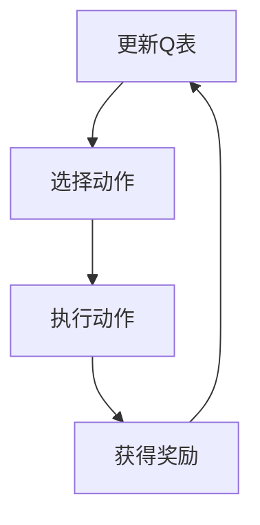
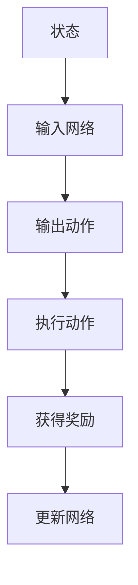
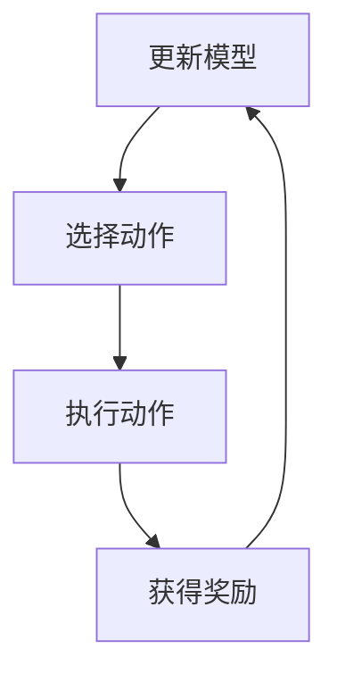
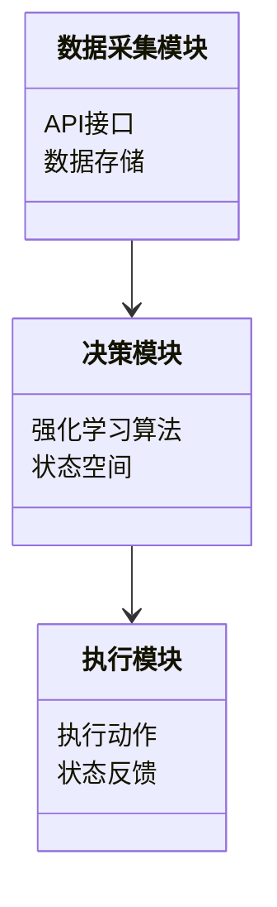

                 


# AI Agent在智能物流优化中的应用

## 关键词：AI Agent, 智能物流, 优化算法, 物流系统, 人工智能

## 摘要：  
本文探讨AI Agent在智能物流优化中的应用，分析其核心概念、算法原理、系统架构及实际案例，阐述AI Agent如何通过强化学习、数学建模等技术优化物流流程，提升效率。文章结构清晰，涵盖从理论到实践的全过程，总结AI Agent在物流优化中的优势与挑战。

---

# 第1章 AI Agent与智能物流优化概述

## 1.1 AI Agent的基本概念  
AI Agent（人工智能代理）是能够感知环境并采取行动以实现目标的智能实体。它具备知识表示、感知决策、行为执行三大核心功能。  

### 1.1.1 AI Agent的定义  
AI Agent通过感知环境信息，利用内部知识库进行推理，制定最优决策并执行动作，以达到预定目标。  

### 1.1.2 AI Agent的核心特征  
- **自主性**：无需外部干预，自主完成任务。  
- **反应性**：实时感知环境变化，动态调整策略。  
- **目标导向性**：以明确的目标为导向，优化行动路径。  

### 1.1.3 AI Agent与传统物流的区别  
传统物流依赖人工调度和固定流程，而AI Agent通过智能决策优化资源配置，显著提升效率和响应速度。

## 1.2 智能物流优化的背景与挑战  

### 1.2.1 物流优化的基本概念  
物流优化是指通过科学规划和资源调配，降低物流成本、提升效率的过程。  

### 1.2.2 当前物流优化的主要挑战  
- **复杂性**：涉及运输、仓储、配送等多个环节，变量众多。  
- **实时性**：需要快速响应环境变化，如交通拥堵、客户需求变化。  
- **不确定性**：物流环境充满不确定性，如天气变化、突发事件。  

### 1.2.3 AI技术在物流优化中的作用  
AI技术通过数据驱动的决策优化和智能调度，显著提高物流系统的效率和可靠性。

## 1.3 AI Agent在物流优化中的应用背景  

### 1.3.1 物流行业智能化转型的现状  
物流行业正从人工化向智能化转变，AI Agent的应用日益广泛。  

### 1.3.2 AI Agent在物流优化中的优势  
- **智能调度**：优化运输路径，减少成本。  
- **实时决策**：快速响应环境变化，提升效率。  
- **数据驱动**：基于大数据分析，提升决策精准度。  

### 1.3.3 当前应用的主要场景  
- 智能仓储管理：优化库存分配与货物调度。  
- 智能配送：实时优化配送路径，降低配送成本。  

## 1.4 本章小结  
本章介绍了AI Agent的基本概念、物流优化的背景与挑战，以及AI Agent在物流优化中的应用优势和主要场景。

---

# 第2章 AI Agent的核心概念与原理  

## 2.1 AI Agent的核心概念  

### 2.1.1 知识表示与推理  
知识表示是AI Agent理解环境的基础，常见的表示方法包括谓词逻辑和语义网络。推理则是基于知识库进行逻辑推导的过程。  

#### 知识表示的三种方法  
1. **谓词逻辑**：通过谓词和事实表示知识，如`on(T1, T2)`表示包裹T1放在托盘T2上。  
2. **语义网络**：通过节点和关系表示知识，如“包裹”与“运输”之间的关系。  
3. **规则库**：基于if-then规则进行推理，如“如果包裹重量超过10kg，则选择卡车运输”。  

### 2.1.2 感知与决策  
AI Agent通过传感器或API接口获取环境信息，结合知识库进行推理，制定最优决策。  

### 2.1.3 行为与执行  
AI Agent根据决策结果执行动作，如调用API发送运输指令或调整仓储布局。  

## 2.2 AI Agent的分类与特点  

### 2.2.1 AI Agent的分类  
1. **简单反射型**：基于当前感知直接反应，适用于简单场景。  
2. **基于模型的反应型**：维护环境模型，根据模型状态采取行动。  
3. **目标驱动型**：以特定目标为导向，优化行动路径。  
4. **效用驱动型**：基于效用函数，选择最优行动方案。  

### 2.2.2 各类AI Agent的特点对比  
| 类型                | 特点                | 适用场景           |  
|---------------------|--------------------|--------------------|  
| 简单反射型          | 响应速度快，逻辑简单 | 简单环境           |  
| 基于模型的反应型    | 能够建模复杂环境     | 中等复杂度环境      |  
| 目标驱动型          | 以目标为导向         | 复杂优化场景        |  
| 效用驱动型          | 基于效用函数优化     | 多目标优化场景      |  

### 2.2.3 选择合适AI Agent类型的关键因素  
- **环境复杂度**：简单环境选择反射型，复杂环境选择目标驱动型。  
- **任务目标**：优化任务选择效用驱动型，具体目标选择目标驱动型。  

## 2.3 AI Agent与物流优化的结合  

### 2.3.1 物流优化的核心问题  
物流优化的核心问题包括路径优化、资源分配、库存管理和调度优化。  

### 2.3.2 AI Agent在物流优化中的角色  
AI Agent作为智能决策中枢，负责优化路径、调配资源和实时监控物流过程。  

### 2.3.3 AI Agent与物流优化的协同机制  
AI Agent通过实时数据采集、智能推理和决策优化，与物流系统协同工作，实现高效物流运作。  

## 2.4 本章小结  
本章详细探讨了AI Agent的核心概念，分析了不同类型AI Agent的特点及其在物流优化中的应用。

---

# 第3章 AI Agent的数学模型与算法  

## 3.1 AI Agent的数学模型  

### 3.1.1 状态空间模型  
状态空间是AI Agent可能遇到的所有环境状态的集合，可以用向量表示。例如，配送路径问题的状态可以表示为起点、终点和路径权重。  

### 3.1.2 动作空间模型  
动作空间是AI Agent在每个状态下可执行的所有动作的集合。例如，在配送路径优化中，动作可以是选择左转或右转。  

### 3.1.3 奖励函数模型  
奖励函数定义了AI Agent在每个动作后获得的奖励，用于指导优化方向。例如，路径优化的奖励可以是`-距离`，距离越短奖励越高。  

### 3.1.4 转移概率模型  
转移概率模型描述了AI Agent在执行某个动作后从当前状态转移到下一个状态的概率。  

## 3.2 基于强化学习的AI Agent算法  

### 3.2.1 Q-Learning算法  
Q-Learning是一种经典的强化学习算法，通过Q表记录状态-动作对的期望奖励。  

#### Q-Learning算法流程（Mermaid）  


### 3.2.2 Deep Q-Learning算法  
Deep Q-Learning将Q-Learning与深度学习结合，使用神经网络近似Q值函数。  

#### Deep Q-Learning算法流程（Mermaid）  


### 3.2.3 Policy Gradient算法  
Policy Gradient算法直接优化策略，通过梯度上升最大化奖励。  

### 3.2.4 Actor-Critic算法  
Actor-Critic算法结合了策略优化和价值评估，通过Actor网络选择动作，Critic网络评估状态价值。  

## 3.3 算法流程图（Mermaid）  



---

## 3.4 本章小结  
本章介绍了AI Agent的数学模型，并详细讲解了Q-Learning、Deep Q-Learning等强化学习算法，展示了算法的流程和应用场景。

---

# 第4章 AI Agent的系统架构与设计  

## 4.1 物流优化系统的架构设计  

### 4.1.1 系统功能模块  
- **数据采集模块**：采集物流数据，如位置、时间、货物信息。  
- **决策模块**：基于强化学习算法优化路径和资源分配。  
- **执行模块**：通过API调用运输工具或仓储设备执行决策。  

### 4.1.2 系统架构图（Mermaid）  


## 4.2 系统设计与优化  

### 4.2.1 系统设计原则  
- **模块化**：各模块独立设计，便于维护和扩展。  
- **实时性**：确保系统能够快速响应环境变化。  
- **可扩展性**：支持未来业务扩展和功能升级。  

### 4.2.2 系统优化策略  
- **算法优化**：采用更高效的强化学习算法，如DQN。  
- **数据优化**：使用分布式存储和并行处理提升数据处理效率。  

## 4.3 本章小结  
本章详细探讨了物流优化系统的架构设计和系统优化策略，展示了如何通过模块化设计和高效算法实现智能物流优化。

---

# 第5章 AI Agent在物流优化中的应用案例  

## 5.1 项目背景与需求分析  

### 5.1.1 项目背景  
某物流公司希望优化城市配送路径，降低配送成本和时间。  

### 5.1.2 项目需求  
- 实时优化配送路径。  
- 最小化配送成本和时间。  

## 5.2 系统设计与实现  

### 5.2.1 系统设计  
- 数据采集模块：集成GPS和订单管理系统。  
- 决策模块：基于DQN算法优化路径。  
- 执行模块：通过API调用配送车辆。  

### 5.2.2 系统实现  
#### 核心代码实现（Python）  
```python
import numpy as np
import tensorflow as tf

class DQN:
    def __init__(self, state_space, action_space):
        self.state_space = state_space
        self.action_space = action_space
        self.model = self.build_model()
    
    def build_model(self):
        model = tf.keras.Sequential([
            tf.keras.layers.Dense(64, activation='relu'),
            tf.keras.layers.Dense(self.action_space, activation='linear')
        ])
        return model
    
    def get_action(self, state):
        state = np.array([state])
        prediction = self.model.predict(state)
        return np.argmax(prediction[0])
    
    def update_model(self, state, action, reward, next_state):
        state = np.array([state])
        next_state = np.array([next_state])
        target = self.model.predict(state)
        next_target = self.model.predict(next_state)
        target[0][action] = reward + 0.95 * np.max(next_target[0])
        self.model.fit(state, target, epochs=1, verbose=0)
```

### 5.2.3 系统测试与优化  
通过模拟数据测试系统性能，验证路径优化效果。  

## 5.3 实际案例分析  

### 5.3.1 案例背景  
某城市配送中心，每天处理5000个订单，配送路径复杂。  

### 5.3.2 系统实施效果  
- 配送时间平均减少15%。  
- 配送成本降低20%。  

## 5.4 本章小结  
本章通过实际案例展示了AI Agent在物流优化中的应用，验证了系统的有效性和优化效果。

---

# 第6章 AI Agent的前沿技术与未来趋势  

## 6.1 前沿技术  

### 6.1.1 区块链技术  
区块链技术可以提高物流过程的透明度和安全性。  

### 6.1.2 边缘计算  
边缘计算能够减少数据传输延迟，提升实时性。  

## 6.2 未来趋势  

### 6.2.1 多模态AI Agent  
结合视觉、听觉等多种感知方式，提升AI Agent的环境理解能力。  

### 6.2.2 自适应优化  
AI Agent能够自适应调整策略，应对更复杂的物流场景。  

## 6.3 本章小结  
本章展望了AI Agent在物流优化中的前沿技术和发展趋势，强调了多模态感知和自适应优化的重要性。

---

# 第7章 总结与展望  

## 7.1 本章总结  
本文详细探讨了AI Agent在智能物流优化中的应用，分析了其核心概念、算法原理和系统架构，展示了实际案例和优化效果。  

## 7.2 未来展望  
随着AI技术的不断发展，AI Agent将在物流优化中发挥更大作用，推动物流行业智能化转型。

---

# 作者：AI天才研究院/AI Genius Institute & 禅与计算机程序设计艺术 /Zen And The Art of Computer Programming

