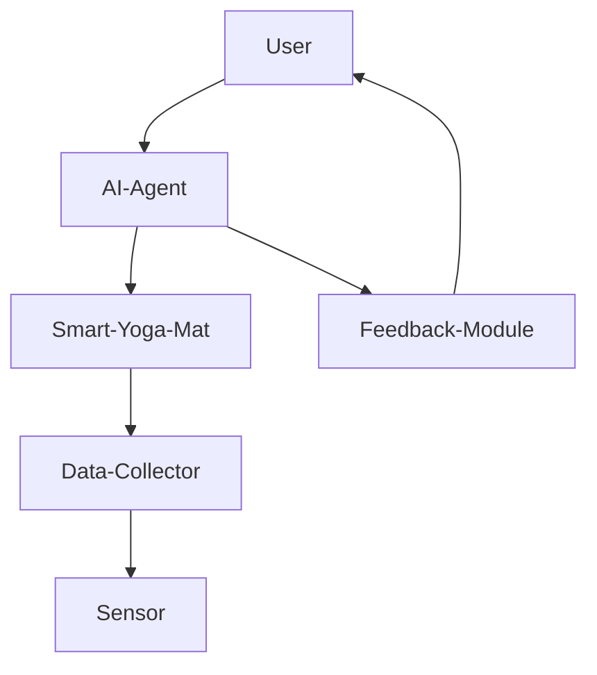
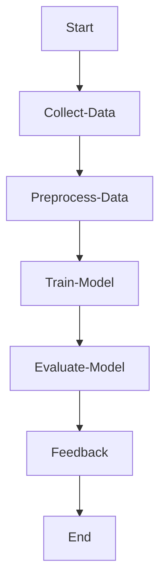

                 


# AI Agent在智能瑜伽垫中的呼吸指导

> 关键词：AI Agent，智能瑜伽垫，呼吸指导，深度学习，系统架构，健康科技

> 摘要：本文深入探讨了AI Agent在智能瑜伽垫中的呼吸指导应用，从背景介绍、核心概念、算法原理到系统设计、项目实战及优化与扩展，全面分析了AI Agent在呼吸指导中的作用及其技术实现。通过具体案例和详细讲解，展示了如何利用AI技术提升瑜伽练习的效果和用户体验。

---

## 第1章: AI Agent与智能瑜伽垫概述

### 1.1 AI Agent的基本概念

#### 1.1.1 AI Agent的定义
AI Agent，即人工智能代理，是一种能够感知环境、自主决策并执行任务的智能实体。它通过传感器获取信息，利用算法处理数据，做出决策，并通过执行器完成目标。AI Agent的核心在于其智能性和自主性，能够根据环境变化调整自身行为。

#### 1.1.2 AI Agent的核心特点
- **自主性**：AI Agent能够自主决策，无需外部干预。
- **反应性**：能够实时感知环境并做出反应。
- **学习能力**：通过数据和经验不断优化自身算法。
- **交互性**：能够与用户或其他系统进行有效交互。

#### 1.1.3 AI Agent的应用场景
AI Agent广泛应用于多个领域，如自动驾驶、智能助手、机器人等。在健康科技领域，AI Agent可以用于个性化健康管理、运动指导等。本文将重点探讨AI Agent在智能瑜伽垫中的应用，特别是在呼吸指导方面的创新。

---

### 1.2 智能瑜伽垫的发展现状

#### 1.2.1 瑜伽与呼吸的重要性
瑜伽是一种结合身体、呼吸和精神的练习方式，正确的呼吸技巧是瑜伽练习的核心。通过调节呼吸，可以增强身体的柔韧性、专注力和内在平静。

#### 1.2.2 智能瑜伽垫的功能与优势
智能瑜伽垫通过集成传感器、AI算法和反馈系统，能够实时监测用户的呼吸、心率、体位等数据，并提供个性化的指导。相比传统瑜伽垫，智能瑜伽垫的优势在于其智能化和个性化，能够帮助用户更高效地完成瑜伽练习。

#### 1.2.3 当前市场上的智能瑜伽垫产品
当前市场上，已有多种智能瑜伽垫产品，它们通过不同的传感器和算法提供呼吸指导、体位校正等功能。然而，如何进一步优化呼吸指导的智能化水平，是当前研究的重点方向。

---

## 第2章: AI Agent在呼吸指导中的应用

### 2.1 呼吸指导的基本原理

#### 2.1.1 正确呼吸的重要性
正确的呼吸方式可以改善身体的氧气摄入、降低压力、提高专注力。在瑜伽练习中，呼吸与动作的配合至关重要，错误的呼吸方式可能导致身体不适或练习效果不佳。

#### 2.1.2 不同呼吸技巧的分类
常见的呼吸技巧包括腹式呼吸、交替呼吸、箱式呼吸等。每种呼吸技巧都有其独特的效果和适用场景。AI Agent需要能够识别用户的呼吸模式，并推荐适合的呼吸技巧。

#### 2.1.3 呼吸指导的目标与方法
呼吸指导的目标是帮助用户掌握正确的呼吸技巧，提升瑜伽练习的效果。实现方法包括实时监测呼吸数据、分析呼吸模式、提供反馈和指导。

---

### 2.2 AI Agent在呼吸指导中的作用

#### 2.2.1 AI Agent如何感知用户的呼吸
AI Agent通过内置的传感器（如心率传感器、呼吸传感器）获取用户的呼吸数据，包括呼吸频率、深度、节奏等。

#### 2.2.2 AI Agent如何分析用户的呼吸模式
通过机器学习算法，AI Agent可以分析用户的呼吸数据，识别呼吸模式中的问题（如浅呼吸、不规则呼吸）并提出改进建议。

#### 2.2.3 AI Agent如何反馈呼吸指导
AI Agent通过声音、震动或视觉反馈的方式，指导用户调整呼吸节奏和深度，帮助用户达到最佳的呼吸状态。

---

## 第3章: AI Agent的核心概念与原理

### 3.1 AI Agent的核心概念

#### 3.1.1 AI Agent的感知模块
感知模块负责采集用户的呼吸数据，包括心率、呼吸频率、呼吸深度等。这些数据为后续的分析和指导提供基础。

#### 3.1.2 AI Agent的决策模块
决策模块利用机器学习算法对呼吸数据进行分析，识别用户的呼吸模式，并生成相应的指导策略。

#### 3.1.3 AI Agent的执行模块
执行模块通过反馈机制将指导策略传递给用户，包括声音提示、震动反馈或视觉提示。

---

### 3.2 AI Agent与传统呼吸指导工具的对比

#### 3.2.1 AI Agent的优势
- **智能化**：AI Agent能够实时分析用户的呼吸数据，提供个性化的指导。
- **便捷性**：用户无需手动记录呼吸数据，AI Agent自动完成监测和分析。
- **高效性**：通过机器学习算法，AI Agent能够快速识别呼吸问题并提出解决方案。

#### 3.2.2 传统呼吸指导工具的局限性
- **人工依赖**：传统工具需要用户手动记录和分析呼吸数据，效率较低。
- **缺乏个性化**：无法根据用户的个体差异提供定制化的指导。

#### 3.2.3 AI Agent与传统工具的结合
通过结合AI Agent与传统呼吸指导工具，可以实现更高效、更精准的呼吸指导，提升用户体验。

---

## 第4章: AI Agent的实体关系与架构设计

### 4.1 实体关系图



- **用户（User）**：用户通过智能瑜伽垫进行瑜伽练习，并与AI Agent交互。
- **AI Agent**：负责处理用户的呼吸数据，并提供指导。
- **智能瑜伽垫（Smart Yoga Mat）**：硬件设备，集成传感器和反馈模块。
- **数据采集器（Data Collector）**：负责收集用户的呼吸数据。
- **传感器（Sensor）**：用于采集用户的生理数据，如心率、呼吸频率等。
- **反馈模块（Feedback Module）**：通过声音、震动或视觉方式向用户反馈指导信息。

---

### 4.2 系统架构图


- **感知模块**：负责数据的采集和初步处理。
- **决策模块**：核心部分，负责数据的分析和决策。
- **执行模块**：负责将决策结果传递给用户。

---

## 第5章: AI Agent的算法原理

### 5.1 算法原理概述



---

### 5.2 算法实现细节

#### 5.2.1 数据预处理
- 数据清洗：去除噪声数据，确保数据的准确性。
- 数据归一化：将不同传感器的数据标准化，便于模型处理。

#### 5.2.2 模型训练
- 使用深度学习模型（如LSTM）进行序列预测，识别用户的呼吸模式。
- 设定损失函数（如均方误差）和优化器（如Adam）进行模型训练。

#### 5.2.3 模型评估
- 通过准确率、召回率等指标评估模型的性能。
- 根据实际数据调整模型参数，优化预测效果。

---

## 第6章: 系统分析与架构设计

### 6.1 问题场景介绍

#### 6.1.1 瑜伽练习中的呼吸问题
用户在瑜伽练习中可能因为呼吸不规律而导致身体不适或练习效果不佳。

#### 6.1.2 系统的目标
通过AI Agent实现智能化的呼吸指导，帮助用户掌握正确的呼吸技巧，提升瑜伽练习的效果。

---

### 6.2 系统功能设计

#### 6.2.1 数据采集模块
- 传感器类型：心率传感器、呼吸传感器。
- 数据采集频率：实时采集用户的呼吸数据。

#### 6.2.2 呼吸分析模块
- 数据分析算法：基于机器学习的呼吸模式识别。
- 呼吸模式分类：浅呼吸、深呼吸、不规则呼吸等。

#### 6.2.3 反馈模块
- 反馈方式：声音提示、震动反馈、视觉提示。
- 反馈内容：呼吸节奏、深度调整建议。

---

### 6.3 系统架构设计

#### 6.3.1 分层架构
- **感知层**：负责数据的采集和初步处理。
- **决策层**：负责数据的分析和决策。
- **执行层**：负责将决策结果传递给用户。

#### 6.3.2 模块交互流程
1. 用户开始瑜伽练习。
2. 传感器采集用户的呼吸数据。
3. 数据传输到AI Agent进行分析。
4. AI Agent根据分析结果生成反馈信息。
5. 反馈信息通过反馈模块传递给用户。

---

## 第7章: 项目实战

### 7.1 环境安装

#### 7.1.1 Python环境安装
- 安装Python和必要的库（如numpy、pandas、tensorflow）。
- 安装智能瑜伽垫的传感器驱动。

#### 7.1.2 数据采集
- 使用智能瑜伽垫的传感器采集用户的呼吸数据。
- 数据格式：CSV或JSON。

---

### 7.2 核心代码实现

#### 7.2.1 数据预处理代码
```python
import numpy as np
import pandas as pd

# 读取数据
data = pd.read_csv('breathing_data.csv')

# 数据清洗
data.dropna(inplace=True)

# 数据归一化
data = (data - data.mean()) / data.std()
```

#### 7.2.2 模型训练代码
```python
import tensorflow as tf
from tensorflow.keras import layers

# 构建模型
model = tf.keras.Sequential([
    layers.LSTM(64, input_shape=(None, 1)),
    layers.Dense(32, activation='relu'),
    layers.Dense(1, activation='sigmoid')
])

# 编译模型
model.compile(optimizer='adam', loss='binary_crossentropy', metrics=['accuracy'])
```

---

### 7.3 实际案例分析

#### 7.3.1 数据分析
- 对用户呼吸数据进行分析，识别其呼吸模式。
- 根据分析结果生成个性化的呼吸指导方案。

#### 7.3.2 系统优化
- 根据用户反馈调整模型参数，优化呼吸指导的效果。

---

## 第8章: 优化与扩展

### 8.1 系统优化

#### 8.1.1 系统鲁棒性
- 提高系统的抗干扰能力，确保在复杂环境下仍能准确采集和分析呼吸数据。

#### 8.1.2 系统可扩展性
- 支持更多类型的传感器和数据源，扩展系统的功能。

---

### 8.2 技术扩展

#### 8.2.1 增强现实（AR）技术
- 结合AR技术，提供更直观的呼吸指导和可视化反馈。

#### 8.2.2 可穿戴设备
- 集成可穿戴设备，实现更全面的健康监测和个性化的呼吸指导。

---

## 第9章: 总结与展望

### 9.1 总结
本文深入探讨了AI Agent在智能瑜伽垫中的呼吸指导应用，从背景介绍、核心概念到算法原理和系统设计，全面分析了AI Agent在呼吸指导中的作用及其技术实现。

### 9.2 展望
未来，随着AI技术的不断发展，智能瑜伽垫将具备更强大的功能，如实时健康监测、个性化健康管理等。AI Agent在呼吸指导中的应用也将更加智能化、个性化，为用户带来更好的瑜伽练习体验。

---

## 作者

作者：AI天才研究院/AI Genius Institute & 禅与计算机程序设计艺术 /Zen And The Art of Computer Programming

