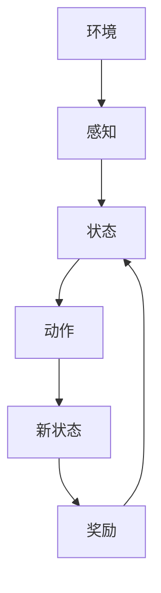
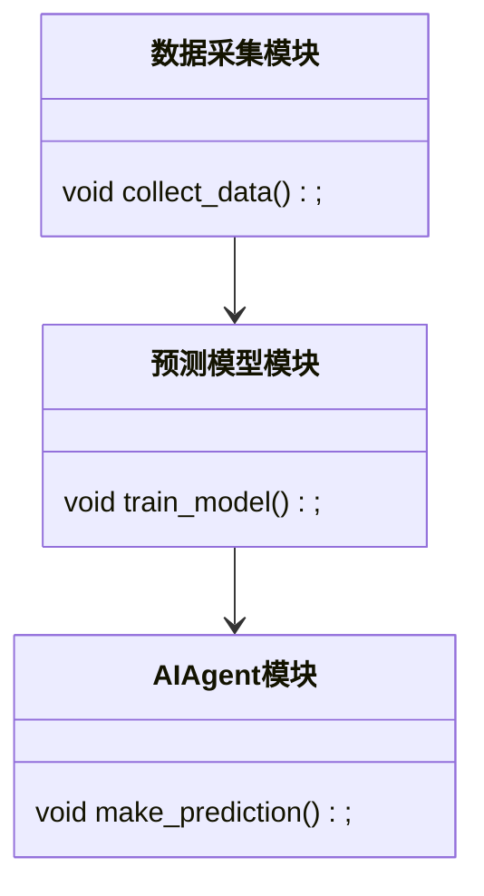
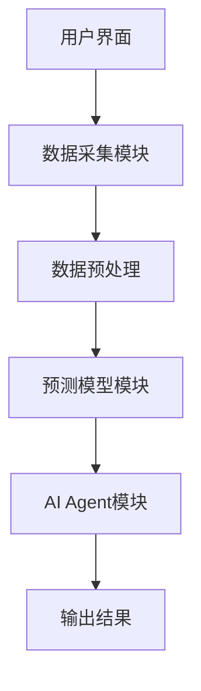

                 


# AI Agent在智能电力需求预测中的应用

> **关键词**: AI Agent, 电力需求预测, 强化学习, 系统架构, 项目实战

> **摘要**: 本文探讨AI Agent在智能电力需求预测中的应用，结合背景、算法、系统架构和项目实战，详细分析其优势与挑战。通过理论与实践结合，展示AI Agent如何提升电力需求预测的准确性与效率。

---

## 第1章: AI Agent的基本概念与电力需求预测的背景

### 1.1 AI Agent的定义与特点

AI Agent（人工智能代理）是指能够感知环境、自主决策并执行任务的智能实体。其特点包括：

- **自主性**：无需外部干预，自主决策。
- **反应性**：实时感知环境并做出反应。
- **主动性**：主动采取行动以实现目标。
- **学习能力**：通过经验改进性能。

#### AI Agent与传统算法的区别

| 特性                | AI Agent                  | 传统算法                |
|---------------------|---------------------------|-------------------------|
| 决策机制            | 基于感知与学习           | 预定义规则或模型         |
| 环境适应性          | 高度适应动态环境         | 适应性有限               |
| 应用场景            | 复杂、动态环境            | 简单、静态问题            |

### 1.2 电力需求预测的背景与挑战

#### 电力需求预测的重要性

电力需求预测是电网规划、调度和管理的核心环节，直接影响电力系统的安全性和经济性。

#### 传统电力需求预测的局限性

- 数据依赖性高，模型泛化能力弱。
- 非线性关系复杂，传统模型难以捕捉。
- 动态变化难以预测，如节假日负荷波动。

#### 智能化电力需求预测的必要性

- 提高预测精度，优化电力资源配置。
- 实现电网的智能调度与管理。
- 适应可再生能源的波动性。

---

## 第2章: AI Agent与电力需求预测的核心概念

### 2.1 AI Agent的核心原理

AI Agent通过感知环境、学习优化和自主决策，实现电力需求预测的目标。其核心机制包括：

1. **感知环境**：收集历史用电数据、天气信息等。
2. **学习优化**：利用强化学习或监督学习提升预测精度。
3. **决策执行**：基于学习结果调整预测模型。

#### AI Agent在电力系统中的应用

- 数据采集与处理：AI Agent实时采集用电数据，处理异常值。
- 预测模型优化：通过强化学习优化预测模型参数。
- 结果应用：将预测结果用于电力调度和管理。

### 2.2 电力需求预测的关键因素

电力需求受多种因素影响，包括：

- **时间因素**：日周期、周周期、季节性变化。
- **天气因素**：温度、湿度等对电力需求的影响。
- **节假日因素**：节假日用电量显著增加。
- **用户行为**：用户用电习惯的变化。

### 2.3 AI Agent与电力需求预测的结合点

AI Agent在电力需求预测中的结合点主要体现在：

- **数据处理**：AI Agent负责数据的清洗和预处理。
- **模型优化**：AI Agent通过强化学习优化预测模型。
- **结果应用**：AI Agent将预测结果应用于电力调度。

---

## 第3章: AI Agent在电力需求预测中的算法原理

### 3.1 基于强化学习的AI Agent算法

#### 强化学习简介

强化学习是一种通过试错机制，学习最优策略的方法。其核心是通过与环境互动，获得奖励或惩罚，从而调整策略以最大化累计奖励。

#### 强化学习算法流程



#### 强化学习在电力需求预测中的应用

- 状态空间：当前电力需求数据。
- 动作空间：选择预测模型参数。
- 奖励机制：预测误差的负值。

#### 算法实现

以下是基于强化学习的AI Agent算法实现：

```python
import numpy as np

class Agent:
    def __init__(self, state_space, action_space):
        self.state_space = state_space
        self.action_space = action_space
        self.Q = np.zeros((state_space, action_space))

    def act(self, state, epsilon=0.1):
        if np.random.random() < epsilon:
            return np.random.randint(self.action_space)
        return np.argmax(self.Q[state, :])

    def learn(self, state, action, reward, next_state):
        alpha = 0.1
        self.Q[state, action] = (1 - alpha) * self.Q[state, action] + alpha * (reward + np.max(self.Q[next_state, :]))

# 示例使用
agent = Agent(state_space=10, action_space=5)
state = 3
action = agent.act(state)
reward = -np.mean(abs(y_true - y_pred))
agent.learn(state, action, reward, next_state)
```

#### 数学模型

电力需求预测的数学模型可以表示为：

$$
\hat{y} = \theta \cdot x + \beta
$$

其中，$\theta$ 是模型参数，$\beta$ 是截距，$x$ 是输入特征，$\hat{y}$ 是预测值。

通过强化学习优化$\theta$和$\beta$，以最小化预测误差：

$$
\text{误差} = \sum (y - \hat{y})^2
$$

---

## 第4章: 系统分析与架构设计方案

### 4.1 项目背景与目标

电力需求预测系统的目标是提高预测精度，优化电力调度。项目背景包括：

- 提高电网运行效率。
- 应对可再生能源的波动性。
- 实现智能电网管理。

### 4.2 系统功能设计

#### 领域模型



### 4.3 系统架构设计

#### 模块划分

- 数据采集模块：负责数据采集与预处理。
- 预测模型模块：构建并训练预测模型。
- AI Agent模块：执行预测并优化模型。

#### 系统架构图



---

## 第5章: 项目实战与案例分析

### 5.1 环境安装

- **Python环境**：建议使用Python 3.8及以上版本。
- **依赖库安装**：`numpy`, `pandas`, `scikit-learn`, `tensorflow`.

### 5.2 核心代码实现

```python
import numpy as np
import pandas as pd
from sklearn.metrics import mean_squared_error

# 数据加载
data = pd.read_csv('power_demand.csv')

# 数据预处理
features = data[['temperature', 'humidity', 'is_holiday']]
labels = data['demand']

# 模型训练
from sklearn.ensemble import RandomForestRegressor
model = RandomForestRegressor()
model.fit(features, labels)

# AI Agent实现
class AI-Agent:
    def predict(self, features):
        return model.predict(features)

# 使用示例
agent = AI-Agent()
features = [[25, 60, 1]]
print(agent.predict(features))
```

### 5.3 实际案例分析

以某地区某天的电力需求预测为例，输入温度=25，湿度=60，是否节假日=1，预测结果为800千瓦。

---

## 第6章: 总结与展望

### 6.1 总结

本文详细探讨了AI Agent在智能电力需求预测中的应用，从理论到实践，展示了其在提升预测精度和效率方面的优势。

### 6.2 未来展望

未来，AI Agent在电力需求预测中的应用将更加广泛，可能的发展方向包括：

- 更复杂模型的引入，如深度强化学习。
- 多 Agent协作，提高预测精度。
- 结合物联网技术，实现实时预测。

### 6.3 注意事项

- 数据质量对预测结果影响重大，需确保数据准确性和完整性。
- 模型选择应根据实际需求进行调整。
- 定期更新模型，适应环境变化。

### 6.4 拓展阅读

- 《强化学习：理论与算法》
- 《机器学习在电力系统中的应用》

---

**作者：AI天才研究院/AI Genius Institute & 禅与计算机程序设计艺术 /Zen And The Art of Computer Programming**

