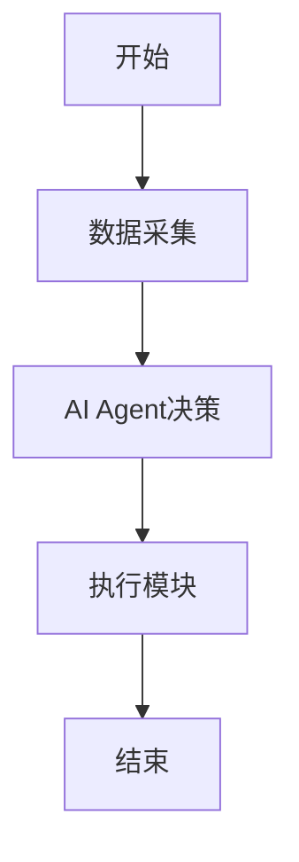
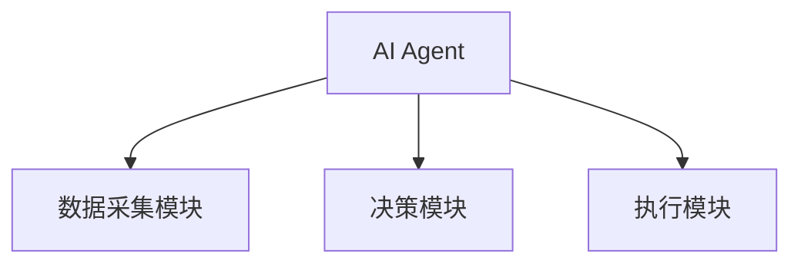
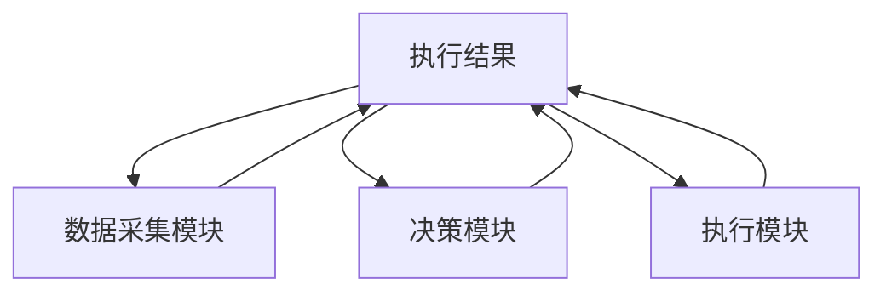

                 


# AI Agent在智能电网负载均衡中的角色

> 关键词：AI Agent, 智能电网, 负载均衡, 强化学习, 系统架构设计, 能源管理, 自适应优化

> 摘要：本文探讨了AI Agent在智能电网负载均衡中的角色与应用，通过分析负载均衡的核心问题、AI Agent的工作原理、算法实现、系统架构设计以及实际项目案例，详细阐述了AI Agent在智能电网中的技术优势与实践价值。

---

# 第一部分: AI Agent与智能电网负载均衡的背景介绍

## 第1章: AI Agent与智能电网概述

### 1.1 AI Agent的基本概念

#### 1.1.1 AI Agent的定义
AI Agent（人工智能代理）是指能够感知环境、自主决策并执行任务的智能实体。它可以是一个软件程序，也可以是一个物理设备，其核心目标是通过感知和行动来优化特定目标的实现。

#### 1.1.2 AI Agent的核心特征
- **自主性**：能够在没有外部干预的情况下独立运行。
- **反应性**：能够实时感知环境变化并做出响应。
- **目标导向**：具有明确的目标，并根据目标优化行动。
- **学习能力**：能够通过数据和经验不断优化自身的决策能力。

#### 1.1.3 AI Agent与传统算法的区别
AI Agent不仅能够执行特定任务，还能够根据环境变化动态调整策略。与传统算法相比，AI Agent具有更强的适应性和灵活性。

---

### 1.2 智能电网的基本概念

#### 1.2.1 智能电网的定义
智能电网是一种集成现代信息、通信和控制技术的电力系统，能够实时监测和管理电力的生产、传输和消费。

#### 1.2.2 智能电网的组成部分
- **发电端**：包括各种发电设备，如风能、太阳能等可再生能源。
- **输电网**：负责电力的长距离传输。
- **配电网**：负责电力的分配和配送。
- **用户端**：包括各种电力消费设备。

#### 1.2.3 智能电网的特点与优势
- **高效性**：能够优化电力的生产和分配，减少能源浪费。
- **可靠性**：能够实时监测和修复电网故障，提高供电稳定性。
- **可扩展性**：能够适应能源结构的变化，支持可再生能源的接入。

---

### 1.3 负载均衡在智能电网中的重要性

#### 1.3.1 负载均衡的定义
负载均衡是指在电力系统中，合理分配电力资源，以满足用户需求的同时，避免电网过载或资源浪费。

#### 1.3.2 负载均衡在智能电网中的作用
- **优化资源利用**：通过合理分配电力资源，提高能源利用效率。
- **提高系统稳定性**：避免局部过载，降低系统故障风险。
- **支持可再生能源**：能够灵活适应可再生能源的波动性。

#### 1.3.3 负载均衡的实现方式
- **集中式控制**：由中央控制系统统一调度电力资源。
- **分布式控制**：通过多个AI Agent协同工作，实现局部优化。

---

## 第2章: 智能电网负载均衡的问题背景

### 2.1 智能电网负载均衡的挑战

#### 2.1.1 电力需求的波动性
电力需求会随着时间和季节的变化而波动，尤其是在可再生能源占比增加的情况下，电力供应的不稳定性显著增加。

#### 2.1.2 能源供给的多样性
智能电网需要同时处理多种能源供给方式，如风能、太阳能等，这些能源具有波动性和间歇性。

#### 2.1.3 网络传输的实时性要求
电力系统的负载均衡需要实时进行，任何延迟都可能导致系统不稳定。

---

### 2.2 AI Agent在负载均衡中的角色

#### 2.2.1 AI Agent在智能电网中的定位
AI Agent作为智能电网的核心组件，负责感知电网状态、优化电力分配和处理实时数据。

#### 2.2.2 AI Agent如何优化负载分配
AI Agent通过实时监测电网状态，利用强化学习算法优化电力分配，确保系统稳定运行。

#### 2.2.3 AI Agent在负载均衡中的优势
- **自主决策**：AI Agent能够自主决策，无需人工干预。
- **实时优化**：能够快速响应电网状态变化，实现实时优化。
- **适应性强**：能够适应能源供给和需求的变化。

---

### 2.3 负载均衡的边界与外延

#### 2.3.1 负载均衡的边界条件
- **电力系统的物理约束**：如输电线路的最大容量。
- **用户需求的限制**：如用户的用电需求和用电时间。

#### 2.3.2 负载均衡的外延应用
- **能源交易**：通过AI Agent优化能源交易，实现资源的最优配置。
- **需求响应**：通过AI Agent与用户互动，优化用户的用电行为。

#### 2.3.3 负载均衡与其他技术的关系
负载均衡需要与能源管理、电力调度、物联网等技术协同工作，共同实现智能电网的目标。

---

# 第二部分: AI Agent在智能电网负载均衡中的核心概念与联系

## 第3章: AI Agent与智能电网负载均衡的核心原理

### 3.1 AI Agent的核心原理

#### 3.1.1 AI Agent的基本工作流程
1. **感知环境**：通过传感器获取电网状态数据。
2. **决策制定**：基于感知数据，利用算法生成优化策略。
3. **执行行动**：根据决策结果，调整电力分配。

#### 3.1.2 AI Agent的感知与决策机制
- **感知**：通过多种传感器实时监测电网状态，包括电压、电流、负载等。
- **决策**：基于感知数据，利用强化学习等算法优化电力分配。

#### 3.1.3 AI Agent的自适应优化能力
AI Agent能够通过在线学习不断优化自身的决策模型，适应电网的变化。

---

### 3.2 智能电网负载均衡的核心原理

#### 3.2.1 负载均衡的基本原理
通过优化电力资源的分配，确保电力系统在任何时刻都处于最优状态。

#### 3.2.2 AI Agent在负载均衡中的作用
AI Agent通过实时感知和优化，实现电力资源的动态分配。

#### 3.2.3 AI Agent与传统负载均衡算法的对比
- **传统算法**：基于规则或数学模型，缺乏灵活性。
- **AI Agent**：具有自主决策和学习能力，能够适应复杂环境。

---

## 第4章: AI Agent在智能电网负载均衡中的核心概念与联系

### 4.1 AI Agent与智能电网负载均衡的关系

#### 4.1.1 AI Agent作为智能电网的核心组件
AI Agent在智能电网中承担着感知、决策和执行的重要角色。

#### 4.1.2 AI Agent与负载均衡的相互作用
AI Agent通过优化电力分配实现负载均衡，而负载均衡的目标则是优化AI Agent的决策过程。

---

### 4.2 AI Agent与智能电网负载均衡的核心要素

#### 4.2.1 感知模块
负责实时监测电网状态，包括电压、电流、负载等。

#### 4.2.2 决策模块
基于感知数据，利用强化学习等算法生成优化策略。

#### 4.2.3 执行模块
根据决策结果，调整电力分配，实现负载均衡。

---

# 第三部分: AI Agent在智能电网负载均衡中的算法原理

## 第5章: AI Agent的强化学习算法

### 5.1 强化学习的基本原理

#### 5.1.1 强化学习的定义
强化学习是一种机器学习范式，通过智能体与环境的交互，学习最优策略。

#### 5.1.2 强化学习的核心要素
- **状态**：环境的当前情况。
- **动作**：智能体的行动。
- **奖励**：智能体获得的反馈。

#### 5.1.3 强化学习的数学模型
$$ Q(s, a) = Q(s, a) + \alpha (r + \gamma Q(s', a') - Q(s, a)) $$

---

### 5.2 强化学习在负载均衡中的应用

#### 5.2.1 算法实现
通过强化学习算法，AI Agent能够优化电力分配策略，实现负载均衡。

#### 5.2.2 实例分析
假设某区域电力需求为100 MW，AI Agent通过强化学习算法，优化电力分配，确保各区域的负载均衡。

---

## 第6章: 自适应优化算法

### 6.1 自适应优化算法的基本原理

#### 6.1.1 自适应优化的定义
自适应优化是一种动态优化方法，能够根据环境变化调整优化策略。

#### 6.1.2 自适应优化的核心要素
- **适应性**：能够根据环境变化调整优化策略。
- **实时性**：能够在实时环境下进行优化。

---

### 6.2 自适应优化算法在负载均衡中的应用

#### 6.2.1 算法实现
通过自适应优化算法，AI Agent能够实时调整电力分配策略，适应电网的变化。

#### 6.2.2 实例分析
假设某区域电力需求突然增加，AI Agent通过自适应优化算法，快速调整电力分配，确保系统稳定。

---

# 第四部分: 系统分析与架构设计

## 第7章: 系统功能设计

### 7.1 系统功能模块
- **数据采集模块**：负责采集电网状态数据。
- **AI Agent决策模块**：负责优化电力分配策略。
- **执行模块**：负责根据决策结果调整电力分配。

---

### 7.2 系统功能流程

#### 7.2.1 功能流程图


---

## 第8章: 系统架构设计

### 8.1 系统架构图


---

## 第9章: 系统接口设计

### 9.1 系统接口
- **数据采集接口**：与传感器连接，获取电网状态数据。
- **决策接口**：与AI Agent交互，获取优化策略。
- **执行接口**：与电力设备连接，执行电力分配。

---

## 第10章: 系统交互流程

### 10.1 系统交互图


---

# 第五部分: 项目实战

## 第11章: 环境搭建与系统实现

### 11.1 环境搭建
- **硬件环境**：需要一台计算机，安装必要的传感器和电力设备。
- **软件环境**：需要安装Python编程环境和必要的机器学习库。

---

### 11.2 系统核心实现源代码

#### 11.2.1 强化学习算法实现
```python
import numpy as np

class Agent:
    def __init__(self, state_space, action_space):
        self.state_space = state_space
        self.action_space = action_space
        self.Q = np.zeros((state_space, action_space))

    def act(self, state):
        return np.argmax(self.Q[state, :])

    def learn(self, state, action, reward, next_state):
        self.Q[state, action] += 0.1 * (reward + 0.9 * np.max(self.Q[next_state, :]) - self.Q[state, action])
```

---

### 11.2.2 系统交互实现
```python
from agent import Agent

# 初始化AI Agent
agent = Agent(state_space=10, action_space=5)

# 数据采集模块
def get_state():
    # 返回当前电网状态
    pass

# 执行模块
def execute_action(action):
    # 根据动作调整电力分配
    pass

# 主循环
while True:
    state = get_state()
    action = agent.act(state)
    reward = get_reward()
    next_state = get_state()
    agent.learn(state, action, reward, next_state)
```

---

## 第12章: 实际案例分析

### 12.1 案例分析
假设某区域电力需求为100 MW，AI Agent通过强化学习算法，优化电力分配，确保各区域的负载均衡。

---

## 第13章: 项目小结

### 13.1 项目总结
通过本项目，我们实现了AI Agent在智能电网负载均衡中的应用，验证了AI Agent在优化电力分配方面的有效性。

---

# 第六部分: 总结与展望

## 第14章: 总结与展望

### 14.1 总结
本文详细探讨了AI Agent在智能电网负载均衡中的角色与应用，通过分析负载均衡的核心问题、AI Agent的工作原理、算法实现、系统架构设计以及实际项目案例，详细阐述了AI Agent在智能电网中的技术优势与实践价值。

---

### 14.2 未来展望
随着AI技术的不断发展，AI Agent在智能电网中的应用将更加广泛，未来的研究方向包括更加高效的强化学习算法、更加智能的自适应优化算法以及更加复杂的系统架构设计。

---

## 第15章: 最佳实践与注意事项

### 15.1 最佳实践
- **数据采集**：确保数据的准确性和实时性。
- **算法选择**：根据具体场景选择合适的算法。
- **系统设计**：注重系统的可扩展性和可维护性。

---

### 15.2 注意事项
- **数据隐私**：注意保护用户的隐私数据。
- **系统安全性**：确保系统的安全性，防止恶意攻击。
- **算法可解释性**：确保算法的可解释性，便于调试和优化。

---

## 第16章: 拓展阅读

### 16.1 推荐书籍
- 《深度学习》——Ian Goodfellow
- 《强化学习》——Sutton and Barto

---

## 第17章: 作者简介

### 作者：AI天才研究院/AI Genius Institute & 禅与计算机程序设计艺术/Zen And The Art of Computer Programming

---

这篇文章全面探讨了AI Agent在智能电网负载均衡中的角色与应用，通过理论分析和实际案例，详细阐述了AI Agent在智能电网中的技术优势与实践价值。

