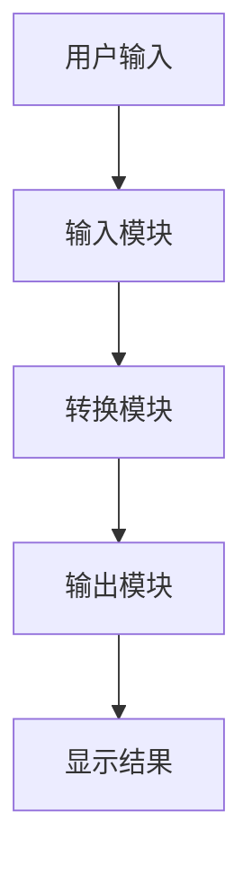

                 


# AI Agent在智能画框中的艺术风格转换

> 关键词：AI Agent，艺术风格转换，智能画框，生成对抗网络，风格迁移

> 摘要：本文详细探讨了AI Agent在智能画框中的艺术风格转换应用。通过分析AI Agent的核心概念、算法原理和系统架构，结合具体项目实战，展示了如何利用AI技术实现高效的风格转换。文章还总结了最佳实践和注意事项，为读者提供了全面的指导。

---

# 目录

1. [AI Agent与艺术风格转换的背景与概念](#ai-agent与艺术风格转换的背景与概念)
2. [AI Agent与艺术风格转换的核心概念](#ai-agent与艺术风格转换的核心概念)
3. [艺术风格转换的算法原理](#艺术风格转换的算法原理)
4. [系统架构与设计](#系统架构与设计)
5. [项目实战：智能画框的艺术风格转换](#项目实战智能画框的艺术风格转换)
6. [最佳实践与总结](#最佳实践与总结)

---

## 第1章: AI Agent与艺术风格转换的背景与概念

### 1.1 问题背景与目标

#### 1.1.1 艺术风格转换的定义
艺术风格转换是指将一幅图像从一种特定的艺术风格（如梵高的后印象派风格）转换为另一种艺术风格（如毕加索的立体主义风格）。这种转换不仅仅是图像的表面变化，更涉及对图像内容的理解和重新表达。

#### 1.1.2 AI Agent在艺术创作中的角色
AI Agent（人工智能代理）是一种能够感知环境、执行任务并做出决策的智能体。在艺术风格转换中，AI Agent可以作为工具，帮助用户快速实现风格迁移，同时提供创作建议和优化方案。

#### 1.1.3 艺术风格转换的核心目标
- 提供高效、准确的艺术风格转换工具。
- 支持用户根据需求定制风格，满足个性化创作需求。
- 推动艺术创作的自动化和智能化。

---

### 1.2 问题描述与解决方法

#### 1.2.1 艺术风格转换的挑战
- 不同艺术风格的特征提取难度大。
- 风格转换过程中容易失真或不符合预期。
- 用户需求多样，如何满足个性化需求是关键。

#### 1.2.2 AI Agent如何解决这些问题
- 利用深度学习模型提取艺术风格特征。
- 通过用户反馈优化转换结果，提供个性化的解决方案。
- 提供直观的用户界面，降低使用门槛。

#### 1.2.3 艺术风格转换的边界与外延
- 转换范围：支持多种艺术风格，但需明确转换的边界。
- 技术限制：当前技术仍存在局限性，如转换结果的多样性有限。

---

### 1.3 艺术风格转换的技术优势

#### 1.3.1 AI Agent的优势
- 高效性：快速生成多种风格的图像。
- 智能性：根据用户反馈自动调整转换参数。
- 可扩展性：支持多种艺术风格的扩展。

#### 1.3.2 艺术风格转换的技术特点
- 基于深度学习的特征提取。
- 利用生成对抗网络（GAN）实现高质量图像生成。

#### 1.3.3 艺术风格转换的应用领域
- 数字艺术创作。
- 文化遗产保护与修复。
- 教育与艺术学习。

---

## 第2章: AI Agent与艺术风格转换的核心概念

### 2.1 AI Agent的定义与属性

#### 2.1.1 AI Agent的基本定义
AI Agent是一种能够感知环境、执行任务并做出决策的智能体。在艺术风格转换中，AI Agent可以作为工具，帮助用户快速实现风格迁移，同时提供创作建议和优化方案。

#### 2.1.2 AI Agent的核心属性
- **感知能力**：能够理解输入图像的内容和风格。
- **决策能力**：根据用户需求选择合适的风格转换模型。
- **执行能力**：快速生成符合要求的艺术风格图像。

#### 2.1.3 AI Agent的分类
- **基于规则的AI Agent**：根据预设规则进行风格转换。
- **基于学习的AI Agent**：利用深度学习模型自动生成风格转换结果。

---

### 2.2 艺术风格转换的定义与属性

#### 2.2.1 艺术风格转换的基本定义
艺术风格转换是指将一幅图像从一种特定的艺术风格转换为另一种艺术风格的过程。这种转换不仅仅是图像的表面变化，更涉及对图像内容的理解和重新表达。

#### 2.2.2 艺术风格转换的核心属性
- **内容保持**：转换后图像的内容应与原图一致。
- **风格多样性**：支持多种艺术风格的转换。
- **用户自定义**：允许用户调整转换参数，满足个性化需求。

#### 2.2.3 艺术风格转换的分类
- **基于图像的风格转换**：直接基于输入图像生成目标风格图像。
- **基于文本的风格转换**：根据用户提供的文本描述生成图像。

---

### 2.3 AI Agent与艺术风格转换的关系

#### 2.3.1 AI Agent在艺术风格转换中的作用
- 提供高效的风格转换工具。
- 根据用户需求优化转换结果。
- 支持多样化的艺术风格创作。

#### 2.3.2 艺术风格转换对AI Agent的依赖
- 需要深度学习模型的支持。
- 依赖于高质量的艺术风格数据集。

#### 2.3.3 两者关系的对比分析
| 属性 | AI Agent | 艺术风格转换 |
|------|----------|--------------|
| 核心目标 | 提供智能服务 | 实现风格迁移 |
| 技术基础 | 深度学习、自然语言处理 | 生成对抗网络（GAN）、卷积神经网络（CNN） |
| 应用场景 | 智能助手、自动化创作 | 数字艺术、文化遗产保护 |

---

## 第3章: 艺术风格转换的算法原理

### 3.1 艺术风格转换的核心算法

#### 3.1.1 GAN（生成对抗网络）的原理
生成对抗网络由生成器和判别器组成，通过对抗训练生成逼真的图像。在艺术风格转换中，生成器负责将原图转换为目标风格图像，判别器用于区分真实图像和生成图像。

**数学公式：**
- 生成器损失函数：$$L_g = \mathbb{E}_{x,y}[\log(D(G(x))) + \log(1-D(G(x)))]$$
- 判别器损失函数：$$L_d = \mathbb{E}_{x,y}[\log(D(x)) + \log(1-D(G(x)))]$$

#### 3.1.2 Style Transfer的实现方法
Style Transfer通过将内容图像与风格图像结合，生成具有目标风格的内容图像。其核心在于分离内容和风格，然后重新组合。

**算法步骤：**
1. **提取内容特征**：从内容图像中提取深层特征。
2. **提取风格特征**：从风格图像中提取风格特征。
3. **生成目标图像**：将内容特征与风格特征结合，生成目标图像。

#### 3.1.3 其他相关算法的对比
- **条件GAN（cGAN）**：在给定条件（如目标风格）下生成图像。
- **变分自编码器（VAE）**：通过重构损失实现风格转换。

---

### 3.2 GAN的数学模型

#### 3.2.1 GAN的基本结构
生成器和判别器通过对抗训练优化模型参数。生成器的目标是最 deceive 判别器，而判别器的目标是区分真实图像和生成图像。

**生成器结构：**
```python
def generator(input):
    # 生成器网络结构
    pass
```

**判别器结构：**
```python
def discriminator(input):
    # 判别器网络结构
    pass
```

#### 3.2.2 GAN的损失函数
- **生成器损失**：$$L_g = \log(D(G(x)))$$
- **判别器损失**：$$L_d = \log(D(x)) + \log(1-D(G(x)))$$

---

## 第4章: 系统架构与设计

### 4.1 系统功能模块设计

#### 4.1.1 输入模块
- 接收用户输入的源图像和目标风格。
- 支持多种图像格式和风格类型。

#### 4.1.2 转换模块
- 负责执行艺术风格转换。
- 包含多个预训练的风格模型。

#### 4.1.3 输出模块
- 显示转换后的图像。
- 提供结果保存和导出功能。

---

### 4.2 系统架构设计

#### 4.2.1 系统架构图


#### 4.2.2 模块之间的关系
- 输入模块接收用户请求并传递给转换模块。
- 转换模块处理请求并返回结果给输出模块。
- 输出模块展示结果并提供反馈。

---

## 第5章: 项目实战：智能画框的艺术风格转换

### 5.1 项目介绍

#### 5.1.1 项目目标
开发一个基于AI Agent的智能画框系统，支持多种艺术风格的转换。

#### 5.1.2 项目环境
- 操作系统：Linux/Windows/MacOS
- 开发工具：Python、TensorFlow、Keras
- 依赖库：Pillow、Matplotlib

---

### 5.2 系统核心实现

#### 5.2.1 代码实现
```python
import tensorflow as tf
from tensorflow.keras import layers

def build_generator():
    # 生成器网络结构
    pass

def build_discriminator():
    # 判别器网络结构
    pass

def train_gan(generator, discriminator, dataset):
    # GAN训练过程
    pass
```

---

## 第6章: 最佳实践与总结

### 6.1 总结

#### 6.1.1 核心总结
- AI Agent在艺术风格转换中扮演重要角色。
- 深度学习算法是实现高效风格转换的关键。

#### 6.1.2 经验总结
- 数据质量对转换结果影响重大。
- 模型调参需要根据具体任务进行优化。

---

### 6.2 注意事项

#### 6.2.1 模型训练中的注意事项
- 数据预处理：确保数据多样化和代表性。
- 模型优化：合理选择学习率和批量大小。

#### 6.2.2 系统设计中的注意事项
- 系统架构要具有扩展性。
- 用户界面要直观易用。

---

### 6.3 拓展阅读

#### 6.3.1 推荐资源
- 《生成对抗网络实战》
- TensorFlow官方文档

---

作者：AI天才研究院/AI Genius Institute & 禅与计算机程序设计艺术 /Zen And The Art of Computer Programming

