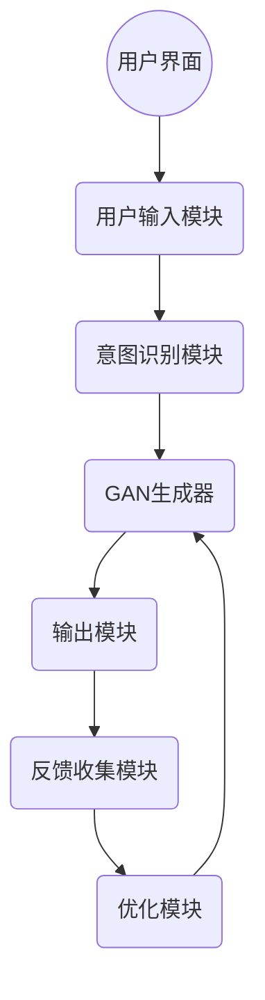

                 


# AI Agent在智能画笔中的绘画技巧指导

## 关键词：
AI Agent，智能画笔，绘画技巧，生成对抗网络，强化学习，图像生成

## 摘要：
本文系统地探讨了AI Agent在智能画笔中的应用，分析了其在绘画技巧指导中的核心算法和实现方法。通过结合生成对抗网络（GAN）和强化学习（RL），本文详细讲解了AI Agent如何辅助用户进行绘画创作，包括用户意图识别、实时反馈和绘画风格多样性等关键功能。文章还提供了实际的项目实现和系统架构设计，为读者提供了从理论到实践的全面指导。

---

# 第1章: AI Agent与智能画笔概述

## 1.1 AI Agent的基本概念

### 1.1.1 AI Agent的定义与特点
AI Agent（人工智能代理）是指能够感知环境并采取行动以实现目标的智能体。在智能画笔中，AI Agent的核心特点包括：
- **自主性**：能够独立运行并做出决策。
- **反应性**：能够实时响应用户的输入和环境变化。
- **学习能力**：通过数据和反馈不断优化自身性能。

### 1.1.2 AI Agent的工作原理
AI Agent通过以下步骤实现绘画辅助：
1. **感知输入**：接收用户的绘画动作或意图。
2. **处理数据**：利用算法生成绘画建议或效果。
3. **输出反馈**：将结果反馈给用户或进一步优化。

### 1.1.3 AI Agent与传统绘画工具的对比
与传统绘画工具相比，AI Agent的优势在于：
- 提供智能化的绘画建议和实时反馈。
- 能够根据用户的风格和意图生成多样化的绘画效果。
- 学习能力强，能够不断优化绘画质量。

---

## 1.2 智能画笔的发展历程

### 1.2.1 传统绘画工具的局限性
传统绘画工具主要依赖手动操作，存在以下问题：
- 绘画技巧依赖用户经验。
- 难以快速生成复杂图案。
- 缺乏智能化的绘画建议和反馈。

### 1.2.2 AI技术在绘画工具中的引入
随着AI技术的发展，绘画工具逐渐智能化：
- 利用深度学习生成绘画效果。
- 通过用户意图识别优化绘画体验。
- 实现实时反馈和个性化建议。

### 1.2.3 智能画笔的现状与未来趋势
当前，智能画笔已经在艺术创作和教育培训领域得到广泛应用。未来趋势包括：
- 更高的智能化和个性化。
- 更强的实时互动性和反馈能力。
- 更广泛的跨领域应用。

---

## 1.3 AI Agent在智能画笔中的作用

### 1.3.1 AI Agent如何辅助绘画
AI Agent在智能画笔中的主要功能包括：
- 根据用户输入生成绘画建议。
- 实时调整绘画效果以匹配用户意图。
- 提供多样化的绘画风格选择。

### 1.3.2 AI Agent的核心功能与技术实现
AI Agent的核心功能包括：
- **图像生成**：利用GAN生成高质量的绘画效果。
- **用户意图识别**：通过深度学习模型分析用户的绘画意图。
- **实时反馈**：根据用户反馈优化绘画效果。

### 1.3.3 AI Agent在绘画创作中的优势
AI Agent的优势体现在：
- 高效性：快速生成绘画效果。
- 个性化：根据用户需求定制绘画风格。
- 学习能力强：通过反馈不断优化性能。

---

## 1.4 本章小结
本章介绍了AI Agent的基本概念、发展历程及其在智能画笔中的作用。通过对比传统绘画工具和AI Agent，突出了其在绘画创作中的智能化和高效性优势。

---

# 第2章: AI Agent的绘画技巧基础

## 2.1 AI Agent的绘画流程

### 2.1.1 用户输入与AI Agent的处理流程
用户输入是AI Agent绘画的基础，主要包括：
1. **用户动作捕捉**：通过传感器捕捉用户的绘画动作。
2. **意图识别**：分析用户的绘画意图。
3. **生成建议**：基于意图生成绘画建议。
4. **实时反馈**：根据用户反馈优化效果。

### 2.1.2 AI Agent的图像生成机制
AI Agent通过以下步骤生成图像：
1. **输入数据处理**：将用户输入转化为可处理的数据。
2. **模型生成**：利用GAN等算法生成初始图像。
3. **效果优化**：根据用户反馈调整图像参数。

### 2.1.3 AI Agent的绘画效果优化
效果优化的关键在于：
- **多目标优化**：平衡生成图像的质量和多样性。
- **实时调整**：根据用户反馈动态优化图像。

---

## 2.2 AI Agent的绘画风格与多样性

### 2.2.1 不同绘画风格的实现方法
AI Agent支持多种绘画风格，包括：
- **写实风格**：通过深度学习生成逼真图像。
- **抽象风格**：通过风格迁移生成抽象艺术。
- **卡通风格**：通过风格迁移生成卡通效果。

### 2.2.2 AI Agent如何适应不同绘画风格
AI Agent通过以下方式适应不同风格：
- **风格迁移网络**：将目标风格应用到生成图像中。
- **多风格模型**：训练一个多风格GAN模型。

### 2.2.3 绘画风格的可调节性与多样性
AI Agent的风格多样性体现在：
- **可调节参数**：用户可以通过参数调整风格强度。
- **混合风格**：生成混合多种风格的图像。

---

## 2.3 AI Agent的用户反馈与实时调整

### 2.3.1 用户反馈的采集与处理
用户反馈是AI Agent优化的重要依据，包括：
- **用户评分**：用户对生成图像的满意度评分。
- **用户输入**：用户的进一步调整需求。

### 2.3.2 AI Agent的实时调整机制
实时调整机制包括：
- **反馈循环**：根据用户反馈不断优化生成图像。
- **动态参数调整**：根据反馈动态调整生成模型的参数。

### 2.3.3 用户满意度与效果优化
优化效果的关键在于：
- **反馈分析**：分析用户反馈的共性需求。
- **模型优化**：根据反馈优化生成模型。

---

## 2.4 本章小结
本章详细介绍了AI Agent的绘画流程、风格多样性和实时调整机制。通过这些机制，AI Agent能够高效地辅助用户完成绘画创作，并提供多样化的绘画效果。

---

# 第3章: AI Agent的核心算法原理

## 3.1 生成对抗网络（GAN）在绘画中的应用

### 3.1.1 GAN的基本原理
生成对抗网络（GAN）由生成器和判别器组成，通过对抗训练生成逼真的图像。其基本原理如下：
- 生成器尝试生成与真实图像相似的图像。
- 判别器尝试区分生成图像和真实图像。
- 通过不断迭代优化生成器和判别器的参数。

### 3.1.2 GAN在图像生成中的优势
GAN的优势包括：
- **生成高质量图像**：GAN能够生成逼真的图像。
- **多样性**：通过不同的网络结构生成多样化的图像。

### 3.1.3 GAN在绘画中的具体实现
GAN在绘画中的具体实现步骤如下：
1. **数据准备**：收集绘画图像数据。
2. **网络构建**：构建生成器和判别器的神经网络。
3. **对抗训练**：通过对抗训练优化网络参数。

---

## 3.2 强化学习（RL）在绘画中的应用

### 3.2.1 RL的基本原理
强化学习（RL）通过智能体与环境的交互，学习最优策略。其基本原理如下：
- 智能体通过动作与环境互动。
- 环境返回奖励信号，指导智能体优化策略。

### 3.2.2 RL在绘画中的策略优化
RL在绘画中的策略优化包括：
- **策略网络**：定义绘画动作的选择策略。
- **奖励函数**：定义绘画效果的奖励机制。

### 3.2.3 RL在绘画中的具体实现
RL在绘画中的具体实现步骤如下：
1. **环境定义**：定义绘画环境和规则。
2. **策略网络构建**：构建策略网络。
3. **强化学习训练**：通过训练优化策略网络。

---

## 3.3 本章小结
本章详细讲解了GAN和RL在绘画中的应用原理和具体实现。通过这些算法，AI Agent能够生成高质量的绘画效果，并通过强化学习不断优化绘画策略。

---

# 第4章: 智能画笔的系统架构与实现

## 4.1 系统架构设计

### 4.1.1 系统功能模块
智能画笔的系统功能模块包括：
- **用户输入模块**：接收用户的绘画动作。
- **意图识别模块**：分析用户的绘画意图。
- **图像生成模块**：生成绘画效果。
- **实时反馈模块**：根据用户反馈优化图像。

### 4.1.2 系统交互流程
系统交互流程如下：
1. **用户输入**：用户进行绘画动作。
2. **意图识别**：系统分析用户的绘画意图。
3. **图像生成**：系统根据意图生成绘画效果。
4. **实时反馈**：用户对生成效果进行反馈，系统进行优化。

### 4.1.3 系统架构图
以下是系统的架构图：



---

## 4.2 系统实现细节

### 4.2.1 环境配置
系统实现需要以下环境：
- **硬件要求**：高性能计算设备，如GPU。
- **软件要求**：Python 3.8及以上版本，TensorFlow或PyTorch框架。

### 4.2.2 核心代码实现
以下是核心代码实现：

```python
import tensorflow as tf
from tensorflow.keras import layers

# 定义生成器
def build_generator():
    model = tf.keras.Sequential()
    model.add(layers.Dense(256, activation='relu', input_dim=100))
    model.add(layers.Dense(128, activation='relu'))
    model.add(layers.Dense(64, activation='relu'))
    model.add(layers.Dense(32, activation='relu'))
    model.add(layers.Dense(16, activation='relu'))
    model.add(layers.Dense(3, activation='sigmoid'))
    return model

# 定义判别器
def build_discriminator():
    model = tf.keras.Sequential()
    model.add(layers.Dense(64, activation='relu', input_dim=3))
    model.add(layers.Dense(32, activation='relu'))
    model.add(layers.Dense(1, activation='sigmoid'))
    return model
```

### 4.2.3 系统功能解读
- **生成器**：负责生成绘画图像。
- **判别器**：负责区分生成图像和真实图像。
- **反馈模块**：根据用户反馈优化生成图像。

---

## 4.3 本章小结
本章详细讲解了智能画笔的系统架构和实现细节，包括功能模块、交互流程和核心代码实现。

---

# 第5章: 项目实战与案例分析

## 5.1 项目环境配置

### 5.1.1 环境安装
需要安装以下库：
- `tensorflow`
- `numpy`
- `matplotlib`

### 5.1.2 数据准备
需要准备以下数据：
- 训练图像数据集。

---

## 5.2 系统核心实现

### 5.2.1 生成器实现
以下是生成器的实现代码：

```python
import tensorflow as tf
from tensorflow.keras import layers

def build_generator():
    model = tf.keras.Sequential()
    model.add(layers.Dense(256, activation='relu', input_dim=100))
    model.add(layers.Dense(128, activation='relu'))
    model.add(layers.Dense(64, activation='relu'))
    model.add(layers.Dense(32, activation='relu'))
    model.add(layers.Dense(16, activation='relu'))
    model.add(layers.Dense(3, activation='sigmoid'))
    return model
```

### 5.2.2 判别器实现
以下是判别器的实现代码：

```python
def build_discriminator():
    model = tf.keras.Sequential()
    model.add(layers.Dense(64, activation='relu', input_dim=3))
    model.add(layers.Dense(32, activation='relu'))
    model.add(layers.Dense(1, activation='sigmoid'))
    return model
```

### 5.2.3 对抗训练实现
以下是GAN的对抗训练代码：

```python
generator = build_generator()
discriminator = build_discriminator()

cross_entropy = tf.keras.losses.BinaryCrossentropy()

def generator_loss(fake_output):
    return cross_entropy(tf.ones_like(fake_output), fake_output)

def discriminator_loss(real_output, fake_output):
    return cross_entropy(tf.ones_like(real_output), real_output) + cross_entropy(tf.zeros_like(fake_output), fake_output)

generator_optimizer = tf.keras.optimizers.Adam(0.0002)
discriminator_optimizer = tf.keras.optimizers.Adam(0.0002)

# 训练过程
for epoch in range(num_epochs):
    for batch in dataset_batches:
        noise = tf.random.normal([batch_size, 100])
        real_images = next(iterator)
        
        # 生成假图像
        generated_images = generator(noise, training=True)
        
        # 训练判别器
        with tf.GradientTape() as tape:
            real_output = discriminator(real_images, training=True)
            fake_output = discriminator(generated_images, training=True)
            d_loss = discriminator_loss(real_output, fake_output)
        gradients = tape.gradient(d_loss, discriminator.trainable_weights)
        discriminator_optimizer.apply_gradients(zip(gradients, discriminator.trainable_weights))
        
        # 训练生成器
        with tf.GradientTape() as tape:
            fake_output = discriminator(generated_images, training=True)
            g_loss = generator_loss(fake_output)
        gradients = tape.gradient(g_loss, generator.trainable_weights)
        generator_optimizer.apply_gradients(zip(gradients, generator.trainable_weights))
```

---

## 5.3 项目小结
本章通过实际案例展示了AI Agent在智能画笔中的实现，包括环境配置、代码实现和对抗训练过程。通过这些实现，AI Agent能够生成高质量的绘画效果，并通过反馈不断优化。

---

# 第6章: 最佳实践与注意事项

## 6.1 最佳实践

### 6.1.1 数据准备
- 确保数据多样化，涵盖多种绘画风格和场景。
- 数据预处理是关键，需清洗和归一化处理。

### 6.1.2 模型优化
- 调整超参数，如学习率和批量大小。
- 使用早停和Dropout防止过拟合。

### 6.1.3 系统优化
- 优化网络结构，减少计算复杂度。
- 使用分布式训练提升效率。

---

## 6.2 小结
本章总结了AI Agent在智能画笔中的最佳实践和注意事项，帮助读者优化系统性能和提升绘画效果。

---

# 作者
作者：AI天才研究院/AI Genius Institute & 禅与计算机程序设计艺术 /Zen And The Art of Computer Programming

---

# 附录
附录部分将提供完整的代码实现和更多详细的技术细节，供读者参考和实践。

---

通过以上结构，本文系统地探讨了AI Agent在智能画笔中的绘画技巧指导，从理论到实践，为读者提供了全面的指导和参考。

