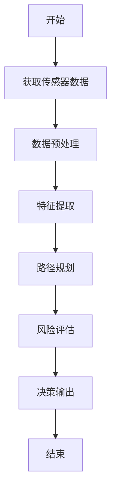
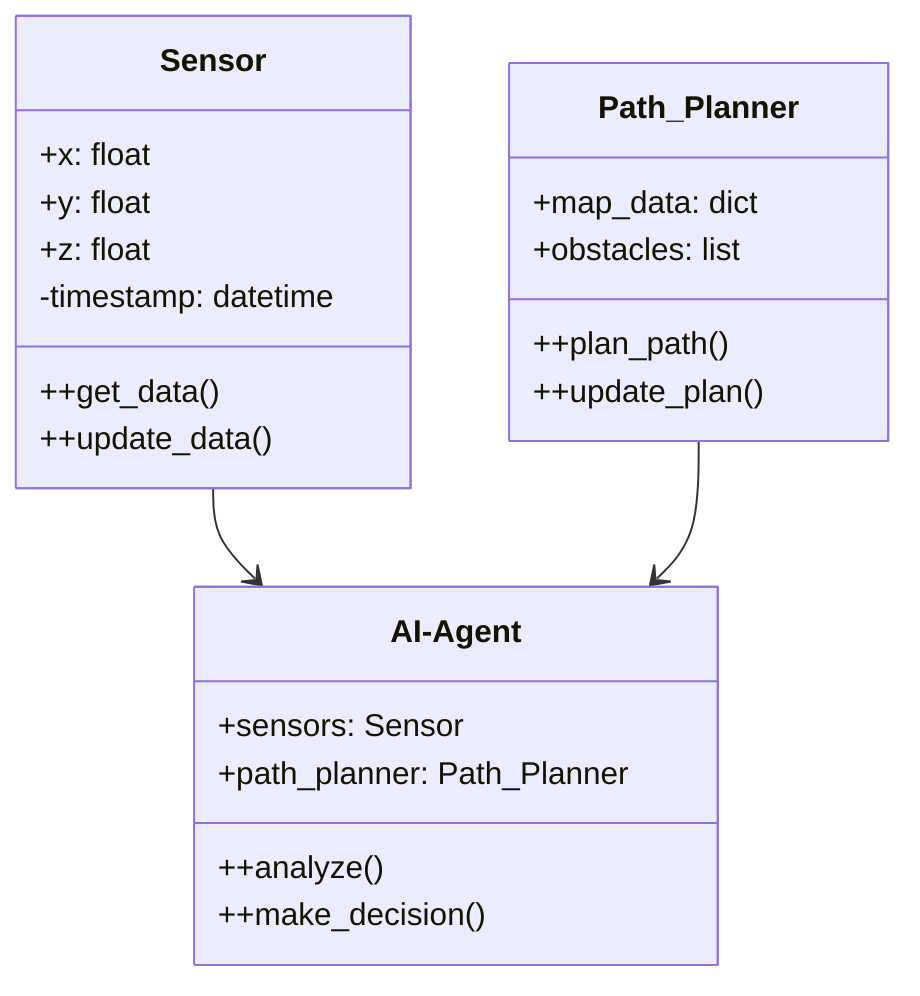
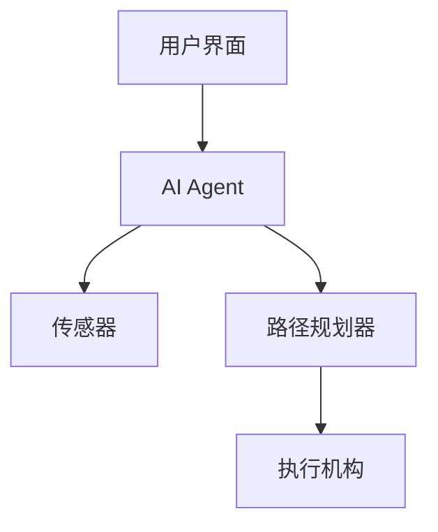

                 


**# AI Agent在智能登山杖中的地形分析**

**关键词：** AI Agent, 智能登山杖, 地形分析, 路径规划, 机器学习, 传感器数据, 户外运动

**摘要：**  
本文探讨AI Agent在智能登山杖中的地形分析应用，详细介绍AI技术如何帮助登山者通过地形分析实现安全、高效的登山体验。文章从问题背景、核心概念、算法原理、系统架构到项目实战，全面解析AI Agent在智能设备中的技术实现与实际应用。

---

## 第一章: 问题背景与描述

### 1.1 问题背景介绍

#### 1.1.1 当代登山运动的技术挑战  
现代登山运动面临复杂地形、天气变化和体力极限等多重挑战。传统登山杖仅提供物理支撑，缺乏智能辅助功能，难以满足现代登山者的需求。

#### 1.1.2 地形分析技术在户外运动中的重要性  
地形分析技术能帮助登山者识别危险区域、规划最优路径，提升运动效率和安全性。

#### 1.1.3 AI技术在智能设备中的应用趋势  
AI技术的快速发展推动了智能设备的创新，AI Agent在智能登山杖中的应用成为可能。

### 1.2 问题描述与目标

#### 1.2.1 智能登山杖的功能需求  
智能登山杖需具备地形分析、路径规划、实时反馈等功能，帮助登山者做出决策。

#### 1.2.2 地形分析的数学与算法挑战  
地形分析涉及多源数据融合、特征提取和路径规划等复杂算法，需结合数学模型优化。

#### 1.2.3 AI Agent在智能决策中的作用  
AI Agent通过实时分析环境数据，辅助登山杖做出最优决策，提升用户体验。

### 1.3 问题解决与边界

#### 1.3.1 AI Agent在地形分析中的核心任务  
AI Agent负责数据处理、特征提取和决策制定，确保地形分析的准确性和实时性。

#### 1.3.2 地形分析的边界与外延  
地形分析的边界包括传感器数据的处理范围和决策的适用场景，外延则涉及其他智能设备的应用。

#### 1.3.3 系统设计的关键要素与组成  
系统由传感器、AI Agent、用户界面和执行机构组成，各部分协同工作实现智能分析。

---

## 第二章: AI Agent与地形分析的核心概念

### 2.1 核心概念与原理

#### 2.1.1 AI Agent的基本定义与特征  
AI Agent是具有感知、决策和执行能力的智能体，能根据环境信息做出反应。

#### 2.1.2 地形分析的数学模型与特征提取  
地形分析通过传感器数据建立数学模型，提取关键特征用于路径规划。

#### 2.1.3 AI Agent在地形分析中的决策机制  
AI Agent基于多源数据，结合上下文信息，进行路径优化和风险评估。

### 2.2 核心概念对比分析

#### 2.2.1 不同地形分析算法的特征对比（表格）  
| 算法名称   | 数据输入 | 输出结果 | 优势             | 劣势             |
|------------|----------|----------|-----------------|-----------------|
| A*算法     | 坐标数据 | 路径规划 | 最优路径         | 适合静态环境     |
| RRT算法     | 传感器数据 | 路径规划 | 处理动态障碍     | 计算效率较低     |

#### 2.2.2 AI Agent与传统自动控制系统的区别  
AI Agent具备学习和自适应能力，而传统系统依赖预设规则。

#### 2.2.3 地形分析数据的特征与处理方法  
传感器数据包括GPS、加速度、倾斜角等，需预处理、特征提取和融合。

### 2.3 实体关系与架构设计

#### 2.3.1 地形分析系统的ER实体关系图（Mermaid流程图）  
```mermaid
erDiagram
    participant User
    participant Sensor_Data
    participant AI-Agent
    participant Path_Planning
    participant Decision_Making
    User --> Sensor_Data : 提供数据
    Sensor_Data --> AI-Agent : 分析数据
    AI-Agent --> Path_Planning : 生成路径
    Path_Planning --> Decision_Making : 制定决策
    Decision_Making --> User : 提供反馈
```

---

## 第三章: AI Agent的算法原理与数学模型

### 3.1 算法原理与流程

#### 3.1.1 地形分析算法的总体流程（Mermaid流程图）  


#### 3.1.2 AI Agent的决策逻辑与反馈机制  
AI Agent根据实时数据和预设模型，计算最优路径，通过反馈机制动态调整决策。

#### 3.1.3 算法实现的数学模型与公式  
路径规划的数学模型：  
$$\text{距离} = \sqrt{(x_2 - x_1)^2 + (y_2 - y_1)^2}$$  
RRT算法优化目标：  
$$\text{路径长度} = \sum_{i=1}^{n} \sqrt{(x_i - x_{i-1})^2 + (y_i - y_{i-1})^2}$$

### 3.2 核心算法实现

#### 3.2.1 路径规划算法的数学模型与公式  
A*算法的启发函数：  
$$h(n) = \sqrt{(x_{\text{end}} - x_n)^2 + (y_{\text{end}} - y_n)^2}$$  

#### 3.2.2 地形特征提取的算法实现  
Python代码示例：  
```python
import numpy as np

def terrain_feature_extraction(data):
    # 数据预处理
    processed_data = data.apply(lambda x: x**2)
    # 特征提取
    features = processed_data.describe()
    return features
```

---

## 第四章: 系统分析与架构设计

### 4.1 系统功能设计

#### 4.1.1 领域模型类图（Mermaid）  


### 4.2 系统架构设计

#### 4.2.1 系统架构图（Mermaid）  


#### 4.2.2 接口设计与交互流程  
交互流程：用户输入指令 → 传感器采集数据 → AI Agent分析 → Planner生成路径 → 执行机构反馈。

---

## 第五章: 项目实战

### 5.1 环境安装与配置

#### 5.1.1 Python环境安装  
安装依赖：`pip install numpy matplotlib`

#### 5.1.2 系统核心实现源代码  
路径规划代码示例：  
```python
import numpy as np
import matplotlib.pyplot as plt

def plot_path(planner):
    plt.figure(figsize=(10, 10))
    plt.plot(planner.x, planner.y, 'b-', marker='o')
    plt.xlabel('X')
    plt.ylabel('Y')
    plt.title('Path Planning')
    plt.show()
```

### 5.2 实际案例分析与解读

#### 5.2.1 案例分析  
案例：复杂地形下的路径规划，AI Agent如何优化路径，避开障碍。

#### 5.2.2 代码实现与功能解读  
解读代码中的关键部分，如传感器数据的处理和路径规划算法的实现。

---

## 第六章: 总结与展望

### 6.1 总结

#### 6.1.1 核心内容回顾  
AI Agent通过传感器数据和算法模型，实现智能地形分析和路径规划，提升登山杖的智能化水平。

### 6.1.2 未来展望  
未来可能的发展方向包括增强现实反馈、多传感器融合和自适应学习算法。

### 6.2 最佳实践 tips

#### 6.2.1 使用AI Agent的注意事项  
确保数据安全，定期更新模型，适应不同地形。

#### 6.2.2 拓展阅读建议  
推荐阅读《强化学习》和《计算机视觉》相关书籍。

---

**作者：AI天才研究院/AI Genius Institute & 禅与计算机程序设计艺术 /Zen And The Art of Computer Programming**

