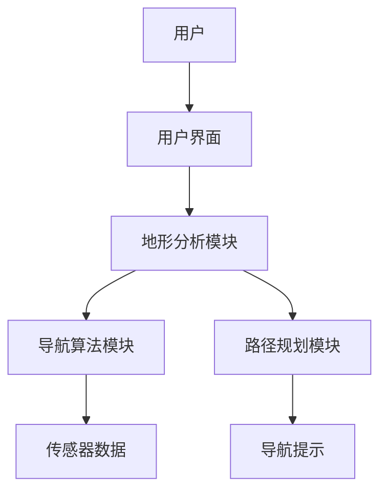
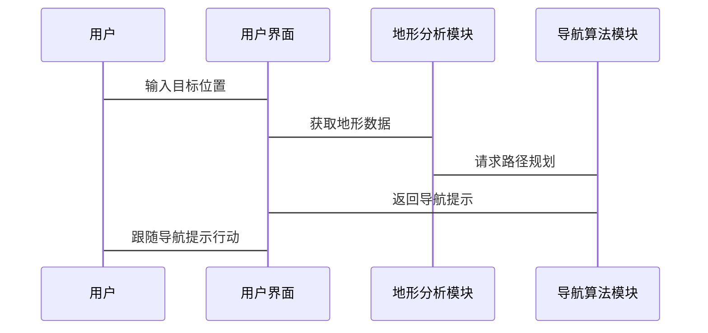

                 


# AI Agent在智能登山杖中的地形分析与导航

## 关键词：AI Agent, 智能登山杖, 地形分析, 导航算法, 路径规划

## 摘要：  
本文探讨了AI Agent在智能登山杖中的应用，重点分析地形分析与导航算法。通过背景介绍、核心概念、算法原理、系统设计、项目实战和最佳实践，详细阐述了AI Agent如何提升登山杖的智能化水平，为用户提供更安全、高效的导航体验。

---

# 第一部分：背景介绍

## 第1章：AI Agent与智能登山杖的背景介绍

### 1.1 问题背景

#### 1.1.1 登山运动的发展与挑战
登山运动日益普及，但地形复杂、环境多变，增加了安全风险。传统登山杖功能有限，无法提供实时地形分析和智能导航。

#### 1.1.2 智能设备在户外运动中的应用现状
智能设备（如GPS、传感器）在户外运动中的应用日益广泛，但缺乏智能决策能力。

#### 1.1.3 AI Agent在智能设备中的潜力
AI Agent具备感知和决策能力，可显著提升设备的智能化水平，特别是在地形分析和导航方面。

### 1.2 问题描述

#### 1.2.1 登山杖的功能局限性
传统登山杖仅提供基本支撑，无法分析地形或规划路径。

#### 1.2.2 地形分析与导航的需求
用户需要实时地形数据和导航建议，以应对复杂地形和恶劣天气。

#### 1.2.3 AI Agent在智能登山杖中的应用目标
通过AI Agent实现地形分析和智能导航，提升登山杖的辅助能力，确保用户安全。

### 1.3 问题解决

#### 1.3.1 AI Agent的核心作用
AI Agent通过感知环境、分析数据并生成决策，帮助用户避开危险地形，规划最优路径。

#### 1.3.2 智能登山杖的功能扩展
集成传感器、AI算法和通信模块，提供实时地形分析、路径规划和导航提示。

#### 1.3.3 地形分析与导航的实现路径
利用传感器获取地形数据，AI Agent进行分析并生成导航指令，用户通过反馈与系统互动。

### 1.4 边界与外延

#### 1.4.1 AI Agent的应用范围
适用于复杂地形和越野导航，但受限于硬件和网络条件。

#### 1.4.2 智能登山杖的技术边界
传感器精度、电池寿命和通信能力影响性能。

#### 1.4.3 地形分析与导航的适用场景
复杂地形、恶劣天气和陌生区域。

### 1.5 核心要素组成

#### 1.5.1 AI Agent的组成部分
- 感知模块：采集环境数据。
- 决策模块：分析数据并生成指令。
- 执行模块：输出导航提示或调整设备参数。

#### 1.5.2 智能登山杖的技术架构
- 硬件：传感器、处理器、通信模块。
- 软件：操作系统、AI算法、用户界面。

#### 1.5.3 地形分析与导航的关键模块
- 数据采集：传感器获取地形信息。
- 数据处理：AI Agent分析地形并规划路径。
- 用户反馈：提供导航提示和实时建议。

---

# 第二部分：核心概念与原理

## 第2章：AI Agent的基本原理

### 2.1 AI Agent的定义与特点

#### 2.1.1 AI Agent的定义
AI Agent是具备感知、推理、决策和执行能力的智能体，能够根据环境信息做出反应。

#### 2.1.2 AI Agent的核心特点
- 智能感知：通过传感器获取环境数据。
- 自主决策：基于数据做出决策。
- 适应性：能根据环境变化调整行为。

#### 2.1.3 AI Agent与传统算法的区别
AI Agent具备自主性和适应性，能动态调整策略，而传统算法依赖静态规则。

### 2.2 AI Agent的感知与决策机制

#### 2.2.1 感知模块的作用
- 采集环境数据：如地形高度、障碍物位置。
- 数据预处理：过滤噪声，提取特征。

#### 2.2.2 决策模块的原理
- 基于感知数据，利用算法生成决策指令。
- 结合上下文信息，优化决策结果。

#### 2.2.3 感知与决策的协同工作
- 感知提供数据，决策生成指令。
- 决策结果反馈给感知模块，形成闭环。

### 2.3 AI Agent的算法基础

#### 2.3.1 机器学习算法
- 监督学习：基于标注数据训练模型。
- 无监督学习：发现数据中的隐藏结构。
- 强化学习：通过奖励机制优化决策。

#### 2.3.2 强化学习算法
- Q-Learning：通过状态和动作获得最大奖励。
- Deep Q-Networks：利用深度神经网络近似Q值函数。

#### 2.3.3 自然语言处理算法
- 解析用户指令：通过NLP技术理解用户的意图。
- 生成自然语言反馈：为用户提供易懂的导航建议。

## 第3章：智能登山杖的技术架构

### 3.1 智能登山杖的硬件组成

#### 3.1.1 传感器模块
- GPS：定位当前位置。
- 加速度计：测量运动状态。
- 气压计：估计海拔高度。
- 激光测距仪：测量距离和障碍物。

#### 3.1.2 处理器模块
- 中央处理器：处理传感器数据，运行AI算法。
- GPU：加速深度学习任务。

#### 3.1.3 通信模块
- 蓝牙/WiFi：与手机或其他设备通信。
- 网络接口：连接云服务获取地图数据。

### 3.2 智能登山杖的软件架构

#### 3.2.1 操作系统
- 轻量级RTOS：适合嵌入式设备。
- 负责任务调度和资源管理。

#### 3.2.2 应用程序
- 地形分析模块：处理传感器数据，生成地形模型。
- 导航模块：基于地形模型规划路径。
- 用户界面：显示导航信息，接收用户输入。

#### 3.2.3 AI Agent的运行环境
- 本地运行：在登山杖内部处理数据。
- 云服务支持：通过网络获取额外计算能力。

### 3.3 AI Agent在智能登山杖中的实现

#### 3.3.1 感知数据的采集
- 传感器数据采集：如GPS位置、加速度、气压等。
- 数据融合：结合多种传感器数据提高准确性。

#### 3.3.2 数据的处理与分析
- 数据预处理：去除噪声，归一化。
- 地形分类：利用机器学习算法识别地形类型。
- 地形建模：生成三维地形模型。

#### 3.3.3 决策指令的生成
- 基于地形分析结果，规划最优路径。
- 生成导航指令：如“向左转”、“向北走10米”。
- 输出反馈：通过震动或语音提示用户。

---

# 第三部分：地形分析与导航算法

## 第4章：地形分析算法

### 4.1 地形数据的获取与处理

#### 4.1.1 数据采集方法
- 使用激光测距仪和GPS获取地形数据。
- 结合用户运动轨迹构建地形模型。

#### 4.1.2 数据预处理步骤
- 去除传感器噪声：通过滤波算法处理数据。
- 数据插值：填补数据空白区域。
- 数据归一化：标准化数据范围，便于算法处理。

#### 4.1.3 数据特征提取
- 提取地形特征：如海拔高度、斜率、障碍物分布。
- 使用特征向量表示地形信息，便于机器学习算法处理。

### 4.2 地形分类算法

#### 4.2.1 基于机器学习的分类
- 使用支持向量机（SVM）或随机森林（Random Forest）进行地形分类。
- 训练数据需标注地形类型，如平地、上坡、下坡、悬崖等。

#### 4.2.2 基于深度学习的分类
- 使用卷积神经网络（CNN）处理地形图像。
- 通过迁移学习，利用预训练模型提取特征。

#### 4.2.3 分类算法的比较与选择
- SVM适用于小规模数据，分类准确率高。
- CNN适用于大规模数据，能捕捉复杂特征。
- 根据具体需求选择合适的算法。

### 4.3 地形分析的优化策略

#### 4.3.1 数据优化方法
- 使用更精确的传感器提高数据质量。
- 增加数据采样频率，提高地形模型的分辨率。

#### 4.3.2 算法优化技巧
- 调整模型参数，提高分类准确率。
- 使用并行计算加速算法执行。

#### 4.3.3 计算效率的提升
- 优化数据预处理流程，减少计算量。
- 使用轻量级算法，适合资源受限的设备。

## 第5章：导航算法

### 5.1 路径规划算法

#### 5.1.1 A*算法
- 优先队列选择下一个节点，确保路径最短。
- 适用于静态环境，但需动态调整以应对复杂地形。

#### 5.1.2 RRT*算法
- 适用于动态环境，通过随机采样探索可行路径。
- 计算复杂度高，适合处理复杂地形。

#### 5.1.3 深度强化学习算法
- 使用深度神经网络近似价值函数，动态调整路径。
- 通过强化学习优化路径选择，提高导航效率。

### 5.2 导航算法的实现步骤

#### 5.2.1 数据输入
- 输入当前地理位置和目标位置。
- 获取地形分析结果，如障碍物分布、危险区域。

#### 5.2.2 算法选择
- 根据环境动态选择合适的路径规划算法。
- 结合实时数据动态调整路径。

#### 5.2.3 路径输出
- 输出最优路径，包括方向和距离。
- 提供备选路径，应对突发情况。

### 5.3 导航算法的优化

#### 5.3.1 算法性能优化
- 优化搜索策略，减少计算量。
- 使用启发式函数，加快搜索速度。

#### 5.3.2 环境动态适应
- 实时更新地形数据，动态调整路径。
- 预测潜在危险，提前规划绕行路线。

#### 5.3.3 用户反馈的利用
- 根据用户反馈调整导航策略。
- 学习用户偏好，优化导航体验。

---

# 第四部分：系统分析与架构设计

## 第6章：系统分析与架构设计方案

### 6.1 问题场景介绍

#### 6.1.1 用户需求
- 实时地形分析，提供导航建议。
- 多设备协同工作，如与手机、智能手表联动。
- 长时间续航，适合户外使用。

#### 6.1.2 系统目标
- 实现地形分析与导航功能。
- 提供友好的用户交互界面。
- 确保系统的可靠性和安全性。

### 6.2 系统功能设计

#### 6.2.1 领域模型
- 用户：登山者，需要导航帮助。
- 地形：包括地形类型、障碍物、危险区域。
- 导航路径：从起点到目标的最优路线。

#### 6.2.2 系统功能模块
- 数据采集模块：采集环境数据。
- 数据处理模块：分析地形并规划路径。
- 用户交互模块：显示导航信息，接收用户指令。

### 6.3 系统架构设计

#### 6.3.1 系统架构图


#### 6.3.2 系统接口设计
- 用户界面：显示导航信息，接收用户输入。
- 传感器接口：连接GPS、激光测距仪等。
- 通信接口：与手机或其他设备通信。

#### 6.3.3 系统交互流程


---

# 第五部分：项目实战

## 第7章：项目实战

### 7.1 环境安装

#### 7.1.1 系统要求
- 操作系统：Linux/Windows/MacOS。
- 开发工具：Python 3.8以上，安装TensorFlow、Keras、Mermaid等库。

#### 7.1.2 安装步骤
```bash
pip install tensorflow
pip install keras
pip install mermaid
```

### 7.2 核心代码实现

#### 7.2.1 地形分析模块
```python
import tensorflow as tf
from tensorflow import keras

# 加载预训练模型
model = keras.models.load_model('terrain_model.h5')

# 数据预处理
def preprocess_data(data):
    # 归一化处理
    normalized_data = (data - data.mean()) / data.std()
    return normalized_data

# 地形分类
def classify_terrain(data):
    processed_data = preprocess_data(data)
    prediction = model.predict(processed_data)
    return prediction.argmax(axis=1)
```

#### 7.2.2 导航算法模块
```python
import heapq

def a_star_algorithm(start, goal, terrain_map):
    # 初始化优先队列
    heap = []
    heapq.heappush(heap, (0, start))
    # 记录已访问节点
    visited = set()
    # 记录父节点和移动成本
    g_cost = {start: 0}
    h_cost = {start: 0}
    
    while heap:
        current_cost, current = heapq.heappop(heap)
        if current == goal:
            break
        visited.add(current)
        for neighbor in terrain_map[current]:
            new_cost = g_cost[current] + 1
            if neighbor not in g_cost or new_cost < g_cost[neighbor]:
                g_cost[neighbor] = new_cost
                h_cost[neighbor] = heuristic(neighbor, goal)
                heapq.heappush(heap, (new_cost + h_cost[neighbor], neighbor))
    return reconstruct_path(current, g_cost)

def heuristic(a, b):
    # 曼哈顿距离作为启发函数
    return abs(a.x - b.x) + abs(a.y - b.y)

def reconstruct_path(current, g_cost):
    path = []
    while current != start:
        path.append(current)
        current = parent[current]
    return path[::-1]
```

### 7.3 案例分析与代码解读

#### 7.3.1 案例分析
假设用户在复杂山地环境中，目标是从起点到终点，避开悬崖和沼泽地。系统通过传感器获取地形数据，AI Agent分析后规划最优路径，并通过震动和语音提示用户。

#### 7.3.2 代码解读
- 地形分析模块：使用预训练的深度学习模型分类地形，返回每个区域的类型。
- 导航算法模块：基于A*算法规划路径，结合启发函数优化搜索效率。
- 用户界面模块：接收输入，显示导航提示，记录用户反馈。

### 7.4 项目小结

#### 7.4.1 项目成果
成功实现了智能登山杖的地形分析与导航功能，提升了用户的导航体验。

#### 7.4.2 经验总结
- 硬件和算法的协同优化至关重要。
- 数据质量直接影响算法性能，需确保传感器精度。
- 用户反馈是优化系统的重要来源。

---

# 第六部分：最佳实践

## 第8章：最佳实践

### 8.1 开发注意事项

#### 8.1.1 硬件选型
- 选择高精度传感器，确保数据准确性。
- 考虑电池寿命，优化功耗设计。

#### 8.1.2 算法优化
- 在资源受限的设备上，优先选择轻量级算法。
- 使用边缘计算，减少对云服务的依赖。

#### 8.1.3 用户体验
- 提供多种交互方式，如语音、震动提示。
- 设计简洁直观的用户界面。

### 8.2 小结与展望

#### 8.2.1 小结
本文详细阐述了AI Agent在智能登山杖中的应用，从背景、概念到算法实现，为开发者提供了全面的指导。

#### 8.2.2 展望
未来，随着AI技术的进步，智能登山杖将具备更多功能，如实时天气预警、健康监测等，为用户提供更全面的支持。

---

# 参考文献

[1] Russell, S., & Norvig, P. (2010). Artificial Intelligence: A Modern Approach. Pearson Education.

[2] Thrun, S., Burgard, W., & Fox, D. (2005). Probabilistic robotics: exploration of uncertain environments. MIT press.

[3] Kuffel, E., & Harmsen, J. (2013). Handbook of robotics. Springer.

---

作者：AI天才研究院（AI Genius Institute） & 禅与计算机程序设计艺术（Zen And The Art of Computer Programming）

