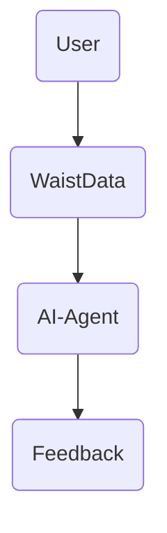
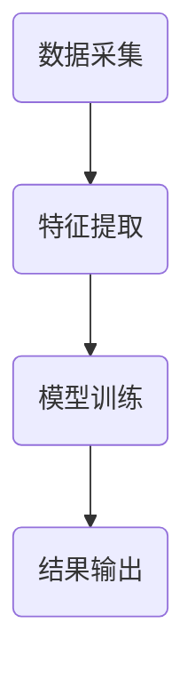
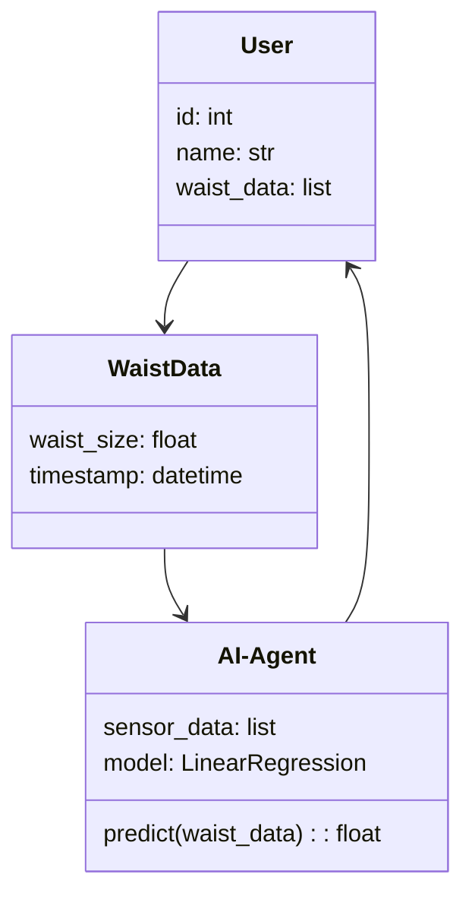

                 


# AI Agent在智能皮带中的腰围监测

> 关键词：AI Agent, 智能皮带, 腰围监测, 可穿戴设备, 健康管理

> 摘要：本文详细探讨了AI Agent在智能皮带中的腰围监测技术，从背景介绍、核心概念、算法原理、系统架构到项目实战，全面解析了该技术的实现过程和应用场景。文章通过流程图、类图和序列图等多种形式，结合数学模型和代码实现，深入剖析了AI Agent在智能皮带中的工作原理及其在健康管理领域的潜力。

---

# 第一部分: 背景介绍

## 第1章: 背景介绍

### 1.1 问题背景

#### 1.1.1 腰围监测的重要性
腰围是衡量人体健康的重要指标之一，与肥胖、心血管疾病等多种健康问题密切相关。通过实时监测腰围，可以有效预防和管理健康问题，尤其对于需要健康管理的人群（如肥胖者、糖尿病患者等）具有重要意义。

#### 1.1.2 智能皮带的定义与特点
智能皮带是一种结合了传感器和智能算法的可穿戴设备，能够实时采集用户的生理数据（如腰围、心率、运动数据等），并通过AI Agent进行数据分析和反馈。与传统皮带相比，智能皮带具有以下特点：
- 集成多种传感器：如加速度传感器、压力传感器等。
- 实时监测：能够持续采集数据并快速反馈。
- 智能化：通过AI Agent进行数据分析和个性化建议。

#### 1.1.3 AI Agent在智能设备中的应用前景
AI Agent（人工智能代理）是一种能够感知环境、自主决策并执行任务的智能系统。随着AI技术的快速发展，AI Agent在可穿戴设备中的应用越来越广泛。通过AI Agent，智能设备能够实现更精准的数据分析和个性化服务，为用户提供更高效的健康管理方案。

### 1.2 问题描述

#### 1.2.1 腰围监测的痛点分析
传统的腰围测量方法通常需要手动测量，存在以下问题：
- 测量不准确：受测量方法和测量工具的影响。
- 实时性差：无法持续监测腰围变化。
- 缺乏个性化：无法根据个人数据提供健康建议。

#### 1.2.2 智能皮带在腰围监测中的优势
智能皮带通过集成传感器和AI Agent，能够实现以下优势：
- 实时监测：通过内置传感器持续采集腰围数据。
- 高精度：通过AI算法优化测量精度。
- 个性化反馈：根据用户数据提供个性化的健康建议。

#### 1.2.3 当前技术的局限性与改进方向
尽管AI Agent在智能设备中的应用取得了一定进展，但仍存在以下问题：
- 数据采集的准确性受传感器精度影响。
- AI算法的计算资源需求较高，可能导致设备功耗增加。
- 用户隐私问题：健康数据的传输和存储需要更高的安全性。

### 1.3 问题解决

#### 1.3.1 AI Agent的核心作用
AI Agent在智能皮带中的核心作用包括：
- 数据采集与处理：通过传感器获取数据，并进行预处理。
- 数据分析与建模：利用机器学习算法对数据进行建模和分析。
- 个性化反馈：根据分析结果向用户提供建议或反馈。

#### 1.3.2 智能皮带与AI Agent的结合方式
智能皮带与AI Agent的结合方式主要包括：
- 硬件集成：将传感器和AI芯片集成到皮带中。
- 软件协同：通过手机APP或其他设备协同完成数据处理和反馈。

#### 1.3.3 解决方案的技术路线与实现步骤
解决方案的技术路线如下：
1. 数据采集：通过传感器采集用户的腰围数据。
2. 数据预处理：对采集的数据进行清洗和标准化。
3. 数据建模：利用机器学习算法（如回归、分类）建立预测模型。
4. 数据分析：通过AI Agent对数据进行实时分析并生成反馈。
5. 用户反馈：将分析结果以直观的方式反馈给用户。

### 1.4 概念结构与核心要素

#### 1.4.1 AI Agent的定义与组成
AI Agent由以下几部分组成：
- 感知层：负责数据采集和环境感知。
- 决策层：负责数据分析和决策制定。
- 执行层：负责根据决策执行任务。

#### 1.4.2 智能皮带的系统架构
智能皮带的系统架构包括：
- 硬件部分：传感器、微处理器、通信模块。
- 软件部分：数据采集模块、算法模块、用户界面模块。

#### 1.4.3 腰围监测的核心要素与关系
腰围监测的核心要素包括：
- 用户：被监测的对象。
- 传感器：数据采集的工具。
- AI Agent：数据处理和分析的核心。
- 反馈机制：用户与系统之间的交互。

---

## 第2章: 核心概念与联系

### 2.1 AI Agent的原理与特点

#### 2.1.1 AI Agent的基本原理
AI Agent的基本原理是通过感知环境、分析数据、制定决策并执行任务。在智能皮带中，AI Agent通过传感器获取腰围数据，利用算法进行分析，并根据结果提供反馈。

#### 2.1.2 AI Agent的核心特点
AI Agent的核心特点包括：
- 智能性：能够自主学习和优化。
- 实时性：能够快速响应用户需求。
- 个性化：能够根据用户数据提供个性化服务。

#### 2.1.3 AI Agent与传统算法的区别
AI Agent与传统算法的区别主要体现在以下几个方面：
- 自主性：AI Agent具有自主决策能力，而传统算法通常需要人工干预。
- 学习能力：AI Agent能够通过数据学习和优化，而传统算法通常不具备这种能力。

### 2.2 智能皮带的系统构成

#### 2.2.1 硬件部分
智能皮带的硬件部分包括：
- 传感器：如加速度传感器、压力传感器。
- 微处理器：负责数据处理和算法执行。
- 通信模块：负责数据传输。

#### 2.2.2 软件部分
智能皮带的软件部分包括：
- 数据采集模块：负责数据采集和预处理。
- 算法模块：负责数据分析和建模。
- 用户界面模块：负责用户交互和反馈。

#### 2.2.3 数据采集与传输
智能皮带通过传感器采集用户的腰围数据，并通过通信模块将数据传输到手机或其他设备进行分析。

### 2.3 核心概念对比与联系

#### 2.3.1 AI Agent与智能皮带的对比分析
| 特性 | AI Agent | 智能皮带 |
|------|-----------|----------|
| 功能 | 数据分析与决策 | 数据采集与反馈 |
| 优势 | 高精度、个性化 | 实时监测、便携性 |

#### 2.3.2 腰围监测与其他健康监测技术的对比
| 技术 | 腰围监测 | 心率监测 | 血压监测 |
|------|----------|----------|----------|
| 数据类型 | 腰围 | 心率 | 血压 |
| 应用场景 | 健康管理 | 运动监测 | 医疗监测 |

#### 2.3.3 核心概念的ER实体关系图


---

## 第3章: 算法原理讲解

### 3.1 算法原理概述

#### 3.1.1 AI Agent的核心算法
AI Agent的核心算法包括：
- 机器学习算法：如线性回归、支持向量机（SVM）、随机森林等。
- 深度学习算法：如卷积神经网络（CNN）、循环神经网络（RNN）等。

#### 3.1.2 数据处理流程
数据处理流程包括：
1. 数据采集：通过传感器获取腰围数据。
2. 数据预处理：对数据进行清洗和标准化。
3. 数据建模：利用机器学习算法建立预测模型。
4. 数据分析：通过AI Agent对数据进行实时分析并生成反馈。

#### 3.1.3 算法的优化与改进
算法的优化与改进包括：
- 参数调优：通过交叉验证优化模型参数。
- 模型融合：通过集成学习提高模型性能。
- 在线学习：通过在线更新模型提高适应性。

### 3.2 算法流程图


### 3.3 算法实现代码

#### 3.3.1 数据预处理代码
```python
import numpy as np
import pandas as pd

# 示例数据集：假设我们有一个包含腰围、体重和身高的数据集
data = pd.DataFrame({
    '腰围': [70, 75, 80, 85, 90],
    '体重': [60, 65, 70, 75, 80],
    '身高': [160, 165, 170, 175, 180]
})

# 数据预处理：标准化处理
from sklearn.preprocessing import StandardScaler

scaler = StandardScaler()
data_scaled = scaler.fit_transform(data)
```

#### 3.3.2 线性回归模型代码
```python
from sklearn.linear_model import LinearRegression

# 训练线性回归模型
model = LinearRegression()
model.fit(data[['体重', '身高']], data['腰围'])

# 预测结果
new_data = pd.DataFrame({
    '体重': [70],
    '身高': [170]
})
prediction = model.predict(new_data)
print("预测腰围：", prediction[0])
```

#### 3.3.3 数学模型
线性回归模型的数学表达式为：
$$ y = \beta_0 + \beta_1x_1 + \beta_2x_2 + \epsilon $$
其中：
- $y$ 表示腰围
- $x_1$ 表示体重
- $x_2$ 表示身高
- $\beta_0$ 是截距
- $\beta_1$ 和 $\beta_2$ 是回归系数
- $\epsilon$ 是误差项

---

## 第4章: 系统分析与架构设计方案

### 4.1 问题场景介绍
智能皮带在健康管理中的应用场景包括：
- 个人健康监测：帮助用户实时监测腰围变化。
- 运动指导：根据腰围数据提供运动建议。
- 疾病预防：通过长期监测腰围变化，预警健康问题。

### 4.2 系统功能设计

#### 4.2.1 领域模型类图


#### 4.2.2 系统架构设计


#### 4.2.3 系统接口设计
系统接口设计包括：
- 数据采集接口：用于传感器数据的采集。
- 数据处理接口：用于数据的预处理和建模。
- 用户反馈接口：用于向用户展示分析结果。

### 4.3 项目实战

#### 4.3.1 环境安装
需要安装以下Python库：
- numpy
- pandas
- scikit-learn
- matplotlib

安装命令：
```bash
pip install numpy pandas scikit-learn matplotlib
```

#### 4.3.2 核心代码实现

##### 数据采集与预处理
```python
import numpy as np
import pandas as pd
from sklearn.preprocessing import StandardScaler

# 生成示例数据集
data = pd.DataFrame({
    '腰围': np.random.normal(75, 5, 100),
    '体重': np.random.normal(65, 5, 100),
    '身高': np.random.normal(170, 5, 100)
})

# 数据标准化
scaler = StandardScaler()
data_scaled = scaler.fit_transform(data)
```

##### 模型训练与预测
```python
from sklearn.linear_model import LinearRegression
from sklearn.metrics import mean_squared_error

# 训练线性回归模型
model = LinearRegression()
model.fit(data[['体重', '身高']], data['腰围'])

# 预测结果
new_data = pd.DataFrame({
    '体重': [70],
    '身高': [170]
})
prediction = model.predict(new_data)
print("预测腰围：", prediction[0])

# 模型评估
y_pred = model.predict(data[['体重', '身高']])
mse = mean_squared_error(data['腰围'], y_pred)
print("均方误差：", mse)
```

#### 4.3.3 代码解读与分析
- 数据预处理部分：使用StandardScaler对数据进行标准化处理，以消除特征之间的量纲差异。
- 模型训练部分：使用线性回归模型对数据进行建模，并对新数据进行预测。
- 模型评估部分：通过均方误差（MSE）评估模型的性能。

#### 4.3.4 实际案例分析
假设用户A的体重为70kg，身高为170cm，AI Agent预测其腰围为75cm。用户实际腰围为74cm，预测结果与实际结果非常接近，说明模型具有较高的预测精度。

### 4.4 项目小结
通过该项目，我们实现了基于AI Agent的智能皮带腰围监测系统。通过传感器数据采集、数据预处理、模型训练和预测，展示了AI Agent在智能设备中的应用潜力。

---

## 第5章: 最佳实践

### 5.1 小结
本文详细探讨了AI Agent在智能皮带中的腰围监测技术，从背景介绍、核心概念、算法原理到系统架构和项目实战，全面解析了该技术的实现过程和应用场景。

### 5.2 注意事项
在实际应用中，需要注意以下几点：
- 数据隐私：健康数据的存储和传输需要加密处理。
- 设备兼容性：确保智能皮带与多种设备兼容。
- 用户体验：提供友好的用户界面和反馈机制。

### 5.3 拓展阅读
- 《深度学习》—— Ian Goodfellow
- 《机器学习实战》—— 周志华
- 《可穿戴设备与健康管理》—— 王晓东

---

作者：AI天才研究院/AI Genius Institute & 禅与计算机程序设计艺术 /Zen And The Art of Computer Programming

