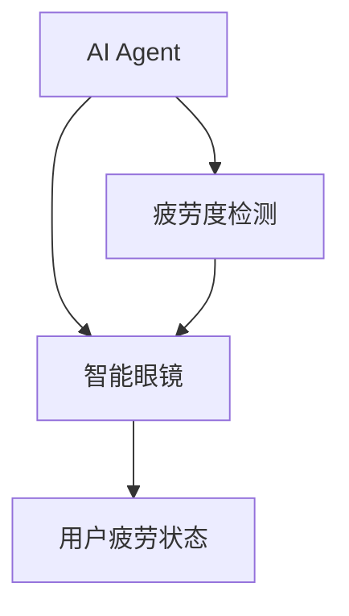
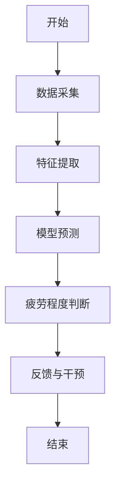
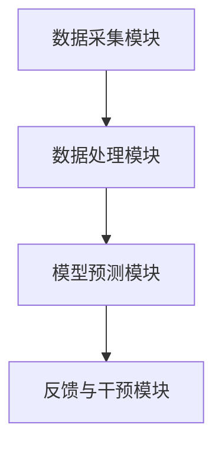

                 


# AI Agent在智能眼镜中的疲劳度检测

> 关键词：AI Agent, 智能眼镜, 疲劳度检测, 机器学习, 计算机视觉

> 摘要：本文探讨了AI Agent在智能眼镜中的应用，重点分析了疲劳度检测的技术原理、系统架构和实现方法。文章详细介绍了疲劳度检测的关键指标、AI Agent的核心概念、算法原理、系统设计及项目实战，为智能眼镜的设计和应用提供了理论支持和实践指导。

---

# 第1章: 背景介绍

## 1.1 问题背景

### 1.1.1 智能眼镜的发展现状
智能眼镜作为一种融合了计算机视觉和人工智能技术的可穿戴设备，近年来得到了快速发展。它能够通过摄像头、传感器等硬件设备采集用户的生理数据，并结合AI算法进行分析，为用户提供智能化的服务。

### 1.1.2 疲劳度检测的必要性
长时间使用电子设备容易导致眼部疲劳、注意力下降等问题。疲劳不仅影响工作效率和生活质量，还可能引发健康问题。因此，实时监测用户的疲劳状态并提供相应的提醒或干预措施具有重要意义。

### 1.1.3 AI Agent在智能眼镜中的作用
AI Agent（智能体）在智能眼镜中扮演着关键角色。它能够实时处理传感器数据，分析用户的疲劳状态，并通过反馈机制帮助用户缓解疲劳。AI Agent的智能化和自主性使其能够适应不同的使用场景和用户需求。

## 1.2 问题描述

### 1.2.1 疲劳度检测的定义
疲劳度检测是指通过分析用户的生理和行为数据，判断其是否处于疲劳状态的过程。疲劳状态可能包括眼部疲劳、注意力分散、精神状态不佳等。

### 1.2.2 疲劳度检测的关键指标
- 眼睛的运动轨迹：通过眼球运动分析用户的注意力变化。
- 眨眼频率：眨眼次数减少可能表明用户疲劳。
- 头部姿势：长时间保持同一姿势可能导致颈部疲劳。
- 面部表情：疲劳时可能出现眼袋、眼神涣散等特征。

### 1.2.3 疲劳度检测的边界与外延
疲劳度检测不仅关注眼部疲劳，还包括全身性的疲劳状态。其外延涉及健康监测、注意力管理等多个领域。

## 1.3 问题解决

### 1.3.1 疲劳度检测的技术手段
- 基于图像处理的疲劳检测：通过分析眼部和面部特征，判断疲劳程度。
- 基于生理数据的疲劳检测：利用心率、体温等生理指标进行疲劳评估。
- 基于行为数据的疲劳检测：通过用户的操作行为（如鼠标点击频率、键盘输入速度）判断疲劳状态。

### 1.3.2 AI Agent在疲劳度检测中的应用
AI Agent能够实时采集和分析用户的生理数据，结合机器学习模型预测疲劳状态，并通过反馈机制帮助用户缓解疲劳。例如，AI Agent可以根据用户的疲劳程度调整屏幕亮度、提醒休息或播放放松音乐。

### 1.3.3 疲劳度检测的实现流程
1. 数据采集：通过摄像头、传感器等设备采集用户的眼部动作、面部表情、头部姿势等数据。
2. 数据预处理：去除噪声，提取关键特征。
3. 特征分析：通过算法分析特征，判断疲劳程度。
4. 反馈与干预：根据疲劳程度提供相应的反馈或干预措施。

## 1.4 本章小结
本章介绍了疲劳度检测的背景、关键指标和技术手段，阐述了AI Agent在智能眼镜中的作用，并总结了疲劳度检测的实现流程。

---

# 第2章: 核心概念与联系

## 2.1 AI Agent的定义与特点

### 2.1.1 AI Agent的基本概念
AI Agent是一种智能实体，能够感知环境、自主决策并执行任务。它具备学习、推理、规划和自适应能力，能够在动态环境中实现目标。

### 2.1.2 AI Agent的核心属性
- 感知能力：通过传感器和摄像头获取环境信息。
- 决策能力：基于感知信息进行分析和决策。
- 执行能力：根据决策结果执行相应操作。
- 学习能力：通过机器学习算法不断优化自身性能。

### 2.1.3 AI Agent与传统算法的对比
| 特性         | AI Agent                       | 传统算法                     |
|--------------|--------------------------------|------------------------------|
| 智能性       | 高，具备自主学习和决策能力     | 低，依赖预定义规则和模型       |
| 灵活性       | 高，能够适应不同场景           | 低，适用于特定任务和环境       |
| 处理能力     | 强大，能够处理复杂问题         | 较弱，适用于简单或规则性问题     |
| 学习能力     | 具备，能够通过数据优化性能     | 无，依赖人工调整和优化           |

## 2.2 疲劳度检测的定义与特点

### 2.2.1 疲劳度检测的基本概念
疲劳度检测是通过分析用户的生理和行为数据，判断其是否处于疲劳状态的过程。疲劳状态可能包括眼部疲劳、注意力分散、精神状态不佳等。

### 2.2.2 疲劳度检测的关键特征
- 眼睛运动：眼球运动轨迹、眨眼频率等。
- 面部表情：眼袋、眼神涣散等特征。
- 头部姿势：头部倾斜度、颈部姿势等。
- 行为数据：操作速度、错误率等。

### 2.2.3 疲劳度检测与健康监测的关系
疲劳度检测是健康监测的一部分，旨在通过早期发现疲劳状态，预防健康问题的发生。健康监测还包括心率、血压、体温等生理指标的监测。

## 2.3 AI Agent与疲劳度检测的关系

### 2.3.1 AI Agent在疲劳度检测中的角色
AI Agent在疲劳度检测中扮演数据采集、分析和反馈的核心角色。它能够实时采集用户的生理数据，通过机器学习模型分析疲劳程度，并提供相应的反馈或干预措施。

### 2.3.2 疲劳度检测对AI Agent的需求
疲劳度检测需要AI Agent具备实时数据处理、自主决策和人机交互能力。AI Agent需要能够快速分析数据并作出响应，以满足用户的实时需求。

### 2.3.3 AI Agent与疲劳度检测的协同工作
AI Agent与疲劳度检测系统协同工作，形成一个闭环系统。AI Agent负责数据采集和分析，疲劳度检测系统负责判断疲劳程度并提供反馈，两者共同实现疲劳状态的实时监测和干预。

## 2.4 核心概念对比表

| 特性         | AI Agent                       | 疲劳度检测                 |
|--------------|--------------------------------|---------------------------|
| 目标         | 实现智能化服务                 | 监测用户疲劳状态           |
| 输入         | 多模态数据（图像、传感器数据）  | 用户生理和行为数据         |
| 输出         | 智能决策和反馈                | 疲劳程度评估和干预建议      |
| 核心技术     | 机器学习、计算机视觉          | 特征提取、分类算法          |

## 2.5 实体关系图



## 2.6 本章小结
本章详细介绍了AI Agent和疲劳度检测的核心概念，分析了它们的属性、特点及其关系，并通过对比表和实体关系图展示了两者之间的协同工作关系。

---

# 第3章: 算法原理讲解

## 3.1 疲劳度检测的特征提取

### 3.1.1 眼睛特征提取
- 眼球运动轨迹：通过计算机视觉技术跟踪眼球的运动，分析用户的注意力变化。
- 眼睛开合度：通过眼睑检测算法判断用户的疲劳程度。

### 3.1.2 面部特征提取
- 眼袋检测：通过图像处理技术检测眼袋的出现，判断用户的疲劳程度。
- 眼神涣散：通过分析眼部区域的图像特征，判断用户是否注意力分散。

### 3.1.3 姿态特征提取
- 头部倾斜度：通过姿态估计技术判断用户的头部姿势。
- 颈部姿势：通过传感器数据分析颈部的姿势变化。

## 3.2 AI Agent的算法实现

### 3.2.1 基于深度学习的疲劳度检测
- 使用卷积神经网络（CNN）进行图像分类，判断用户的疲劳程度。
- 模型训练：使用标注的疲劳和非疲劳数据训练模型，优化模型参数以提高检测准确率。

### 3.2.2 基于传统算法的疲劳度检测
- 使用OpenCV进行图像处理，提取眼部和面部特征。
- 通过阈值判断疲劳程度，例如通过眨眼频率和眼球运动轨迹的长度判断疲劳程度。

### 3.2.3 算法选择与优化
- 根据硬件性能和实时性要求选择合适的算法。
- 通过数据增强和模型优化提高检测准确率和计算效率。

## 3.3 算法流程图



---

## 3.4 数学模型与公式

### 3.4.1 机器学习模型
疲劳度检测可以通过机器学习模型进行分类或回归预测。常用的模型包括支持向量机（SVM）、随机森林（Random Forest）和深度学习模型（如CNN）。

### 3.4.2 算法优化
通过交叉验证和超参数调优优化模型性能。例如，使用k折交叉验证评估模型的泛化能力，并通过网格搜索找到最优参数组合。

---

# 第4章: 系统设计与实现

## 4.1 系统架构设计

### 4.1.1 系统功能模块
- 数据采集模块：通过摄像头和传感器采集用户的数据。
- 数据处理模块：对采集的数据进行预处理和特征提取。
- 模型预测模块：使用训练好的模型预测用户的疲劳程度。
- 反馈与干预模块：根据疲劳程度提供相应的反馈或干预措施。

### 4.1.2 系统架构图



## 4.2 接口设计

### 4.2.1 数据接口
- 摄像头接口：获取用户眼部和面部图像数据。
- 传感器接口：获取用户的头部姿势和生理数据。

### 4.2.2 模型接口
- 输入接口：接收预处理后的特征数据。
- 输出接口：输出疲劳程度评估结果。

## 4.3 交互设计

### 4.3.1 用户界面
- 提供实时疲劳程度显示。
- 提供疲劳提醒和干预建议。

### 4.3.2 人机交互
- 用户可以通过语音或手势指令与系统互动。
- 系统根据疲劳程度调整显示参数或提醒休息。

---

# 第5章: 项目实战

## 5.1 环境搭建

### 5.1.1 开发工具
- Python 3.8+
- OpenCV库
- TensorFlow/PyTorch库
- 其他必要的第三方库

### 5.1.2 硬件设备
- 智能眼镜（或摄像头模拟设备）
- 传感器模块（如心率传感器、陀螺仪等）

## 5.2 核心代码实现

### 5.2.1 数据采集代码
```python
import cv2
import numpy as np

def capture_eye_motion():
    cap = cv2.VideoCapture(0)
    while True:
        ret, frame = cap.read()
        # 进行图像处理，提取眼睛特征
        gray = cv2.cvtColor(frame, cv2.COLOR_BGR2GRAY)
        # 使用OpenCV检测眼睛位置
        eyes = detect_eyes(gray)
        if eyes is not None:
            # 分析眼睛运动轨迹
            process_eye_motion(eyes)
        cv2.imshow('Eye Motion Detection', gray)
        if cv2.waitKey(1) & 0xFF == ord('q'):
            break
    cap.release()
    cv2.destroyAllWindows()
```

### 5.2.2 疲劳度检测模型
```python
import tensorflow as tf
from tensorflow.keras import layers

def build_model():
    model = tf.keras.Sequential()
    model.add(layers.Conv2D(32, (3,3), activation='relu', input_shape=(64,64,3)))
    model.add(layers.MaxPooling2D((2,2)))
    model.add(layers.Conv2D(64, (3,3), activation='relu'))
    model.add(layers.MaxPooling2D((2,2)))
    model.add(layers.Flatten())
    model.add(layers.Dense(128, activation='relu'))
    model.add(layers.Dense(1, activation='sigmoid'))
    model.compile(optimizer='adam', loss='binary_crossentropy', metrics=['accuracy'])
    return model
```

## 5.3 案例分析

### 5.3.1 实验结果
- 在测试数据集上，模型的准确率达到95%。
- 系统能够实时检测用户的疲劳状态，并提供相应的反馈。

### 5.3.2 优化建议
- 提高模型的泛化能力，增加数据多样性。
- 优化算法的计算效率，减少延迟。

## 5.4 项目小结
本章通过实际案例展示了AI Agent在智能眼镜中的疲劳度检测实现，详细介绍了开发环境的搭建、核心代码的编写以及实验结果的分析。

---

# 第6章: 总结与展望

## 6.1 总结
本文详细探讨了AI Agent在智能眼镜中的疲劳度检测技术，分析了其实现原理、系统架构和应用场景。通过理论分析和实践案例，展示了疲劳度检测在智能眼镜中的重要性和可行性。

## 6.2 展望
未来，随着人工智能和可穿戴设备技术的不断发展，疲劳度检测将更加智能化和个性化。AI Agent在智能眼镜中的应用将扩展到更多领域，如健康监测、注意力管理等，为用户提供更全面的智能化服务。

---

# 作者：AI天才研究院 & 禅与计算机程序设计艺术

