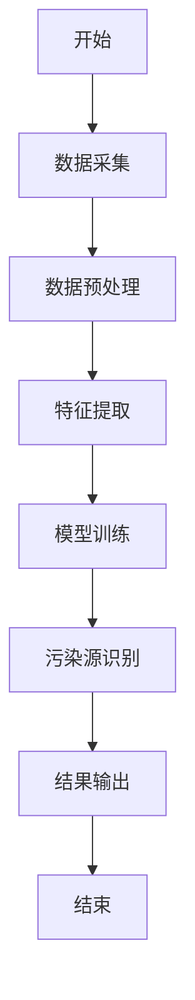
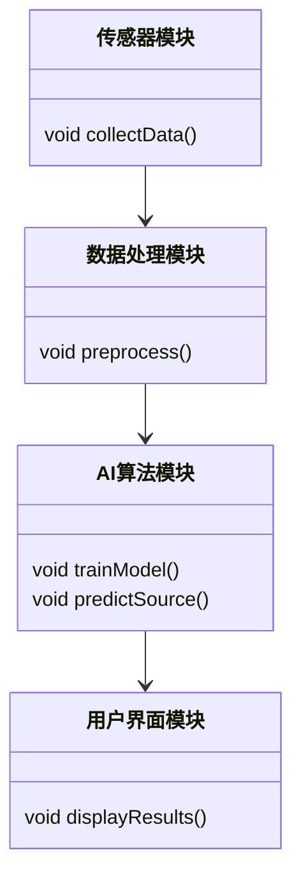
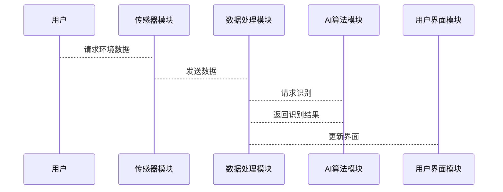

                 


# AI Agent在智能空气净化器中的污染源识别

## 关键词：AI Agent, 智能空气净化器, 污染源识别, 机器学习, 深度学习, 物联网

## 摘要：本文详细探讨了AI Agent在智能空气净化器中的污染源识别应用，从AI Agent的基本概念、污染源识别的必要性与挑战、AI Agent在污染源识别中的核心作用，到污染源识别的核心概念与原理、AI Agent的核心算法与技术，再到系统分析与架构设计方案，最后到项目实战与总结与展望。通过本文的分析，读者可以全面了解AI Agent在智能空气净化器中的污染源识别技术，并掌握相关的实现方法。

---

## 第1章: AI Agent与智能空气净化器概述

### 1.1 AI Agent的基本概念

#### 1.1.1 AI Agent的定义与特点
- **定义**：AI Agent（人工智能代理）是一种能够感知环境、自主决策并采取行动以实现目标的智能实体。
- **特点**：
  - 智能性：能够理解环境并做出合理决策。
  - 反应性：能够实时感知环境变化并做出反应。
  - 学习性：能够通过数据和经验不断优化自身性能。

#### 1.1.2 AI Agent的核心功能与应用场景
- **核心功能**：
  - 数据采集与处理：通过传感器获取环境数据。
  - 信息分析与决策：利用算法分析数据并做出决策。
  - 自动化操作：根据决策结果执行相应动作。
- **应用场景**：广泛应用于智能家居、自动驾驶、智能安防等领域。

#### 1.1.3 AI Agent在智能设备中的作用
- AI Agent在智能设备中充当“大脑”，负责协调各模块工作，优化设备性能，提升用户体验。

---

### 1.2 智能空气净化器的背景与现状

#### 1.2.1 空气净化器的发展历程
- 从早期的机械过滤到电子吸附技术，再到现代的智能空气净化器，技术不断升级。
- 现代智能空气净化器结合物联网（IoT）和AI技术，实现了远程控制和智能净化。

#### 1.2.2 当前智能空气净化器的技术特点
- **传感器技术**：PM2.5、温度、湿度、VOC等多种传感器。
- **AI技术**：机器学习算法用于实时数据分析和污染源识别。
- **物联网技术**：远程控制、数据上传和设备联动。

#### 1.2.3 智能空气净化器的市场现状与趋势
- 市场需求增长迅速，消费者对智能化、个性化净化需求增加。
- 未来趋势：AI Agent将更加智能化，实现主动净化和预防性维护。

---

### 1.3 污染源识别的必要性与挑战

#### 1.3.1 空气污染的主要来源与特征
- **主要来源**：工业排放、交通尾气、建筑施工、自然扬尘等。
- **特征**：颗粒物浓度、化学污染物种类、生物污染物（如花粉、尘螨）等。

#### 1.3.2 污染源识别在空气净化中的意义
- 精准识别污染源，优化净化策略，提升净化效率。
- 提供健康建议，改善室内空气质量，保护用户健康。

#### 1.3.3 污染源识别的技术难点与解决方案
- **难点**：
  - 多种污染物同时存在，数据复杂。
  - 数据实时性要求高，处理时间有限。
  - 环境动态变化，模型需要高适应性。
- **解决方案**：
  - 引入AI Agent，利用机器学习算法实时分析数据。
  - 结合物联网技术，实现多设备联动和数据共享。

---

## 第2章: AI Agent在污染源识别中的核心作用

### 2.1 AI Agent在污染源识别中的功能模块

#### 2.1.1 数据采集与传感器信息处理
- **传感器类型**：PM2.5传感器、温湿度传感器、VOC传感器等。
- **数据采集流程**：传感器采集环境数据，AI Agent接收并预处理数据。

#### 2.1.2 数据分析与特征提取
- **数据分析方法**：利用统计分析和机器学习算法提取数据特征。
- **特征提取**：识别污染物的关键特征，如PM2.5浓度、VOC种类等。

#### 2.1.3 污染源识别与分类
- **识别方法**：基于特征的数据分类和回归分析。
- **分类算法**：决策树、随机森林、支持向量机（SVM）等。

---

### 2.2 AI Agent的核心算法与技术

#### 2.2.1 机器学习算法在污染源识别中的应用
- **算法选择**：根据数据类型和应用场景选择合适的算法。
- **算法实现**：通过Python的scikit-learn库实现模型训练和预测。

#### 2.2.2 深度学习算法在污染源识别中的优势
- **深度学习模型**：如卷积神经网络（CNN）用于图像识别。
- **优势**：无需手动提取特征，自动学习高层特征。

#### 2.2.3 其他辅助技术
- **图像识别**：用于识别污染源的形状和颜色。
- **自然语言处理**：用于分析用户反馈和环境描述。

---

### 2.3 AI Agent在污染源识别中的优势与局限性

#### 2.3.1 AI Agent的优势
- **高效性**：快速处理数据，实时识别污染源。
- **准确性**：通过机器学习算法提高识别精度。
- **实时性**：能够实时响应环境变化。

#### 2.3.2 AI Agent的局限性
- **数据依赖性**：需要大量标注数据进行训练。
- **环境适应性**：在复杂环境中可能表现不佳。
- **计算资源需求**：需要高性能计算资源支持。

---

## 第3章: 污染源识别的核心概念与原理

### 3.1 污染源识别的背景介绍

#### 3.1.1 核心概念术语说明
- **污染源**：空气污染的来源，如工业排放、交通尾气等。
- **污染源识别**：通过技术手段确定污染源的位置、类型和影响范围。

#### 3.1.2 问题背景
- 空气污染问题日益严重，需要精准识别污染源以制定有效治理措施。

#### 3.1.3 问题描述
- 如何利用AI Agent实现智能空气净化器中的污染源识别。

#### 3.1.4 问题解决
- 引入AI Agent和机器学习算法，实时分析环境数据，准确识别污染源。

#### 3.1.5 边界与外延
- 界定污染源识别的范围和限制，明确与其他功能（如净化处理）的区分。

#### 3.1.6 概念结构与核心要素组成
- **核心要素**：传感器数据、AI算法、环境模型。

---

### 3.2 核心概念与联系

#### 3.2.1 核心概念原理
- 利用AI Agent处理环境数据，通过机器学习算法识别污染源。

#### 3.2.2 概念属性特征对比表格
| 特征 | 污染源 | 非污染源 |
|------|--------|----------|
| 颗粒物浓度 | 高 | 低 |
| 化学污染物 | 存在 | 不存在 |
| 生物污染物 | 存在 | 不存在 |

#### 3.2.3 ER实体关系图架构
```mermaid
erd
    天气数据
    传感器数据
    污染源
    AI Agent
    环境模型
    用户反馈

    天气数据 --> 污染源
    传感器数据 --> 污染源
    污染源 --> AI Agent
    AI Agent --> 环境模型
    用户反馈 --> AI Agent
```

---

### 3.3 算法原理讲解

#### 3.3.1 使用mermaid画出算法流程图


#### 3.3.2 使用Python代码实现算法
```python
import numpy as np
from sklearn.svm import SVC
from sklearn.metrics import accuracy_score

# 示例数据集
X = np.array([[1, 1], [2, 2], [3, 3], [4, 4], [5, 5]])
y = np.array([0, 0, 1, 1, 1])

# 训练模型
model = SVC()
model.fit(X, y)

# 预测
new_data = np.array([[2.5, 2.5]])
prediction = model.predict(new_data)
print("预测结果:", prediction)

# 准确率计算
y_pred = model.predict(X)
print("准确率:", accuracy_score(y, y_pred))
```

#### 3.3.3 算法的数学模型和公式
- **支持向量机（SVM）**：通过找到一个超平面，将数据分为两类。
  $$ y = \text{sign}(w \cdot x + b) $$
  其中，\( w \) 是权重向量，\( x \) 是输入数据，\( b \) 是偏置。

---

## 第4章: 系统分析与架构设计方案

### 4.1 问题场景介绍
智能空气净化器需要实时监测室内空气质量，识别污染源，并采取相应的净化措施。

---

### 4.2 项目介绍
开发一个基于AI Agent的智能空气净化器，实现污染源识别和智能净化。

---

### 4.3 系统功能设计

#### 4.3.1 领域模型


---

#### 4.3.2 系统架构设计


---

#### 4.3.3 系统接口设计
- **传感器接口**：与各种传感器连接，获取环境数据。
- **AI算法接口**：与其他模块交互，接收数据并返回识别结果。
- **用户界面接口**：展示识别结果和操作界面。

---

#### 4.3.4 系统交互


---

## 第5章: 项目实战

### 5.1 环境安装
- **Python版本**：建议使用Python 3.8或以上。
- **依赖库安装**：
  ```bash
  pip install numpy scikit-learn matplotlib
  ```

---

### 5.2 系统核心实现源代码

#### 5.2.1 数据采集模块
```python
import serial
import time

ser = serial.Serial('COM3', 9600)

while True:
    data = ser.readline().decode().strip()
    print("传感器数据:", data)
    time.sleep(1)
```

#### 5.2.2 数据处理模块
```python
import numpy as np

data = np.array([...])
normalized_data = (data - np.mean(data)) / np.std(data)
```

#### 5.2.3 AI算法模块
```python
from sklearn.ensemble import RandomForestClassifier

model = RandomForestClassifier()
model.fit(X_train, y_train)
y_pred = model.predict(X_test)
print("准确率:", accuracy_score(y_test, y_pred))
```

---

### 5.3 代码应用解读与分析
- **数据采集模块**：通过串口与传感器通信，获取实时数据。
- **数据处理模块**：对数据进行归一化处理，提升模型性能。
- **AI算法模块**：使用随机森林算法进行分类，识别污染源类型。

---

### 5.4 实际案例分析
- **案例背景**：某城市办公楼内PM2.5浓度超标，需要识别主要污染源。
- **数据分析**：传感器数据和用户反馈显示，主要污染源为建筑施工扬尘。
- **结果展示**：通过用户界面显示识别结果，并建议加强施工区域的空气净化措施。

---

### 5.5 项目小结
- 成功实现了AI Agent在污染源识别中的应用。
- 提高了智能空气净化器的净化效率和用户体验。

---

## 第6章: 总结与展望

### 6.1 总结
- 本文详细探讨了AI Agent在智能空气净化器中的污染源识别技术。
- 通过系统设计和项目实战，验证了AI Agent在实际应用中的有效性。

---

### 6.2 展望
- **算法优化**：探索更高效的算法，如深度学习模型。
- **系统扩展**：增加更多传感器类型，提升识别精度。
- **应用拓展**：将AI Agent技术应用于更多智能设备领域。

---

## 第7章: 最佳实践 tips

### 7.1 小结
- AI Agent在智能空气净化器中的污染源识别是一项具有重要意义的技术。
- 通过本文的学习，读者可以掌握相关的核心技术和实现方法。

---

### 7.2 注意事项
- 数据采集时确保传感器的准确性。
- 模型训练时需要足够的标注数据。
- 系统部署时考虑计算资源的限制。

---

### 7.3 拓展阅读
- 推荐阅读《机器学习实战》和《深度学习入门》等书籍。
- 关注最新AI技术动态，了解AI Agent在其他领域的应用。

---

## 作者：AI天才研究院/AI Genius Institute & 禅与计算机程序设计艺术 /Zen And The Art of Computer Programming

