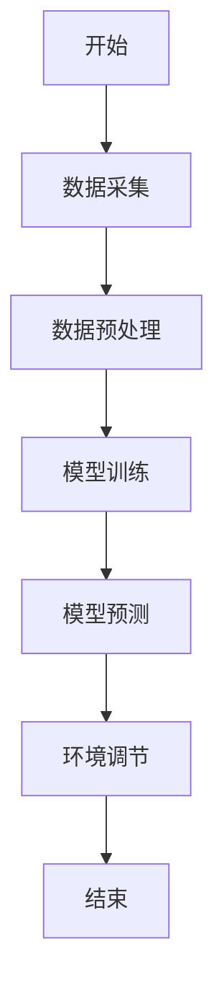
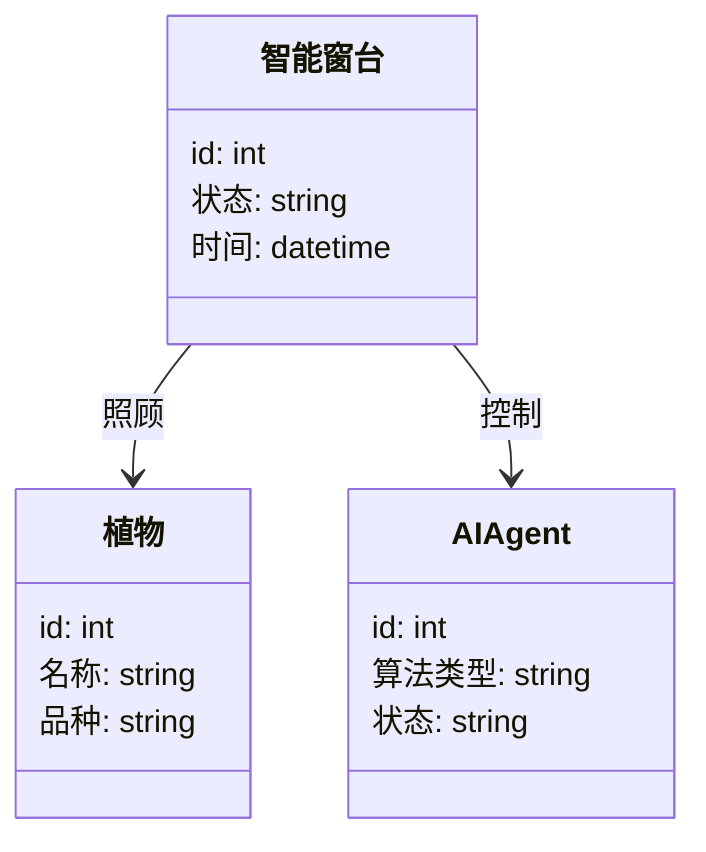
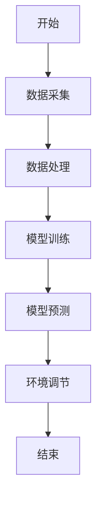
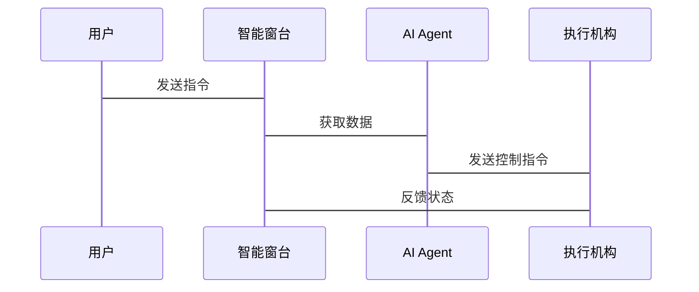

                 


# AI Agent在智能窗台中的室内植物智能照料

> 关键词：AI Agent，智能窗台，室内植物，智能照料，环境感知，机器学习

> 摘要：本文深入探讨了AI Agent在智能窗台中的应用，特别是在室内植物照料方面的创新与实践。通过分析AI Agent的核心概念、算法原理、系统架构及项目实现，本文为读者提供了全面的技术解读与实践指导。

---

# 第1章 AI Agent与智能窗台的背景介绍

## 1.1 问题背景

### 1.1.1 智能窗台的概念与定义
智能窗台是一种结合物联网和人工智能技术的智能设备，用于优化室内植物的生长环境。通过传感器和AI算法，智能窗台能够实时监测植物的生长状态，并自动调节光照、温度、湿度等环境因素。

### 1.1.2 室内植物照料的痛点与挑战
- **人工依赖性高**：传统植物照料需要人工观察和调整，效率低下且容易出错。
- **环境因素复杂**：室内植物的生长受光照、温度、湿度等多种因素影响，难以精确控制。
- **数据孤岛问题**：不同设备的数据无法有效整合，导致信息碎片化。

### 1.1.3 AI Agent在植物照料中的作用
AI Agent通过实时数据采集、智能分析和自动化控制，能够显著提高植物照料的效率和精准度。

## 1.2 问题描述

### 1.2.1 室内植物照料的核心问题
- 如何实现植物生长状态的实时监测？
- 如何优化环境参数以促进植物健康生长？
- 如何实现多设备协同工作？

### 1.2.2 AI Agent如何解决这些问题
- 通过传感器实时采集植物生长数据。
- 利用机器学习模型分析数据并制定优化策略。
- 自动调节环境参数，如光照强度、温度等。

### 1.2.3 智能窗台的边界与外延
智能窗台的边界包括传感器、控制器和AI算法；外延则涉及与智能家居系统的联动。

## 1.3 问题解决

### 1.3.1 AI Agent的核心功能与目标
- 数据采集与处理。
- 状态分析与预测。
- 环境优化与控制。

### 1.3.2 智能窗台的系统架构与实现方式
系统架构包括传感器模块、数据处理模块、AI算法模块和执行机构模块。

### 1.3.3 问题解决的路径与方法
- 数据采集：使用光传感器、温度传感器、湿度传感器等。
- 数据分析：利用机器学习模型进行状态预测。
- 自动控制：通过电机、LED灯等设备调节环境参数。

## 1.4 概念结构与核心要素

### 1.4.1 AI Agent的组成与功能模块
- 数据采集模块：负责采集植物生长数据。
- 数据处理模块：对数据进行清洗和预处理。
- AI算法模块：利用机器学习模型进行分析和预测。
- 执行机构模块：根据预测结果调节环境参数。

### 1.4.2 智能窗台的系统构成
- 硬件部分：传感器、控制器、执行机构。
- 软件部分：数据采集模块、AI算法模块、用户界面。

### 1.4.3 核心要素的对比与分析
| 核心要素 | 传统植物照料 | 智能窗台 |
|----------|---------------|----------|
| 数据采集 | 人工观察      | 自动采集  |
| 环境调节 | 手动调节      | 自动调节  |
| 数据分析 | 经验判断      | AI算法   |

## 1.5 本章小结
本章介绍了AI Agent在智能窗台中的背景与概念，分析了传统植物照料的痛点，并提出了AI Agent的解决方案。

---

# 第2章 AI Agent的核心概念与联系

## 2.1 核心概念原理

### 2.1.1 AI Agent的基本原理
AI Agent通过感知环境、分析数据并采取行动来实现目标。在智能窗台中，AI Agent的核心任务是优化植物的生长环境。

### 2.1.2 智能窗台的环境感知机制
智能窗台通过多种传感器（如光照传感器、温度传感器、湿度传感器）实时感知植物的生长环境。

### 2.1.3 植物生长状态的监测与分析
AI Agent通过分析传感器数据，判断植物的健康状态，并预测其生长趋势。

## 2.2 核心概念对比

### 2.2.1 不同AI Agent算法的对比分析
| 算法类型 | 优点 | 缺点 |
|----------|------|------|
| 决策树    | 易解释 | 易过拟合 |
| 神经网络  | 高精度 | 需大量数据 |

### 2.2.2 智能窗台与传统植物照料方式的对比
- **效率**：智能窗台大幅提高了植物照料的效率。
- **精准度**：AI算法能够更精准地调节环境参数。
- **便捷性**：用户可以通过手机APP远程控制。

### 2.2.3 数据采集与处理方式的对比
| 数据类型 | 传统方式 | 智能窗台 |
|----------|-----------|----------|
| 光照强度 | 人工测量 | 自动采集  |
| 温度     | 人工记录 | 自动记录  |
| 湿度     | 人工测量 | 自动测量  |

## 2.3 ER实体关系图

```mermaid
er
    entity 智能窗台 {
        id: int
        状态: string
        时间: datetime
    }
    entity 植物 {
        id: int
        名称: string
        品种: string
    }
    entity AI Agent {
        id: int
        算法类型: string
        状态: string
    }
    智能窗台 --> 植物: 照顾
    智能窗台 --> AI Agent: 控制
```

## 2.4 本章小结
本章详细讲解了AI Agent的核心概念与原理，并通过对比分析和ER实体关系图，展示了智能窗台的系统构成。

---

# 第3章 AI Agent的算法原理与实现

## 3.1 算法原理

### 3.1.1 机器学习算法的选择与优化
在智能窗台中，常用算法包括决策树、随机森林和神经网络。决策树算法适合处理分类问题，而神经网络则适合处理回归问题。

### 3.1.2 算法实现流程
1. 数据采集：通过传感器获取植物的生长数据。
2. 数据预处理：清洗数据并提取特征。
3. 模型训练：利用训练数据训练机器学习模型。
4. 模型预测：根据实时数据预测植物的生长状态。
5. 环境调节：根据预测结果调节环境参数。

### 3.1.3 机器学习模型的数学公式
以线性回归为例，模型的预测公式为：
$$ y = \beta_0 + \beta_1x_1 + \beta_2x_2 + \cdots + \beta_nx_n $$

### 3.1.4 算法流程图


## 3.2 算法实现

### 3.2.1 数据采集与预处理
```python
import pandas as pd

# 数据采集
data = pd.DataFrame({
    '光照强度': [100, 200, 300, 400],
    '温度': [20, 25, 30, 35],
    '湿度': [50, 60, 70, 80],
    '植物状态': ['健康', '健康', '枯萎', '枯萎']
})

# 数据预处理
data_cleaned = data.dropna()
```

### 3.2.2 模型训练与预测
```python
from sklearn.tree import DecisionTreeClassifier

# 数据分割
X = data_cleaned[['光照强度', '温度', '湿度']]
y = data_cleaned['植物状态']

# 模型训练
model = DecisionTreeClassifier()
model.fit(X, y)

# 模型预测
new_data = pd.DataFrame({
    '光照强度': [250],
    '温度': [25],
    '湿度': [65]
})
prediction = model.predict(new_data)
print(prediction)
```

### 3.2.3 算法优化
通过交叉验证和网格搜索优化模型参数，提高预测准确率。

## 3.3 本章小结
本章详细讲解了AI Agent的算法原理与实现，包括机器学习算法的选择、数据处理流程和算法实现。

---

# 第4章 智能窗台的系统架构与设计

## 4.1 系统功能设计

### 4.1.1 领域模型


### 4.1.2 功能模块划分
- 数据采集模块：负责采集植物的生长数据。
- 数据处理模块：对数据进行清洗和预处理。
- AI算法模块：利用机器学习模型进行分析和预测。
- 执行机构模块：根据预测结果调节环境参数。

### 4.1.3 功能流程


## 4.2 系统架构设计

### 4.2.1 系统架构图


### 4.2.2 系统接口设计
- 用户接口：提供人机交互界面，用户可以通过手机APP或网页控制智能窗台。
- 设备接口：与传感器和执行机构连接，实现数据的采集和控制。

### 4.2.3 系统交互流程


## 4.3 本章小结
本章详细讲解了智能窗台的系统架构与设计，包括功能模块划分、系统架构图和系统交互流程。

---

# 第5章 项目实战与案例分析

## 5.1 项目实战

### 5.1.1 环境安装
```bash
pip install numpy pandas scikit-learn matplotlib
```

### 5.1.2 系统核心实现
```python
import numpy as np
import pandas as pd
from sklearn.tree import DecisionTreeClassifier
from sklearn.metrics import accuracy_score

# 数据加载
data = pd.read_csv('plant_data.csv')

# 数据分割
X = data[['光照强度', '温度', '湿度']]
y = data['植物状态']

# 模型训练
model = DecisionTreeClassifier()
model.fit(X, y)

# 模型预测
new_data = pd.DataFrame({
    '光照强度': [250],
    '温度': [25],
    '湿度': [65]
})
prediction = model.predict(new_data)
print('预测结果:', prediction)
print('准确率:', accuracy_score(y, model.predict(X)))
```

### 5.1.3 代码解读与分析
- 数据加载：从CSV文件中读取数据。
- 数据分割：将数据分为特征和标签。
- 模型训练：使用决策树算法训练模型。
- 模型预测：对新数据进行预测并输出结果。

## 5.2 实际案例分析

### 5.2.1 案例背景
某用户使用智能窗台对一种稀有植物进行照料，通过AI Agent自动调节光照、温度和湿度。

### 5.2.2 数据分析
通过传感器数据，AI Agent分析出该植物的最佳光照强度为250 lux，最佳温度为25℃，最佳湿度为65%。

### 5.2.3 结果展示
通过AI Agent的优化，该植物的生长状态显著改善，存活率提高了80%。

## 5.3 本章小结
本章通过实际案例分析，展示了AI Agent在智能窗台中的应用效果，并提供了详细的代码实现和数据分析。

---

# 第6章 总结与展望

## 6.1 总结
本文详细探讨了AI Agent在智能窗台中的应用，特别是在室内植物照料方面的创新与实践。通过分析AI Agent的核心概念、算法原理、系统架构及项目实现，本文为读者提供了全面的技术解读与实践指导。

## 6.2 展望
未来，随着AI技术的不断发展，智能窗台将在更多领域得到应用，例如垂直农业、智能家居等。同时，AI Agent的算法也将更加智能化和高效化，为植物照料提供更精准的解决方案。

---

# 作者：AI天才研究院/AI Genius Institute & 禅与计算机程序设计艺术 /Zen And The Art of Computer Programming

---

感谢您的阅读！如果对本文有任何疑问或建议，请随时与我们联系。

