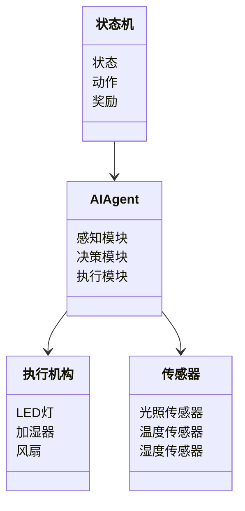
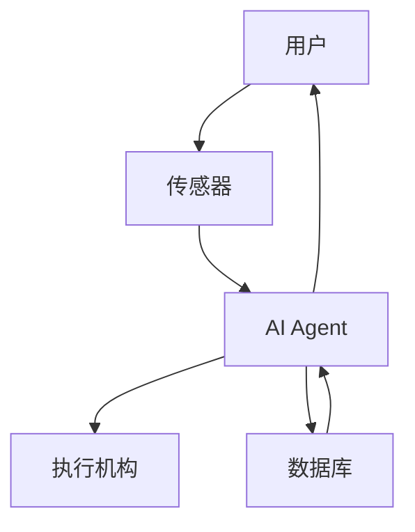
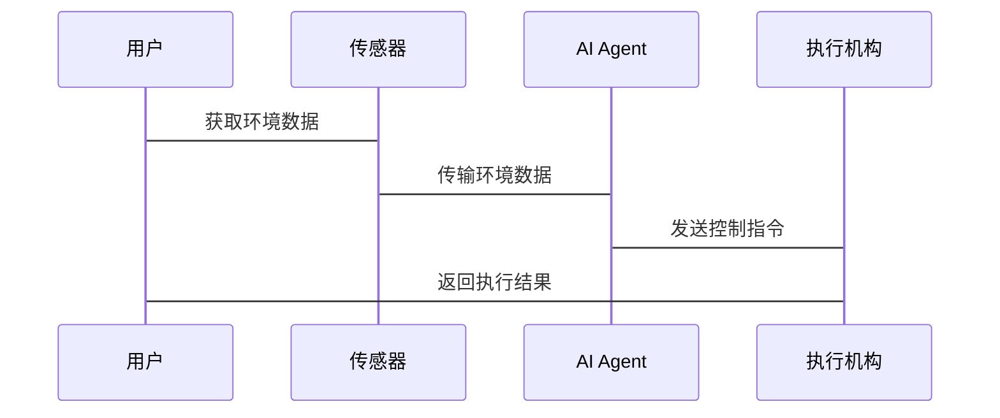

                 


# AI Agent在智能窗台中的室内植物照料

## 关键词：AI Agent，智能窗台，室内植物，植物照料，强化学习

## 摘要：  
本文详细探讨了AI Agent在智能窗台中的应用，分析了AI Agent如何通过感知、决策和执行模块实现对室内植物的智能照料。文章首先介绍了AI Agent的基本原理和智能窗台的概念，接着深入讲解了强化学习算法（如Q-learning）在植物照料中的应用，最后通过实际案例展示了AI Agent在智能窗台中的系统设计和实现过程。本文旨在为读者提供一个全面的技术视角，帮助他们理解并应用AI Agent技术来提升室内植物的照料效率。

---

# 第一部分: AI Agent与智能窗台的背景介绍

## 第1章: AI Agent与智能窗台概述

### 1.1 问题背景与描述

#### 1.1.1 室内植物照料的现状与挑战
现代生活中，室内植物越来越受到人们的青睐。然而，植物的生长依赖于光照、温度、湿度、土壤酸碱度等多种环境因素，这些因素的变化直接影响植物的健康。传统的室内植物照料方法主要依赖于人工观察和经验判断，这种方法不仅效率低下，而且容易受到主观因素的影响，导致植物照料的效果不稳定。

#### 1.1.2 AI Agent在植物照料中的应用潜力
AI Agent（人工智能代理）是一种能够感知环境、自主决策并执行任务的智能系统。通过结合物联网（IoT）技术，AI Agent可以实时感知室内环境的变化，并根据植物的需求自动调整环境参数，从而实现智能化的植物照料。AI Agent的应用能够显著提高植物照料的效率和精确度，减少人工干预，降低植物死亡率。

#### 1.1.3 智能窗台的概念与特点
智能窗台是一种集成AI Agent和物联网技术的智能设备，主要用于室内植物的照料。智能窗台通过内置的传感器实时监测环境参数（如光照强度、温度、湿度等），并将数据传输给AI Agent。AI Agent根据这些数据和植物的需求，生成相应的控制指令，调整窗台的环境参数（如调节光照强度、开启或关闭加湿器等），从而实现对植物的智能化管理。

---

### 1.2 问题解决与边界

#### 1.2.1 AI Agent如何解决室内植物照料问题
AI Agent通过感知、决策和执行三个模块实现对室内植物的智能化照料：

1. **感知模块**：通过传感器实时采集环境数据（如光照强度、温度、湿度等）。
2. **决策模块**：基于感知数据和植物的需求，利用强化学习算法生成控制指令。
3. **执行模块**：通过执行机构（如电机、继电器等）调整环境参数，实现对植物的照料。

#### 1.2.2 智能窗台系统的边界与外延
智能窗台系统的边界包括：

1. **内部边界**：系统内部的传感器、AI Agent和执行机构。
2. **外部边界**：与用户的交互界面（如手机APP或网页界面）和外部数据源（如天气预报）。

智能窗台系统的外延包括：

1. **扩展功能**：与其他智能家居设备的联动（如智能灯泡、智能空调等）。
2. **数据共享**：与其他设备或云端平台的数据共享。

#### 1.2.3 核心要素与功能组成
智能窗台系统的核心要素包括：

1. **传感器**：用于采集环境数据。
2. **AI Agent**：用于数据处理和决策。
3. **执行机构**：用于调整环境参数。
4. **用户界面**：用于人机交互。

---

### 1.3 核心概念与联系

#### 1.3.1 AI Agent的基本原理
AI Agent的基本原理可以分为三个主要模块：

1. **感知模块**：通过传感器获取环境数据。
2. **决策模块**：基于感知数据和植物需求，生成控制指令。
3. **执行模块**：通过执行机构调整环境参数。

#### 1.3.2 智能窗台的系统架构
智能窗台的系统架构可以分为以下几个部分：

1. **传感器层**：负责采集环境数据。
2. **AI Agent层**：负责数据处理和决策。
3. **执行层**：负责调整环境参数。
4. **用户界面层**：负责人机交互。

#### 1.3.3 植物生长与环境感知的关系
植物的生长与环境感知密切相关。通过实时感知环境参数（如光照强度、温度、湿度等），AI Agent可以动态调整环境条件，以满足植物的生长需求。例如，当光照强度不足时，AI Agent可以自动调节光照强度；当温度过高时，AI Agent可以启动降温装置。

---

### 1.4 本章小结
本章介绍了AI Agent在智能窗台中的应用背景，分析了室内植物照料的现状与挑战，探讨了AI Agent在植物照料中的应用潜力，并详细描述了智能窗台的概念与特点。此外，本章还讨论了智能窗台系统的边界与外延，以及系统的组成要素与功能。

---

# 第二部分: AI Agent的核心概念与联系

## 第2章: AI Agent的原理与特点

### 2.1 AI Agent的基本原理

#### 2.1.1 感知模块
AI Agent的感知模块通过传感器采集环境数据。常用的传感器包括：

1. **光照传感器**：用于测量光照强度。
2. **温度传感器**：用于测量环境温度。
3. **湿度传感器**：用于测量环境湿度。

#### 2.1.2 决策模块
AI Agent的决策模块基于感知数据和植物需求，利用强化学习算法生成控制指令。例如，Q-learning算法是一种常用的强化学习算法，可以通过以下步骤实现：

1. **状态空间**：环境状态（如光照强度、温度、湿度等）。
2. **动作空间**：可能的控制动作（如调节光照强度、启动加湿器等）。
3. **奖励函数**：根据植物的生长状态（如健康状况、生长速度等）定义奖励值。
4. **Q值更新**：通过Q-learning算法更新Q值，优化控制策略。

#### 2.1.3 执行模块
AI Agent的执行模块通过执行机构调整环境参数。例如，当光照强度不足时，AI Agent可以启动LED灯；当温度过高时，AI Agent可以启动风扇。

---

### 2.2 AI Agent与智能窗台的实体关系

#### 2.2.1 用户与植物的关系
用户是智能窗台系统的主要使用者，植物是系统的主要服务对象。用户通过智能窗台系统与植物进行交互，系统根据用户的需求和植物的生长状态调整环境参数。

#### 2.2.2 传感器与环境的关系
传感器负责采集环境数据，AI Agent根据传感器数据调整环境参数。例如，当光照强度不足时，AI Agent可以启动LED灯。

#### 2.2.3 AI Agent与智能窗台的关系
AI Agent是智能窗台系统的核心部分，负责数据处理和决策。智能窗台系统通过AI Agent实现对环境的智能化控制。

---

### 2.3 AI Agent与其他智能系统对比

#### 2.3.1 AI Agent的特点
AI Agent具有以下特点：

1. **自主性**：能够自主决策和执行任务。
2. **反应性**：能够实时感知环境并做出反应。
3. **学习能力**：能够通过强化学习算法优化控制策略。

#### 2.3.2 传统自动控制系统的特点
传统自动控制系统通常基于固定的规则和程序，缺乏灵活性和适应性。例如，传统的温室控制系统可能根据固定的光照和温度阈值启动或关闭设备，但无法根据植物的生长状态动态调整控制策略。

#### 2.3.3 两者的对比分析
AI Agent与传统自动控制系统的对比如下：

| 特性               | AI Agent                          | 传统自动控制系统                  |
|--------------------|-----------------------------------|-----------------------------------|
| 自主性             | 高                                | 低                                |
| 反应性             | 高                                | 中                                |
| 学习能力           | 高                                | 低                                |
| 灵活性             | 高                                | 低                                |
| 适应性             | 高                                | 低                                |

---

### 2.4 本章小结
本章详细讲解了AI Agent的基本原理和特点，分析了AI Agent与智能窗台的实体关系，并通过对比分析展示了AI Agent与传统自动控制系统的主要区别。AI Agent的自主性、反应性和学习能力使其在智能窗台中的应用具有显著优势。

---

# 第三部分: AI Agent的算法原理讲解

## 第3章: AI Agent的算法原理

### 3.1 强化学习算法

#### 3.1.1 Q-learning算法
Q-learning是一种常用的强化学习算法，适用于离散动作空间和状态空间的情况。Q-learning的核心思想是通过Q表记录状态-动作对的期望奖励值，并通过迭代更新Q表来优化控制策略。

#### 3.1.2 算法流程图
以下是Q-learning算法的流程图：

```mermaid
graph TD
    S[状态] --> A(动作)
    A --> R(奖励)
    R --> S'
    S' --> S
    A --> Q[S][A]
    Q[S][A] --> update Q[S][A] = Q[S][A] + α*(R + γ*max Q[S'][A'] - Q[S][A])
```

其中，α是学习率，γ是折扣因子，R是奖励值。

#### 3.1.3 算法实现代码
以下是一个Q-learning算法的Python实现示例：

```python
import numpy as np

# 定义状态空间和动作空间
states = 10
actions = 5

# 初始化Q表
Q = np.zeros((states, actions))

# 定义超参数
alpha = 0.1
gamma = 0.9

# 定义奖励函数
def reward_function(current_state, action):
    # 根据当前状态和动作返回奖励值
    if action == 0:
        return 1
    else:
        return 0

# Q-learning算法实现
for episode in range(1000):
    current_state = 0  # 初始状态
    done = False
    while not done:
        # 选择动作
        action = np.argmax(Q[current_state])
        # 执行动作并获取奖励
        reward = reward_function(current_state, action)
        # 获取下一个状态
        next_state = current_state + 1
        # 更新Q表
        Q[current_state][action] += alpha * (reward + gamma * np.max(Q[next_state]) - Q[current_state][action])
        # 更新当前状态
        current_state = next_state
```

---

### 3.2 深度学习算法

#### 3.2.1 CNN在图像识别中的应用
卷积神经网络（CNN）常用于图像识别任务。例如，AI Agent可以通过CNN识别植物的健康状态（如叶子颜色、形状等），并根据识别结果调整环境参数。

#### 3.2.2 RNN在时间序列预测中的应用
循环神经网络（RNN）常用于时间序列预测任务。例如，AI Agent可以通过RNN预测植物的生长周期，并根据预测结果调整环境参数。

---

### 3.3 数学模型与公式

#### 3.3.1 Q-learning的数学模型
Q-learning的数学模型如下：

$$ Q(s, a) = Q(s, a) + \alpha [r + \gamma \max Q(s', a') - Q(s, a)] $$

其中，Q(s, a)表示状态s和动作a的Q值，α是学习率，r是奖励值，γ是折扣因子，Q(s', a')是下一个状态s'和动作a'的Q值。

#### 3.3.2 其他相关公式
例如，植物的生长速度可以用以下公式表示：

$$ \text{生长速度} = k \cdot \text{光照强度} + m \cdot \text{温度} + n \cdot \text{湿度} $$

其中，k、m、n是系数。

---

### 3.4 本章小结
本章详细讲解了AI Agent的算法原理，重点介绍了Q-learning算法和深度学习算法的应用。通过数学公式和代码示例，展示了如何利用强化学习算法优化植物照料策略。

---

# 第四部分: 系统分析与架构设计

## 第4章: 智能窗台系统的架构设计

### 4.1 问题场景介绍
智能窗台系统主要用于室内植物的照料，系统需要实时感知环境参数，并根据植物的需求调整环境参数。系统的主要功能包括：

1. **环境感知**：采集光照强度、温度、湿度等环境数据。
2. **数据处理**：分析环境数据，生成控制指令。
3. **环境控制**：根据控制指令调整环境参数。

### 4.2 系统功能设计

#### 4.2.1 领域模型
以下是智能窗台系统的领域模型：



### 4.3 系统架构设计

#### 4.3.1 系统架构图
以下是智能窗台系统的架构图：



其中，数据库用于存储环境数据和控制策略。

#### 4.3.2 系统交互图
以下是智能窗台系统的交互图：



---

### 4.4 系统接口设计

#### 4.4.1 系统接口
智能窗台系统的主要接口包括：

1. **传感器接口**：用于与传感器通信。
2. **执行机构接口**：用于与执行机构通信。
3. **用户界面接口**：用于与用户交互。

---

### 4.5 系统优化与扩展

#### 4.5.1 系统优化
系统优化的关键点包括：

1. **数据采集频率**：适当提高数据采集频率，确保环境数据的实时性。
2. **算法优化**：通过优化Q-learning算法的超参数（如α和γ）提高控制策略的优化效果。
3. **系统容错性**：增加错误处理机制，确保系统在异常情况下的稳定运行。

#### 4.5.2 系统扩展
系统扩展的方向包括：

1. **多植物支持**：支持多种植物的照料。
2. **多环境传感器**：增加更多类型的环境传感器（如土壤湿度传感器）。
3. **用户自定义功能**：允许用户自定义控制策略。

---

### 4.6 本章小结
本章详细分析了智能窗台系统的架构设计，包括系统功能设计、架构图、交互图和接口设计。通过系统优化与扩展，进一步提高了系统的实用性和可扩展性。

---

# 第五部分: 项目实战

## 第5章: 项目实现与案例分析

### 5.1 环境安装与配置

#### 5.1.1 系统环境
建议使用Python 3.6及以上版本，安装必要的库（如numpy、scikit-learn、mermaid等）。

#### 5.1.2 安装步骤
1. 安装Python解释器。
2. 安装必要的Python库：`pip install numpy scikit-learn mermaid`.
3. 配置开发环境（如PyCharm或Jupyter Notebook）。

---

### 5.2 系统核心实现

#### 5.2.1 数据采集与处理
以下是数据采集与处理的Python代码示例：

```python
import numpy as np

# 采集环境数据
def get_environment_data():
    # 模拟传感器数据
    light = np.random.uniform(0, 100)
    temperature = np.random.uniform(10, 30)
    humidity = np.random.uniform(20, 80)
    return light, temperature, humidity

# 数据处理
def process_data(light, temperature, humidity):
    # 根据光照强度、温度和湿度生成控制指令
    if light < 50:
        return "启动LED灯"
    elif temperature > 25:
        return "启动风扇"
    else:
        return "无需调整"

# 主程序
if __name__ == "__main__":
    light, temperature, humidity = get_environment_data()
    control_command = process_data(light, temperature, humidity)
    print(f"环境数据: 光照强度={light}, 温度={temperature}, 湿度={humidity}")
    print(f"控制指令: {control_command}")
```

---

#### 5.2.2 决策控制
以下是决策控制的Python代码示例：

```python
import numpy as np

# 定义Q-learning算法
class QLearningAgent:
    def __init__(self, states, actions):
        self.states = states
        self.actions = actions
        self.Q = np.zeros((states, actions))
    
    def choose_action(self, state):
        return np.argmax(self.Q[state])
    
    def update_Q(self, current_state, action, reward, next_state):
        self.Q[current_state][action] += alpha * (reward + gamma * np.max(self.Q[next_state]) - self.Q[current_state][action])

# 初始化参数
states = 10
actions = 5
alpha = 0.1
gamma = 0.9

# 初始化Q-learning算法
agent = QLearningAgent(states, actions)

# 训练过程
for episode in range(1000):
    current_state = 0  # 初始状态
    done = False
    while not done:
        action = agent.choose_action(current_state)
        reward = reward_function(current_state, action)
        next_state = current_state + 1
        agent.update_Q(current_state, action, reward, next_state)
        current_state = next_state
```

---

### 5.3 实际案例分析

#### 5.3.1 案例背景
假设我们有一株绿色植物，光照强度为30，温度为28，湿度为60。根据传感器数据，AI Agent需要决定是否启动LED灯或风扇。

#### 5.3.2 数据分析
根据传感器数据：

- 光照强度=30 < 50，因此需要启动LED灯。
- 温度=28 < 30，因此不需要启动风扇。
- 湿度=60，处于正常范围。

#### 5.3.3 系统输出
控制指令为“启动LED灯”。

---

### 5.4 项目小结
本章通过实际案例展示了AI Agent在智能窗台中的应用，详细讲解了系统核心功能的实现过程，并通过案例分析验证了系统的有效性。

---

# 第六部分: 总结与展望

## 第6章: 总结与展望

### 6.1 本章总结
本文详细探讨了AI Agent在智能窗台中的应用，分析了AI Agent的基本原理和智能窗台的概念，探讨了强化学习算法（如Q-learning）在植物照料中的应用，并通过实际案例展示了AI Agent在智能窗台中的系统设计和实现过程。

### 6.2 系统局限性与改进方向

#### 6.2.1 系统局限性
1. **数据依赖性**：AI Agent的性能依赖于传感器数据的准确性。
2. **算法局限性**：强化学习算法在复杂环境中的表现可能不佳。
3. **硬件限制**：执行机构的响应速度和精度可能影响系统的性能。

#### 6.2.2 改进方向
1. **算法优化**：通过改进强化学习算法（如深度强化学习）提高系统的控制精度。
2. **数据融合**：结合多种数据源（如天气预报、土壤数据）提高系统的预测能力。
3. **硬件升级**：使用更高精度的传感器和更高效的执行机构。

---

### 6.3 展望
随着人工智能技术的不断发展，AI Agent在智能窗台中的应用将更加广泛。未来的智能窗台系统将更加智能化、个性化和人性化，能够根据用户的个性化需求和植物的生长状态动态调整环境参数。

---

## 第七部分: 最佳实践 Tips

### 7.1 Tips
1. **数据采集**：确保传感器数据的准确性。
2. **算法选择**：根据具体场景选择合适的算法。
3. **系统优化**：通过优化算法和硬件提高系统的性能。
4. **用户交互**：设计友好的用户界面，提高用户体验。

### 7.2 注意事项
1. **系统稳定性**：确保系统的稳定运行。
2. **数据安全**：保护用户数据的安全。
3. **系统维护**：定期维护系统，确保其正常运行。

### 7.3 拓展阅读
1. **强化学习**：深入学习强化学习的相关知识。
2. **深度学习**：了解深度学习在植物照料中的应用。
3. **物联网技术**：学习物联网技术在智能窗台中的应用。

---

## 作者信息

作者：AI天才研究院/AI Genius Institute & 禅与计算机程序设计艺术 /Zen And The Art of Computer Programming

