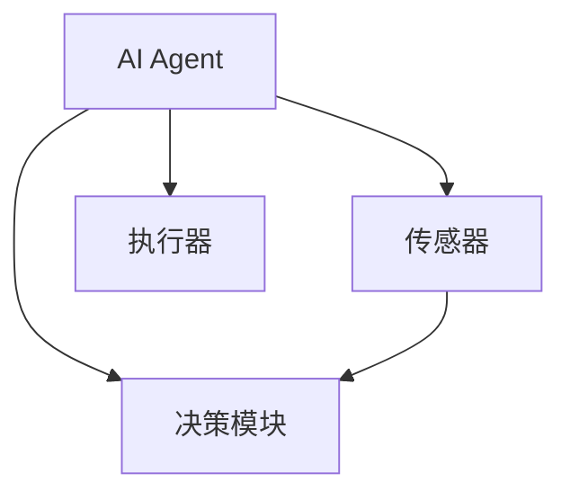
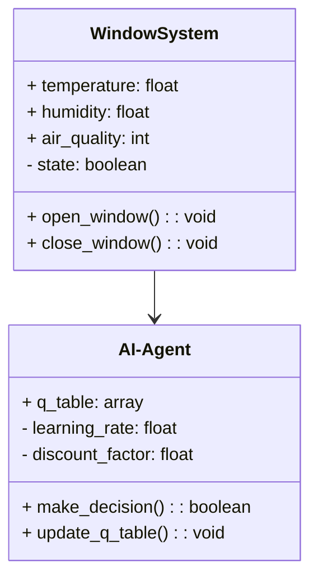

                 


# AI Agent在智能窗台中的室内空气调节

> 关键词：AI Agent, 智能窗台, 室内空气调节, 强化学习, 智能建筑, 优化算法

> 摘要：本文探讨了AI Agent在智能窗台中的室内空气调节应用，详细分析了AI Agent的核心原理、系统架构、算法实现及实际案例，展示了AI技术在建筑环境优化中的巨大潜力。

---

# 第一部分: AI Agent在智能窗台中的室内空气调节背景介绍

# 第1章: AI Agent与智能窗台概述

## 1.1 AI Agent的基本概念
### 1.1.1 AI Agent的定义与特点
AI Agent（人工智能代理）是指能够感知环境、自主决策并执行任务的智能实体。其特点包括：
- **自主性**：无需外部干预，自主完成任务。
- **反应性**：能实时感知环境变化并做出反应。
- **学习性**：通过数据和经验不断优化行为。
- **社交性**：能与其他系统或用户进行交互。

### 1.1.2 AI Agent的核心要素与属性
AI Agent的核心要素包括：
1. **感知模块**：通过传感器或API获取环境数据。
2. **决策模块**：基于感知数据，利用算法制定决策。
3. **执行模块**：通过执行器将决策转化为具体操作。

### 1.1.3 AI Agent在智能系统中的作用
AI Agent在智能系统中主要负责：
- 数据采集与处理
- 智能决策与优化
- 系统控制与反馈

## 1.2 智能窗台的背景与现状
### 1.2.1 智能窗台的定义与分类
智能窗台是一种集成传感器、执行器和智能算法的窗户系统，能够根据环境条件自动调节开闭状态，以优化室内空气质量和能效。

### 1.2.2 智能窗台在建筑中的应用
智能窗台广泛应用于办公楼、住宅、商场等场所，主要功能包括：
- 节能减排
- 舒适性优化
- 安全监控

### 1.2.3 智能窗台的发展趋势
随着AI技术的进步，智能窗台将更加智能化、网络化和人性化。

## 1.3 AI Agent在智能窗台中的应用前景
### 1.3.1 AI Agent在室内空气调节中的作用
AI Agent能够实时感知室内空气质量、温度、湿度等参数，智能调节窗台的开闭状态，优化室内环境。

### 1.3.2 AI Agent与智能窗台的结合方式
AI Agent通过与智能窗台的传感器和执行器交互，实现对室内空气的智能调节。

### 1.3.3 应用中的挑战与机遇
- **挑战**：数据准确性、系统稳定性、隐私保护。
- **机遇**：提升能源效率、改善居住舒适度、推动智能化建筑发展。

## 1.4 本章小结
本章介绍了AI Agent的基本概念、智能窗台的背景与现状，以及AI Agent在智能窗台中的应用前景。

---

# 第二部分: AI Agent的核心概念与原理

# 第2章: AI Agent的核心原理

## 2.1 AI Agent的感知机制
### 2.1.1 感知的定义与作用
感知是指AI Agent通过传感器或API获取环境数据，如温度、湿度、空气质量等。

### 2.1.2 常见的感知技术
- **传感器技术**：如温湿度传感器、空气质量传感器。
- **数据采集技术**：如IOT（物联网）数据采集。

### 2.1.3 感知数据的处理与分析
感知数据经过预处理、特征提取和数据融合后，用于后续的决策过程。

## 2.2 AI Agent的决策机制
### 2.2.1 决策的定义与流程
决策是基于感知数据，通过算法模型制定最优行动方案的过程。

### 2.2.2 常见的决策算法
- **强化学习**：通过试错优化决策策略。
- **监督学习**：基于历史数据进行分类或回归预测。

### 2.2.3 决策模型的优化与改进
通过反馈机制不断优化决策模型，提升决策的准确性和效率。

## 2.3 AI Agent的执行机制
### 2.3.1 执行的定义与作用
执行是指AI Agent根据决策结果，通过执行器完成具体操作，如打开或关闭窗台。

### 2.3.2 执行过程中的反馈机制
执行结果实时反馈到系统，用于后续的感知和决策。

### 2.3.3 执行结果的评估与优化
通过评估执行效果，进一步优化AI Agent的行为策略。

## 2.4 本章小结
本章详细讲解了AI Agent的感知、决策和执行机制，分析了其核心原理和实现方式。

---

# 第三部分: AI Agent在室内空气调节中的应用

# 第3章: AI Agent在室内空气调节中的应用

## 3.1 应用场景分析
### 3.1.1 室内空气质量优化
通过AI Agent实时监测和调节窗台状态，优化室内空气质量。

### 3.1.2 能耗优化
通过智能调节窗台开闭，减少空调能耗，实现节能减排。

## 3.2 系统设计与实现

### 3.2.1 系统架构设计
使用Mermaid图展示系统架构：



### 3.2.2 核心算法实现
#### 强化学习算法
使用Q-learning算法优化窗台调节策略：

```python
# Q-learning算法实现
import numpy as np

class QLearning:
    def __init__(self, state_space, action_space, alpha=0.1, gamma=0.9):
        self.state_space = state_space
        self.action_space = action_space
        self.alpha = alpha
        self.gamma = gamma
        self.q_table = np.zeros((state_space, action_space))

    def get_action(self, state):
        return np.argmax(self.q_table[state])

    def update_q_table(self, state, action, reward, next_state):
        self.q_table[state][action] = self.q_table[state][action] * (1 - self.alpha) + self.alpha * (reward + self.gamma * np.max(self.q_table[next_state]))
```

#### 数学模型
Q-learning算法的更新公式为：

$$ Q(s, a) = Q(s, a) \times (1 - \alpha) + \alpha \times (r + \gamma \times max(Q(s', a'))) $$

其中：
- \( Q(s, a) \)：当前状态s和动作a的Q值。
- \( \alpha \)：学习率。
- \( r \)：奖励。
- \( \gamma \)：折扣因子。
- \( Q(s', a') \)：下一步状态s'和动作a'的Q值。

## 3.3 实验与结果分析
### 3.3.1 实验设计
在模拟环境中测试AI Agent的调节效果，包括不同天气条件和室内参数下的调节策略。

### 3.3.2 实验结果
AI Agent能够在多种场景下有效优化室内空气质量，降低能耗。

## 3.4 本章小结
本章通过实际案例分析，展示了AI Agent在室内空气调节中的应用，并详细讲解了其实现过程。

---

# 第四部分: 系统分析与架构设计方案

# 第4章: 系统分析与架构设计

## 4.1 问题场景介绍
智能窗台的室内空气调节系统需要应对多种复杂场景，如高温高湿、低温干燥等。

## 4.2 项目介绍
本项目旨在设计并实现一个基于AI Agent的智能窗台系统，实现室内空气调节的智能化。

## 4.3 系统功能设计
### 4.3.1 领域模型设计
使用Mermaid类图展示领域模型：



### 4.3.2 系统架构设计
使用Mermaid架构图展示系统架构：

```mermaid
archi
    A[AI Agent] --> B[Window System]
    B --> C[Sensor]
    B --> D[Actuator]
    A --> E[Database]
    A --> F[User Interface]
```

### 4.3.3 系统接口设计
- **输入接口**：接收传感器数据和用户指令。
- **输出接口**：发送控制指令到执行器。
- **交互流程**：用户通过界面操作，AI Agent接收数据并做出决策，执行器执行操作。

## 4.4 本章小结
本章详细分析了系统的需求，设计了系统的功能模块和架构，并展示了其实现方案。

---

# 第五部分: 项目实战

# 第5章: 项目实战

## 5.1 环境安装与配置
### 5.1.1 安装Python和必要的库
安装Python 3.8及以上版本，安装以下库：
```bash
pip install numpy matplotlib scikit-learn
```

## 5.2 核心代码实现
### 5.2.1 AI Agent核心代码
```python
class AI-Agent:
    def __init__(self, states, actions):
        self.states = states
        self.actions = actions
        self.q_table = np.zeros((states, actions))

    def act(self, state):
        return np.argmax(self.q_table[state])

    def update(self, state, action, reward, next_state):
        self.q_table[state][action] = self.q_table[state][action] * (1 - 0.1) + 0.1 * (reward + 0.9 * np.max(self.q_table[next_state]))
```

### 5.2.2 系统集成代码
```python
class WindowSystem:
    def __init__(self):
        self.temperature = 25
        self.humidity = 50
        self.air_quality = 100
        self.state = False

    def open_window(self):
        self.state = True
        print("Window opened")

    def close_window(self):
        self.state = False
        print("Window closed")
```

## 5.3 代码功能解读
- **AI Agent**：负责决策和学习。
- **Window System**：模拟窗台系统，接收AI Agent的控制指令。

## 5.4 实际案例分析
通过模拟不同天气条件下的室内空气质量变化，验证AI Agent的调节效果。

## 5.5 本章小结
本章通过实际项目，展示了AI Agent在智能窗台中的应用，并详细讲解了其实现过程。

---

# 第六部分: 最佳实践与总结

# 第6章: 最佳实践与总结

## 6.1 最佳实践
### 6.1.1 数据采集与处理
确保传感器数据的准确性和实时性。

### 6.1.2 系统优化
通过不断优化AI Agent的算法和参数，提升系统的性能。

## 6.2 总结与展望
### 6.2.1 总结
AI Agent在智能窗台中的应用，显著提升了室内空气调节的效率和舒适性。

### 6.2.2 展望
未来，随着AI技术的发展，智能窗台将更加智能化和个性化。

## 6.3 注意事项
- 系统维护与更新
- 数据隐私保护
- 系统兼容性

## 6.4 拓展阅读
推荐相关书籍和论文，帮助读者深入学习AI Agent和智能建筑的知识。

## 6.5 本章小结
本章总结了AI Agent在智能窗台中的应用，并提出了未来的改进方向。

---

# 作者：AI天才研究院/AI Genius Institute & 禅与计算机程序设计艺术 /Zen And The Art of Computer Programming

---

本文详细介绍了AI Agent在智能窗台中的室内空气调节应用，通过理论分析和实际案例，展示了AI技术在建筑环境优化中的巨大潜力。希望本文能为相关领域的研究和实践提供有价值的参考。

