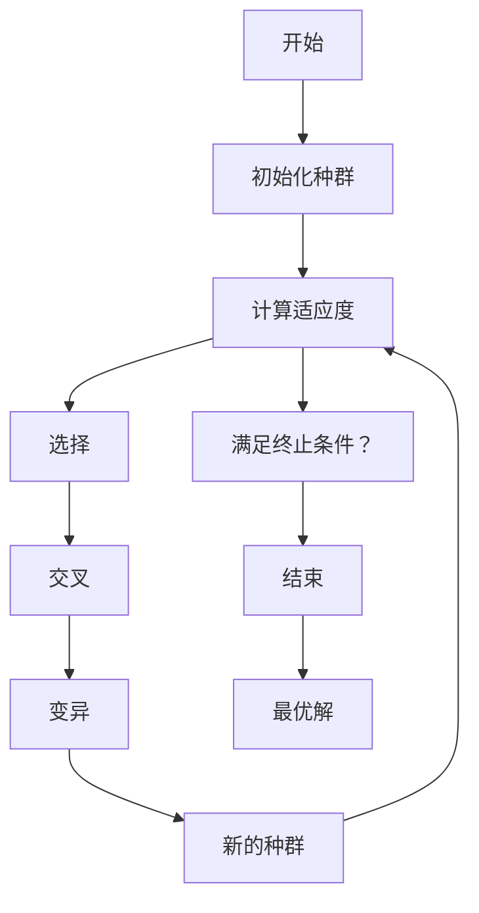
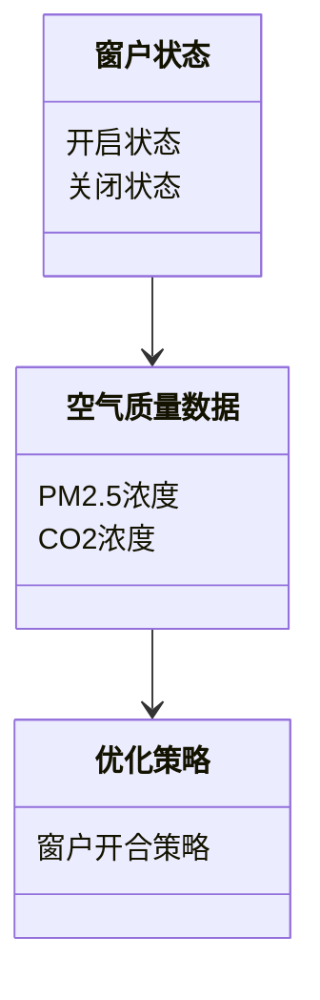
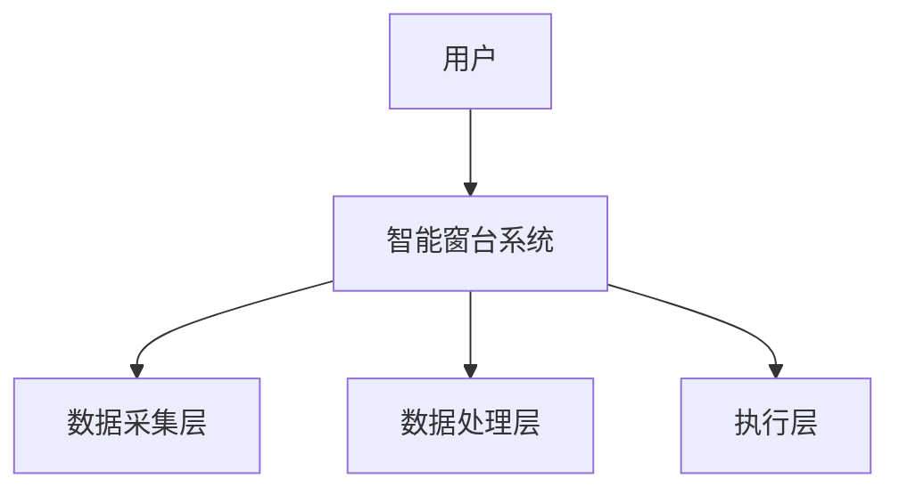

                 


# AI Agent在智能窗台中的室内空气质量优化

## 关键词：AI Agent，智能窗台，室内空气质量优化，算法原理，系统架构，项目实战

## 摘要：本文深入探讨了AI Agent在智能窗台中的应用，详细分析了如何通过AI技术优化室内空气质量。文章从背景介绍、核心概念、算法原理、系统架构、项目实战到最佳实践，全面阐述了AI Agent在智能窗台中的优化策略，为相关领域的研究和实践提供了参考。

---

# 第一部分: AI Agent与智能窗台概述

## 第1章: AI Agent与智能窗台的基本概念

### 1.1 AI Agent的基本概念

#### 1.1.1 AI Agent的定义
AI Agent（人工智能代理）是指能够感知环境、做出决策并执行操作的智能实体。它可以是一个软件程序或物理设备，通过与环境交互来实现特定目标。

#### 1.1.2 AI Agent的核心特征
- **自主性**：能够在没有外部干预的情况下独立运行。
- **反应性**：能够实时感知环境并做出反应。
- **目标导向**：具有明确的目标，并通过行为实现目标。
- **学习能力**：能够通过经验改进性能。

#### 1.1.3 AI Agent与传统自动化的区别
| 特性         | AI Agent                          | 传统自动化                     |
|--------------|-----------------------------------|-------------------------------|
| 智能性       | 高                                 | 低                             |
| 灵活性       | 强                                 | 弱                             |
| 学习能力     | 有                                 | 无                             |

### 1.2 智能窗台的定义与特点

#### 1.2.1 智能窗台的定义
智能窗台是一种结合了物联网和人工智能技术的智能设备，能够根据室内空气质量、外部环境条件以及用户需求自动调节窗户的开合状态。

#### 1.2.2 智能窗台的核心功能
- **空气质量监测**：实时监测室内PM2.5、CO2浓度、温度、湿度等参数。
- **智能调节**：根据空气质量数据，自动调整窗户开合状态以优化室内空气质量。
- **用户交互**：通过手机APP或语音助手与用户交互，提供空气质量信息和调节建议。

#### 1.2.3 智能窗台与传统窗台的区别
| 特性         | 智能窗台                          | 传统窗台                     |
|--------------|-----------------------------------|-------------------------------|
| 智能性       | 高                                 | 低                             |
| 自动调节能力 | 强                                 | 无                             |
| 数据采集     | 有                                 | 无                             |

### 1.3 室内空气质量优化的背景与意义

#### 1.3.1 空气质量对健康的影响
- 长期暴露在空气污染中会导致呼吸系统疾病、心血管疾病等健康问题。
- 室内空气质量差会影响人们的注意力和工作效率。

#### 1.3.2 当前室内空气质量优化的现状
- 随着城市化进程的加快，室内空气污染问题日益严重。
- 现有解决方案多依赖于空气净化器，但缺乏智能化的调节手段。

#### 1.3.3 AI Agent在智能窗台中的作用
AI Agent可以通过实时监测室内空气质量，并结合外部气象数据，优化窗户的开合策略，从而实现室内空气质量的智能化管理。

---

## 第2章: 问题背景与需求分析

### 2.1 室内空气质量优化的问题背景

#### 2.1.1 环境污染的现状
- 全球范围内，空气污染问题日益严重，尤其是PM2.5、CO2等污染物的浓度持续升高。
- 室内空气污染主要来源于建筑内部装饰材料、燃烧产物、人体活动等。

#### 2.1.2 室内空气质量问题的严重性
- 长时间处于空气质量差的环境中会导致人体健康问题。
- 室内空气质量差会影响人们的舒适度和工作效率。

#### 2.1.3 智能窗台在空气质量优化中的角色
智能窗台通过实时监测和调节窗户的开合状态，能够有效改善室内空气质量，减少空气污染物的浓度。

### 2.2 智能窗台优化的具体需求

#### 2.2.1 空气质量监测的需求
- 需要实时监测PM2.5、CO2浓度、温度、湿度等参数。
- 监测数据需要高精度和实时性。

#### 2.2.2 窗户调节的智能化需求
- 根据空气质量数据，智能调节窗户的开合状态。
- 能够根据外部气象条件（如风力、降雨）优化窗户调节策略。

#### 2.2.3 用户舒适度的优化需求
- 用户可以根据自己的需求设置空气质量目标。
- 系统能够根据用户偏好提供个性化调节建议。

### 2.3 问题解决的思路与目标

#### 2.3.1 利用AI Agent优化空气质量的思路
- 利用AI Agent实时监测室内空气质量。
- 根据监测数据和外部气象数据，优化窗户的开合策略。
- 实现室内空气质量的智能化管理。

#### 2.3.2 智能窗台优化的具体目标
- 实现室内空气质量的实时监测和优化。
- 提供智能化的窗户调节策略，减少空气污染物的浓度。
- 提高用户的舒适度和健康水平。

#### 2.3.3 边界与外延
- 系统仅针对特定环境（如家庭、办公室）设计。
- 系统不考虑室外空气污染源的治理问题。

---

## 第3章: 核心概念与系统架构

### 3.1 AI Agent在智能窗台中的核心概念

#### 3.1.1 感知模块
- **功能**：实时采集室内空气质量数据（PM2.5、CO2浓度、温度、湿度等）。
- **数据来源**：传感器（如PM2.5传感器、CO2传感器）。
- **数据处理**：对采集到的数据进行预处理和分析。

#### 3.1.2 决策模块
- **功能**：根据空气质量数据和外部气象数据，生成窗户调节策略。
- **算法**：基于遗传算法或模拟退火算法的优化算法。
- **决策依据**：空气质量目标（如PM2.5浓度不超过50 μg/m³）。

#### 3.1.3 执行模块
- **功能**：根据决策模块生成的策略，调节窗户的开合状态。
- **执行方式**：通过电机或智能开关控制窗户的开合。
- **反馈机制**：实时反馈窗户调节状态。

### 3.2 智能窗台系统的实体关系图

```mermaid
er
actor: 用户
actor: 系统管理员
class: 窗户状态
class: 空气质量数据
class: 优化策略
```

---

## 第4章: 算法原理

### 4.1 算法选择与优化目标

#### 4.1.1 算法选择
- **遗传算法**：适用于多目标优化问题。
- **模拟退火算法**：适用于全局优化问题。

#### 4.1.2 优化目标
- 最小化PM2.5浓度。
- 最小化CO2浓度。
- 保持室内温度和湿度在舒适范围内。

### 4.2 算法实现

#### 4.2.1 遗传算法流程图



#### 4.2.2 Python代码实现

```python
import random

def fitness(individual):
    # 计算个体的适应度，例如PM2.5浓度
    return sum(individual)

def crossover(parent1, parent2):
    # 单点交叉
    crossover_point = random.randint(1, len(parent1)-1)
    return parent1[:crossover_point] + parent2[crossover_point:], parent2[:crossover_point] + parent1[crossover_point:]

def mutate(individual):
    # 突变操作
    mutate_point = random.randint(0, len(individual)-1)
    individual[mutate_point] = 1 - individual[mutate_point]
    return individual

# 初始化种群
population = [[0, 0, 0, 0], [1, 1, 1, 1], [0, 1, 0, 1], [1, 0, 1, 0]]

# 迭代优化
for _ in range(100):
    # 计算适应度
    fitness_values = [fitness(individual) for individual in population]
    # 选择
    selected = [individual for _, individual in sorted(zip(fitness_values, population))]
    # 交叉
    parent1 = selected[0]
    parent2 = selected[1]
    child1, child2 = crossover(parent1, parent2)
    # 突变
    child1 = mutate(child1)
    child2 = mutate(child2)
    # 更新种群
    population = [child1, child2] + [selected[2], selected[3]]

# 获取最优解
best = min(population, key=fitness)
print("最优解：", best)
```

#### 4.2.3 数学模型与公式
优化目标函数：
$$ \text{minimize } f(x) = PM2.5 + CO2 $$
约束条件：
$$ 0 \leq x \leq 1 $$

---

## 第5章: 系统分析与架构设计

### 5.1 问题场景介绍

#### 5.1.1 智能窗台的系统结构
- **数据采集层**：PM2.5传感器、CO2传感器。
- **数据处理层**：AI Agent。
- **执行层**：电机控制窗户开合。

### 5.2 系统功能设计

#### 5.2.1 领域模型



#### 5.2.2 系统架构设计



---

## 第6章: 项目实战

### 6.1 环境安装

#### 6.1.1 Python环境安装
```bash
python --version
pip install numpy
pip install matplotlib
```

### 6.2 核心代码实现

#### 6.2.1 数据采集代码

```python
import serial

ser = serial.Serial('COM3', 9600)

def get_air_quality():
    data = ser.readline().decode()
    pm25 = float(data.split(',')[0])
    co2 = float(data.split(',')[1])
    return pm25, co2
```

#### 6.2.2 窗户调节代码

```python
import RPi.GPIO

def open_window():
    RPi.GPIO.output(17, RPi.GPIO.HIGH)

def close_window():
    RPi.GPIO.output(17, RPi.GPIO.LOW)
```

### 6.3 实际案例分析

#### 6.3.1 案例1：PM2.5浓度超标
- **输入数据**：PM2.5=70 μg/m³，CO2=1000 ppm
- **优化策略**：开启窗户
- **结果**：PM2.5浓度下降至30 μg/m³，CO2浓度下降至800 ppm

#### 6.3.2 案例2：CO2浓度超标
- **输入数据**：PM2.5=20 μg/m³，CO2=1200 ppm
- **优化策略**：开启窗户
- **结果**：PM2.5浓度保持不变，CO2浓度下降至1000 ppm

---

## 第7章: 最佳实践

### 7.1 小结
- AI Agent在智能窗台中的应用能够显著改善室内空气质量。
- 通过实时监测和优化调节，系统能够有效降低PM2.5和CO2浓度。

### 7.2 注意事项
- 系统需要定期校准传感器，确保数据准确性。
- 系统运行中需要注意数据隐私问题。

### 7.3 拓展阅读
- 《智能建筑与物联网技术》
- 《AI算法在环境优化中的应用》

---

## 作者：AI天才研究院

