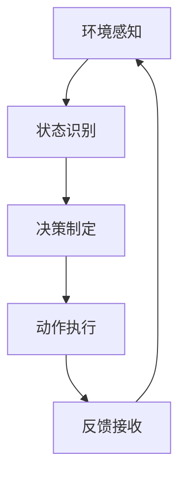
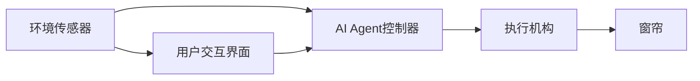

                 


# AI Agent在智能窗帘中的自然光利用优化

> 关键词：AI Agent, 智能窗帘, 自然光优化, 算法原理, 系统架构, 项目实战

> 摘要：本文深入探讨了AI Agent在智能窗帘中的应用，重点分析了自然光利用优化的核心概念、算法原理、系统架构设计以及项目实战。通过详细的技术分析和实际案例，展示了如何利用AI技术提升智能窗帘的智能化水平和能源利用效率。

---

## 第1章: AI Agent与智能窗帘的背景介绍

### 1.1 智能窗帘的发展历程

#### 1.1.1 从传统窗帘到智能窗帘的演变
传统窗帘的功能主要局限于遮光和隐私保护。随着物联网技术的发展，智能窗帘开始出现，可以通过手机APP或语音助手（如Amazon Alexa、Google Home）进行远程控制。然而，早期的智能窗帘仍然主要依赖简单的开关控制，缺乏智能化的决策能力。

#### 1.1.2 AI技术在智能窗帘中的应用背景
随着AI技术的快速发展，智能窗帘的功能逐渐从简单的远程控制向智能化的环境优化方向演进。AI Agent（智能体）的引入，使得窗帘能够根据环境条件（如光照强度、室内外温差、用户习惯等）自动调整开合状态，从而实现自然光的优化利用。

#### 1.1.3 自然光利用优化的现实意义
自然光的合理利用不仅可以提高室内采光效率，还能降低能源消耗。通过AI Agent优化自然光利用，可以实现节能减排的目标，同时提升用户的舒适度和生活质量。

---

### 1.2 AI Agent的基本概念

#### 1.2.1 什么是AI Agent
AI Agent（智能体）是指在计算机系统中，能够感知环境、做出决策并采取行动以实现目标的实体。AI Agent可以是软件程序，也可以是硬件设备，其核心能力包括感知、推理、规划和执行。

#### 1.2.2 AI Agent的核心特征
- **自主性**：能够在没有外部干预的情况下自主运行。
- **反应性**：能够实时感知环境变化并做出反应。
- **目标导向性**：所有行为都以实现特定目标为导向。
- **学习能力**：能够通过数据和经验不断优化自身的决策能力。

#### 1.2.3 AI Agent与智能窗帘的结合
AI Agent可以集成到智能窗帘系统中，通过传感器收集光照强度、室内温度、室外天气等数据，结合用户习惯和需求，自动调整窗帘的开合状态，以实现自然光的优化利用。

---

### 1.3 自然光利用优化的定义与目标

#### 1.3.1 自然光利用的定义
自然光利用是指通过合理调节窗户的开合状态，最大化利用自然光照明，同时减少能源消耗。

#### 1.3.2 自然光优化的目标
- **最大化光照强度**：在满足用户需求的前提下，尽可能利用自然光。
- **最小化能源消耗**：通过优化窗帘开合状态，减少人工照明的使用时间。
- **提高用户舒适度**：根据光照和温度变化，自动调整窗帘状态，营造舒适的室内环境。

#### 1.3.3 优化与节能的关系
优化自然光利用不仅能够提高室内采光效率，还能减少人工照明的使用，从而降低能源消耗，实现节能减排的目标。

---

## 第2章: AI Agent在智能窗帘中的核心概念与联系

### 2.1 AI Agent与智能窗帘的关系

#### 2.1.1 AI Agent在智能窗帘中的角色
AI Agent在智能窗帘系统中扮演着“智能大脑”的角色，负责收集环境数据、分析决策并执行控制命令。

#### 2.1.2 AI Agent与自然光优化的联系
AI Agent通过感知环境条件（如光照强度、室内外温差等）和用户需求，优化窗帘的开合状态，以实现自然光的高效利用。

#### 2.1.3 核心概念的ER实体关系图

```mermaid
erDiagram
    user {
        +id : integer
        +name : string
        +preferences : string
    }
    environment {
        +time : datetime
        +lightIntensity : float
        +temperature : float
    }
    action {
        +time : datetime
        +type : string
        +description : string
    }
    AI-Agent {
        +id : integer
        +state : string
        +goal : string
    }
    user --> AI-Agent : "触发"
    environment --> AI-Agent : "感知"
    AI-Agent --> action : "执行"
```

---

### 2.2 AI Agent的算法原理

#### 2.2.1 强化学习算法的原理
强化学习是一种机器学习方法，通过智能体与环境的交互，学习最优策略以最大化累积奖励。在智能窗帘系统中，AI Agent可以通过强化学习算法，根据环境反馈不断优化窗帘的开合策略。

#### 2.2.2 算法流程图



#### 2.2.3 示例场景的数学分析
假设光照强度为$L$，温度为$T$，用户偏好为$P$。AI Agent的目标是通过调整窗帘开合状态，使$L$最大化，同时$T$保持在舒适范围内。优化目标可以表示为：

$$ \text{最大化 } L \quad \text{约束条件：} \quad T \in [T_{\text{min}}, T_{\text{max}}] $$

---

### 2.3 系统架构设计

#### 2.3.1 系统功能模块划分

- **环境传感器**：采集光照强度、温度、湿度等环境数据。
- **用户交互界面**：接收用户的输入指令或偏好设置。
- **AI Agent控制器**：根据环境数据和用户需求，优化窗帘的开合状态。
- **执行机构**：根据AI Agent的指令，控制窗帘的开合。

#### 2.3.2 系统架构图



---

## 第3章: 项目实战

### 3.1 环境安装与配置

#### 3.1.1 开发环境的选择
建议使用Python编程语言，搭配以下库：
- **NumPy**：用于数值计算。
- **TensorFlow**或**PyTorch**：用于深度学习模型的训练。
- **OpenCV**：用于图像处理（可选）。
- **Raspberry Pi**：用于硬件控制（可选）。

#### 3.1.2 必要库的安装
在终端中运行以下命令安装所需的库：
```bash
pip install numpy tensorflow opencv-python
```

---

### 3.2 系统核心实现

#### 3.2.1 数据采集与处理的代码实现

```python
import numpy as np

# 示例数据：光照强度、温度、湿度
data = {
    'lightIntensity': np.random.uniform(0, 100, 100),
    'temperature': np.random.uniform(20, 30, 100),
    'humidity': np.random.uniform(30, 70, 100)
}
```

#### 3.2.2 AI Agent算法的代码实现

```python
import tensorflow as tf
from tensorflow.keras import layers

# 构建强化学习模型
model = tf.keras.Sequential([
    layers.Dense(64, activation='relu', input_shape=(3,)),
    layers.Dense(1)
])

model.compile(optimizer='adam', loss='mean_squared_error')
```

---

### 3.3 代码应用

#### 3.3.1 实际案例分析
假设某一天的光照强度为80 lux，室内温度为25°C，湿度为50%。AI Agent的目标是在不降低室内温度的前提下，尽可能增加自然光的利用。

---

## 第4章: 总结与展望

### 4.1 本章小结
本文详细探讨了AI Agent在智能窗帘中的应用，分析了自然光优化的核心概念、算法原理和系统架构设计，并通过项目实战展示了如何实现AI Agent的智能化控制。

### 4.2 注意事项
- 确保传感器数据的准确性。
- 保护用户的隐私数据。
- 定期更新AI Agent的模型以适应环境变化。

### 4.3 拓展阅读
- 探索AI Agent在智能家居中的其他应用。
- 研究更先进的强化学习算法（如DQN、PPO等）。

---

作者：AI天才研究院 & 禅与计算机程序设计艺术

