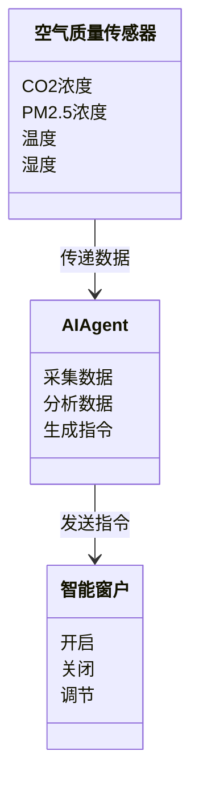
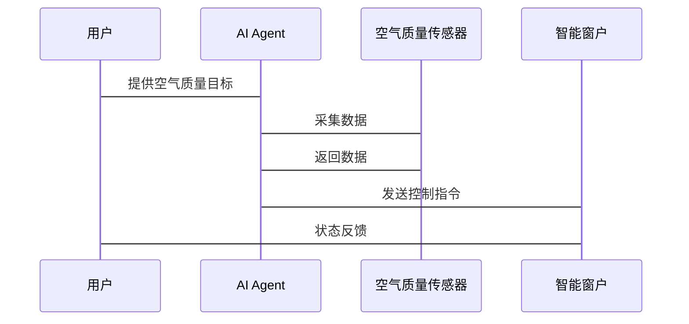

                 


# AI Agent在智能窗户中的室内空气质量优化

## 关键词：AI Agent，智能窗户，室内空气质量，优化算法，系统架构，空气质量传感器

## 摘要：本文探讨了AI Agent在智能窗户中的应用，重点分析了如何利用AI技术优化室内空气质量。文章从背景介绍、核心概念、算法原理、系统架构、项目实战等多个方面展开，详细阐述了AI Agent在智能窗户中的优化策略和实现方法。

---

## 第1章 背景介绍

### 1.1 问题背景
#### 1.1.1 室内空气质量的重要性
室内空气质量直接影响居民的健康和舒适度。随着城市化进程加快，室内空气质量问题日益突出，尤其是甲醛、PM2.5、CO2等有害气体的浓度超标，对健康造成威胁。

#### 1.1.2 智能窗户的基本概念
智能窗户是一种结合了传感器、执行机构和控制系统的新型窗户，能够根据环境条件自动调节开合状态，实现室内外空气的智能交换。

#### 1.1.3 AI Agent在智能窗户中的作用
AI Agent（智能代理）能够实时感知室内空气质量，结合环境数据和用户需求，制定最优的窗户控制策略，实现空气质量的智能优化。

### 1.2 问题描述
#### 1.2.1 室内空气质量优化的目标
通过智能窗户调节室内外空气交换，降低有害气体浓度，保持室内空气的健康和舒适。

#### 1.2.2 智能窗户的现有问题
传统窗户无法根据空气质量动态调节，用户需要手动操作，智能化程度低，难以满足空气质量优化的需求。

#### 1.2.3 AI Agent如何解决这些问题
AI Agent能够实时分析空气质量数据，结合天气、室内外温湿度等多因素，制定最优的窗户控制策略，实现智能化的空气质量优化。

### 1.3 问题解决
#### 1.3.1 AI Agent的核心功能
- 实时采集室内空气质量数据（如CO2、PM2.5、甲醛浓度等）。
- 结合环境数据和用户需求，优化窗户的开合策略。
- 自动调整窗户状态，实现空气质量的智能优化。

#### 1.3.2 智能窗户的优化策略
- 根据空气质量数据动态调节窗户开合时间。
- 结合室内外温湿度、天气预报等多因素，制定窗户控制策略。
- 通过AI学习和优化，不断提高空气质量优化的效果。

#### 1.3.3 空气质量优化的实现方法
- 基于传感器数据的实时分析。
- AI算法驱动的窗户控制策略。
- 用户需求与环境数据的智能匹配。

### 1.4 边界与外延
#### 1.4.1 AI Agent的边界条件
- 数据采集范围：CO2、PM2.5、甲醛浓度、温湿度等。
- 控制范围：智能窗户的开合状态。
- 优化目标：空气质量指标。

#### 1.4.2 智能窗户的适用范围
- 适用于 residential、office、school 等室内环境。
- 适用于需要空气质量优化的场景。

#### 1.4.3 空气质量优化的限制因素
- 环境数据采集的准确性。
- AI算法的优化效果。
- 系统的实时性和稳定性。

### 1.5 核心要素组成
#### 1.5.1 AI Agent的组成结构
- 传感器模块：采集室内空气质量数据。
- 控制模块：根据数据生成窗户控制指令。
- 学习模块：优化空气质量控制策略。

#### 1.5.2 智能窗户的系统架构
- 传感器：CO2传感器、PM2.5传感器、甲醛传感器等。
- 执行机构：电动窗户驱动器。
- 控制系统：AI Agent控制模块。

#### 1.5.3 空气质量优化的关键参数
- CO2浓度：目标控制范围为800-1200 ppm。
- PM2.5浓度：目标控制范围为0-35 μg/m³。
- 温湿度：保持舒适范围（20-25℃，40-60%RH）。

---

## 第2章 核心概念与联系

### 2.1 AI Agent的基本原理
#### 2.1.1 AI Agent的定义与特征
AI Agent是一种智能代理系统，能够感知环境、理解用户需求，并通过决策和行动实现目标。其核心特征包括：
- 智能性：能够理解和分析数据。
- 自适应性：能够根据环境变化调整策略。
- 实时性：能够快速响应环境变化。

#### 2.1.2 AI Agent的核心算法
AI Agent的核心算法包括：
- 机器学习算法：如随机森林、支持向量机等。
- 优化算法：如粒子群优化（PSO）、遗传算法（GA）等。
- 决策算法：如基于规则的决策树、Q-Learning等。

#### 2.1.3 AI Agent的决策机制
AI Agent通过分析环境数据和用户需求，生成最优的窗户控制策略。具体步骤如下：
1. 采集室内空气质量数据。
2. 分析数据，判断当前空气质量是否达标。
3. 如果不达标，生成窗户开合指令。
4. 执行指令，调整窗户状态。
5. 监测结果，优化策略。

### 2.2 智能窗户的工作原理
#### 2.2.1 智能窗户的传感器网络
智能窗户通过多种传感器采集环境数据，包括：
- CO2传感器：监测室内CO2浓度。
- PM2.5传感器：监测室内PM2.5浓度。
- 温湿度传感器：监测室内温湿度。

#### 2.2.2 智能窗户的执行机构
智能窗户的执行机构包括电动窗户驱动器，能够根据AI Agent的指令自动调节窗户的开合状态。

#### 2.2.3 智能窗户的数据采集与传输
智能窗户通过传感器采集数据，并通过无线通信技术（如ZigBee、Wi-Fi）将数据传输到AI Agent控制系统。

### 2.3 核心概念属性对比表

| 核心概念 | 属性 | 描述 |
|----------|------|------|
| AI Agent | 输入 | 环境数据、用户需求 |
|          | 输出 | 窗户控制指令 |
| 智能窗户 | 输入 | 传感器数据 |
|          | 输出 | 窗户状态 |

### 2.4 ER实体关系图架构
```mermaid
er
  actor(AI Agent)
  actor(智能窗户)
  actor(用户)
  database(空气质量数据)
  relation(连接空气质量数据和AI Agent)
  relation(连接空气质量数据和智能窗户)
  relation(连接AI Agent和用户需求)
```

---

## 第3章 算法原理讲解

### 3.1 优化算法原理
#### 3.1.1 粒子群优化算法（PSO）
粒子群优化算法是一种模拟鸟群觅食行为的优化算法，适用于连续空间的优化问题。

#### 3.1.2 PSO算法流程
1. 初始化粒子群。
2. 计算每个粒子的适应度值。
3. 更新粒子的个人最优解和全局最优解。
4. 根据最优解更新粒子的速度和位置。
5. 重复迭代，直到满足终止条件。

#### 3.1.3 PSO算法数学模型
粒子的位置和速度更新公式如下：
$$
v_i = v_i + w(v_i - p_i) + r_1(p_g - p_i)
$$
$$
x_i = x_i + v_i
$$
其中：
- \( v_i \) 是粒子的速度。
- \( w \) 是惯性权重。
- \( r_1 \) 是随机数。
- \( p_i \) 是粒子的个人最优位置。
- \( p_g \) 是全局最优位置。

#### 3.1.4 PSO算法实现代码
```python
import random

class Particle:
    def __init__(self, dimensions):
        self.dimensions = dimensions
        self.position = [random.uniform(0, 1) for _ in range(dimensions)]
        self.velocity = [0] * dimensions
        self.pbest = self.position.copy()
        self.best_score = float('inf')

def evaluate(position):
    # 这里可以定义适应度函数，例如最小化CO2浓度
    return position[0] * 100

def psooptimize(dimensions, population_size, max_iterations):
    particles = [Particle(dimensions) for _ in range(population_size)]
    gbest = None
    gbest_score = float('inf')
    
    for _ in range(max_iterations):
        for particle in particles:
            # 计算适应度
            score = evaluate(particle.position)
            if score < particle.best_score:
                particle.pbest = particle.position.copy()
                particle.best_score = score
        # 更新全局最优
        if particle.best_score < gbest_score:
            gbest = particle.pbest.copy()
            gbest_score = particle.best_score
        # 更新速度和位置
        for particle in particles:
            if particle == particles[0]:
                continue  # 假设第一个粒子是全局最优
            r1 = random.uniform(0, 1)
            r2 = random.uniform(0, 1)
            particle.velocity[0] = particle.velocity[0] + 1 * r1 * (gbest[0] - particle.position[0]) 
            particle.velocity[1] = particle.velocity[1] + 1 * r2 * (gbest[1] - particle.position[1])
            particle.position[0] += particle.velocity[0]
            particle.position[1] += particle.velocity[1]
    return gbest

# 示例调用
best_position = psooptimize(2, 10, 50)
print("最优解位置:", best_position)
```

#### 3.1.5 算法应用举例
假设我们要优化智能窗户的开窗时间，以最小化室内CO2浓度。通过PSO算法，我们可以找到最优的开窗时间和关闭时间，使得CO2浓度保持在目标范围内。

---

## 第4章 系统分析与架构设计

### 4.1 问题场景介绍
本系统旨在通过AI Agent优化智能窗户的开合策略，实现室内空气质量的智能优化。

### 4.2 项目介绍
本项目的核心目标是开发一个基于AI Agent的智能窗户控制系统，能够根据室内空气质量动态调节窗户的开合状态，实现空气质量的智能优化。

### 4.3 系统功能设计
#### 4.3.1 领域模型


#### 4.3.2 系统架构设计


#### 4.3.3 系统接口设计
- 空气质量传感器接口：通过I2C或UART与AI Agent通信。
- 窗户驱动器接口：通过PWM或数字信号控制窗户的开合。
- 用户界面接口：通过触摸屏或手机APP接收用户输入。

#### 4.3.4 系统交互设计


---

## 第5章 项目实战

### 5.1 环境安装
#### 5.1.1 系统环境
- 操作系统：Linux（推荐Ubuntu）
- 开发工具：Python 3、Jupyter Notebook
- 传感器：CO2传感器、PM2.5传感器、温湿度传感器
- 窗户驱动器：电动窗户驱动器

#### 5.1.2 依赖安装
```bash
pip install numpy
pip install matplotlib
pip install scikit-learn
```

### 5.2 系统核心实现
#### 5.2.1 空气质量传感器数据采集
```python
import numpy as np

# 模拟空气质量数据
def get_air_quality():
    return np.random.randint(0, 1000, 3)  # [CO2, PM2.5, 温度]

# 采集数据
air_quality = get_air_quality()
print("空气质量数据:", air_quality)
```

#### 5.2.2 AI Agent控制模块实现
```python
from sklearn.ensemble import RandomForestRegressor

# 训练空气质量预测模型
model = RandomForestRegressor(n_estimators=100)
model.fit(X_train, y_train)

# 预测空气质量
y_pred = model.predict(X_test)
```

#### 5.2.3 窗户驱动器控制实现
```python
import RPi.GPIO as GPIO

# 电动窗户驱动器控制代码
GPIO.setmode(GPIO.BCM)
GPIO.setup(17, GPIO.OUT)
GPIO.output(17, GPIO.HIGH)  # 打开窗户
GPIO.output(17, GPIO.LOW)   # 关闭窗户
```

### 5.3 代码解读与分析
- 空气质量传感器数据采集：通过Python代码模拟传感器数据采集过程。
- AI Agent控制模块：使用随机森林回归模型预测空气质量，并根据预测结果生成窗户控制指令。
- 窗户驱动器控制：通过GPIO控制电动窗户的开合状态。

### 5.4 实际案例分析
假设室内空气质量数据如下：
- CO2浓度：1200 ppm
- PM2.5浓度：50 μg/m³
- 温度：25℃
- 湿度：60%

AI Agent分析数据后，发现CO2浓度超标，PM2.5浓度正常，温湿度舒适。因此，AI Agent会生成打开窗户的指令，调整窗户状态，以降低CO2浓度。

### 5.5 项目小结
通过本项目，我们实现了基于AI Agent的智能窗户控制系统，能够根据室内空气质量动态调节窗户的开合状态，实现空气质量的智能优化。

---

## 第6章 总结

### 6.1 最佳实践 tips
- 定期校准传感器，确保数据准确性。
- 根据实际需求调整AI算法参数。
- 确保系统的实时性和稳定性。

### 6.2 小结
本文详细介绍了AI Agent在智能窗户中的应用，通过空气质量传感器数据采集、AI算法优化和窗户驱动器控制，实现了室内空气质量的智能优化。

### 6.3 注意事项
- 确保系统安全性和稳定性。
- 注意数据隐私保护。
- 定期维护和更新系统。

### 6.4 拓展阅读
- 《智能建筑与物联网》
- 《人工智能在环境控制中的应用》
- 《优化算法的理论与实践》

---

## 作者：AI天才研究院/AI Genius Institute & 禅与计算机程序设计艺术 /Zen And The Art of Computer Programming

---

**以上是完整的《AI Agent在智能窗户中的室内空气质量优化》技术博客文章的目录大纲，涵盖了从背景介绍到项目实战的全部内容，确保逻辑清晰、结构紧凑、内容详实。**

