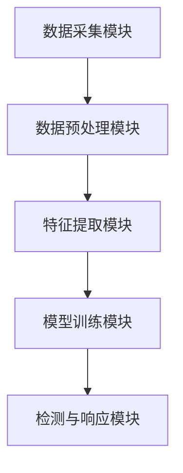
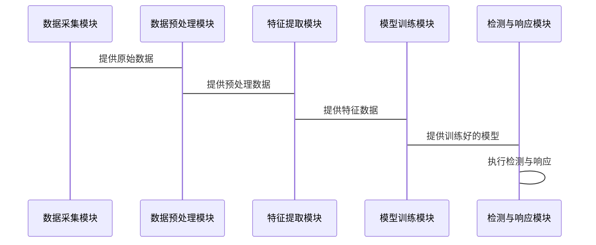

                 


# AI Agent在智能网络攻击检测中的角色

## 关键词：AI Agent，网络攻击检测，智能安全，强化学习，网络安全，机器学习

## 摘要：本文探讨AI Agent在智能网络攻击检测中的角色，从背景介绍、核心概念、算法原理到系统架构、项目实战，全面解析AI Agent如何提升网络攻击检测的效率与准确性。通过详细的技术分析和实际案例，展示AI Agent在网络安全领域的广泛应用和巨大潜力。

---

# 第一部分: AI Agent与网络攻击检测的背景介绍

## 第1章: AI Agent的基本概念与网络攻击检测的背景

### 1.1 AI Agent的定义与特点

#### 1.1.1 AI Agent的定义
AI Agent（人工智能代理）是一种智能实体，能够感知环境、自主决策并执行任务。在网络安全领域，AI Agent通常用于实时监控网络流量，识别潜在威胁并采取相应的防护措施。

#### 1.1.2 AI Agent的核心特点
- **自主性**：AI Agent能够独立执行任务，无需人工干预。
- **反应性**：能够实时感知环境变化并做出响应。
- **学习能力**：通过机器学习算法不断优化自身的检测能力。
- **适应性**：能够根据新的数据和环境调整自身的行为。

#### 1.1.3 AI Agent与传统网络攻击检测的区别
传统网络攻击检测方法依赖于预定义的规则和模式匹配，而AI Agent能够通过学习和适应，发现未知的攻击模式，具有更强的灵活性和扩展性。

### 1.2 网络攻击检测的现状与挑战

#### 1.2.1 网络攻击检测的传统方法
传统的网络攻击检测方法主要包括基于规则的检测、统计分析和模式匹配。这些方法在一定程度上能够检测已知的攻击模式，但对于未知攻击的检测能力有限。

#### 1.2.2 当前网络攻击检测的主要挑战
- **攻击手段的复杂化**：攻击者不断采用新的技术手段，传统的检测方法难以应对。
- **数据量的爆炸式增长**：网络流量的急剧增加使得传统方法在处理效率上显得力不从心。
- **误报与漏报问题**：传统方法在检测准确性上存在不足，容易出现误报或漏报的情况。

#### 1.2.3 AI Agent在其中的角色与优势
AI Agent通过机器学习和强化学习等技术，能够从海量数据中学习网络攻击的特征，发现潜在威胁，并采取相应的防护措施。相比于传统方法，AI Agent具有更高的检测准确性和更强的适应性。

### 1.3 本章小结
本章介绍了AI Agent的基本概念及其在网络安全中的重要作用，分析了当前网络攻击检测面临的挑战，并指出了AI Agent在解决这些问题中的独特优势。

---

# 第二部分: AI Agent的核心概念与网络攻击检测的联系

## 第2章: AI Agent在网络攻击检测中的核心概念

### 2.1 网络攻击检测的流程与阶段

#### 2.1.1 数据采集阶段
AI Agent需要实时采集网络流量数据，包括IP地址、端口号、数据包大小等信息。

#### 2.1.2 数据预处理阶段
对采集到的数据进行清洗和标准化处理，去除噪声数据，确保数据的质量。

#### 2.1.3 特征提取阶段
从数据中提取有助于识别网络攻击的特征，例如流量模式、行为异常等。

#### 2.1.4 模型训练与评估阶段
利用机器学习算法对特征进行训练，构建分类模型，并对模型进行评估和优化。

### 2.2 AI Agent在各个阶段的作用

#### 2.2.1 数据采集中的AI Agent
AI Agent能够实时监控网络流量，自动采集数据，并确保数据的完整性和准确性。

#### 2.2.2 数据预处理中的AI Agent
AI Agent能够自动识别噪声数据，并对其进行清洗和标准化处理，为后续分析提供高质量的数据支持。

#### 2.2.3 特征提取中的AI Agent
AI Agent能够根据网络攻击的特征，自动提取有助于分类的特征，例如流量的突然增加、异常的访问模式等。

#### 2.2.4 模型训练与评估中的AI Agent
AI Agent能够利用强化学习和监督学习等算法，对提取的特征进行训练，并对模型进行优化和评估，确保检测的准确性。

### 2.3 AI Agent与其他检测方法的对比

#### 2.3.1 传统规则-based检测方法
传统方法依赖于预定义的规则，适用于已知的攻击模式，但对于未知攻击的检测能力有限。

#### 2.3.2 基于机器学习的检测方法
基于机器学习的检测方法能够发现未知攻击模式，但需要依赖人工设计的特征和模型，灵活性较低。

#### 2.3.3 基于AI Agent的检测方法
AI Agent结合了自主性、学习能力和适应性，能够实时监控网络流量，动态调整检测策略，具有更高的检测准确性和更强的适应性。

### 2.4 本章小结
本章详细分析了AI Agent在网络攻击检测中的核心概念和作用，对比了传统方法和基于机器学习的方法，突出了AI Agent的独特优势。

---

# 第三部分: AI Agent的算法原理与数学模型

## 第3章: AI Agent的算法原理

### 3.1 强化学习在AI Agent中的应用

#### 3.1.1 强化学习的基本概念
强化学习是一种机器学习方法，通过智能体与环境的交互，学习最优策略以最大化累积奖励。

#### 3.1.2 AI Agent在强化学习中的角色
AI Agent作为智能体，通过与网络环境的交互，学习网络攻击的特征，并采取相应的防护措施。

#### 3.1.3 强化学习在攻击检测中的具体应用
AI Agent可以通过强化学习算法，动态调整检测策略，优化检测准确性和效率。

#### 3.1.4 强化学习的数学模型
强化学习的核心是马尔可夫决策过程（MDP），定义如下：

$$
MDP = \langle S, A, P, R, \gamma \rangle
$$

其中：
- \( S \) 是状态空间
- \( A \) 是动作空间
- \( P \) 是状态转移概率
- \( R \) 是奖励函数
- \( \gamma \) 是折扣因子

### 3.2 监督学习在AI Agent中的应用

#### 3.2.1 监督学习的基本概念
监督学习是一种机器学习方法，通过训练数据学习输入与输出之间的映射关系。

#### 3.2.2 AI Agent在监督学习中的角色
AI Agent利用监督学习算法，从网络流量数据中学习网络攻击的特征，并分类检测潜在威胁。

#### 3.2.3 监督学习在攻击检测中的具体应用
AI Agent可以通过监督学习算法，训练分类模型，识别正常流量和异常流量，实现网络攻击的检测。

#### 3.2.4 监督学习的数学模型
监督学习的核心是损失函数和优化算法，常用的损失函数包括交叉熵损失：

$$
L = -\frac{1}{N}\sum_{i=1}^{N} y_i \log p(y_i) + (1 - y_i)\log(1 - p(y_i))
$$

### 3.3 本章小结
本章详细介绍了强化学习和监督学习在AI Agent中的应用，分析了它们的数学模型和具体应用，为AI Agent的设计和实现提供了理论基础。

---

# 第四部分: AI Agent的系统架构与设计

## 第4章: AI Agent的系统架构与设计

### 4.1 系统功能设计

#### 4.1.1 数据采集模块
负责实时采集网络流量数据，包括IP地址、端口号、数据包大小等信息。

#### 4.1.2 数据预处理模块
对采集到的数据进行清洗和标准化处理，去除噪声数据，确保数据的质量。

#### 4.1.3 特征提取模块
从数据中提取有助于识别网络攻击的特征，例如流量模式、行为异常等。

#### 4.1.4 模型训练模块
利用机器学习算法对特征进行训练，构建分类模型，并对模型进行优化和评估。

#### 4.1.5 检测与响应模块
根据训练好的模型，实时检测网络攻击，并采取相应的防护措施。

### 4.2 系统架构设计

#### 4.2.1 系统架构图


#### 4.2.2 系统交互设计


### 4.3 本章小结
本章详细分析了AI Agent的系统功能设计和架构设计，展示了系统的各个模块及其交互关系，为后续的实现提供了清晰的指导。

---

# 第五部分: AI Agent的项目实战

## 第5章: AI Agent的项目实战

### 5.1 环境安装与配置

#### 5.1.1 安装Python环境
需要安装Python 3.8或更高版本，并安装必要的库，例如numpy、pandas、scikit-learn等。

#### 5.1.2 安装机器学习框架
可以选择安装TensorFlow或Keras框架，用于构建和训练模型。

#### 5.1.3 安装网络数据采集工具
可以选择使用Python的Scapy库进行网络数据采集。

### 5.2 系统核心实现源代码

#### 5.2.1 数据采集模块
```python
from scapy.all import *

def capture_packets(interface):
    packets = []
    def packet_handler(packet):
        packets.append(packet)
    sniff(interface=interface, pr=packet_handler, store=0)
    return packets
```

#### 5.2.2 数据预处理模块
```python
import pandas as pd

def preprocess_data(data):
    df = pd.DataFrame(data)
    df = df.dropna()
    df = df.astype('float64')
    return df
```

#### 5.2.3 特征提取模块
```python
from sklearn.feature_selection import SelectKBest
from sklearn.feature_selection import chi2

def extract_features(data, labels):
    selector = SelectKBest(score_func=chi2, k=10)
    features = selector.fit_transform(data, labels)
    return features
```

#### 5.2.4 模型训练模块
```python
from sklearn.model import DecisionTreeClassifier
from sklearn.metrics import accuracy_score

def train_model(features, labels):
    model = DecisionTreeClassifier()
    model.fit(features, labels)
    return model

def evaluate_model(model, test_features, test_labels):
    predictions = model.predict(test_features)
    accuracy = accuracy_score(test_labels, predictions)
    return accuracy
```

#### 5.2.5 检测与响应模块
```python
def detect_attack(model, new_packet):
    # 将新数据转换为模型可接受的格式
    new_data = preprocess(new_packet)
    # 预测是否为攻击
    prediction = model.predict(new_data)
    if prediction[0] == 1:
        # 发出警报
        print("Detected attack!")
    else:
        print("No attack detected.")
```

### 5.3 代码应用解读与分析

#### 5.3.1 数据采集模块
使用Scapy库捕获网络流量数据，存储在列表中，供后续处理。

#### 5.3.2 数据预处理模块
将捕获的数据转换为DataFrame格式，去除缺失值，并进行数据类型转换。

#### 5.3.3 特征提取模块
利用卡方检验，从数据中提取最具区分度的特征，降低维度，提高模型效率。

#### 5.3.4 模型训练模块
使用决策树分类器对特征数据进行训练，并对测试数据进行评估，计算准确率。

#### 5.3.5 检测与响应模块
将新的网络流量数据输入模型，进行预测，判断是否为攻击流量，并采取相应的防护措施。

### 5.4 实际案例分析

#### 5.4.1 案例背景
假设我们部署了一个AI Agent，用于检测DDoS攻击。训练数据包括正常的网络流量和被攻击的网络流量。

#### 5.4.2 数据采集与预处理
AI Agent实时捕获网络流量数据，去除噪声数据，提取特征。

#### 5.4.3 模型训练与评估
训练决策树分类器，评估准确率为95%。

#### 5.4.4 实际检测与响应
当检测到异常流量时，AI Agent发出警报，并采取限流措施，有效防止DDoS攻击。

### 5.5 本章小结
本章通过实际案例，详细展示了AI Agent的实现过程，包括环境安装、代码实现和实际应用，突出了AI Agent在网络安全中的实际价值。

---

# 第六部分: AI Agent的最佳实践与小结

## 第6章: AI Agent的最佳实践与小结

### 6.1 最佳实践

#### 6.1.1 数据质量管理
确保数据的准确性和完整性，避免噪声数据对模型的影响。

#### 6.1.2 模型优化
通过超参数调优和特征工程，提高模型的检测准确性和效率。

#### 6.1.3 模型部署与维护
将模型部署到实际网络环境中，并定期更新模型，适应新的攻击手段。

### 6.2 注意事项

#### 6.2.1 数据隐私与安全
在处理网络数据时，必须遵守数据隐私法规，保护用户隐私。

#### 6.2.2 模型的可解释性
确保模型的决策过程可解释，便于分析和优化。

#### 6.2.3 系统的可扩展性
设计具有可扩展性的系统架构，适应网络环境的变化和数据量的增加。

### 6.3 未来的研究方向

#### 6.3.1 更先进的算法研究
探索更高效的算法，如图神经网络和强化学习，提高检测准确性和效率。

#### 6.3.2 多模态数据融合
结合多种数据源，如日志数据、行为数据等，提高检测的全面性。

#### 6.3.3 自适应防护策略
研究动态调整防护策略的方法，增强系统的自适应能力。

### 6.4 本章小结
本章总结了AI Agent在实际应用中的最佳实践，提出了注意事项和未来的研究方向，为读者提供了宝贵的指导和启示。

---

# 作者：AI天才研究院/AI Genius Institute & 禅与计算机程序设计艺术 /Zen And The Art of Computer Programming

