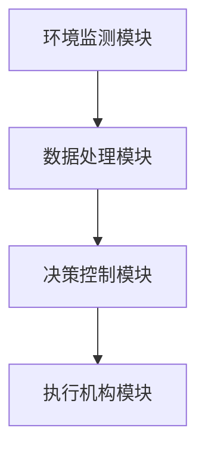
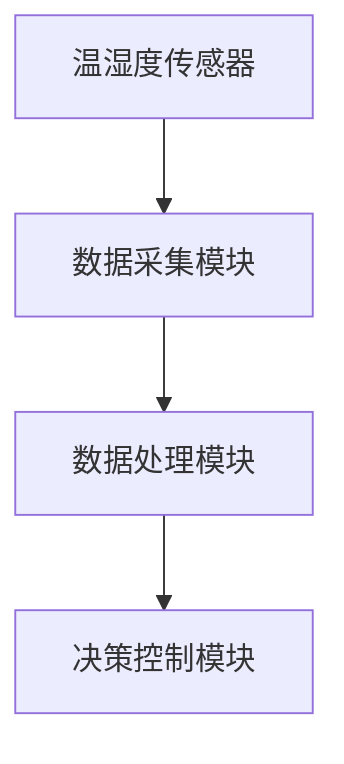
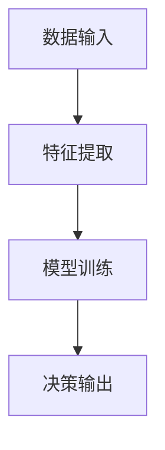

                 


# AI Agent在智能花盆中的自动浇水系统

> 关键词：AI Agent，智能花盆，自动浇水系统，物联网，环境监测，决策算法

> 摘要：本文详细探讨了AI Agent在智能花盆自动浇水系统中的应用。通过分析系统的架构设计、环境监测、数据处理、决策算法等关键部分，展示了如何利用AI技术实现智能浇水。文章结合理论与实践，提供了一个完整的项目实现案例，帮助读者理解并掌握相关技术。

---

# 第一部分：AI Agent与智能花盆概述

## 第1章：AI Agent的基本概念

### 1.1 AI Agent的定义与特点
AI Agent（人工智能代理）是指能够感知环境、自主决策并执行任务的智能实体。它具备以下特点：
- **自主性**：无需外部干预，自主完成任务。
- **反应性**：能够实时感知环境变化并做出反应。
- **目标导向**：基于目标进行决策和行动。

### 1.2 智能花盆的应用场景
智能花盆是一种结合了物联网和人工智能技术的设备，主要用于自动监测和管理植物的生长环境。其应用场景包括：
- **家庭种植**：帮助用户实现便捷的植物养护。
- **办公环境**：提升办公环境的空气质量。
- **农业应用**：用于温室或大规模植物种植的环境管理。

### 1.3 自动浇水系统的重要性
自动浇水系统能够根据植物的实际需求，自动调整浇水频率和量，避免过度浇水或缺水，从而提高植物的生长效率和健康状况。

---

## 第2章：AI Agent在智能花盆中的作用

### 2.1 AI Agent的核心功能
AI Agent在智能花盆中的作用主要体现在以下几个方面：
- **环境感知**：通过传感器收集温湿度、光照等环境数据。
- **数据处理**：对收集的数据进行分析和处理，提取有用信息。
- **决策制定**：基于分析结果，决定是否需要浇水及浇水的量。

### 2.2 智能花盆的整体架构
智能花盆的系统架构包括以下几个模块：
- **环境监测模块**：负责采集环境数据。
- **数据处理模块**：对数据进行预处理和分析。
- **决策控制模块**：基于数据生成决策指令。
- **执行机构模块**：根据决策指令执行浇水操作。

### 2.3 系统的边界与外延
智能花盆系统的边界包括传感器、数据处理单元和执行机构。外延部分则涉及与用户的交互界面和远程控制功能。

---

# 第二部分：系统架构与功能设计

## 第3章：系统架构设计

### 3.1 系统总体架构
智能花盆的总体架构可以分为以下几个层次：
- **感知层**：包括各种传感器，用于采集环境数据。
- **数据层**：负责数据的存储和管理。
- **决策层**：基于数据进行分析和决策。
- **执行层**：根据决策结果执行相应的操作。

### 3.2 功能模块划分
系统功能模块包括：
- **环境监测模块**：温湿度传感器、光照传感器。
- **数据处理模块**：数据采集、预处理、存储。
- **决策控制模块**：规则引擎、机器学习模型。
- **执行机构模块**：水泵、电磁阀。

### 3.3 模块交互关系
模块之间的交互关系如下（使用mermaid图）：



---

## 第4章：环境监测与数据采集

### 4.1 环境监测模块设计
环境监测模块主要由温湿度传感器和光照传感器组成。温湿度传感器用于监测土壤湿度和空气湿度，光照传感器用于监测光照强度。

### 4.2 数据采集与处理
数据采集模块负责将传感器信号转换为数字信号，并通过数据总线传输到数据处理模块。数据处理模块对采集到的数据进行预处理，包括去噪和归一化处理。

### 4.3 数据流分析
数据流的流程如下（使用mermaid图）：



---

## 第5章：AI Agent的决策算法实现

### 5.1 决策算法的选择与设计
决策算法可以选择基于规则的算法或基于机器学习的算法。基于规则的算法适用于简单的决策逻辑，而基于机器学习的算法能够处理更复杂的环境变化。

### 5.2 决策算法的实现步骤
决策算法的实现步骤包括数据输入、特征提取、模型训练和决策输出。

### 5.3 算法流程图
算法的流程图如下（使用mermaid图）：



---

## 第6章：项目实战

### 6.1 环境安装与配置
需要安装温湿度传感器、光照传感器和水泵等硬件设备，并配置数据采集卡和通信模块。

### 6.2 核心代码实现
以下是Python实现的决策算法代码示例：

```python
import numpy as np

# 数据预处理
data = np.array([温湿度, 光照])
processed_data = (data - np.mean(data)) / np.std(data)

# 决策逻辑
if processed_data[0] < threshold1 and processed_data[1] > threshold2:
    决策浇水
else:
    不浇水
```

### 6.3 系统测试与优化
通过实际测试验证系统的稳定性和准确性，并根据测试结果优化算法和硬件配置。

---

## 第7章：最佳实践与总结

### 7.1 最佳实践
- 传感器选型要根据具体环境和需求进行选择。
- 数据处理要充分考虑环境噪声和数据偏差。
- 算法优化要结合实际应用场景进行调整。

### 7.2 系统总结
通过本文的分析和实现，我们可以看到AI Agent在智能花盆中的应用潜力巨大。未来，随着技术的进步，系统将更加智能化和高效。

---

## 作者

作者：AI天才研究院/AI Genius Institute & 禅与计算机程序设计艺术 /Zen And The Art of Computer Programming

