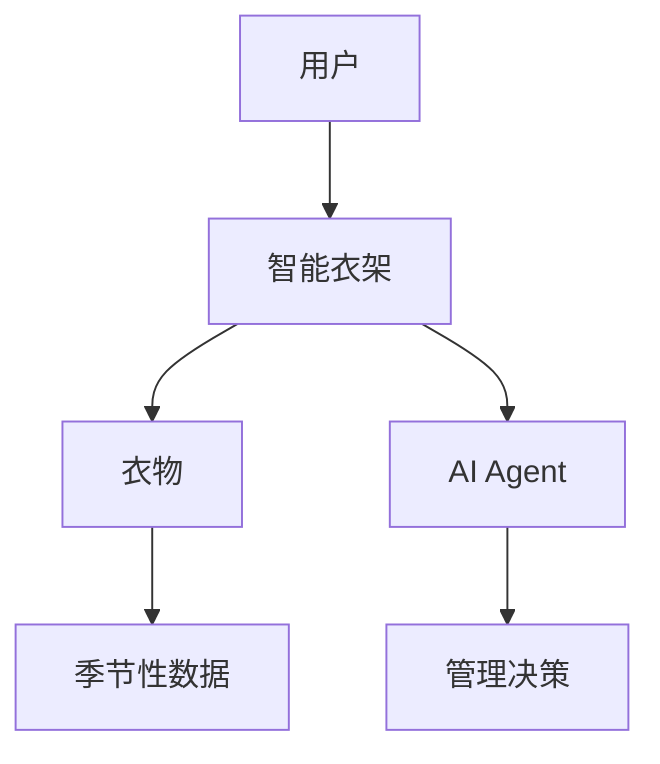
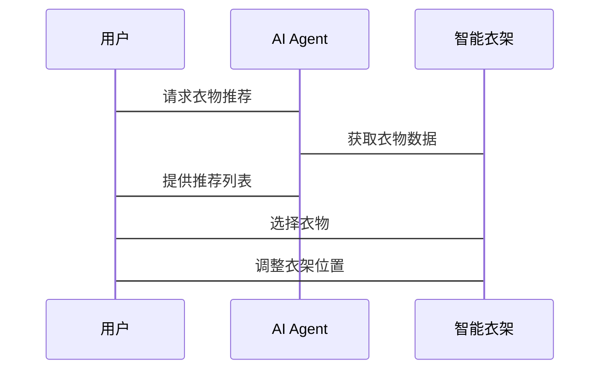

                 


# AI Agent在智能衣架中的季节性衣物管理

> 关键词：AI Agent, 智能衣架, 季节性衣物管理, 算法原理, 系统架构设计

> 摘要：本文探讨AI Agent在智能衣架中的应用，重点分析其在季节性衣物管理中的作用。通过背景介绍、核心概念、算法原理、系统架构设计、项目实战等方面，详细阐述AI Agent如何优化衣物管理，解决实际问题。

---

## 第一章: AI Agent与智能衣架的背景介绍

### 1.1 问题背景与描述

#### 1.1.1 季节性衣物管理的痛点
传统衣物管理方式存在效率低下、易遗忘、难以追踪等问题。季节变换时，用户难以快速找到适合穿着的衣物，导致时间浪费和不便。

#### 1.1.2 智能衣架的定义与目标
智能衣架是一种结合物联网技术的智能设备，能够实时感知衣物状态，并通过AI Agent进行数据分析和决策，帮助用户高效管理衣物。

#### 1.1.3 AI Agent在智能衣架中的作用
AI Agent通过感知环境、分析数据、制定决策，实现衣物分类、提醒、推荐等功能，提升用户体验。

### 1.2 季节性衣物管理的核心问题
- 衣物分类与识别
- 季节性衣物推荐
- 穿搭建议
- 衣物使用频率分析

### 1.3 智能衣架的概念结构与核心要素
- 系统架构：感知层、数据层、决策层、执行层
- 核心要素：衣物识别、数据存储、AI算法、用户交互

---

## 第二章: AI Agent的核心概念与联系

### 2.1 AI Agent的基本原理
- 感知：通过传感器获取衣物信息
- 决策：基于数据进行分类和推荐
- 执行：通过智能衣架调整衣物位置或状态

### 2.2 核心概念的属性特征对比

| 特征       | 智能衣架         | 传统衣架         |
|------------|-----------------|-----------------|
| 智能性      | 高              | 无              |
| 连接性      | 支持物联网       | 不支持           |
| 交互性      | 支持用户交互     | 无              |
| 学习能力    | 可通过AI学习用户习惯 | 无              |

### 2.3 ER实体关系图架构



---

## 第三章: AI Agent的算法原理与数学模型

### 3.1 算法原理

AI Agent通过以下步骤实现衣物管理：
1. 数据采集：获取衣物信息，如材质、颜色、品牌。
2. 数据分析：分析用户的穿衣习惯和偏好。
3. 决策制定：推荐适合当前季节的衣物组合。
4. 执行：调整衣架状态，如旋转或移动位置。

### 3.2 数学模型与公式

#### 衣物分类模型
使用聚类算法对衣物进行分类，公式如下：
$$
C = \text{聚类}(D, k)
$$
其中，$D$是数据集，$k$是簇的数量。

#### 季节性预测模型
使用时间序列分析预测未来的穿衣趋势，公式如下：
$$
P(t) = a \cdot P(t-1) + b
$$
其中，$a$是自回归系数，$b$是常数项。

### 3.3 算法实现

```python
def manage_clothes(clothes, season):
    # 分类衣物
    classified = cluster(clothes, 4)
    # 推荐衣物
    recommendation = recommend(classified, season)
    # 执行调整
    adjust(positions, recommendation)
    return recommendation
```

---

## 第四章: 系统架构设计与实现

### 4.1 系统功能设计

系统功能包括：
- 衣物识别与分类
- 季节性衣物推荐
- 穿搭建议
- 使用频率分析

### 4.2 系统架构设计


### 4.3 接口设计

系统接口包括：
- 用户输入接口
- 数据采集接口
- AI决策接口
- 执行控制接口

### 4.4 交互流程



---

## 第五章: 项目实战与案例分析

### 5.1 环境安装

安装环境：
- Python 3.8+
- 物联网传感器
- 数据库：MySQL

### 5.2 核心代码实现

```python
import numpy as np

def cluster(clothes_data, num_clusters):
    # 使用K-means算法进行聚类
    from sklearn.cluster import KMeans
    kmeans = KMeans(n_clusters=num_clusters)
    kmeans.fit(clothes_data)
    return kmeans.labels_
```

### 5.3 案例分析

案例：用户在冬季需要推荐厚重衣物
- 系统采集用户历史穿衣数据
- 通过聚类分析分类衣物
- 推荐适合冬季的衣物组合

### 5.4 总结

项目实现了AI Agent在智能衣架中的应用，有效提升了衣物管理效率，优化了用户体验。

---

## 第六章: 总结与展望

### 6.1 全文总结

本文详细探讨了AI Agent在智能衣架中的应用，通过背景分析、算法实现、系统设计和项目实战，展示了AI Agent在季节性衣物管理中的潜力和优势。

### 6.2 未来展望

未来的研究方向包括：
- 更智能的衣物推荐算法
- 多设备协同优化
- 用户行为分析的深度学习模型

---

## 作者

作者：AI天才研究院/AI Genius Institute & 禅与计算机程序设计艺术 /Zen And The Art of Computer Programming

