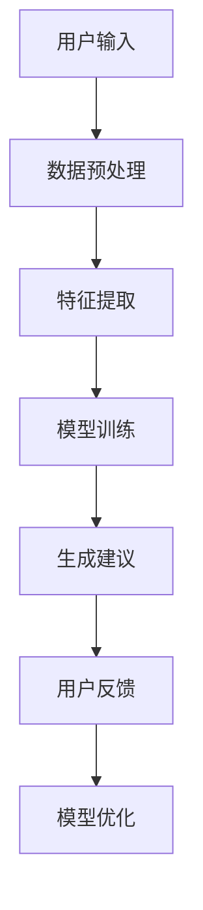
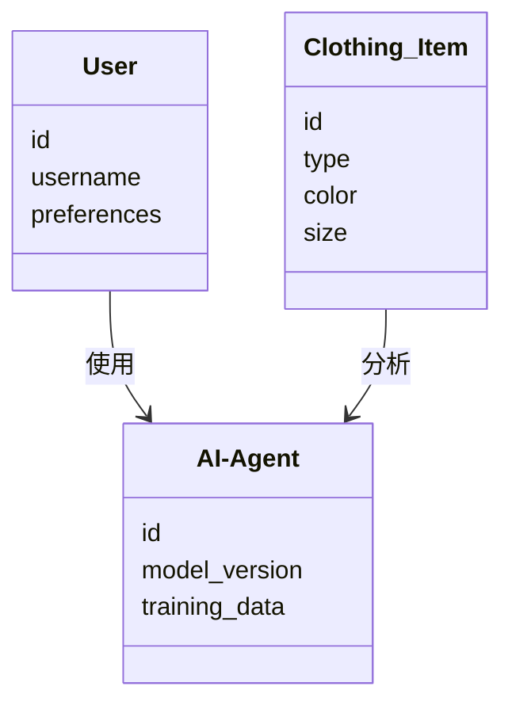

                 


# AI Agent在智能衣架中的穿搭灵感生成器

## 关键词：AI Agent，智能衣架，穿搭灵感生成器，服装搭配，人工智能算法，推荐系统

## 摘要：  
本文探讨AI Agent在智能衣架中的穿搭灵感生成器的应用，分析其核心算法和系统架构，展示如何通过生成式AI和推荐系统为用户提供个性化服装搭配建议。文章从问题背景、核心概念、算法原理到系统设计和项目实战，全面解析该技术的实现过程。

---

# 第一部分: AI Agent在智能衣架中的穿搭灵感生成器背景介绍

## 第1章: 问题背景与描述

### 1.1 问题背景

#### 1.1.1 当代服装搭配的痛点
现代人面临服装搭配的难题，尤其是选择合适的衣物组合。用户常常在衣柜中拥有大量衣物，但缺乏有效的方法来搭配出合适的造型。此外，时尚趋势的快速变化使得用户难以跟上潮流。

#### 1.1.2 智能衣架的市场需求
随着智能家居和物联网技术的发展，智能衣架逐渐成为一种趋势。用户希望衣架不仅仅是挂衣服的工具，还能提供智能化的服务，如自动分类、推荐搭配等。

#### 1.1.3 AI技术在服装搭配中的应用潜力
AI技术，特别是生成式AI和推荐系统，为服装搭配提供了新的可能性。AI可以通过分析用户的历史穿搭、颜色偏好、身材特征等信息，生成个性化的搭配建议。

### 1.2 问题描述

#### 1.2.1 用户需求分析
用户希望智能衣架能够根据他们的喜好和衣柜中的衣物，推荐合适的搭配方案。此外，用户还希望系统能够提供实时的时尚趋势建议。

#### 1.2.2 现有解决方案的局限性
现有的服装搭配工具多为手动输入或简单的规则匹配，缺乏智能化和个性化。此外，这些工具通常无法与智能设备（如智能衣架）无缝集成。

#### 1.2.3 AI Agent在智能衣架中的角色定位
AI Agent在智能衣架中扮演着关键角色，负责接收用户的输入、分析数据、生成搭配建议，并通过智能衣架的硬件进行反馈。

### 1.3 问题解决思路

#### 1.3.1 AI Agent的核心功能
AI Agent需要具备数据采集、分析、生成建议和反馈的能力。它能够从用户的衣柜数据、历史穿搭记录和时尚趋势中提取有用的信息。

#### 1.3.2 穿搭灵感生成器的设计目标
穿搭灵感生成器的目标是为用户提供个性化、多样化的搭配建议，同时考虑衣物的材质、颜色和场合等因素。

#### 1.3.3 系统架构的整体思路
系统架构需要整合AI Agent、用户数据、智能衣架硬件和用户界面，确保各模块之间的高效协同。

### 1.4 边界与外延

#### 1.4.1 系统功能的边界
系统的功能包括数据采集、搭配建议生成、反馈和学习，但不包括衣物的物理操作（如悬挂、取出）。

#### 1.4.2 穿搭建议的适用范围
穿搭建议适用于日常服装搭配，但不包括特殊场合（如婚礼、晚宴）的搭配需求。

#### 1.4.3 系统与其他模块的交互边界
系统通过API与其他模块（如智能衣架硬件、用户界面）交互，确保数据的实时传输和处理。

### 1.5 核心概念与组成

#### 1.5.1 AI Agent的定义与属性
AI Agent是一种智能代理，能够根据用户的输入和环境数据，生成相应的输出。其属性包括数据采集能力、数据分析能力、生成建议能力和自适应能力。

#### 1.5.2 穿搭生成器的组成要素
穿搭生成器由数据采集模块、数据分析模块、搭配生成模块和反馈模块组成。这些模块协同工作，为用户提供搭配建议。

#### 1.5.3 系统核心模块的结构关系
系统核心模块包括AI Agent、用户数据、搭配建议和反馈。这些模块之间的关系通过Mermaid图展示，确保逻辑清晰。

---

## 第2章: 核心概念与联系

### 2.1 AI Agent与穿搭生成器的关系

#### 2.1.1 AI Agent在穿搭生成中的作用
AI Agent负责接收用户的输入、分析数据，并生成搭配建议。它通过生成式AI和推荐系统为用户提供个性化的建议。

#### 2.1.2 穿搭生成器的实现方式
穿搭生成器通过分析用户的衣柜数据、历史穿搭记录和时尚趋势，利用生成式AI生成多样化的搭配建议。

#### 2.1.3 两者之间的协同机制
AI Agent与穿搭生成器协同工作，AI Agent负责数据处理和建议生成，穿搭生成器负责呈现建议并收集用户的反馈。

### 2.2 核心概念属性对比

#### 2.2.1 AI Agent的核心属性
- 数据采集能力
- 数据分析能力
- 生成建议能力
- 自适应能力

#### 2.2.2 穿搭生成器的功能属性
- 数据分析能力
- 生成建议能力
- 用户反馈能力
- 实时更新能力

#### 2.2.3 两者属性的对比分析
AI Agent和穿搭生成器在数据处理和生成建议方面有相似之处，但在具体功能和实现方式上有差异。

### 2.3 ER实体关系图

```mermaid
erDiagram
    user {
        id
        username
        preferences
    }
    clothing_item {
        id
        type
        color
        size
    }
    ai_agent {
        id
        model_version
        training_data
    }
    interaction {
        id
        user_id
        item_id
        timestamp
    }
    user --> ai_agent: 使用
    clothing_item --> ai_agent: 分析
    interaction --> user: 记录
    interaction --> clothing_item: 记录
```

---

## 第3章: 算法原理讲解

### 3.1 生成式AI的原理

#### 3.1.1 生成式AI的基本概念
生成式AI是一种能够生成新内容的人工智能技术，常用于图像生成、文本生成等领域。

#### 3.1.2 生成式AI的数学模型
生成式AI的核心是生成对抗网络（GAN），包括生成器和判别器两个部分。生成器通过对抗训练生成逼真的数据，判别器则区分真实数据和生成数据。

#### 3.1.3 生成式AI的应用场景
在服装搭配中，生成式AI可以用于生成多样化的搭配方案，帮助用户快速找到合适的衣物组合。

### 3.2 推荐系统的数学模型

#### 3.2.1 推荐系统的基本原理
推荐系统通过分析用户的偏好和行为，为用户提供个性化的推荐结果。

#### 3.2.2 推荐系统的数学模型
推荐系统常用的模型包括协同过滤、基于内容的推荐和混合推荐。这些模型通过分析用户数据和物品数据，生成推荐列表。

#### 3.2.3 推荐系统的优化方法
推荐系统的优化方法包括提升算法精度、减少计算复杂度和增加实时性等。

### 3.3 算法实现的流程

#### 3.3.1 算法流程图


#### 3.3.2 Python代码实现
```python
import numpy as np
from tensorflow.keras import layers, Model

def build_generator():
    # 定义生成器模型
    input_layer = layers.Input(shape=(100,))
    dense_layer = layers.Dense(256, activation='relu')(input_layer)
    output_layer = layers.Dense(2, activation='sigmoid')(dense_layer)
    return Model(inputs=input_layer, outputs=output_layer)

def build_discriminator():
    # 定义判别器模型
    input_layer = layers.Input(shape=(2,))
    dense_layer = layers.Dense(256, activation='relu')(input_layer)
    output_layer = layers.Dense(1, activation='sigmoid')(dense_layer)
    return Model(inputs=input_layer, outputs=output_layer)

generator = build_generator()
discriminator = build_discriminator()
```

### 3.4 数学公式与算法细节

#### 3.4.1 生成器的损失函数
生成器的损失函数是交叉熵损失，用于衡量生成数据与真实数据的差异。
$$ L_g = -\log(D(G(z))) $$

#### 3.4.2 判别器的损失函数
判别器的损失函数也是交叉熵损失，用于衡量其区分真实数据和生成数据的能力。
$$ L_d = -\log(D(x)) - \log(1-D(G(z))) $$

#### 3.4.3 模型训练的优化策略
模型训练采用Adam优化器，学习率设置为0.0002，动量系数为0.5。
$$ \text{Adam}( \theta, \alpha=0.0002, \beta_1=0.5) $$

---

## 第4章: 系统分析与架构设计

### 4.1 系统功能设计

#### 4.1.1 领域模型设计


#### 4.1.2 系统架构设计


#### 4.1.3 接口设计
系统接口包括用户输入接口、数据接口和反馈接口。用户输入接口接收用户的衣柜数据，数据接口与AI Agent交互，反馈接口接收用户的反馈并优化模型。

#### 4.1.4 交互流程
```mermaid
sequenceDiagram
    用户 --> AI-Agent: 提供衣柜数据
    AI-Agent --> 推荐系统: 分析数据
    推荐系统 --> 智能衣架: 生成建议
    用户 <-- 智能衣架: 查看建议
    用户 --> AI-Agent: 提供反馈
    AI-Agent --> 推荐系统: 优化模型
```

### 4.2 项目介绍

#### 4.2.1 项目目标
项目的目的是通过AI Agent和智能衣架的结合，为用户提供个性化的服装搭配建议。

#### 4.2.2 项目实现方案
项目采用生成式AI和推荐系统，结合智能衣架的硬件和用户界面，实现智能化的服装搭配建议。

### 4.3 系统功能设计

#### 4.3.1 领域模型设计
领域模型包括用户、衣物和AI Agent三个核心类。用户类包含用户的ID、用户名和偏好，衣物类包含衣物的ID、类型、颜色和尺寸，AI Agent类包含模型版本和训练数据。

#### 4.3.2 系统架构设计
系统架构包括用户界面、AI Agent、推荐系统和智能衣架四个部分。用户界面接收用户的输入，AI Agent进行数据分析，推荐系统生成搭配建议，智能衣架向用户展示建议。

#### 4.3.3 系统接口设计
系统接口包括用户输入接口、数据接口和反馈接口。用户输入接口接收用户的衣柜数据，数据接口与AI Agent交互，反馈接口接收用户的反馈并优化模型。

#### 4.3.4 系统交互流程
用户向AI Agent提供衣柜数据，AI Agent分析数据并传递给推荐系统，推荐系统生成搭配建议并通过智能衣架展示给用户。用户查看建议后提供反馈，AI Agent根据反馈优化模型。

### 4.4 项目实战

#### 4.4.1 环境安装与配置
用户需要安装Python、TensorFlow和Keras等工具，配置开发环境。

#### 4.4.2 核心功能实现
实现AI Agent和推荐系统的功能，包括数据预处理、模型训练和生成建议。

#### 4.4.3 代码实现与解读
提供Python代码示例，解读代码的功能和实现细节。

#### 4.4.4 项目应用与分析
分析项目的实际应用，展示AI Agent在智能衣架中的穿搭灵感生成器的效果和优势。

#### 4.4.5 项目小结
总结项目的实现过程，指出项目的成功之处和需要改进的地方。

### 4.5 最佳实践

#### 4.5.1 技术实现上的注意事项
在技术实现上，需要注意数据隐私保护、模型的实时性和准确性。

#### 4.5.2 系统设计上的优化建议
系统设计上，建议采用模块化设计，确保各模块之间的独立性和可扩展性。

#### 4.5.3 项目实施中的常见问题与解决方案
在项目实施中，常见问题包括数据不足、模型训练时间过长等，解决方案包括数据增强、优化算法等。

#### 4.5.4 针对用户的使用建议
建议用户定期更新衣柜数据，确保搭配建议的准确性。

---

## 第5章: 总结与展望

### 5.1 项目总结

#### 5.1.1 项目背景
项目旨在通过AI Agent和智能衣架的结合，为用户提供个性化的服装搭配建议。

#### 5.1.2 核心成果
项目实现了AI Agent和推荐系统的功能，成功生成了个性化的搭配建议，并通过智能衣架展示给用户。

#### 5.1.3 经验总结
在项目实施过程中，我们积累了宝贵的经验，包括数据处理、模型优化和系统设计等方面。

### 5.2 项目小结

#### 5.2.1 核心优势
项目的最大优势在于AI Agent的强大数据分析能力和推荐系统的高效性。

#### 5.2.2 项目不足
项目的不足之处在于模型的实时性和准确性还有提升空间。

### 5.3 未来展望

#### 5.3.1 技术优化方向
未来可以进一步优化模型，提高生成建议的多样性和准确性。

#### 5.3.2 功能扩展方向
可以考虑扩展功能，如支持多语言、多场景的搭配建议。

#### 5.3.3 应用场景扩展
未来可以将该技术应用于更多领域，如虚拟试衣、在线购物助手等。

### 5.4 注意事项

#### 5.4.1 数据隐私保护
在实际应用中，需要注意用户数据的隐私保护，避免数据泄露。

#### 5.4.2 系统稳定性保障
确保系统的稳定性和可靠性，避免因技术故障影响用户体验。

#### 5.4.3 用户体验优化
不断优化用户体验，确保用户能够轻松使用系统并获得满意的搭配建议。

### 5.5 拓展阅读

#### 5.5.1 推荐系统领域的最新研究
推荐系统领域有许多最新的研究，如深度学习推荐系统、强化学习推荐系统等。

#### 5.5.2 生成式AI的前沿技术
生成式AI的前沿技术包括更大规模的模型、多模态生成等。

#### 5.5.3 相关技术书籍与资源
推荐相关的书籍和资源，帮助读者深入学习AI Agent和生成式AI的技术。

---

## 作者：AI天才研究院/AI Genius Institute & 禅与计算机程序设计艺术/Zen And The Art of Computer Programming

---

通过以上结构，我们可以系统地分析和实现AI Agent在智能衣架中的穿搭灵感生成器。从背景介绍到项目实战，每一步都详细展开，确保读者能够全面理解该技术的实现过程和应用价值。

