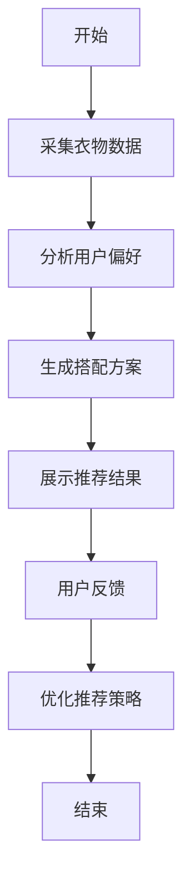
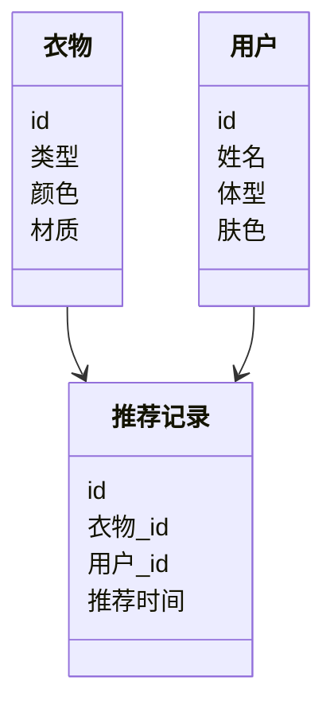
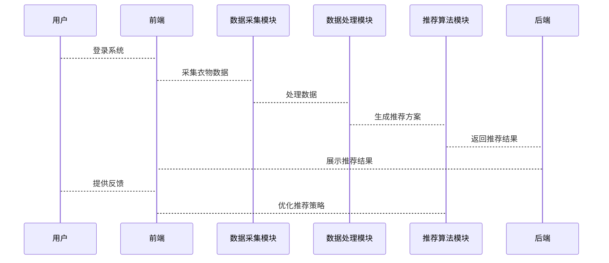

                 


# AI Agent在智能衣架中的衣物搭配建议

## 关键词：AI Agent, 智能衣架, 衣物搭配, 推荐算法, 系统架构, 项目实战

## 摘要：本文探讨AI Agent在智能衣架中的应用，分析衣物搭配的智能化路径。通过详细讲解AI Agent的核心原理、推荐算法、系统架构设计和项目实战，提供全面的技术分析和实践指导。文章还总结了最佳实践，为读者提供深入的见解和实用建议。

---

# 第1章: 背景介绍

## 1.1 问题背景

### 1.1.1 智能衣架的定义与现状
智能衣架是一种结合物联网技术的衣物管理设备，能够通过传感器和AI技术提供智能化的衣物存储和搭配建议。随着智能服装市场的快速发展，用户对衣物搭配的需求日益增长，智能衣架成为提升穿衣效率的重要工具。

### 1.1.2 用户需求与痛点分析
用户在选择衣物搭配时常常面临以下问题：
- **信息过载**：用户拥有大量衣物，难以快速找到合适的搭配。
- **时间效率**：每天搭配衣物耗时耗力，尤其是在早晨通勤高峰期。
- **个性化需求**：每个人的体型、肤色和风格偏好不同，通用的搭配方案难以满足个性化需求。
- **数据分散**：衣物信息分散在衣柜的不同位置，难以系统化管理。

### 1.1.3 AI Agent在衣物搭配中的应用价值
AI Agent（人工智能代理）能够通过分析用户的穿衣习惯、肤色、体型和当前天气，推荐合适的衣物搭配。通过整合用户的衣物数据和实时环境信息，AI Agent能够提供个性化的搭配建议，帮助用户快速找到合适的衣物组合。

---

## 1.2 问题描述

### 1.2.1 衣物搭配的核心问题
AI Agent需要解决的核心问题包括：
1. 如何准确识别衣物的种类、颜色和材质。
2. 如何分析用户的穿衣习惯和偏好。
3. 如何根据当前天气、场合推荐合适的搭配方案。

### 1.2.2 用户行为与偏好分析
用户的穿衣习惯可以通过以下数据进行分析：
- **历史数据**：用户过去搭配的衣物记录。
- **偏好数据**：用户喜欢的品牌、颜色和风格。
- **行为数据**：用户在特定场合下的穿衣习惯。

### 1.2.3 现有解决方案的不足
现有解决方案主要依赖于手动分类和简单的规则推荐，难以满足用户的个性化需求。例如：
- **手动分类**：用户需要手动记录衣物信息，效率低且容易出错。
- **规则推荐**：基于固定规则的推荐系统难以适应用户的个性化需求。
- **缺乏实时反馈**：无法根据用户反馈实时调整推荐策略。

---

## 1.3 问题解决

### 1.3.1 AI Agent的核心作用
AI Agent通过以下方式解决衣物搭配问题：
1. **数据采集与分析**：AI Agent可以自动采集用户的衣物数据和行为数据。
2. **个性化推荐**：基于用户数据和环境信息，AI Agent提供个性化的搭配建议。
3. **实时反馈**：用户对推荐的反馈可以实时优化AI Agent的推荐策略。

### 1.3.2 衣物搭配的智能化路径
智能化路径包括以下几个步骤：
1. **数据采集**：通过传感器和摄像头采集衣物信息和用户行为。
2. **数据处理**：对数据进行清洗和特征提取。
3. **模型训练**：基于机器学习算法训练推荐模型。
4. **推荐生成**：根据用户需求生成推荐方案。

### 1.3.3 解决方案的可行性分析
AI Agent在智能衣架中的应用具有较高的可行性：
- **技术可行性**：现有的机器学习和自然语言处理技术能够支持衣物搭配的推荐。
- **市场可行性**：智能衣架市场逐渐扩大，用户需求旺盛。
- **经济可行性**：AI技术的成熟和硬件成本的下降使得解决方案更具经济性。

---

## 1.4 边界与外延

### 1.4.1 系统功能的边界
系统功能的边界包括：
- **数据采集**：仅限于衣物和用户行为数据。
- **推荐范围**：仅限于衣物搭配建议，不涉及其他领域。
- **用户交互**：仅限于通过智能衣架进行交互。

### 1.4.2 外延功能的扩展性
外延功能的扩展性包括：
- **社交网络集成**：用户可以分享搭配方案到社交平台。
- **品牌推荐**：根据用户的偏好推荐特定品牌或单品。
- **购物助手**：根据用户的搭配需求推荐购买建议。

### 1.4.3 与其他系统的接口定义
与其他系统的接口包括：
- **天气预报接口**：获取实时天气数据。
- **用户数据库接口**：获取用户的个人信息和偏好。
- **支付系统接口**：支持在线购买推荐的衣物。

---

## 1.5 概念结构与核心要素

### 1.5.1 系统架构的核心要素
系统架构的核心要素包括：
1. **数据采集模块**：负责采集衣物和用户数据。
2. **数据处理模块**：对数据进行清洗和特征提取。
3. **推荐算法模块**：基于机器学习算法生成推荐方案。
4. **用户交互模块**：与用户进行交互并展示推荐结果。

### 1.5.2 AI Agent的组成与功能
AI Agent的组成包括：
1. **感知模块**：感知用户需求和环境信息。
2. **决策模块**：基于感知信息做出搭配决策。
3. **执行模块**：将决策结果转化为具体的搭配建议。

### 1.5.3 衣物搭配的逻辑模型
衣物搭配的逻辑模型包括：
1. **特征提取**：提取衣物的颜色、材质和风格特征。
2. **用户画像**：构建用户的穿衣偏好模型。
3. **搭配规则**：基于特征和用户画像生成搭配规则。

---

## 1.6 概念属性对比表
以下是AI Agent和传统推荐系统的属性对比：

| 属性               | AI Agent                     | 传统推荐系统             |
|--------------------|------------------------------|--------------------------|
| 数据来源           | 用户行为、环境数据           | 用户历史数据             |
| 推荐策略           | 动态调整、个性化推荐           | 静态规则、通用推荐         |
| 交互方式           | 实时反馈、动态调整           | 单向推荐、无反馈           |
| 智能水平           | 高，具备学习和优化能力         | 低，基于固定规则           |

---

## 1.7 ER实体关系图
以下是智能衣架系统的ER实体关系图：

```mermaid
erDiagram
    class 衣物 {
        id int
        类型 varchar(255)
        颜色 varchar(255)
        材质 varchar(255)
    }
    class 用户 {
        id int
        姓名 varchar(255)
        体型 varchar(255)
        肤色 varchar(255)
    }
    class 推荐记录 {
        id int
        衣物_id int
        用户_id int
        推荐时间 datetime
    }
    衣物 --> 推荐记录 : "被推荐"
    用户 --> 推荐记录 : "推荐给"
```

---

## 1.8 Mermaid流程图



---

## 1.9 本章小结
本章主要介绍了AI Agent在智能衣架中的应用背景，分析了衣物搭配的核心问题和解决思路。通过对比传统推荐系统，明确了AI Agent的优势和潜力。接下来的章节将详细讲解AI Agent的核心原理和推荐算法。

---

# 第2章: 核心概念与联系

## 2.1 AI Agent的核心原理

### 2.1.1 AI Agent的基本概念
AI Agent是一种能够感知环境、自主决策并执行任务的智能体。在智能衣架中，AI Agent通过感知用户需求和环境信息，自主生成衣物搭配建议。

### 2.1.2 AI Agent的决策机制
AI Agent的决策机制包括：
1. **感知**：通过传感器和摄像头感知用户需求和环境信息。
2. **分析**：基于感知信息分析用户的穿衣偏好和搭配需求。
3. **决策**：根据分析结果生成推荐方案。
4. **反馈**：根据用户的反馈调整推荐策略。

### 2.1.3 AI Agent的学习与优化
AI Agent通过以下方式不断优化推荐策略：
1. **监督学习**：基于用户的反馈调整推荐模型。
2. **强化学习**：通过奖励机制优化推荐策略。
3. **无监督学习**：基于用户行为数据发现新的搭配模式。

---

## 2.2 智能衣架的核心要素

### 2.2.1 衣物数据的特征提取
衣物数据的特征包括：
1. **颜色**：如白色、黑色、红色等。
2. **材质**：如棉、麻、羊毛、合成纤维等。
3. **类型**：如衬衫、裤子、外套、鞋子等。
4. **风格**：如休闲、正式、运动、时尚等。

### 2.2.2 用户行为的特征提取
用户行为的特征包括：
1. **体型**：如瘦型、中等体型、肥胖体型等。
2. **肤色**：如浅色、中等肤色、深色等。
3. **穿衣偏好**：如喜欢的颜色、品牌、风格等。
4. **场合偏好**：如工作日、周末、正式场合等。

### 2.2.3 系统的交互流程
系统的交互流程包括：
1. **用户登录**：用户通过智能衣架登录系统。
2. **数据采集**：系统采集用户的衣物数据和行为数据。
3. **推荐生成**：系统根据用户数据生成搭配建议。
4. **用户反馈**：用户对推荐结果进行反馈。
5. **优化策略**：系统根据反馈优化推荐模型。

---

## 2.3 核心概念的联系

### 2.3.1 AI Agent与衣物数据的关系
AI Agent通过分析衣物数据生成推荐方案。衣物数据包括颜色、材质和类型等特征，这些特征是AI Agent生成推荐方案的基础。

### 2.3.2 用户行为与系统推荐的关联
用户的穿衣习惯和偏好是系统推荐的核心依据。AI Agent通过分析用户行为数据，优化推荐策略，提高推荐的精准度。

### 2.3.3 系统功能与架构设计的整合
系统的功能模块需要在架构设计中进行整合。例如，数据采集模块需要与推荐算法模块协同工作，确保数据的实时性和准确性。

---

## 2.4 本章小结
本章详细讲解了AI Agent的核心原理和智能衣架的核心要素，分析了系统各部分之间的联系。通过对比和分析，明确了AI Agent在衣物搭配中的重要作用。接下来的章节将详细讲解推荐算法和系统架构设计。

---

## 2.5 本章思考与练习
1. **思考**：AI Agent在智能衣架中的应用有哪些潜在挑战？
2. **练习**：尝试设计一个简单的衣物特征提取模型。

---

# 第3章: 算法原理讲解

## 3.1 推荐算法的核心原理

### 3.1.1 协同过滤算法
协同过滤算法是一种基于用户相似性或物品相似性的推荐算法。在智能衣架中，协同过滤算法可以通过分析用户的穿衣习惯和偏好，找到与当前用户相似的用户群体，推荐他们喜欢的衣物搭配方案。

### 3.1.2 基于内容的推荐算法
基于内容的推荐算法是通过分析衣物的特征（如颜色、材质、类型等），找到与用户偏好相似的衣物进行推荐。这种方法能够提高推荐的准确性，但需要大量的特征数据支持。

### 3.1.3 混合推荐模型
混合推荐模型是将协同过滤和基于内容的推荐算法结合起来，利用两种算法的优点，提高推荐的多样性和准确性。在智能衣架中，混合推荐模型可以更好地满足用户的个性化需求。

---

## 3.2 算法实现步骤

### 3.2.1 数据预处理
数据预处理是推荐算法实现的基础，主要包括：
1. **数据清洗**：去除无效数据和异常值。
2. **特征提取**：提取衣物的颜色、材质、类型等特征。
3. **数据归一化**：对数据进行标准化处理，确保不同特征的可比性。

### 3.2.2 模型训练
模型训练是推荐算法的核心，主要包括：
1. **选择算法**：根据具体需求选择合适的推荐算法。
2. **参数调整**：通过交叉验证调整模型的参数，优化模型性能。
3. **训练模型**：利用训练数据训练模型，得到推荐模型。

### 3.2.3 推荐结果生成
推荐结果生成是模型应用的最后一步，主要包括：
1. **生成候选列表**：根据模型预测结果生成候选衣物搭配方案。
2. **排序和筛选**：根据用户的偏好对候选方案进行排序和筛选。
3. **展示结果**：将推荐结果展示给用户，供用户选择和反馈。

---

## 3.3 算法优化与调优

### 3.3.1 参数调整
推荐算法的性能通常依赖于多个参数，如协同过滤算法中的相似度计算参数、基于内容的推荐算法中的特征权重参数等。通过调整这些参数，可以优化模型的性能。

### 3.3.2 模型评估
模型评估是算法优化的重要步骤，主要包括：
1. **评估指标**：如准确率、召回率、F1值等。
2. **交叉验证**：通过交叉验证评估模型的泛化能力。
3. **对比实验**：将不同算法的性能进行对比，选择最优算法。

### 3.3.3 模型调优
模型调优是通过多次实验和参数调整，优化模型的性能。在智能衣架中，可以通过A/B测试等方式，验证不同算法的效果，选择最优的推荐策略。

---

## 3.4 本章小结
本章详细讲解了推荐算法的核心原理和实现步骤，分析了协同过滤、基于内容的推荐和混合推荐模型的优缺点。通过数据预处理、模型训练和结果生成，展示了如何实现个性化的衣物搭配推荐。接下来的章节将详细讲解系统架构设计和项目实战。

---

## 3.5 本章思考与练习
1. **思考**：协同过滤和基于内容的推荐算法在实际应用中有何优缺点？
2. **练习**：尝试实现一个简单的协同过滤算法，对用户数据进行分析。

---

# 第4章: 系统分析与架构设计

## 4.1 项目介绍

### 4.1.1 项目背景
智能衣架项目旨在通过AI Agent技术，为用户提供个性化的衣物搭配建议。项目的目标是通过智能传感器和机器学习算法，实现衣物的智能化管理和推荐。

### 4.1.2 项目目标
项目目标包括：
1. **智能化管理**：实现衣物的智能化存储和管理。
2. **个性化推荐**：为用户提供个性化的衣物搭配建议。
3. **实时反馈**：根据用户反馈实时优化推荐策略。

### 4.1.3 项目范围
项目范围包括：
1. **数据采集**：采集用户的衣物数据和行为数据。
2. **推荐系统**：实现基于机器学习的推荐算法。
3. **用户交互**：设计友好的用户交互界面。

---

## 4.2 系统功能设计

### 4.2.1 领域模型
以下是智能衣架系统的领域模型：



### 4.2.2 功能模块
系统功能模块包括：
1. **数据采集模块**：负责采集衣物和用户数据。
2. **数据处理模块**：对数据进行清洗和特征提取。
3. **推荐算法模块**：基于机器学习算法生成推荐方案。
4. **用户交互模块**：与用户进行交互并展示推荐结果。

---

## 4.3 系统架构设计

### 4.3.1 系统架构图
以下是智能衣架系统的架构图：


### 4.3.2 模块功能描述
模块功能描述包括：
1. **前端**：负责用户界面的展示和交互。
2. **数据采集模块**：通过传感器和摄像头采集衣物和用户数据。
3. **数据处理模块**：对数据进行清洗和特征提取。
4. **推荐算法模块**：基于机器学习算法生成推荐方案。
5. **后端**：负责处理推荐结果并返回给前端。

---

## 4.4 接口设计

### 4.4.1 接口定义
接口定义包括：
1. **数据采集接口**：用于采集衣物和用户数据。
2. **推荐接口**：用于生成推荐方案。
3. **反馈接口**：用于接收用户的反馈。

### 4.4.2 接口协议
接口协议包括：
1. **HTTP**：用于前后端交互。
2. **MQTT**：用于传感器数据的实时传输。

---

## 4.5 交互流程图



---

## 4.6 本章小结
本章详细讲解了智能衣架系统的架构设计和功能模块，分析了系统的接口设计和交互流程。通过模块化设计和接口定义，明确了系统各部分的功能和职责。接下来的章节将详细讲解项目实战和最佳实践。

---

## 4.7 本章思考与练习
1. **思考**：如何设计一个高效的衣物数据采集模块？
2. **练习**：尝试实现一个简单的数据处理模块，对衣物数据进行特征提取。

---

# 第5章: 项目实战

## 5.1 环境安装

### 5.1.1 开发环境
开发环境包括：
1. **操作系统**：Windows 10或macOS 10.15及以上。
2. **编程语言**：Python 3.8及以上。
3. **开发工具**：PyCharm或VS Code。
4. **依赖库**：numpy、pandas、scikit-learn、flask、mermaid等。

### 5.1.2 硬件要求
硬件要求包括：
1. **处理器**：Intel i5或更高。
2. **内存**：8GB及以上。
3. **存储**：至少500GB可用空间。

---

## 5.2 核心代码实现

### 5.2.1 数据采集模块
以下是数据采集模块的代码实现：

```python
import pandas as pd
import numpy as np

def load_data(file_path):
    # 读取数据
    data = pd.read_csv(file_path)
    # 数据清洗
    data = data.dropna()
    # 特征提取
    features = data[['颜色', '材质', '类型']]
    return features
```

### 5.2.2 数据处理模块
以下是数据处理模块的代码实现：

```python
from sklearn.preprocessing import StandardScaler

def preprocess_data(features):
    # 数据归一化
    scaler = StandardScaler()
    features_normalized = scaler.fit_transform(features)
    return features_normalized
```

### 5.2.3 推荐算法模块
以下是推荐算法模块的代码实现：

```python
from sklearn.neighbors import NearestNeighbors

def train_model(features_normalized):
    # 训练模型
    model = NearestNeighbors(n_neighbors=5, algorithm='ball_tree').fit(features_normalized)
    return model

def generate_recommendations(model, features_normalized, indices):
    # 生成推荐
    distances, indices = model.kneighbors(features_normalized[indices])
    return indices
```

### 5.2.4 用户交互模块
以下是用户交互模块的代码实现：

```python
from flask import Flask, request, jsonify

app = Flask(__name__)

@app.route('/recommend', methods=['POST'])
def recommend():
    data = request.json
    features = data['features']
    model = train_model(preprocess_data(features))
    recommendations = generate_recommendations(model, preprocess_data(features), [0])
    return jsonify({'recommendations': recommendations.tolist()})

if __name__ == '__main__':
    app.run(debug=True)
```

---

## 5.3 代码解读与分析

### 5.3.1 数据采集模块
数据采集模块负责从CSV文件中读取衣物数据，并进行数据清洗和特征提取。代码中使用了pandas库，读取数据后删除缺失值，并提取颜色、材质和类型三个特征。

### 5.3.2 数据处理模块
数据处理模块对提取的特征进行归一化处理，确保不同特征的可比性。代码中使用了scikit-learn库中的StandardScaler进行归一化处理。

### 5.3.3 推荐算法模块
推荐算法模块使用k-近邻算法（kNN）训练模型，并生成推荐结果。代码中使用了scikit-learn库中的NearestNeighbors进行模型训练和推荐生成。

### 5.3.4 用户交互模块
用户交互模块通过Flask框架实现API接口，接收用户的衣物数据并返回推荐结果。代码中定义了一个/recommend接口，接收JSON格式的数据，训练模型并返回推荐结果。

---

## 5.4 案例分析与详细解读

### 5.4.1 案例分析
假设用户上传了一件白色的棉质衬衫，系统会根据用户的体型、肤色和场合偏好，推荐适合的下装和鞋子。推荐结果可能包括：
- **下装**：深蓝色的棉质裤子。
- **鞋子**：白色运动鞋。

### 5.4.2 代码实现分析
通过分析代码实现，可以看出系统通过数据采集、处理、训练和推荐四个步骤，实现了个性化的衣物搭配推荐。用户可以通过API接口与系统交互，获取推荐结果。

---

## 5.5 本章小结
本章通过实际项目实战，详细讲解了智能衣架系统的实现过程。从环境安装到代码实现，展示了如何通过Python和相关库实现推荐系统。通过案例分析和代码解读，帮助读者更好地理解系统的实现细节。

---

## 5.6 本章思考与练习
1. **思考**：如何优化推荐算法的性能？
2. **练习**：尝试实现一个基于内容的推荐算法，对比协同过滤算法的效果。

---

# 第6章: 最佳实践与总结

## 6.1 最佳实践

### 6.1.1 数据质量管理
数据质量是推荐系统的核心，建议在数据采集和处理阶段，严格控制数据的质量，确保数据的准确性和完整性。

### 6.1.2 模型优化策略
在模型优化过程中，可以通过A/B测试等方式，对比不同算法的效果，选择最优的推荐策略。

### 6.1.3 用户隐私保护
在数据采集和处理过程中，必须严格遵守用户隐私保护的相关法律法规，确保用户数据的安全性。

### 6.1.4 系统可扩展性
系统设计时应考虑可扩展性，以便在未来扩展更多的功能和服务。

---

## 6.2 小结
通过本文的详细讲解，读者可以全面了解AI Agent在智能衣架中的应用，掌握推荐算法的核心原理和系统架构设计。通过项目实战，读者可以进一步加深对系统的理解和应用能力。

---

## 6.3 注意事项
1. **数据安全**：确保用户数据的安全性，防止数据泄露。
2. **算法优化**：持续优化推荐算法，提高推荐的准确性和多样性。
3. **系统维护**：定期维护和更新系统，确保系统的稳定性和可靠性。

---

## 6.4 拓展阅读
1. **推荐系统**：深入学习推荐系统的相关知识，了解更多的推荐算法和应用场景。
2. **机器学习**：进一步学习机器学习的相关知识，掌握更多的机器学习算法和技巧。
3. **智能系统设计**：学习智能系统的设计方法，提升系统设计能力。

---

## 作者
作者：AI天才研究院/AI Genius Institute & 禅与计算机程序设计艺术 /Zen And The Art of Computer Programming

