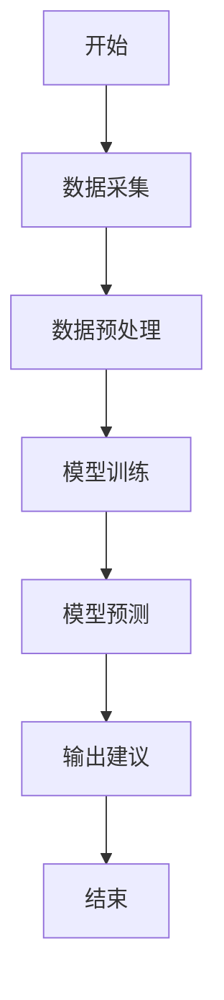
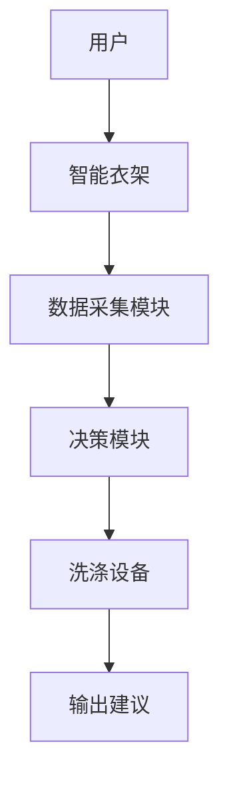

                 


# AI Agent在智能衣架中的衣物清洁建议

> 关键词：AI Agent, 智能衣架, 衣物清洁, 人工智能, 物联网, 算法设计

> 摘要：本文将探讨AI Agent在智能衣架中的衣物清洁建议，从AI Agent的基本概念到其在衣物清洁中的算法原理，再到系统架构设计和项目实战，详细分析AI Agent在智能衣架中的应用。通过理论分析和实际案例相结合的方式，深入探讨AI Agent在智能衣架中的衣物清洁建议的实现过程。

---

## 第1章: AI Agent与智能衣架概述

### 1.1 AI Agent的基本概念
- 1.1.1 AI Agent的定义与特点
  - AI Agent的定义：人工智能代理（AI Agent）是指能够感知环境、自主决策并执行任务的智能实体。
  - AI Agent的特点：智能性、自主性、反应性、社交性、学习能力。
- 1.1.2 AI Agent的核心功能与应用场景
  - 核心功能：感知、决策、执行、学习与优化。
  - 应用场景：智能衣架、智能家居、自动驾驶、智能客服。
- 1.1.3 AI Agent在智能衣架中的应用潜力
  - 提供衣物清洁建议、优化洗涤流程、个性化衣物管理。

### 1.2 智能衣架的定义与特点
- 1.2.1 智能衣架的基本概念
  - 智能衣架：集成了物联网技术，能够感知衣物状态、环境条件并提供智能化管理的衣架。
- 1.2.2 智能衣架的功能模块与技术实现
  - 感知模块：温度、湿度、污渍检测。
  - 决策模块：洗涤建议、衣物分类。
  - 执行模块：智能洗涤设备控制。
- 1.2.3 智能衣架的市场现状与发展趋势
  - 市场现状：智能衣架逐渐普及，AI技术的应用日益广泛。
  - 发展趋势：智能化、个性化、环保化。

---

## 第2章: AI Agent在衣物清洁中的核心问题

### 2.1 衣物清洁问题的背景与挑战
- 2.1.1 衣物清洁的基本流程与痛点
  - 洗涤流程：分类、洗涤剂选择、洗涤时间、晾晒。
  - 痛点：效率低、资源浪费、个性化需求未满足。
- 2.1.2 AI Agent在衣物清洁中的问题解决思路
  - 智能分类、智能洗涤剂推荐、智能洗涤时间建议。
- 2.1.3 衣物清洁问题的边界与外延
  - 边界：仅限于衣物清洁建议，不涉及实际洗涤操作。
  - 外延：扩展到衣物护理、衣物存储等领域。

### 2.2 AI Agent与衣物清洁的核心要素
- 2.2.1 AI Agent的感知能力
  - 数据来源：衣物材质、污渍类型、环境参数。
- 2.2.2 AI Agent的决策能力
  - 决策依据：历史数据、用户偏好、环境条件。
- 2.2.3 AI Agent的执行能力
  - 输出结果：洗涤建议、洗涤设备控制指令。

---

## 第3章: AI Agent在衣物清洁中的核心概念与联系

### 3.1 AI Agent的核心概念原理
- 3.1.1 AI Agent的感知模块
  - 感知方式：传感器数据采集、用户输入。
- 3.1.2 AI Agent的决策模块
  - 决策算法：基于规则的推理、机器学习模型。
- 3.1.3 AI Agent的执行模块
  - 执行方式：输出洗涤建议、控制洗涤设备。

### 3.2 核心概念属性特征对比表格
| 模块     | 属性       | 特征对比         |
|----------|------------|-----------------|
| 感知模块 | 数据来源   | 传感器数据、用户输入 |
| 决策模块 | 决策依据   | 历史数据、环境条件 |
| 执行模块 | 输出结果   | 洗涤建议、设备控制 |

### 3.3 ER实体关系图架构
```mermaid
er
  actor(AI Agent)
  actor 智能衣架
  actor 衣物
  actor 环境参数
  actor 洗涤设备
  actor 洗涤建议
```

---

## 第4章: AI Agent在衣物清洁中的算法原理

### 4.1 算法原理概述
- 4.1.1 基于规则的AI Agent算法
  - 规则定义：根据衣物材质和污渍类型推荐洗涤剂。
- 4.1.2 基于机器学习的AI Agent算法
  - 算法选择：使用决策树或随机森林进行分类。
- 4.1.3 基于深度学习的AI Agent算法
  - 算法选择：使用卷积神经网络（CNN）进行图像识别。

### 4.2 算法流程图


### 4.3 算法实现代码
```python
# 示例代码：基于规则的AI Agent算法
def recommend_wash_clothes(material, stain_type):
    # 根据衣物材质和污渍类型推荐洗涤剂
    if material == '棉' and stain_type == '油渍':
        return '强效去油污洗涤剂'
    elif material == '羊毛' and stain_type == '茶渍':
        return '羊毛专用洗涤剂'
    else:
        return '通用洗涤剂'

# 示例代码：基于机器学习的AI Agent算法
from sklearn.tree import DecisionTreeClassifier
import pandas as pd

# 数据集加载
data = pd.read_csv('clothes_data.csv')
X = data[['material', 'stain_type']]
y = data['recommended_wash']
model = DecisionTreeClassifier().fit(X, y)
```

---

## 第5章: AI Agent在衣物清洁中的系统分析与架构设计

### 5.1 系统架构概述
- 5.1.1 系统整体架构设计
  - 分层架构：感知层、决策层、执行层。
- 5.1.2 系统功能模块划分
  - 感知模块：数据采集。
  - 决策模块：算法模型。
  - 执行模块：设备控制。
- 5.1.3 系统交互流程设计
  - 用户输入 → 数据采集 → 算法决策 → 设备执行。

### 5.2 系统架构图


---

## 第6章: AI Agent在衣物清洁中的项目实战

### 6.1 环境搭建与工具安装
- 6.1.1 开发环境的搭建
  - 操作系统：Windows/Mac/Linux。
  - 开发工具：PyCharm/VS Code。
- 6.1.2 开发工具的安装与配置
  - 安装Python：3.8及以上版本。
  - 安装依赖库：Scikit-learn、TensorFlow、Mermaid。

### 6.2 系统核心实现源代码
```python
# 示例代码：AI Agent在衣物清洁中的核心实现
import numpy as np
from sklearn.tree import DecisionTreeClassifier
import pandas as pd

# 数据集加载
data = pd.read_csv('clothes_data.csv')
X = data[['material', 'stain_type']]
y = data['recommended_wash']

# 模型训练
model = DecisionTreeClassifier().fit(X, y)

# 模型预测
def predict_recommendation(material, stain_type):
    input_data = np.array([[material, stain_type]])
    prediction = model.predict(input_data)
    return prediction[0]
```

### 6.3 代码应用解读与分析
- 代码功能：根据衣物材质和污渍类型，预测推荐的洗涤剂。
- 数学模型：决策树模型，基于特征的分类。
- 实际案例分析：通过具体案例说明AI Agent如何优化衣物清洁流程。

### 6.4 项目小结
- 项目总结：AI Agent在智能衣架中的衣物清洁建议实现了智能化、个性化的管理。
- 注意事项：数据质量和算法选择对系统性能的影响。
- 拓展阅读：AI Agent在其他领域的应用。

---

## 第7章: 总结与展望

### 7.1 总结
- AI Agent在智能衣架中的衣物清洁建议，通过感知、决策和执行三个模块的协同工作，实现了智能化的衣物清洁管理。
- 核心算法包括基于规则的推理和机器学习模型，能够满足不同用户的个性化需求。

### 7.2 展望
- 未来发展方向：结合深度学习技术，进一步提升AI Agent的决策能力。
- 应用前景：AI Agent在智能衣架中的应用将更加广泛，推动衣物管理的智能化和便捷化。

---

## 作者信息

作者：AI天才研究院/AI Genius Institute & 禅与计算机程序设计艺术 /Zen And The Art of Computer Programming

