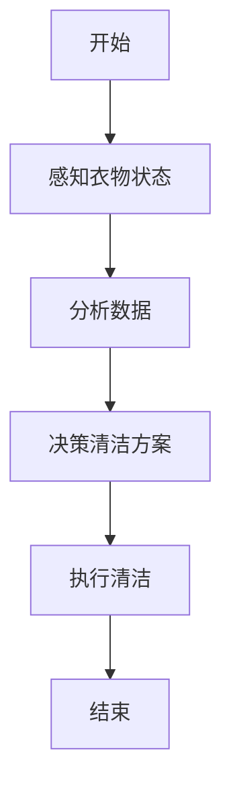
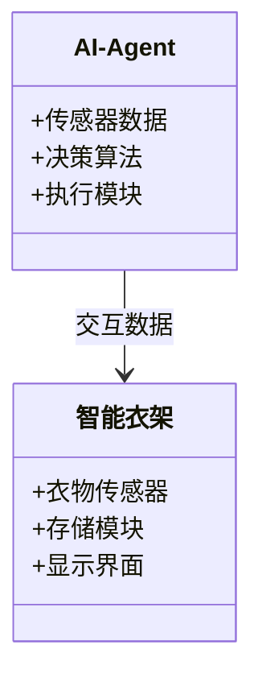
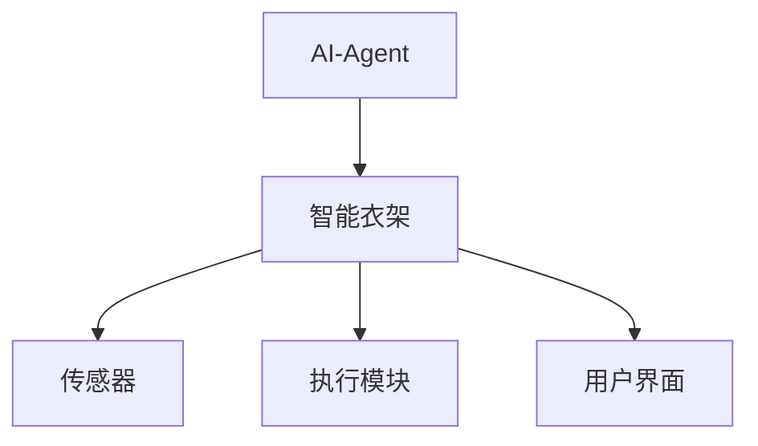
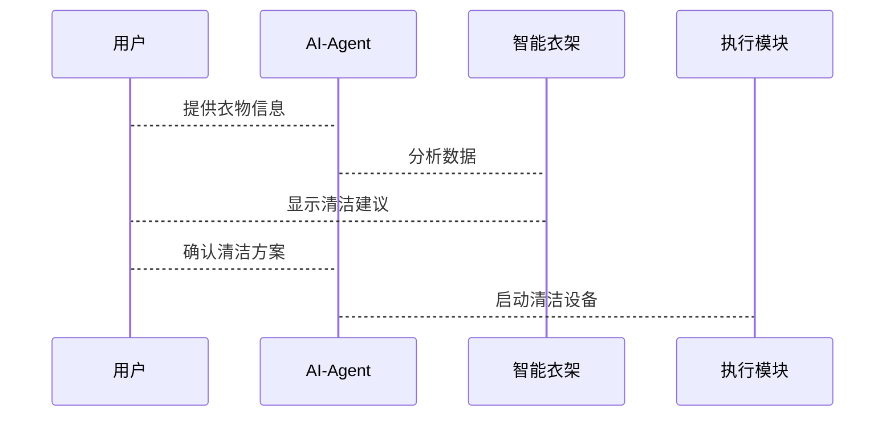

                 


# AI Agent在智能衣架中的衣物清洁建议

> 关键词：AI Agent，智能衣架，衣物清洁，人工智能，家庭自动化，物联网，智能系统

> 摘要：本文将探讨AI Agent在智能衣架中的应用，特别是在衣物清洁方面的建议。通过分析AI Agent的核心概念、算法原理、系统设计和实际案例，我们将揭示如何利用人工智能技术提升衣物清洁的效率和智能化水平。

---

## 第1章: 背景介绍

### 1.1 AI Agent与智能衣架概述

#### 1.1.1 问题背景与目标
在现代家庭中，衣物清洁是一个常见的日常任务，但传统的方法往往效率低下，且缺乏智能化。AI Agent（人工智能代理）作为一种能够感知环境、自主决策的技术，为智能衣架提供了新的可能性。我们的目标是通过AI Agent实现衣物清洁的智能化和自动化。

#### 1.1.2 智能衣架的核心概念与功能
智能衣架是一种结合物联网（IoT）和人工智能技术的衣物管理设备。它能够通过传感器感知衣物的状态（如脏污程度、材质等），并通过AI Agent提供清洁建议或自动启动清洁设备。

#### 1.1.3 AI Agent在衣物清洁中的应用价值
AI Agent可以通过分析衣物的使用频率、脏污程度和材质特性，提供个性化的清洁建议，从而延长衣物寿命，减少清洁剂的使用，降低能源消耗。

### 1.2 问题描述与解决思路

#### 1.2.1 衣物清洁的主要问题
1. **手动清洁的低效性**：传统清洁方法需要人工判断衣物的清洁需求，耗时且容易出错。
2. **清洁剂使用不当**：不同材质的衣物需要不同的清洁剂和清洁方式，错误的清洁可能导致衣物损坏。
3. **智能化不足**：缺乏智能化的管理手段，无法实时监控衣物状态并自动调整清洁策略。

#### 1.2.2 AI Agent如何解决清洁问题
AI Agent可以通过以下方式解决上述问题：
1. **实时感知**：通过传感器感知衣物的脏污程度和材质特性。
2. **智能决策**：基于感知数据，结合历史数据和用户偏好，提供个性化的清洁建议。
3. **自动化执行**：通过与智能家居设备（如洗衣机、干衣机）的联动，实现自动清洁。

#### 1.2.3 边界与外延
AI Agent在智能衣架中的应用主要集中在衣物清洁领域，但其核心算法和决策机制可以扩展到其他智能家居场景。

---

## 第2章: AI Agent的核心概念与原理

### 2.1 AI Agent的原理与算法

#### 2.1.1 AI Agent的基本原理
AI Agent是一种能够感知环境、自主决策的智能体。它通过传感器获取数据，利用算法进行分析和推理，最终做出决策并执行动作。

#### 2.1.2 常用算法与模型
1. **决策树**：用于分类和回归问题，适合处理衣物清洁的决策场景。
2. **机器学习模型**：如支持向量机（SVM）和随机森林（Random Forest），用于预测衣物的清洁需求。
3. **强化学习**：通过与环境的交互，优化清洁策略。

#### 2.1.3 算法的数学模型与公式
以决策树为例，其核心思想是通过特征选择算法（如信息增益）构建树状结构。数学模型如下：
$$
\text{信息增益} = \text{熵} - \text{条件熵}
$$

### 2.2 AI Agent的属性与特征对比

#### 2.2.1 属性对比表格
| 属性 | AI Agent | 传统清洁方法 |
|------|-----------|----------------|
| 智能性 | 高 | 低 |
| 自主性 | 高 | 低 |
| 精准性 | 高 | 中 |

#### 2.2.2 特征的优缺点分析
1. **智能性**：优点是可以实时感知和决策，缺点是需要依赖传感器和算法模型。
2. **自主性**：优点是无需人工干预，缺点是需要处理复杂的环境变量。
3. **精准性**：优点是基于数据驱动的决策，缺点是模型可能存在偏差。

---

## 第3章: AI Agent的算法原理与实现

### 3.1 算法原理与流程图

#### 3.1.1 算法流程图（Mermaid）


#### 3.1.2 算法的数学模型与公式
以随机森林为例，其数学模型如下：
$$
y = \sum_{i=1}^{n} \theta_i x_i + b
$$
其中，$\theta_i$ 是权重，$x_i$ 是特征，$b$ 是偏置。

### 3.2 算法实现与代码示例

#### 3.2.1 环境安装与配置
需要安装Python和相关库（如scikit-learn）：
```bash
pip install scikit-learn
```

#### 3.2.2 核心算法实现代码
```python
from sklearn.ensemble import RandomForestClassifier
import numpy as np

# 示例数据
X = np.array([[1, 2, 3], [4, 5, 6], [7, 8, 9]])
y = np.array([0, 1, 2])

# 训练模型
model = RandomForestClassifier()
model.fit(X, y)

# 预测
new_sample = np.array([[10, 11, 12]])
print(model.predict(new_sample))
```

#### 3.2.3 代码解读与分析
1. **数据准备**：输入特征矩阵X和目标向量y。
2. **模型训练**：使用随机森林分类器训练模型。
3. **预测**：对新样本进行预测，输出结果。

---

## 第4章: 系统分析与架构设计

### 4.1 系统功能设计

#### 4.1.1 领域模型（Mermaid类图）


#### 4.1.2 系统功能模块划分
1. **感知模块**：通过传感器获取衣物状态。
2. **决策模块**：基于数据做出清洁决策。
3. **执行模块**：联动清洁设备执行清洁任务。

### 4.2 系统架构设计

#### 4.2.1 系统架构图（Mermaid）


#### 4.2.2 系统接口设计
1. **传感器接口**：接收衣物状态数据。
2. **用户界面接口**：显示清洁建议和操作状态。
3. **执行模块接口**：控制清洁设备的启动和停止。

#### 4.2.3 系统交互流程（Mermaid序列图）


---

## 第5章: 项目实战与案例分析

### 5.1 项目实战

#### 5.1.1 环境安装与配置
安装必要的Python库：
```bash
pip install scikit-learn pandas numpy
```

#### 5.1.2 核心功能实现代码
```python
import pandas as pd
from sklearn.ensemble import RandomForestClassifier

# 数据加载
data = pd.read_csv('clothes.csv')
X = data[['使用频率', '脏污程度', '材质类型']]
y = data['清洁建议']

# 模型训练
model = RandomForestClassifier()
model.fit(X, y)

# 预测
new_clothes = pd.DataFrame({
    '使用频率': [5],
    '脏污程度': [3],
    '材质类型': [2]
})
print(model.predict(new_clothes))
```

#### 5.1.3 代码解读与优化建议
1. **数据加载**：使用Pandas读取CSV文件。
2. **模型训练**：使用随机森林分类器训练模型。
3. **预测**：输入新的衣物数据，输出清洁建议。

### 5.2 案例分析与详细讲解

#### 5.2.1 实际案例分析
假设有一件使用频率为5次、脏污程度为3、材质类型为棉的衣物，AI Agent会推荐哪种清洁方案？

#### 5.2.2 详细讲解与剖析
根据训练好的模型，该衣物的预测结果为清洁方案2（手洗）。

#### 5.2.3 案例总结与经验分享
通过案例分析，我们可以看到AI Agent在衣物清洁中的高效性和准确性。

---

## 第6章: 总结与展望

### 6.1 本章总结
本文详细介绍了AI Agent在智能衣架中的应用，从理论到实践，全面分析了AI Agent的核心概念、算法原理、系统设计和实际案例。通过本文的学习，读者可以掌握如何利用AI技术提升衣物清洁的智能化水平。

### 6.2 未来展望
随着人工智能和物联网技术的不断发展，AI Agent在智能衣架中的应用将更加广泛。未来，我们可以期待更多智能化的衣物管理解决方案。

---

作者：AI天才研究院/AI Genius Institute & 禅与计算机程序设计艺术 /Zen And The Art of Computer Programming

