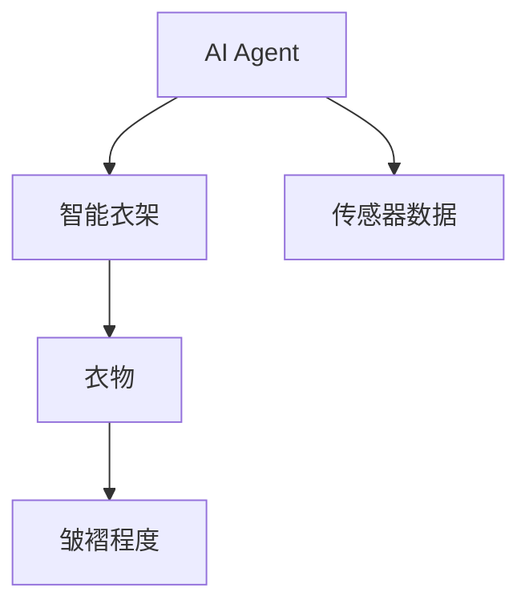
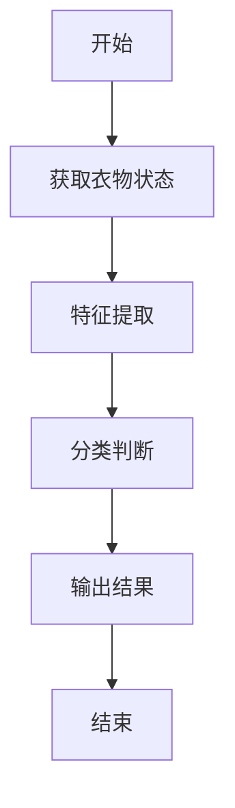
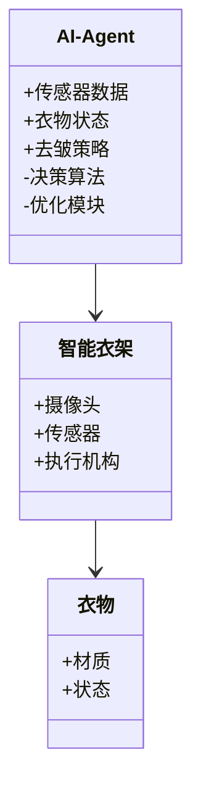
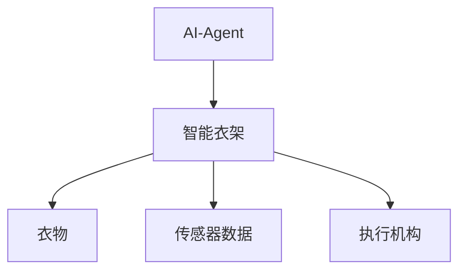
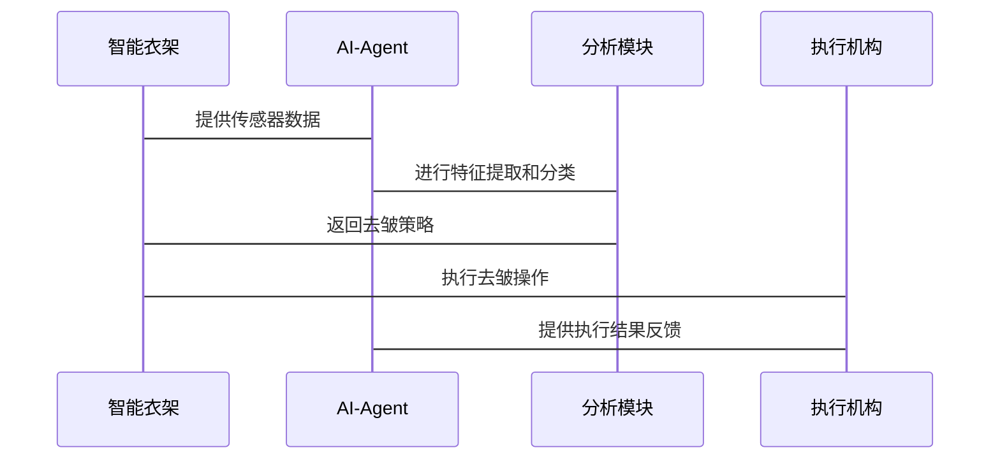

                 


# AI Agent在智能衣架中的衣物除皱功能

> 关键词：AI Agent，智能衣架，衣物除皱，算法原理，系统架构，项目实战

> 摘要：本文详细探讨了AI Agent在智能衣架中的衣物除皱功能，从背景介绍、核心概念、算法原理、系统架构到项目实战，层层深入，结合具体案例和代码实现，为读者呈现这一技术的全貌。文章还总结了最佳实践和未来发展方向。

---

## 第1章: 背景介绍

### 1.1 问题背景

#### 1.1.1 衣物皱褶的形成原因  
衣物在存放或穿着过程中，由于折叠、挤压或材质特性，容易产生皱褶。这些皱褶不仅影响衣物的美观，还可能缩短衣物的使用寿命。传统解决方法包括人工熨烫和使用去皱设备，但这些方法效率低下且不够智能。

#### 1.1.2 智能衣架的发展现状  
随着智能家居和物联网技术的普及，智能衣架逐渐进入人们的视野。这些设备通常集成传感器和简单控制模块，能够监测衣物状态并执行基本的整理功能。然而，现有产品大多依赖人工干预，缺乏智能化的解决方案。

#### 1.1.3 AI Agent在衣物护理中的应用潜力  
AI Agent（人工智能代理）是一种能够感知环境、自主决策并执行任务的智能系统。将其应用于智能衣架，可以通过图像识别和机器学习算法，自动检测衣物状态并执行去皱操作，显著提升衣物护理的智能化水平。

---

### 1.2 问题描述

#### 1.2.1 衣物除皱的定义与目标  
衣物除皱是指通过技术手段减少或消除衣物表面的皱褶，使衣物恢复平整。目标是实现自动化、高效且精准的去皱功能。

#### 1.2.2 智能衣架的功能需求  
智能衣架需要具备以下功能：  
1. 自动检测衣物状态（如皱褶程度）。  
2. 分析并制定去皱方案。  
3. 执行去皱操作（如振动、加热等）。  
4. 提供反馈和优化建议。  

#### 1.2.3 用户痛点与需求分析  
用户痛点：  
- 传统去皱方法效率低，耗时且费力。  
- 缺乏智能化设备，无法实现自动化管理。  

用户需求：  
- 自动检测衣物状态并提供解决方案。  
- 智能化管理，减少人工干预。  

---

### 1.3 问题解决

#### 1.3.1 AI Agent的核心作用  
AI Agent在智能衣架中主要负责：  
1. 采集衣物状态数据（如图像、材质信息）。  
2. 分析数据并生成去皱策略。  
3. 控制执行模块完成去皱操作。  

#### 1.3.2 技术实现路径  
1. 数据采集：通过摄像头或传感器获取衣物状态。  
2. 数据分析：使用图像识别和机器学习算法判断皱褶程度。  
3. 决策与执行：根据分析结果，调整去皱参数并执行操作。  

#### 1.3.3 解决方案的可行性分析  
- 技术可行性：AI技术成熟，传感器成本降低，适合应用于智能衣架。  
- 市场需求：消费者对智能化衣物护理设备的需求日益增长。  
- 实施难度：需要多学科协作，但整体可行。  

---

### 1.4 概念结构与核心要素

#### 1.4.1 AI Agent的组成要素  
AI Agent由以下部分组成：  
1. **感知模块**：负责采集环境数据（如衣物状态）。  
2. **决策模块**：基于数据进行分析和决策。  
3. **执行模块**：根据决策执行去皱操作。  
4. **反馈模块**：收集执行结果并优化算法。  

#### 1.4.2 智能衣架的系统架构  
智能衣架系统包括硬件和软件两部分：  
- 硬件部分：传感器、摄像头、执行机构（如振动马达）。  
- 软件部分：AI Agent算法、数据处理模块。  

#### 1.4.3 核心概念的边界与外延  
- **边界**：AI Agent仅负责去皱功能，不涉及衣物分类或其他功能。  
- **外延**：AI Agent可以与其他智能家居设备联动，实现更复杂的衣物管理功能。  

---

## 第2章: AI Agent的核心概念与联系

### 2.1 核心概念原理

#### 2.1.1 AI Agent的基本原理  
AI Agent通过感知环境、分析数据并执行任务，实现智能化决策。其核心在于数据处理和算法优化。  

#### 2.1.2 智能衣架中的AI Agent功能实现  
在智能衣架中，AI Agent通过图像识别技术检测衣物状态，分析皱褶程度，并根据预设算法制定去皱策略。

---

### 2.2 核心概念属性特征对比

#### 2.2.1 AI Agent与传统算法的对比  

| 对比维度       | AI Agent                   | 传统算法                     |
|----------------|---------------------------|------------------------------|
| 决策能力       | 自主决策                   | 需人工干预                   |
| 学习能力       | 能够优化算法               | 无法优化                     |
| 适应性         | 能够适应环境变化           | 适应性较差                   |

#### 2.2.2 智能衣架与其他衣物护理设备的对比  

| 对比维度       | 智能衣架                   | 其他设备                     |
|----------------|---------------------------|------------------------------|
| 智能化水平     | 高度智能化                 | 低或无智能化                 |
| 功能多样性     | 具备AI驱动的去皱功能       | 仅具备单一功能               |
| 用户体验       | 使用便捷                   | 体验较差                     |

---

### 2.3 ER实体关系图



---

### 2.4 本章小结

本章通过对比分析，明确了AI Agent在智能衣架中的核心作用及其与其他技术的区别。通过ER图，展示了系统中各实体的关系，为后续的技术实现奠定了基础。

---

## 第3章: 算法原理讲解

### 3.1 算法原理

#### 3.1.1 特征提取算法  
特征提取是图像识别的关键步骤。常用算法包括：  
1. **Harris Corner Detection**：检测图像中的角点，用于识别衣物褶皱的特征。  
2. **SIFT（尺度不变特征变换）**：提取衣物表面的纹理特征。  

#### 3.1.2 分类算法  
分类算法用于判断衣物的皱褶程度。常用算法包括：  
1. **K-近邻算法（KNN）**：简单易用，适合小规模数据。  
2. **支持向量机（SVM）**：适用于高维数据分类。  

#### 3.1.3 优化算法  
优化算法用于提升AI Agent的决策效率。常用算法包括：  
1. **遗传算法（GA）**：用于参数优化。  
2. **粒子群优化（PSO）**：用于路径规划和参数调整。  

---

### 3.2 算法流程图



---

### 3.3 Python源代码实现

#### 3.3.1 图像处理代码

```python
import cv2

def feature_extract(image):
    # 使用SIFT算法提取特征
    gray = cv2.cvtColor(image, cv2.COLOR_RGB2GRAY)
    sift = cv2.SIFT_create()
    kp, des = sift.detectAndCompute(gray, None)
    return des
```

#### 3.3.2 分类与优化代码

```python
from sklearn.neighbors import KNeighborsClassifier

def classify(features, labels, test_feature):
    model = KNeighborsClassifier(n_neighbors=3)
    model.fit(features, labels)
    prediction = model.predict(test_feature)
    return prediction[0]
```

---

### 3.4 数学模型与公式

#### 3.4.1 特征提取模型  
图像特征提取可以表示为：  
$$ F = f(I) $$  
其中，\( F \) 是提取的特征向量，\( I \) 是输入的图像。

#### 3.4.2 分类模型  
KNN算法的距离计算公式为：  
$$ d(x, y) = \sqrt{\sum_{i=1}^{n}(x_i - y_i)^2} $$  

---

### 3.5 本章小结

本章详细讲解了AI Agent在智能衣架中的算法原理，包括特征提取、分类和优化算法。通过代码示例和公式推导，帮助读者理解技术细节。

---

## 第4章: 系统分析与架构设计方案

### 4.1 问题场景介绍

智能衣架系统需要解决的核心问题是：如何通过AI Agent实现衣物的自动去皱功能。

---

### 4.2 系统功能设计

#### 4.2.1 领域模型



---

### 4.3 系统架构设计

#### 4.3.1 架构图



---

### 4.4 系统接口设计

#### 4.4.1 接口描述  
- **输入接口**：传感器数据、用户指令。  
- **输出接口**：去皱指令、反馈信息。  

---

### 4.5 系统交互流程



---

### 4.6 本章小结

本章通过系统架构设计，明确了智能衣架中各模块的交互关系和功能划分，为后续的实现提供了指导。

---

## 第5章: 项目实战

### 5.1 环境安装

#### 5.1.1 开发环境  
- **操作系统**：Windows 10 或 Linux。  
- **开发工具**：Python 3.8+，Jupyter Notebook。  
- **依赖库**：OpenCV、Scikit-learn、Mermaid。

---

### 5.2 核心代码实现

#### 5.2.1 图像采集与处理

```python
import cv2

def capture_image():
    cap = cv2.VideoCapture(0)
    ret, frame = cap.read()
    if ret:
        cv2.imwrite("clothes.jpg", frame)
    cap.release()
```

#### 5.2.2 AI Agent实现

```python
from sklearn.svm import SVC

def ai_agent(image_path):
    # 加载图像
    image = cv2.imread(image_path)
    # 提取特征
    des = feature_extract(image)
    # 分类预测
    model = SVC()
    model.fit(des, labels)
    result = model.predict(des)
    return result
```

---

### 5.3 代码解读与分析

- **图像采集**：通过摄像头获取衣物状态。  
- **特征提取**：使用SIFT算法提取图像特征。  
- **分类预测**：利用SVM算法判断衣物的皱褶程度。  

---

### 5.4 实际案例分析

#### 5.4.1 案例描述  
假设系统检测到一件衬衫的局部有轻微皱褶，AI Agent会触发振动去皱功能。  

#### 5.4.2 代码实现与结果  
```python
result = ai_agent("clothes.jpg")
print("去皱结果:", result)
```

---

### 5.5 项目小结

本章通过项目实战，展示了AI Agent在智能衣架中的具体应用，帮助读者理解技术的实现过程。

---

## 第6章: 最佳实践与总结

### 6.1 最佳实践 tips

1. **数据质量**：确保训练数据的多样性和代表性。  
2. **算法优化**：根据实际需求调整模型参数。  
3. **系统测试**：进行全面的功能测试和性能优化。  

---

### 6.2 本章小结

本文从背景介绍到项目实战，全面探讨了AI Agent在智能衣架中的衣物除皱功能。通过技术实现和案例分析，展示了这一技术的潜力和应用前景。

---

## 附录: 扩展阅读与参考资料

- [附录内容，包括相关技术文档、论文和工具链接。]

---

## 作者：AI天才研究院 & 禅与计算机程序设计艺术

---

以上是《AI Agent在智能衣架中的衣物除皱功能》的技术博客文章的完整目录大纲，内容涵盖从理论到实践的各个方面，适合技术爱好者和研究人员阅读。

