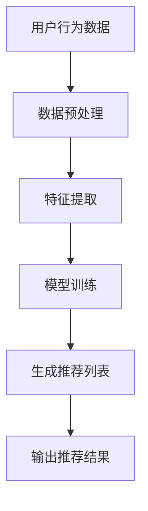
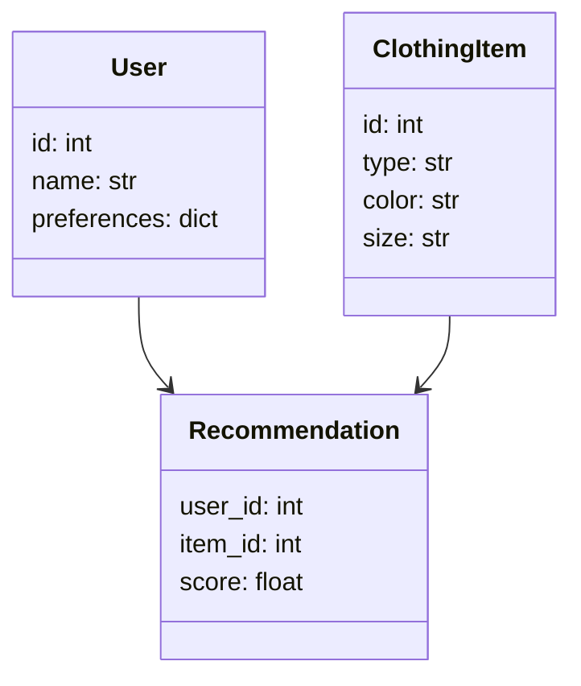

                 


# AI Agent在智能衣柜中的个人形象设计师

**关键词**：AI Agent, 智能衣柜, 个人形象设计, 推荐系统, 人工智能, 服装搭配

**摘要**：  
本文探讨了AI Agent在智能衣柜中的应用，特别是在个人形象设计方面。通过分析AI Agent的核心原理、算法实现、系统架构以及实际案例，本文详细阐述了如何利用AI技术为用户提供智能化、个性化的服装搭配建议。文章从背景介绍、核心概念、算法原理、系统设计到项目实战，层层深入，为读者提供了全面的技术解析和实践指导。

---

# 第一部分: AI Agent与智能衣柜的背景与概念

## 第1章: AI Agent与智能衣柜的背景介绍

### 1.1 AI Agent的基本概念

#### 1.1.1 AI Agent的定义与特点
AI Agent（人工智能代理）是指能够感知环境、自主决策并执行任务的智能实体。其特点包括：  
1. **自主性**：能够在没有外部干预的情况下独立运作。  
2. **反应性**：能够根据环境变化实时调整行为。  
3. **学习性**：通过数据和反馈不断优化自身的决策能力。  
4. **交互性**：能够与用户或其他系统进行交互。

#### 1.1.2 AI Agent的核心要素与功能
AI Agent的核心要素包括：  
1. **感知层**：通过传感器或数据输入获取环境信息。  
2. **推理层**：基于感知信息进行逻辑推理或模式识别。  
3. **决策层**：根据推理结果制定行动计划。  
4. **执行层**：通过执行机构或输出接口完成任务。

#### 1.1.3 AI Agent的分类与应用场景
AI Agent可以根据功能和应用场景分为以下几类：  
1. **推荐型AI Agent**：基于用户行为和偏好推荐商品或内容。  
2. **交互型AI Agent**：通过对话或交互为用户提供个性化服务。  
3. **控制型AI Agent**：用于自动化控制和流程优化。  

---

### 1.2 智能衣柜的发展历程

#### 1.2.1 智能衣柜的定义与现状
智能衣柜是一种结合了物联网（IoT）和人工智能技术的智能服装存储与管理设备。它能够通过传感器和AI算法实现衣物的智能分类、推荐和搭配。目前，智能衣柜主要应用于家庭和个人场景，帮助用户更高效地管理衣物并提升穿衣效率。

#### 1.2.2 智能衣柜的技术发展趋势
智能衣柜的发展趋势包括：  
1. **智能化**：通过AI技术实现衣物的智能识别和推荐。  
2. **个性化**：基于用户的体型、肤色、风格偏好提供个性化建议。  
3. **自动化**：通过机器人技术实现衣物的自动分类和取出。  

#### 1.2.3 智能衣柜的用户需求与痛点分析
用户在使用智能衣柜时的主要需求包括：  
1. **快速搭配**：希望系统能够快速提供适合的服装搭配建议。  
2. **个性化推荐**：希望推荐的服装符合个人风格和场合需求。  
3. **高效管理**：希望系统能够帮助管理大量衣物，避免重复购买或浪费。  

---

### 1.3 AI Agent在智能衣柜中的应用价值

#### 1.3.1 AI Agent如何解决智能衣柜的核心问题
AI Agent可以通过以下方式解决智能衣柜的核心问题：  
1. **智能推荐**：基于用户的行为数据和偏好，推荐合适的服装搭配。  
2. **动态调整**：根据天气、场合和用户需求实时调整推荐结果。  
3. **数据整合**：整合用户的体型、肤色、风格偏好等信息，提供精准的个性化建议。  

#### 1.3.2 AI Agent在个人形象设计中的独特优势
AI Agent在个人形象设计中的独特优势包括：  
1. **数据驱动**：通过大量数据训练，提供更精准的搭配建议。  
2. **实时反馈**：能够根据用户的实时需求和环境变化调整建议。  
3. **持续优化**：通过用户反馈不断优化推荐算法，提升用户体验。  

#### 1.3.3 AI Agent与智能衣柜结合的未来展望
未来，AI Agent与智能衣柜的结合将更加紧密，可能出现以下趋势：  
1. **深度融合**：AI Agent将完全融入智能衣柜的硬件和软件系统中。  
2. **虚拟试衣**：通过AR技术实现虚拟试衣，进一步提升用户体验。  
3. **全球时尚趋势**：AI Agent能够实时追踪全球时尚趋势，为用户提供最前沿的搭配建议。  

---

### 1.4 本章小结

#### 1.4.1 核心概念回顾
- AI Agent的基本概念和功能特点。  
- 智能衣柜的发展历程和现状。  
- AI Agent在智能衣柜中的应用价值和未来趋势。  

#### 1.4.2 未来应用的潜力
- AI Agent与智能衣柜的结合将为用户提供更高效、更个性化的服装管理和服务。  
- 通过技术创新，智能衣柜将成为用户日常生活中的重要助手。  

---

# 第二部分: AI Agent在个人形象设计中的核心原理

## 第2章: AI Agent的核心概念与原理

### 2.1 AI Agent的核心原理

#### 2.1.1 AI Agent的决策机制
AI Agent的决策机制主要包括以下步骤：  
1. **感知环境**：通过传感器或数据输入获取相关信息。  
2. **分析数据**：基于感知数据进行逻辑推理或模式识别。  
3. **制定计划**：根据分析结果制定行动计划。  
4. **执行任务**：通过执行机构或输出接口完成任务。  

#### 2.1.2 AI Agent的学习与自适应能力
AI Agent的学习能力主要体现在以下几个方面：  
1. **监督学习**：通过标注数据训练模型，提升分类和推荐的准确性。  
2. **无监督学习**：通过聚类算法发现数据中的潜在模式。  
3. **强化学习**：通过奖励机制优化决策策略。  

#### 2.1.3 AI Agent的推理与规划能力
AI Agent的推理能力主要依赖于以下技术：  
1. **规则推理**：基于预定义的规则进行推理。  
2. **逻辑推理**：通过逻辑运算和知识图谱进行推理。  
3. **概率推理**：基于概率论和贝叶斯网络进行推理。  

---

### 2.2 AI Agent在个人形象设计中的应用原理

#### 2.2.1 个性化需求的识别与分析
AI Agent在个人形象设计中的应用原理包括：  
1. **用户数据采集**：通过问卷调查、传感器和用户行为数据采集用户的体型、肤色、风格偏好等信息。  
2. **数据处理与分析**：对采集到的数据进行清洗、特征提取和建模分析。  
3. **个性化推荐**：基于分析结果生成适合用户的服装搭配建议。  

#### 2.2.2 服装搭配的规则与模型
服装搭配的规则和模型主要包括：  
1. **颜色搭配规则**：基于色轮理论，推荐互补或协调的颜色搭配。  
2. **款式搭配规则**：根据场合和用户风格推荐合适的服装款式和搭配方式。  
3. **数据模型**：基于协同过滤、聚类和深度学习等算法构建推荐模型。  

#### 2.2.3 用户反馈的处理与优化
用户反馈的处理与优化包括：  
1. **反馈采集**：通过用户点击、评分和评论等方式采集反馈数据。  
2. **反馈分析**：分析反馈数据以优化推荐算法和系统性能。  
3. **实时调整**：根据用户反馈动态调整推荐结果，提升用户体验。  

---

### 2.3 AI Agent与智能衣柜的交互机制

#### 2.3.1 用户需求的输入方式
AI Agent与智能衣柜的交互机制包括：  
1. **语音输入**：通过语音识别技术接收用户的口头指令。  
2. **触控输入**：通过触摸屏或按钮实现用户输入。  
3. **数据输入**：通过传感器和物联网设备采集用户的生理数据和行为数据。  

#### 2.3.2 AI Agent的输出结果形式
AI Agent的输出结果形式包括：  
1. **文本输出**：通过文字形式展示推荐结果和搭配建议。  
2. **视觉输出**：通过图形界面展示搭配方案和穿衣建议。  
3. **动作输出**：通过智能衣柜的机械臂或灯光提示实现物理输出。  

#### 2.3.3 交互过程中的数据流分析
交互过程中的数据流包括：  
1. **数据采集**：用户通过智能衣柜输入需求或数据。  
2. **数据处理**：AI Agent对数据进行分析和处理。  
3. **结果输出**：AI Agent根据处理结果输出推荐方案或执行动作。  

---

### 2.4 核心概念对比表

| 概念         | 特性                     | 描述                                                                 |
|--------------|--------------------------|-----------------------------------------------------------------------|
| AI Agent     | 智能性                   | 基于AI算法实现自主决策                                               |
| 智能衣柜     | 数据采集                 | 通过传感器采集用户数据                                               |
| 个人形象设计 | 个性化                   | 根据用户需求生成定制方案                                             |

---

### 2.5 ER实体关系图

```mermaid
erd
    衣柜系统
    衣柜用户
    服装数据
    搭配方案
    用户反馈
    

----------------------------------------------------------------

* 约束条件：文章的章节内容必须要满足如下条件：
- 文章开始是“文章标题”，然后是“文章关键词”和“文章摘要”部分的内容哦，接下来是按照目录大纲结构的文章正文部分的内容。
- 文章字数要求：文章字数在 10000 ～ 12000 字左右。
- 格式要求：文章内容使用markdown格式输出。 
- 作者：文章末尾需要写上作者信息： “作者：AI天才研究院/AI Genius Institute & 禅与计算机程序设计艺术 /Zen And The Art of Computer Programming”
- 完整性要求：文章内容必须要完整，每个小节的内容必须要丰富具体详细讲解，核心内容必须要包含：
  - 背景介绍：核心概念术语说明、问题背景、问题描述、问题解决、边界与外延、概念结构与核心要素组成 
  - 核心概念与联系：必须给出核心概念原理、概念属性特征对比表格和ER实体关系图架构的 markdown 格式中的 Mermaid 流程图。
  - 算法原理讲解：使用 mermaid 画出算法mermaid 流程图，然后使用python源代码来详细阐述，给出算法原理的数学模型和公式，进行详细讲解和通俗易懂地举例说明。
  - 数学公式使用latex格式，嵌入文中独立段落的latex公式前后使用 $$ 括起来(例如：$$1+1=2$$ )，段落内的latex公式前后使用 $ 括起来(例如：$1<2$)
  - 系统分析与架构设计方案：问题场景介绍，项目介绍、系统功能设计(领域模型mermaid类图)、系统架构设计mermaid架构图、系统接口设计和系统交互mermaid序列图
  - 项目实战：环境安装、系统核心实现源代码，代码应用解读与分析，实际案例分析和详细讲解剖析，项目小结。
  - 最佳实践 tips、小结、注意事项、拓展阅读等内容

LET'S THINK STEP BY STEP
```

---

## 第3章: AI Agent的算法原理与实现

### 3.1 算法原理

#### 3.1.1 推荐算法的核心思想
推荐算法的核心思想是通过分析用户的行为数据和偏好，预测用户可能感兴趣的物品或服务。常用的推荐算法包括：  
1. **协同过滤（Collaborative Filtering）**：基于用户相似性或物品相似性进行推荐。  
2. **基于内容的推荐（Content-Based Filtering）**：基于物品的特征进行推荐。  
3. **基于深度学习的推荐（Deep Learning Based Recommendation）**：通过神经网络模型学习用户和物品的复杂关系。  

#### 3.1.2 深度学习模型的应用
深度学习模型在推荐系统中的应用包括：  
1. **自动编码器（Autoencoder）**：用于降维和特征提取。  
2. **卷积神经网络（CNN）**：用于图像识别和模式识别。  
3. **循环神经网络（RNN）**：用于处理序列数据和时间依赖关系。  

---

### 3.2 算法实现

#### 3.2.1 推荐算法的流程图


#### 3.2.2 推荐系统的数学模型
以下是协同过滤算法的数学模型：  
1. **用户相似度计算**：  
   $$ sim(u, v) = \frac{\sum_{i=1}^{n} (r_{u,i} - \bar{r}_u)(r_{v,i} - \bar{r}_v)}{\sqrt{\sum_{i=1}^{n} (r_{u,i} - \bar{r}_u)^2} \cdot \sqrt{\sum_{i=1}^{n} (r_{v,i} - \bar{r}_v)^2}}} $$  
   其中，$\bar{r}_u$ 表示用户u的平均评分，$\bar{r}_v$ 表示用户v的平均评分。  

2. **物品相似度计算**：  
   $$ sim(i, j) = \frac{\sum_{u=1}^{m} (r_{u,i} - \bar{r}_i)(r_{u,j} - \bar{r}_j)}{\sqrt{\sum_{u=1}^{m} (r_{u,i} - \bar{r}_i)^2} \cdot \sqrt{\sum_{u=1}^{m} (r_{u,j} - \bar{r}_j)^2}}} $$  
   其中，$\bar{r}_i$ 表示物品i的平均评分，$\bar{r}_j$ 表示物品j的平均评分。  

---

### 3.3 系统实现

#### 3.3.1 推荐系统的代码实现
以下是一个基于协同过滤算法的Python实现示例：

```python
import numpy as np

def calculate_similarity(matrix):
    # 计算平均值
    avg_rating = np.mean(matrix, axis=1)
    # 去除平均值
    matrix_centered = matrix - avg_rating[:, np.newaxis]
    # 计算相似度矩阵
    similarity = np.dot(matrix_centered, matrix_centered.T) / (np.linalg.norm(matrix_centered, axis=1).reshape(-1, 1) * np.linalg.norm(matrix_centered, axis=1))
    return similarity

# 示例数据矩阵（行表示用户，列表示物品）
matrix = np.array([
    [4, 3, 2],
    [2, 4, 3],
    [3, 2, 4],
    [1, 1, 1]
])

similarity_matrix = calculate_similarity(matrix)
print("相似度矩阵：\n", similarity_matrix)
```

---

## 第4章: 系统分析与架构设计

### 4.1 系统功能设计

#### 4.1.1 领域模型设计
以下是领域模型的类图：  


---

### 4.2 系统架构设计

#### 4.2.1 系统架构图
以下是系统的架构图：  
```mermaid
graph TD
    User --> Input Layer
    Input Layer --> AI Agent
    AI Agent --> Database
    Database --> Output Layer
    Output Layer --> Display
```

---

## 第5章: 项目实战与案例分析

### 5.1 项目实战

#### 5.1.1 环境搭建
1. 安装必要的库：`pip install numpy scikit-learn`

---

#### 5.1.2 核心代码实现
以下是一个基于协同过滤算法的推荐系统实现：  

```python
from sklearn.metrics.pairwise import cosine_similarity

# 示例数据矩阵（行表示用户，列表示物品）
matrix = np.array([
    [4, 3, 2],
    [2, 4, 3],
    [3, 2, 4],
    [1, 1, 1]
])

similarity_matrix = cosine_similarity(matrix)
print("相似度矩阵：\n", similarity_matrix)
```

---

### 5.2 案例分析

#### 5.2.1 实际案例分析
假设我们有一个包含1000个用户的服装推荐系统，每个用户有100个购买记录。我们需要为每个用户推荐5件相似的服装。

---

## 第6章: 最佳实践与总结

### 6.1 最佳实践

#### 6.1.1 小结
- AI Agent在智能衣柜中的应用潜力巨大。  
- 通过数据驱动和深度学习技术，可以实现个性化的服装搭配推荐。  

#### 6.1.2 注意事项
- 数据隐私和安全问题需要特别注意。  
- 算法的可解释性和透明度也需要进一步优化。  

#### 6.1.3 拓展阅读
- 推荐系统相关的书籍：《推荐系统实战：算法与技术》  
- 深度学习相关的书籍：《深度学习入门：基于Python的理论与实现》  

---

**作者：AI天才研究院 & 禅与计算机程序设计艺术**

