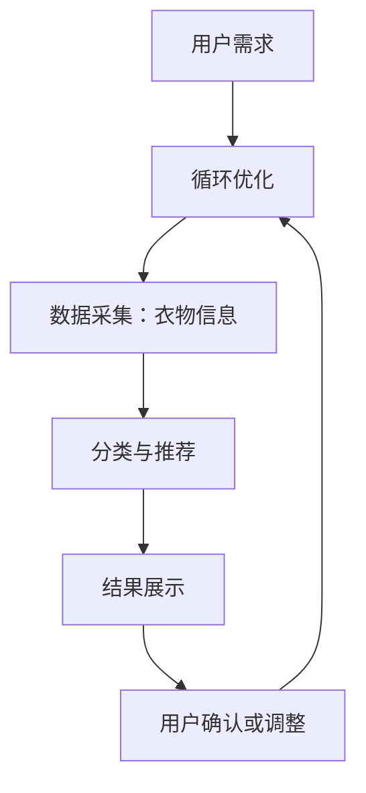
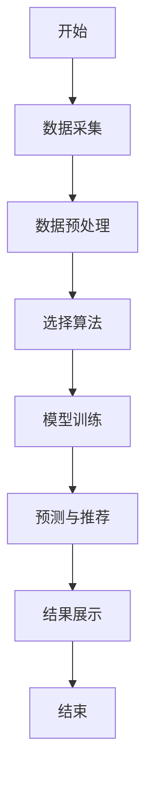
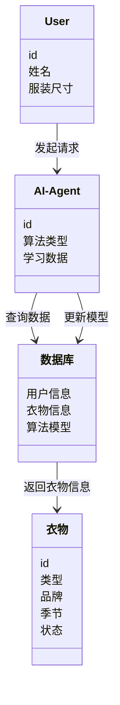
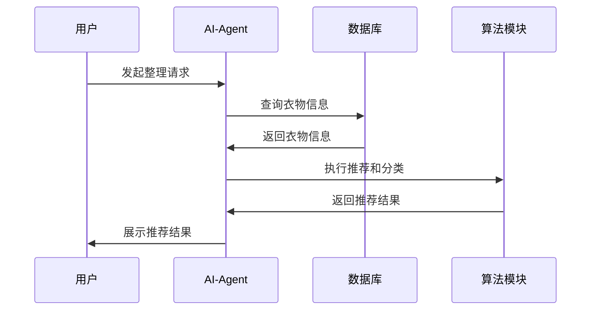

                 


# AI Agent在智能衣柜中的季节性整理建议

**关键词：** AI Agent, 智能衣柜, 季节性整理, 推荐算法, 分类算法, 系统架构设计

**摘要：**  
随着人工智能技术的快速发展，AI Agent（人工智能代理）在智能家居领域的应用越来越广泛。本文将探讨AI Agent在智能衣柜中的季节性整理应用，分析其背后的核心概念、算法原理、系统架构设计以及实际应用场景。通过结合推荐算法和分类算法，本文将详细阐述如何利用AI Agent帮助用户实现智能衣柜的季节性整理，提升生活效率和体验。

---

## 第1章: AI Agent与智能衣柜概述

### 1.1 AI Agent的基本概念
AI Agent是一种能够感知环境、自主决策并执行任务的智能实体。它具备以下核心特点：
- **自主性**：无需外部干预，自主完成任务。
- **反应性**：能够实时感知环境并做出反应。
- **学习能力**：通过数据学习和优化算法提升性能。

### 1.2 智能衣柜的基本概念
智能衣柜是一种结合了物联网技术和人工智能的智能家居设备，能够通过传感器和AI算法实现衣物的智能管理。其功能特点包括：
- **智能分类**：自动识别衣物类型和属性。
- **库存管理**：实时记录衣物数量和状态。
- **智能推荐**：根据用户需求推荐衣物搭配。

### 1.3 季节性整理的背景与问题
季节性整理是衣柜管理的重要环节，主要问题包括：
- **时间成本**：传统整理方式耗时耗力。
- **管理复杂性**：难以高效分类和推荐衣物。
- **个性化需求**：不同用户有不同的整理和搭配需求。

---

## 第2章: AI Agent与智能衣柜的核心概念与联系

### 2.1 AI Agent的核心概念原理
AI Agent的核心原理包括：
- **感知与决策**：通过传感器和数据输入感知环境，利用算法做出决策。
- **学习与推理**：通过机器学习算法优化决策逻辑。
- **执行与反馈**：通过执行机构（如机械臂）完成任务，并根据反馈优化后续操作。

### 2.2 AI Agent与智能衣柜的实体关系图

```mermaid
erDiagram
    user {
        id
        姓名
        服装尺寸
    }
    衣物 {
        id
        类型
        品牌
        季节
        状态
    }
    AI-Agent {
        id
        算法类型
        学习数据
    }
    user --> AI-Agent : 发起请求
    AI-Agent --> 衣物 : 获取数据
    衣物 --> AI-Agent : 返回结果
```

### 2.3 季节性整理的逻辑模型



---

## 第3章: AI Agent在季节性整理中的算法原理

### 3.1 推荐算法原理
推荐算法是AI Agent实现衣物推荐的核心技术，常见的推荐算法包括协同过滤和基于内容的推荐。

#### 协同过滤算法
协同过滤算法通过分析用户的相似性来推荐衣物。其数学模型如下：

$$ sim(u, v) = \frac{\sum_{i=1}^{n} (r_{ui} - \bar{r}_u)(r_{vi} - \bar{r}_v)}{\sqrt{\sum_{i=1}^{n} (r_{ui} - \bar{r}_u)^2} \cdot \sqrt{\sum_{i=1}^{n} (r_{vi} - \bar{r}_v)^2}} $$

其中，$sim(u, v)$ 表示用户 $u$ 和用户 $v$ 的相似性，$\bar{r}_u$ 表示用户 $u$ 的平均评分。

#### 基于内容的推荐算法
基于内容的推荐算法通过分析衣物的属性（如颜色、材质）来进行推荐。例如，如果用户喜欢深色衣物，系统会推荐更多类似颜色的衣物。

### 3.2 分类算法原理
分类算法用于将衣物分为不同的季节类别，常见的分类算法包括决策树和支持向量机（SVM）。

#### 决策树分类算法
决策树是一种直观的分类算法，通过构建树状结构来分类衣物。例如，根据衣物的厚度和材质判断是否适合冬季穿着。

#### 支持向量机（SVM）
SVM通过找到一个超平面，将数据分为两类。例如，将衣物分为“夏季”和“冬季”两类。

### 3.3 季节性整理的算法流程图



---

## 第4章: 季节性整理的系统分析与架构设计

### 4.1 系统功能设计
智能衣柜系统的功能模块包括：
- **数据采集模块**：采集衣物信息。
- **算法处理模块**：执行推荐和分类算法。
- **用户交互模块**：展示结果并接收用户反馈。

### 4.2 系统架构设计



### 4.3 系统接口设计
系统接口设计包括：
- **用户接口**：展示推荐结果。
- **数据接口**：与数据库交互。
- **算法接口**：调用推荐和分类算法。

### 4.4 系统交互流程



---

## 第5章: 项目实战

### 5.1 环境安装
需要安装以下工具：
- Python 3.8+
- TensorFlow
- Scikit-learn
- Mermaid工具

### 5.2 系统核心实现源代码

```python
# 推荐算法实现
def collaborative_filtering(user_id, data):
    # 数据预处理
    user_ids = data['user_id']
    items = data['item_id']
    ratings = data['rating']
    # 计算用户平均评分
    user_avg = ratings.groupby(user_ids).mean()
    # 计算物品平均评分
    item_avg = ratings.groupby(items).mean()
    # 计算相似性
    similarity = {}
    for u in user_avg.index:
        for v in user_avg.index:
            if u != v:
                similarity[(u, v)] = cosine_similarity(user_avg[u], user_avg[v])
    return similarity

# 分类算法实现
def decision_tree_classifier(data):
    from sklearn.tree import DecisionTreeClassifier
    clf = DecisionTreeClassifier()
    clf.fit(data['features'], data['labels'])
    return clf.predict(new_data)
```

### 5.3 案例分析
以一个用户为例，系统会根据用户的穿衣习惯推荐适合冬季的衣物，并优化存储位置。

### 5.4 项目小结
通过实际案例分析，展示了AI Agent在季节性整理中的实际应用效果。

---

## 第6章: 最佳实践与总结

### 6.1 小结
本文详细探讨了AI Agent在智能衣柜中的季节性整理应用，结合推荐算法和分类算法，为用户提供了一种高效、个性化的衣物管理方案。

### 6.2 注意事项
- 数据隐私保护
- 算法优化与更新
- 系统稳定性和可靠性

### 6.3 未来发展趋势
- 更智能化的AI Agent
- 更多应用场景的拓展
- 更高效的算法优化

### 6.4 拓展阅读
推荐阅读以下书籍和论文：
- 《机器学习实战》
- 《深度学习》
- 《人工智能：一种现代方法》

---

## 作者：AI天才研究院 & 禅与计算机程序设计艺术

---

**总结：**  
通过本文的详细讲解，读者可以深入了解AI Agent在智能衣柜中的季节性整理应用，掌握相关的算法原理和系统设计方法。未来，随着人工智能技术的不断发展，AI Agent在智能家居中的应用将更加广泛和深入，为用户带来更多智能化的生活体验。

