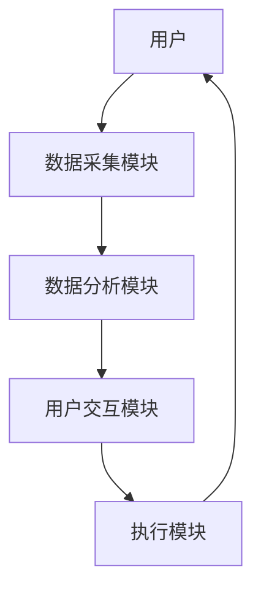
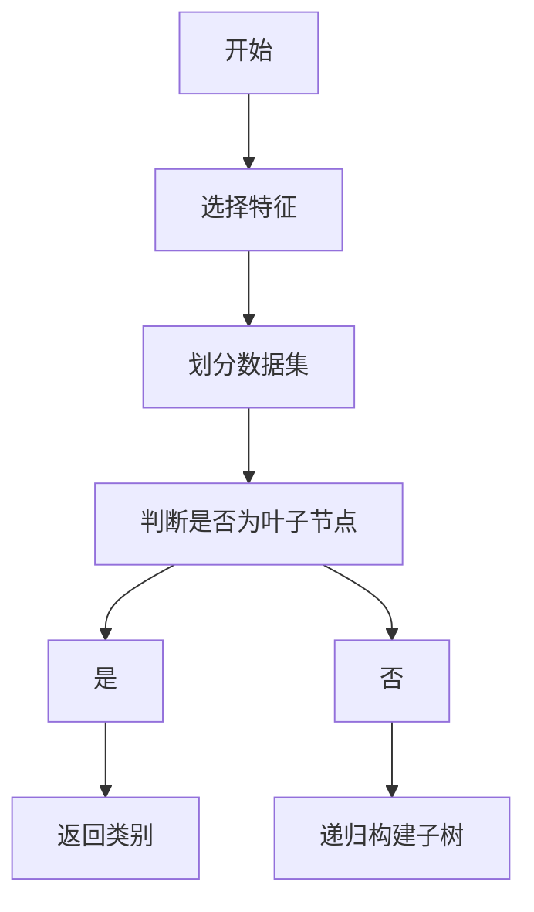
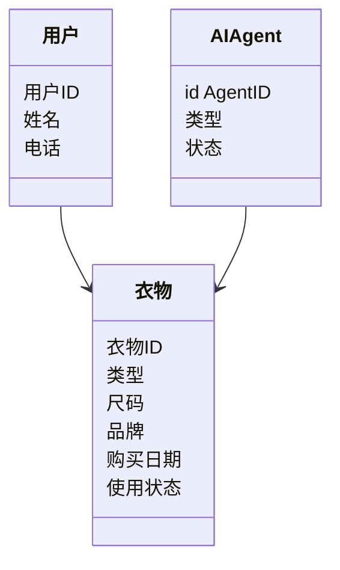

                 


# AI Agent在智能衣柜中的衣物循环利用建议

> 关键词：AI Agent，智能衣柜，衣物循环利用，资源优化，可持续发展

> 摘要：本文探讨了AI Agent在智能衣柜中的应用，重点分析了如何通过AI技术优化衣物管理，实现衣物的循环利用。文章从背景介绍、核心概念、算法原理、系统架构到项目实战，全面解析了AI Agent在智能衣柜中的作用，并提出了具体的实施建议和未来研究方向。

---

## 第一部分：AI Agent在智能衣柜中的衣物循环利用背景介绍

### 第1章：问题背景与描述

#### 1.1 衣物循环利用的重要性
- **1.1.1 资源浪费的现状分析**
  - 当前社会资源浪费严重，衣物浪费尤为突出。每年有大量的服装被丢弃在垃圾填埋场或燃烧处理，造成资源的巨大浪费。
  - 衣物的生产和消费对环境的影响巨大，从生产到废弃的全生命周期都产生大量碳排放和水资源消耗。

- **1.1.2 可持续发展的需求**
  - 全球气候变化和资源枯竭的背景下，可持续发展成为社会共识。
  - 衣物循环利用是实现可持续发展的重要一环，有助于减少资源消耗和环境污染。

- **1.1.3 衣物循环利用的定义与目标**
  - 衣物循环利用指通过设计、收集、加工和再利用，延长衣物使用寿命的过程。
  - 目标是最大限度地减少衣物浪费，提高资源利用率，降低环境影响。

#### 1.2 智能衣柜的发展趋势
- **1.2.1 智能衣柜的概念演变**
  - 传统衣柜：简单的衣物存储工具。
  - 智能衣柜：通过传感器、物联网和AI技术实现智能化管理的衣柜。

- **1.2.2 AI Agent在智能衣柜中的作用**
  - AI Agent能够实时感知衣物状态，优化存储和使用计划。
  - 通过数据分析和预测，帮助用户更好地管理衣物，延长使用寿命。

- **1.2.3 衣物循环利用的场景与边界**
  - 场景：衣物的存储、分类、推荐、共享和回收。
  - 边界：在保证用户体验的前提下，平衡资源利用与隐私保护。

#### 1.3 问题解决思路
- **1.3.1 传统衣柜管理的不足**
  - 衣物管理混乱，难以快速找到合适的衣物。
  - 无法根据天气或场合推荐合适的搭配。
  - 缺乏对衣物使用状态的监控，导致不必要的浪费。

- **1.3.2 AI Agent如何优化衣物管理**
  - 自动分类和存储衣物，提高管理效率。
  - 根据用户习惯推荐穿搭，减少不必要的购买。
  - 监控衣物使用状态，提醒用户及时处理不再需要的衣物。

- **1.3.3 衣物循环利用的核心要素**
  - 数据采集：通过传感器和用户输入获取衣物信息。
  - 数据分析：利用AI算法优化衣物使用计划。
  - 用户交互：通过友好的界面与用户互动，提升用户体验。

---

## 第二部分：核心概念与联系

### 第2章：核心概念与联系

#### 2.1 AI Agent的基本原理
- **2.1.1 AI Agent的定义与分类**
  - AI Agent是一种能够感知环境、自主决策并采取行动的智能体。
  - 分为简单反射型、基于模型的反射型、目标驱动型和效用驱动型四种类型。

| **AI Agent类型** | **特点** | **应用场景** |
|------------------|----------|--------------|
| 简单反射型       | 基于规则的反应式行为 | 基本的衣物分类和存储 |
| 基于模型的反射型 | 使用环境模型进行决策 | 衣物推荐和搭配 |
| 目标驱动型       | 为实现特定目标而行动 | 衣物的共享和回收 |
| 效用驱动型       | 最大化效用函数的值 | 综合优化衣物管理 |

- **2.1.2 AI Agent的核心属性特征对比**
  - **感知能力**：AI Agent能够通过传感器和用户输入获取环境信息。
  - **决策能力**：基于获取的信息做出最优决策。
  - **行动能力**：通过执行机构（如智能衣柜的机械臂）完成操作。
  - **学习能力**：通过机器学习算法不断优化决策模型。

- **2.1.3 AI Agent的ER实体关系图**

```mermaid
er
actor 衣物循环利用系统用户 {
  id 用户ID
  姓名
  电话
}
actor 衣物 {
  id 衣物ID
  类型
  尺码
  品牌
  购买日期
  使用状态
}
actor AI Agent {
  id AgentID
  类型
  状态
}
```

#### 2.2 智能衣柜系统架构
- **2.2.1 系统功能模块划分**
  - 数据采集模块：通过传感器和用户输入获取衣物信息。
  - 数据分析模块：利用AI算法优化衣物使用计划。
  - 用户交互模块：通过友好的界面与用户互动。
  - 执行模块：通过机械臂等执行机构完成衣物的分类和存储。

- **2.2.2 系统架构的Mermaid流程图**



- **2.2.3 系统接口设计与交互流程**
  - **接口设计**：
    - 用户输入接口：通过手机APP或语音助手输入需求。
    - 数据采集接口：通过传感器获取衣物状态。
    - 执行接口：通过机械臂完成衣物分类和存储。
  - **交互流程**：
    1. 用户通过手机APP输入需求。
    2. 系统采集衣物信息。
    3. AI Agent分析数据并生成建议。
    4. 用户确认后，系统执行操作。

---

## 第三部分：算法原理与实现

### 第3章：算法原理与实现

#### 3.1 AI Agent算法选择
- **3.1.1 决策树算法的适用性分析**
  - 决策树是一种常用的分类和回归方法，适合用于衣物分类和推荐。
  - 通过ID3、C4.5或CART算法构建决策树模型。

- **3.1.2 强化学习算法的应用场景**
  - 强化学习适合用于需要动态决策的场景，如衣物的共享和回收。
  - 使用Q-learning算法进行状态转移和奖励函数设计。

- **3.1.3 算法选择的优缺点对比**

| **算法类型** | **优点**                  | **缺点**                |
|--------------|--------------------------|-------------------------|
| 决策树        | 实现简单，易于解释        | 易受噪声数据影响          |
| 强化学习      | 适合动态环境，效果好      | 实现复杂，需要大量数据    |

#### 3.2 算法实现与流程图
- **3.2.1 决策树算法的Mermaid流程图**



- **3.2.2 强化学习算法的实现步骤**
  1. 初始化状态空间和动作空间。
  2. 定义奖励函数。
  3. 构建Q表，记录每个状态-动作对的Q值。
  4. 通过经验回放更新Q表。
  5. 根据最大Q值选择动作。

- **3.2.3 算法实现的Python源代码**

```python
import numpy as np

# 决策树实现
class DecisionTree:
    def __init__(self):
        pass

    def fit(self, X, y):
        pass

    def predict(self, X):
        pass

# 强化学习实现
class QLearning:
    def __init__(self, state_space, action_space):
        self.q_table = np.zeros((state_space, action_space))

    def choose_action(self, state, epsilon=0.9):
        if np.random.random() < epsilon:
            action = np.argmax(self.q_table[state])
        else:
            action = np.random.randint(action_space)
        return action

    def learn(self, state, action, reward):
        self.q_table[state][action] = self.q_table[state][action] * 0.9 + reward
```

#### 3.3 数学模型与公式
- **3.3.1 决策树分类的数学模型**
  - 基于信息增益的决策树构建：
    $$ \text{信息增益}(D, A) = H(D) - H(D|A) $$
    其中，H(D)是数据集D的熵，H(D|A)是基于特征A的条件熵。

- **3.3.2 强化学习的数学公式**
  - Q-learning的更新公式：
    $$ Q(s, a) = Q(s, a) \times \alpha + \beta \times (r + \gamma \times \max Q(s', a')) $$
    其中，α是学习率，β是奖励系数，γ是折扣因子。

- **3.3.3 具体案例的数学推导与解释**
  - 例如，假设我们有两件衣服A和B，分别属于不同的类别。通过决策树算法，我们可以根据颜色、材质等特征进行分类。

---

## 第四部分：系统分析与架构设计

### 第4章：系统分析与架构设计

#### 4.1 问题场景介绍
- **4.1.1 衣物循环利用的典型场景**
  - 用户通过智能衣柜管理自己的衣物，系统根据天气推荐穿搭。
  - 用户将不再需要的衣物共享或回收，减少浪费。

- **4.1.2 AI Agent在衣柜管理中的应用实例**
  - 用户输入需求，系统推荐搭配。
  - 系统监控衣物使用状态，提醒用户及时处理不再需要的衣物。

- **4.1.3 系统需求分析与功能设计**
  - **功能需求**：
    - 衣物的分类和存储。
    - 衣物的推荐和搭配。
    - 衣物的共享和回收。
  - **非功能需求**：
    - 系统的响应时间不超过1秒。
    - 系统支持多用户同时使用。

#### 4.2 系统架构设计
- **4.2.1 系统功能模块的Mermaid类图**



- **4.2.2 系统整体架构的Mermaid架构图**


- **4.2.3 系统接口设计与交互流程**
  - **接口设计**：
    - 用户输入接口：通过手机APP或语音助手输入需求。
    - 数据采集接口：通过传感器获取衣物状态。
    - 执行接口：通过机械臂完成衣物分类和存储。
  - **交互流程**：
    1. 用户通过手机APP输入需求。
    2. 系统采集衣物信息。
    3. AI Agent分析数据并生成建议。
    4. 用户确认后，系统执行操作。

---

## 第五部分：项目实战与实现

### 第5章：项目实战与实现

#### 5.1 环境安装与配置
- **5.1.1 系统环境**
  - 操作系统：Windows 10或更高版本。
  - 开发工具：Python 3.8以上，Jupyter Notebook，PyCharm。

- **5.1.2 软件依赖**
  - Python库：numpy、pandas、scikit-learn、matplotlib。
  - 其他工具：Mermaid图生成工具。

#### 5.2 系统核心实现源代码
- **5.2.1 决策树实现代码**

```python
from sklearn.tree import DecisionTreeClassifier
import numpy as np

# 示例数据
X = np.array([[1, 1], [1, 0], [0, 1], [0, 0]])
y = np.array([0, 1, 1, 0])

# 训练模型
clf = DecisionTreeClassifier()
clf.fit(X, y)

# 预测
print(clf.predict([[1, 1])))
```

- **5.2.2 强化学习实现代码**

```python
import numpy as np

class QLearning:
    def __init__(self, state_space, action_space):
        self.q_table = np.zeros((state_space, action_space))

    def choose_action(self, state, epsilon=0.9):
        if np.random.random() < epsilon:
            action = np.argmax(self.q_table[state])
        else:
            action = np.random.randint(action_space)
        return action

    def learn(self, state, action, reward):
        self.q_table[state][action] = self.q_table[state][action] * 0.9 + reward
```

#### 5.3 实际案例分析与详细解读
- **5.3.1 案例背景**
  - 用户拥有10件衣物，其中5件适合春季，5件适合冬季。
  - 系统需要根据天气推荐合适的衣物搭配。

- **5.3.2 系统实现**
  - 数据采集：通过传感器获取衣物信息。
  - 数据分析：利用决策树算法分类衣物。
  - 用户交互：通过手机APP推荐穿搭。

- **5.3.3 系统输出**
  - 根据天气情况，系统推荐合适的衣物搭配。
  - 提醒用户及时清洗和维护衣物。

#### 5.4 项目小结
- **5.4.1 成果总结**
  - 成功实现智能衣柜的衣物分类和推荐功能。
  - 提高了衣物的使用效率，减少了资源浪费。

- **5.4.2 不足之处**
  - 系统的实时性和响应速度有待进一步优化。
  - 数据隐私保护需要加强。

---

## 第六部分：总结与展望

### 第6章：总结与展望

#### 6.1 全文总结
- 本文详细探讨了AI Agent在智能衣柜中的衣物循环利用问题。
- 通过背景介绍、核心概念、算法原理、系统架构到项目实战的全面解析，提出了具体的实施建议。

#### 6.2 未来研究方向
- **算法优化**：研究更高效的算法，如深度学习模型。
- **系统扩展**：将系统应用到更多场景，如企业级衣物管理。
- **数据隐私保护**：加强数据加密和隐私保护措施。

#### 6.3 最佳实践 tips
- 在实施AI Agent系统前，充分考虑用户需求和实际场景。
- 系统上线后，定期收集用户反馈，不断优化系统性能。

#### 6.4 作者寄语
- AI技术的发展为衣物循环利用提供了新的可能性。
- 我们期待更多的研究者和实践者加入，共同推动可持续发展目标的实现。

---

## 作者：AI天才研究院/AI Genius Institute & 禅与计算机程序设计艺术 /Zen And The Art of Computer Programming

---

**感谢您的耐心阅读！如需转载请注明出处。**

