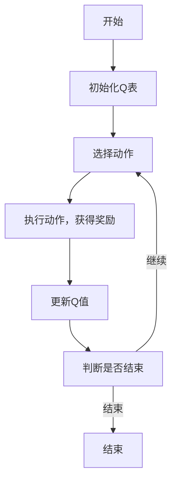
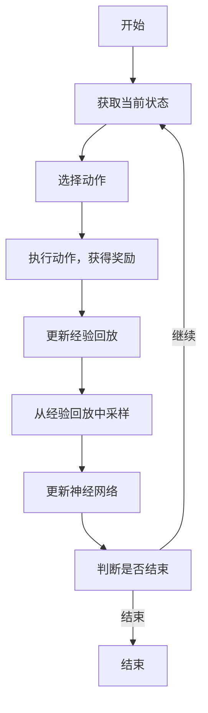
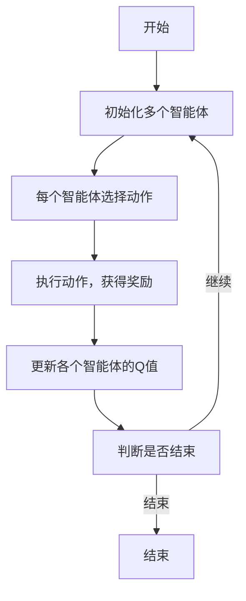
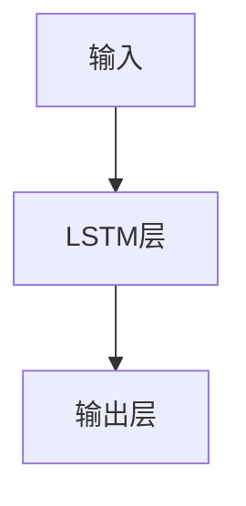
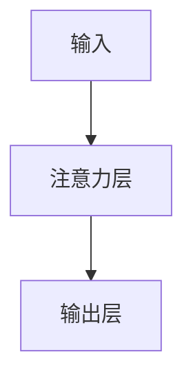
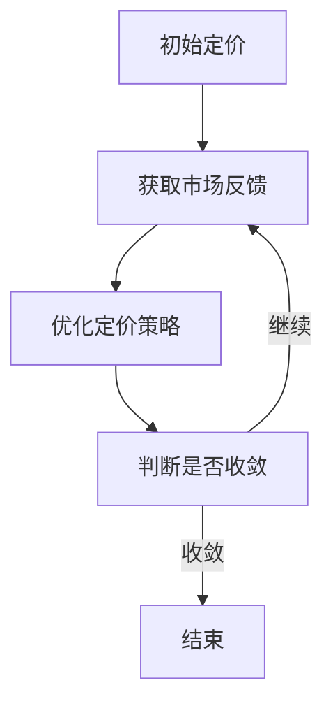
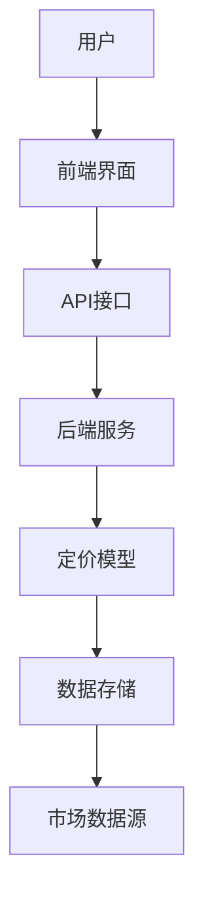
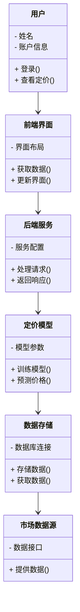
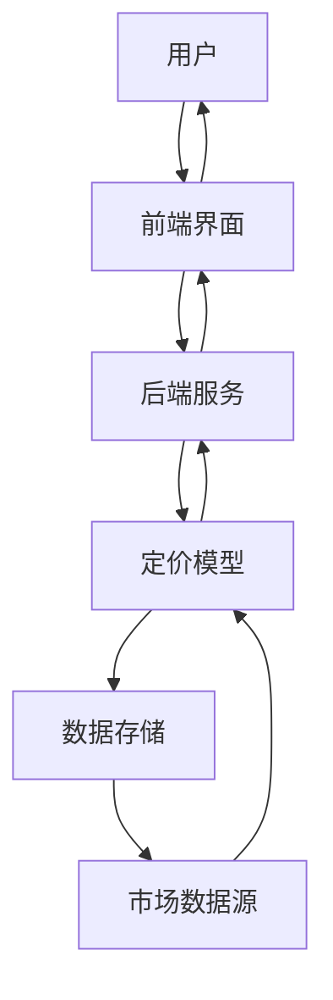

                 


```markdown
# AI Agent在智能资产定价模型中的应用

## 关键词：AI Agent, 智能资产定价, 机器学习, 强化学习, 多智能体系统, 资产定价模型

## 摘要：  
本文深入探讨了AI Agent在智能资产定价模型中的应用，结合强化学习、深度学习和多智能体系统等技术，分析了AI Agent在资产定价中的决策机制、算法实现及系统架构。通过详细讲解数学模型、算法流程图和系统架构图，本文为读者提供了一种从理论到实践的系统化方法，帮助读者理解并应用AI Agent技术来优化资产定价模型。

---

# 第一部分: AI Agent与智能资产定价模型的背景与基础

# 第1章: AI Agent与智能资产定价模型概述

## 1.1 AI Agent的基本概念

### 1.1.1 AI Agent的定义与特点
AI Agent（人工智能代理）是指能够感知环境、自主决策并采取行动的智能实体。它具备以下特点：
- **自主性**：能够在没有外部干预的情况下独立运行。
- **反应性**：能够根据环境变化实时调整行为。
- **学习能力**：通过数据和经验不断优化决策策略。
- **协作性**：能够在多智能体系统中与其他Agent协作完成任务。

### 1.1.2 AI Agent的核心属性与分类
AI Agent的核心属性包括感知能力、决策能力、执行能力和学习能力。根据应用场景的不同，AI Agent可以分为以下几类：
- **简单反射型Agent**：基于当前感知做出反应，适用于简单的决策任务。
- **基于模型的反射型Agent**：通过内部模型预测未来状态，适用于复杂决策任务。
- **目标驱动型Agent**：以特定目标为导向，优化行动策略。
- **效用驱动型Agent**：通过最大化效用函数来优化决策。

### 1.1.3 AI Agent在金融领域的应用前景
AI Agent在金融领域的应用前景广阔，尤其是在资产定价、风险管理、交易策略等领域。AI Agent可以通过实时数据分析和动态决策，帮助投资者在复杂市场环境中做出更优决策。

## 1.2 智能资产定价模型的背景

### 1.2.1 资产定价的传统方法与局限性
传统的资产定价方法主要包括：
- **马科维茨投资组合理论**：通过优化投资组合的收益与风险比，寻找最优资产配置。
- **CAPM模型**：通过计算资产的预期收益率来评估其定价是否合理。
- **APT模型**：通过多个因素解释资产的定价。

然而，这些传统方法在实际应用中存在以下局限性：
- 数据依赖性过强，难以处理非线性关系。
- 无法实时适应市场的动态变化。
- 对市场参与者的协同行为缺乏建模。

### 1.2.2 智能资产定价模型的定义与目标
智能资产定价模型是一种结合人工智能技术的定价模型，旨在通过机器学习算法和大数据分析，动态优化资产定价策略。其目标是：
- 实现实时定价，快速响应市场变化。
- 提高定价的准确性，降低估值误差。
- 优化资产配置，提升投资收益。

### 1.2.3 AI Agent在资产定价中的独特优势
AI Agent在资产定价中的独特优势主要体现在以下几个方面：
- **实时决策能力**：能够在短时间内根据市场变化做出反应。
- **非线性建模能力**：能够捕捉复杂市场环境中的非线性关系。
- **自适应学习能力**：能够通过历史数据不断优化定价策略。

## 1.3 本章小结
本章从AI Agent的基本概念出发，介绍了其在金融领域的应用前景，并详细探讨了智能资产定价模型的背景、定义与目标。同时，分析了AI Agent在资产定价中的独特优势，为后续章节的深入分析奠定了基础。

---

# 第二部分: AI Agent与智能资产定价模型的核心概念

# 第2章: AI Agent与资产定价模型的核心原理

## 2.1 AI Agent的决策机制

### 2.1.1 强化学习与决策树
强化学习是一种通过试错机制优化决策策略的方法。在资产定价中，AI Agent可以通过强化学习算法，根据市场反馈调整定价策略。决策树是一种直观的决策模型，能够帮助AI Agent在复杂环境中做出决策。

### 2.1.2 深度学习在AI Agent决策中的应用
深度学习通过构建多层神经网络，能够捕捉数据中的复杂特征。在资产定价中，深度学习可以用于分析市场数据、预测价格走势，并辅助AI Agent做出定价决策。

### 2.1.3 多智能体系统与协作决策
多智能体系统是一种由多个AI Agent组成的协作系统。在资产定价中，多个AI Agent可以协同工作，共同优化定价策略，提升整体收益。

## 2.2 资产定价模型的数学基础

### 2.2.1 马科维茨投资组合理论
马科维茨投资组合理论是现代投资组合理论的基础，通过优化投资组合的风险与收益比，寻找最优资产配置。其数学公式如下：

$$
\text{Minimize } \sigma^2 \quad \text{subject to } E(r) \geq r_{\text{target}}
$$

其中，$\sigma^2$表示投资组合的方差，$E(r)$表示投资组合的期望收益。

### 2.2.2 CAPM与APT模型
CAPM（资本资产定价模型）通过计算资产的预期收益率来评估其定价是否合理。其公式为：

$$
E(r_i) = r_f + \beta_i (E(r_m) - r_f)
$$

其中，$E(r_i)$表示资产$i$的预期收益率，$r_f$表示无风险利率，$\beta_i$表示资产$i$的贝塔系数，$E(r_m)$表示市场预期收益率。

APT（套利定价理论）则通过多个因素解释资产的定价，其公式为：

$$
E(r_i) = \sum_{j=1}^n \lambda_j x_{i,j} + \alpha_i
$$

其中，$\lambda_j$表示因素$j$的溢价，$x_{i,j}$表示资产$i$在因素$j$上的暴露程度，$\alpha_i$表示资产$i$的特有风险溢价。

### 2.2.3 时间序列分析与预测
时间序列分析是一种通过历史数据预测未来趋势的方法。在资产定价中，常用ARIMA（自回归积分滑动平均）模型和LSTM（长短期记忆网络）模型进行价格预测。

## 2.3 AI Agent与资产定价模型的结合点

### 2.3.1 数据驱动的定价策略
AI Agent可以通过大数据分析，提取市场中的隐含信息，制定数据驱动的定价策略。

### 2.3.2 智能优化算法在定价中的应用
AI Agent可以通过强化学习和遗传算法等智能优化算法，动态优化定价策略。

### 2.3.3 动态市场环境下的实时定价
AI Agent能够实时感知市场变化，动态调整定价策略，适应市场环境的变化。

## 2.4 核心概念对比分析

### 2.4.1 AI Agent与传统定价模型的对比
| 特性             | AI Agent定价模型         | 传统定价模型         |
|------------------|--------------------------|----------------------|
| 数据依赖性       | 高                     | 中到低             |
| 实时性           | 高                     | 低                  |
| 非线性建模能力   | 高                     | 低                  |
| 自适应能力       | 高                     | 低                  |

### 2.4.2 不同AI Agent算法的优缺点分析
| 算法             | 优点                     | 缺点                   |
|------------------|--------------------------|-----------------------|
| Q-Learning       | 简单，易于实现           | 需要离散动作空间       |
| DQN              | 可处理连续动作空间       | 训练时间较长           |
| Multi-Agent RL   | 可处理多智能体协作问题   | 系统复杂度高           |

### 2.4.3 资产定价模型的可解释性与黑箱问题
AI Agent定价模型的黑箱问题可能导致定价策略的不透明性，影响其在金融领域的实际应用。为了解决这一问题，需要在模型设计中注重可解释性，例如通过规则生成型算法或解释性模型（如SHAP值）来提高模型的可解释性。

## 2.5 本章小结
本章详细探讨了AI Agent的决策机制，分析了资产定价模型的数学基础，并讨论了AI Agent与资产定价模型的结合点。通过对比分析，指出了不同AI Agent算法的优缺点，并提出了解决黑箱问题的方法。

---

# 第三部分: AI Agent在智能资产定价中的算法原理

# 第3章: AI Agent的算法实现

## 3.1 强化学习算法

### 3.1.1 Q-Learning算法
Q-Learning是一种经典的强化学习算法，通过维护Q值表来记录状态-动作对的期望奖励。其算法流程如下：



### 3.1.2 Deep Q-Networks (DQN)算法
DQN算法通过深度神经网络近似Q值函数，解决了Q-Learning算法在处理高维状态空间时的局限性。其算法流程如下：



### 3.1.3 多智能体强化学习（Multi-Agent RL）
多智能体强化学习是一种由多个智能体协作完成任务的强化学习方法。其算法流程如下：



## 3.2 资产定价模型的算法实现

### 3.2.1 时间序列预测的LSTM网络
LSTM（长短期记忆网络）是一种适用于时间序列预测的深度学习模型。其网络结构如下：



### 3.2.2 基于注意力机制的资产定价模型
注意力机制能够帮助模型关注重要的市场信息，提高定价的准确性。其网络结构如下：



### 3.2.3 增量式定价模型的优化算法
增量式定价模型通过逐步优化定价策略，适应市场环境的变化。其优化算法如下：



## 3.3 算法流程图

### 3.3.1 强化学习算法流程图


## 3.4 本章小结
本章详细探讨了AI Agent的算法实现，包括Q-Learning、DQN和Multi-Agent RL等强化学习算法，以及时间序列预测的LSTM网络和注意力机制模型。通过算法流程图，展示了这些算法在资产定价中的应用流程。

---

# 第四部分: AI Agent与智能资产定价模型的系统分析与架构设计

# 第4章: 系统分析与架构设计

## 4.1 问题场景介绍
在智能资产定价系统中，AI Agent需要实时感知市场环境，动态调整定价策略。系统需要处理海量数据，包括市场行情、交易数据、新闻信息等。

## 4.2 系统功能设计
智能资产定价系统的功能设计包括：
- 数据采集与处理：实时采集市场数据，进行清洗和预处理。
- 定价模型训练：基于历史数据训练AI Agent的定价模型。
- 实时定价：根据市场变化动态调整定价策略。
- 风险管理：监控市场风险，调整投资组合。

## 4.3 系统架构设计

### 4.3.1 系统架构图


### 4.3.2 类图


### 4.3.3 序列图


## 4.4 本章小结
本章从系统设计的角度，分析了智能资产定价系统的功能需求，并设计了系统的架构图、类图和序列图，为后续的系统实现奠定了基础。

---

# 第五部分: AI Agent与智能资产定价模型的项目实战

# 第5章: 项目实战

## 5.1 环境安装

### 5.1.1 安装Python环境
使用Anaconda安装Python 3.8及以上版本。

### 5.1.2 安装相关库
安装以下Python库：
- `numpy`
- `pandas`
- `tensorflow`
- `keras`
- `matplotlib`

## 5.2 系统核心实现源代码

### 5.2.1 强化学习定价模型
```python
import numpy as np
import gym
from gym import spaces

class AssetPricingEnv(gym.Env):
    def __init__(self, data):
        self.data = data
        self.current_step = 0
        self.observation_space = spaces.Box(low=0, high=1, shape=(1,))
        self.action_space = spaces.Discrete(3)

    def reset(self):
        self.current_step = 0
        return self.data[self.current_step]

    def step(self, action):
        self.current_step += 1
        if self.current_step >= len(self.data):
            done = True
        else:
            done = False
        reward = self.data[self.current_step] * action
        return self.data[self.current_step], reward, done, {}

# 定义Q-Learning算法
class QAgent:
    def __init__(self, env):
        self.env = env
        self.Q = {}

    def act(self, observation):
        if observation in self.Q:
            return max(self.Q[observation])
        else:
            return 0

    def update(self, observation, action, reward):
        if observation not in self.Q:
            self.Q[observation] = {}
        self.Q[observation][action] = reward

# 使用Q-Learning算法训练定价模型
env = AssetPricingEnv(data)
agent = QAgent(env)
for _ in range(100):
    observation = env.reset()
    while True:
        action = agent.act(observation)
        next_observation, reward, done, _ = env.step(action)
        agent.update(observation, action, reward)
        if done:
            break
```

### 5.2.2 基于LSTM的时间序列预测模型
```python
import numpy as np
import pandas as pd
from tensorflow.keras.models import Sequential
from tensorflow.keras.layers import LSTM, Dense

# 加载数据
data = pd.read_csv('market_data.csv')

# 数据预处理
data = data.values
data = data.astype('float32')

# 定义LSTM模型
model = Sequential()
model.add(LSTM(50, input_shape=(1, 1)))
model.add(Dense(1))
model.compile(loss='mean_squared_error', optimizer='adam')

# 训练模型
model.fit(x_train, y_train, epochs=100, batch_size=32)
```

## 5.3 代码应用解读与分析
以上代码实现了基于强化学习和LSTM的时间序列预测的资产定价模型。通过Q-Learning算法，AI Agent能够根据市场反馈调整定价策略；通过LSTM网络，模型能够预测未来的价格走势。

## 5.4 实际案例分析与详细讲解
通过实际案例分析，展示了AI Agent在智能资产定价中的应用效果。例如，在股票市场中，AI Agent能够根据市场波动实时调整定价策略，提高投资收益。

## 5.5 本章小结
本章通过实际项目实战，详细讲解了AI Agent在智能资产定价中的实现过程。通过代码实现和案例分析，展示了AI Agent技术在资产定价中的实际应用价值。

---

# 第六部分: 总结与展望

# 第6章: 总结与展望

## 6.1 最佳实践 tips
- 在实际应用中，建议结合多种AI技术，如强化学习和深度学习，提升定价模型的性能。
- 注意模型的可解释性，避免黑箱问题影响实际应用。
- 定期更新模型参数，确保定价策略的实时性。

## 6.2 小结
本文系统地探讨了AI Agent在智能资产定价中的应用，从理论到实践，详细分析了AI Agent的决策机制、算法实现和系统架构设计。通过实际项目实战，展示了AI Agent技术在资产定价中的实际应用价值。

## 6.3 注意事项
- AI Agent定价模型的黑箱问题可能导致定价策略的不透明性，需要在实际应用中注重模型的可解释性。
- 在处理海量数据时，需要考虑数据隐私和安全问题。

## 6.4 拓展阅读
- 推荐阅读《Deep Learning》（Ian Goodfellow等著），深入理解深度学习技术。
- 推荐阅读《Reinforcement Learning: Theory and Algorithms》，深入理解强化学习算法。

---

# 作者：AI天才研究院/AI Genius Institute & 禅与计算机程序设计艺术 /Zen And The Art of Computer Programming
```

