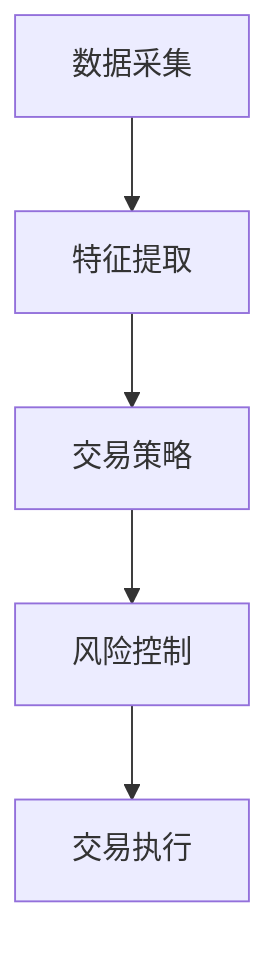

                 


# AI Agent在智能资产管理中的实践

> **关键词**：AI Agent、智能资产管理、强化学习、算法交易、风险控制

> **摘要**：  
本文深入探讨了AI Agent在智能资产管理中的实践应用，从AI Agent的核心概念到其在资产管理中的具体应用场景进行了全面分析。文章首先介绍了AI Agent的基本概念及其在智能资产管理中的定位，随后详细讲解了AI Agent的核心算法原理，包括强化学习、监督学习等。接着，文章从系统架构的角度分析了智能资产管理系统的构建，结合实际案例详细阐述了AI Agent在股票交易中的具体实现。最后，文章总结了AI Agent在智能资产管理中的最佳实践和未来发展方向。

---

# 第一部分: AI Agent与智能资产管理概述

## 第1章: AI Agent与智能资产管理的背景介绍

### 1.1 AI Agent的基本概念

#### 1.1.1 AI Agent的定义与特点
AI Agent（人工智能代理）是指能够感知环境、自主决策并执行任务的智能实体。它具备以下特点：
- **自主性**：能够在没有外部干预的情况下独立运作。
- **反应性**：能够实时感知环境并做出响应。
- **目标导向**：通过设定目标来驱动行为。
- **学习能力**：能够通过经验优化自身的决策能力。

#### 1.1.2 AI Agent的核心要素与功能
AI Agent的核心要素包括：
- **感知模块**：用于获取环境中的信息（如市场数据）。
- **决策模块**：基于感知信息进行分析并制定策略。
- **执行模块**：将决策转化为具体行动。

AI Agent的功能主要体现在以下几个方面：
- 数据处理与分析
- 自动化决策
- 风险控制

#### 1.1.3 AI Agent的分类与应用场景
AI Agent可以根据应用场景分为以下几类：
- **基于规则的AI Agent**：通过预定义的规则进行决策。
- **基于学习的AI Agent**：通过机器学习算法进行决策优化。
- **混合型AI Agent**：结合规则与学习的混合型代理。

AI Agent在资产管理中的应用场景包括：
- 自动化交易
- 风险管理
- 资产配置

---

### 1.2 智能资产管理的背景与挑战

#### 1.2.1 资产管理的基本概念与传统模式
资产管理是指通过投资组合优化、风险控制等手段，实现资产保值增值的过程。传统的资产管理模式主要依赖人工分析和经验判断，存在效率低、决策滞后等问题。

#### 1.2.2 数字化与智能化转型的驱动力
随着大数据、人工智能等技术的发展，资产管理行业正在向数字化和智能化方向转型。这种转型的驱动力包括：
- 数据量的爆炸式增长
- 计算能力的提升
- 人工智能算法的进步

#### 1.2.3 当前智能资产管理的主要挑战
在智能资产管理中，主要面临以下挑战：
- 数据质量与完整性
- 模型过拟合与鲁棒性
- 市场不确定性与黑天鹅事件

---

### 1.3 AI Agent在智能资产管理中的定位与作用

#### 1.3.1 AI Agent如何赋能智能资产管理
AI Agent通过以下方式赋能智能资产管理：
- 提供实时市场监控
- 自动化交易决策
- 风险预警与控制

#### 1.3.2 AI Agent与传统资产管理的对比
| 对比维度 | 传统资产管理 | AI Agent赋能的智能资产管理 |
|----------|--------------|-----------------------------|
| 决策效率 | 依赖人工分析，效率低 | 实时分析，决策速度快 |
| 精准度   | 受主观因素影响大 | 数据驱动，决策精准 |
| 可扩展性 | 有限 | 支持大规模数据处理 |

#### 1.3.3 AI Agent在智能资产管理中的核心价值
- 提高决策效率
- 优化投资组合
- 实时风险管理

---

## 1.4 本章小结
本章从AI Agent的基本概念出发，介绍了其在智能资产管理中的定位与作用，并分析了智能资产管理的背景与挑战。AI Agent通过实时感知、自主决策和学习优化，为智能资产管理提供了强大的技术支撑。

---

# 第二部分: AI Agent的核心概念与原理

## 第2章: AI Agent的核心概念与原理

### 2.1 AI Agent的核心概念

#### 2.1.1 知识表示与推理
知识表示是AI Agent理解世界的基础。常见的知识表示方法包括：
- **逻辑表示**：使用逻辑规则表示知识。
- **语义网络**：通过节点和边表示概念及其关系。
- **概率表示**：通过概率分布表示不确定性。

知识推理是通过已有的知识库进行逻辑推导的过程，常用的推理方法包括：
- **演绎推理**：从一般到特殊的推理。
- **归纳推理**：从特殊到一般的推理。

#### 2.1.2 行为决策与规划
行为决策是AI Agent的核心功能之一。常见的决策方法包括：
- **基于规则的决策**：通过预定义的规则进行决策。
- **基于模型的决策**：通过构建数学模型进行决策优化。
- **基于学习的决策**：通过机器学习算法进行决策优化。

行为规划是通过制定行动计划来实现目标的过程，常用的规划方法包括：
- **无结构规划**：直接生成行动计划。
- **结构化规划**：通过分解任务生成行动计划。

#### 2.1.3 状态感知与反馈
状态感知是AI Agent理解环境的关键。常见的状态感知方法包括：
- **基于传感器的感知**：通过传感器获取环境信息。
- **基于模型的感知**：通过模型模拟环境状态。

反馈机制是AI Agent调整行为的重要手段，常用的反馈方法包括：
- **强化学习**：通过奖励机制调整行为。
- **监督学习**：通过标注数据调整行为。

---

### 2.2 AI Agent的算法原理

#### 2.2.1 强化学习算法
强化学习是一种通过试错机制优化决策的算法。常见的强化学习算法包括：
- **Q-learning**：通过更新Q值表来优化决策。
- **Deep Q-Network (DQN)**：通过深度神经网络近似Q值函数。

Q-learning的数学公式如下：
$$ Q(s, a) = r + \gamma \max Q(s', a') $$

#### 2.2.2 监督学习算法
监督学习是一种通过标注数据进行分类或回归的算法。常用的监督学习算法包括：
- **线性回归**：用于回归问题。
- **支持向量机 (SVM)**：用于分类问题。

线性回归的数学公式如下：
$$ y = w x + b $$

#### 2.2.3 聚类与分类算法
聚类算法用于将数据分为不同的类别，常用的聚类算法包括：
- **K-means**：基于距离的聚类算法。
- **层次聚类**：基于层次结构的聚类算法。

分类算法用于对数据进行分类，常用的分类算法包括：
- **决策树**：基于树结构的分类算法。
- **随机森林**：基于集成学习的分类算法。

---

### 2.3 AI Agent的数学模型与公式

#### 2.3.1 Q-learning算法公式
$$ Q(s, a) = r + \gamma \max Q(s', a') $$
其中：
- \( Q(s, a) \) 表示当前状态下采取动作 \( a \) 的Q值。
- \( r \) 表示奖励值。
- \( \gamma \) 表示折扣因子。
- \( s' \) 表示下一个状态。

#### 2.3.2 神经网络模型的数学表达
$$ y = \sigma(w x + b) $$
其中：
- \( x \) 表示输入数据。
- \( w \) 表示权重。
- \( b \) 表示偏置。
- \( \sigma \) 表示激活函数。

---

### 2.4 本章小结
本章详细讲解了AI Agent的核心概念与算法原理，包括知识表示与推理、行为决策与规划、状态感知与反馈等内容。通过数学公式和算法流程图，进一步阐述了强化学习、监督学习等算法的实现原理。

---

# 第三部分: AI Agent在智能资产管理中的应用

## 第3章: 智能资产管理中的AI Agent应用场景

### 3.1 股票交易中的AI Agent应用

#### 3.1.1 股票市场数据的特征提取
股票市场数据的特征提取是AI Agent进行股票交易的基础。常用的特征包括：
- **技术指标**：如移动平均线、相对强弱指数等。
- **市场情绪**：如新闻情感分析、社交媒体情绪等。
- **基本面指标**：如市盈率、市净率等。

#### 3.1.2 基于AI Agent的交易策略
基于AI Agent的交易策略主要包括：
- **强化学习策略**：通过试错机制优化交易决策。
- **监督学习策略**：基于历史数据进行分类或回归分析。
- **混合策略**：结合多种策略进行优化。

#### 3.1.3 AI Agent在风险控制中的作用
AI Agent可以通过以下方式实现风险控制：
- **实时监控市场波动**：通过状态感知模块实时监控市场风险。
- **动态调整投资组合**：通过行为决策模块动态优化投资组合。
- **风险预警**：通过反馈机制提前预警潜在风险。

---

### 3.2 债券与基金投资中的AI Agent应用

#### 3.2.1 债券评级与投资决策
AI Agent可以通过以下方式实现债券评级与投资决策：
- **基于信用评分模型的评级**：通过监督学习算法对债券进行评级。
- **基于市场情绪的评级调整**：通过自然语言处理技术分析新闻和社交媒体情绪，调整债券评级。

#### 3.2.2 基金组合优化
AI Agent可以通过以下方式优化基金组合：
- **基于现代投资组合理论（MPT）的优化**：通过数学模型优化投资组合的风险与收益。
- **基于强化学习的优化**：通过强化学习算法动态优化投资组合。

---

### 3.3 AI Agent在智能资产配置中的应用

#### 3.3.1 资产配置的理论基础
资产配置的理论基础包括：
- **现代投资组合理论（MPT）**：通过优化投资组合的风险与收益。
- **均值-方差优化**：通过数学模型优化投资组合的收益与风险。

#### 3.3.2 基于AI Agent的资产配置策略
基于AI Agent的资产配置策略主要包括：
- **动态资产配置**：根据市场变化动态调整资产配置。
- **因子投资**：基于因子模型进行资产配置。

---

## 3.4 本章小结
本章通过具体案例分析了AI Agent在股票交易、债券与基金投资、资产配置等场景中的应用。AI Agent通过实时感知、自主决策和学习优化，显著提高了智能资产管理的效率与精度。

---

# 第四部分: 项目实战

## 第4章: 基于AI Agent的股票交易系统开发

### 4.1 项目介绍
本项目旨在开发一个基于AI Agent的股票交易系统，实现自动化交易和风险控制。

### 4.2 系统功能设计

#### 4.2.1 系统功能模块
系统功能模块包括：
- **数据采集模块**：采集股票市场数据。
- **特征提取模块**：提取股票市场特征。
- **交易策略模块**：基于AI Agent的交易策略。
- **风险控制模块**：实现风险监控与预警。

#### 4.2.2 系统功能流程图


---

### 4.3 系统架构设计

#### 4.3.1 系统架构图


#### 4.3.2 系统接口设计
系统接口包括：
- **数据接口**：与数据源对接。
- **交易接口**：与交易系统对接。
- **用户接口**：与用户交互。

---

### 4.4 项目实战代码实现

#### 4.4.1 环境安装
安装所需的Python库：
```bash
pip install numpy pandas scikit-learn tensorflow
```

#### 4.4.2 核心代码实现
```python
import numpy as np
import pandas as pd
from sklearn.model import svm
from tensorflow.keras import layers

# 数据采集
data = pd.read_csv('stock_data.csv')

# 特征提取
features = data[['open', 'close', 'high', 'low', 'volume']]
labels = data['label']

# 模型训练
model = svm.SVC()
model.fit(features, labels)

# 模型预测
predictions = model.predict(features)
```

---

### 4.5 项目小结
本章通过具体案例详细讲解了基于AI Agent的股票交易系统开发，包括项目介绍、系统功能设计、系统架构设计和核心代码实现。通过实际操作，读者可以更好地理解AI Agent在智能资产管理中的具体应用。

---

# 第五部分: 最佳实践与未来展望

## 第5章: 最佳实践与未来展望

### 5.1 最佳实践

#### 5.1.1 小结
本章总结了AI Agent在智能资产管理中的最佳实践，包括：
- 数据质量管理
- 模型优化与调参
- 系统测试与验证

#### 5.1.2 注意事项
在实际应用中，需要注意以下几点：
- 数据质量和完整性
- 模型的可解释性
- 系统的鲁棒性

#### 5.1.3 拓展阅读
推荐以下拓展阅读内容：
- 《机器学习实战》
- 《强化学习（书籍）》
- 《智能投顾：从入门到精通》

---

### 5.2 未来展望

#### 5.2.1 AI Agent与智能资产管理的未来发展
随着AI技术的不断进步，AI Agent在智能资产管理中的应用前景广阔。未来的发展方向包括：
- **多模态数据处理**：结合文本、图像等多种数据源进行分析。
- **自适应决策优化**：通过强化学习实现动态优化。
- **跨市场与跨资产投资**：实现全球化资产配置。

#### 5.2.2 技术创新与突破
技术创新与突破的方向包括：
- **更高效的算法**：如图神经网络、Transformer等。
- **更强大的计算能力**：如量子计算、边缘计算等。
- **更智能的交互方式**：如自然语言处理、语音识别等。

---

## 5.3 本章小结
本章总结了AI Agent在智能资产管理中的最佳实践，并展望了未来的发展方向。通过技术创新与实践积累，AI Agent将在智能资产管理中发挥更大的作用。

---

# 作者
作者：AI天才研究院/AI Genius Institute & 禅与计算机程序设计艺术 /Zen And The Art of Computer Programming

