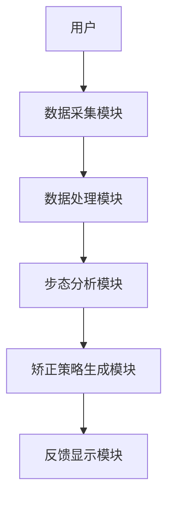
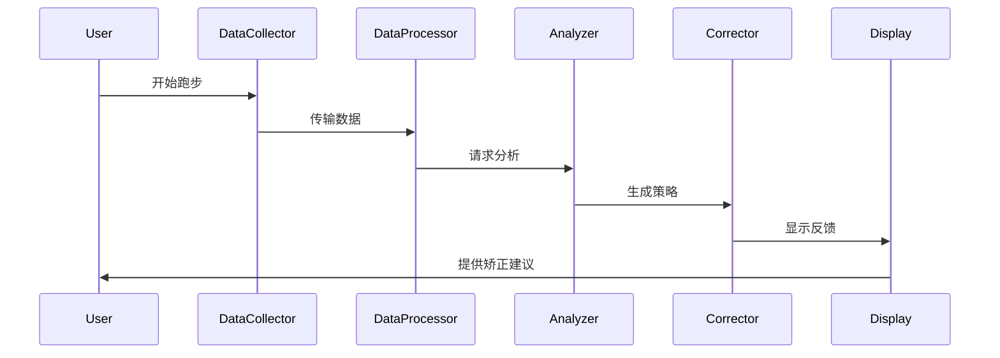

                 


# AI Agent在智能跑步鞋中的步态矫正指导

> 关键词：AI Agent，智能跑步鞋，步态矫正，运动健康，人工智能，算法设计

> 摘要：本文详细探讨了AI Agent在智能跑步鞋中的步态矫正应用。从背景介绍到核心算法，从系统架构到项目实战，系统地分析了AI Agent如何通过数据采集、特征提取、算法设计和反馈机制来实现个性化的步态矫正指导。文章结合理论与实践，深入剖析了步态矫正的技术原理和实现方案，并通过具体案例展示了AI Agent在运动健康领域的实际应用价值。

---

## 第1章: AI Agent与智能跑步鞋的背景介绍

### 1.1 AI Agent的基本概念
#### 1.1.1 AI Agent的定义与特点
AI Agent（人工智能代理）是指能够感知环境、做出决策并执行任务的智能系统。其特点包括自主性、反应性、目标导向和学习能力。在智能跑步鞋中，AI Agent通过传感器数据实时分析用户的跑步姿势和步态，提供个性化的矫正建议。

#### 1.1.2 智能跑步鞋的基本概念
智能跑步鞋是一种集成了多种传感器和智能算法的运动装备，能够实时采集用户的跑步数据，如步频、步长、鞋底压力分布等，并通过AI技术提供反馈和建议。

#### 1.1.3 AI Agent在智能跑步鞋中的作用
AI Agent通过分析用户的步态数据，识别潜在的步态问题，并提供实时矫正指导，帮助用户改善跑步姿势，预防运动损伤，提升运动表现。

### 1.2 步态矫正的必要性
#### 1.2.1 步态问题的定义与分类
步态问题包括过度内翻、外翻、步频过快或过慢等。这些问题可能导致运动损伤或运动效率低下。

#### 1.2.2 步态问题对运动表现的影响
步态问题不仅影响跑步速度和耐力，还可能导致膝盖、踝关节等部位的损伤。

#### 1.2.3 步态矫正的技术需求
传统步态矫正方法依赖于人工观察和经验判断，而AI Agent可以通过实时数据分析提供更精准、个性化的矫正建议。

---

## 第2章: AI Agent步态矫正的核心原理

### 2.1 步态分析的原理
#### 2.1.1 数据采集与特征提取
AI Agent通过鞋底的传感器采集用户的跑步数据，包括加速度、角速度、压力分布等，并提取关键特征，如步频、步长、步态周期等。

#### 2.1.2 步态特征的分类与识别
通过机器学习算法（如随机森林、支持向量机等），对步态特征进行分类，识别用户的步态问题类型。

### 2.2 AI Agent的决策机制
#### 2.2.1 数据分析与模式识别
AI Agent利用统计分析和模式识别技术，从大量数据中提取规律，识别用户的步态问题。

#### 2.2.2 矫正策略的生成与优化
根据识别的步态问题，AI Agent生成个性化的矫正策略，并通过实时反馈优化矫正效果。

---

## 第3章: 步态矫正系统的核心要素对比

### 3.1 步态矫正系统的关键因素
#### 3.1.1 数据采集设备的性能对比
不同传感器的精度和采样率直接影响步态分析的准确性。高精度传感器能够捕捉更细腻的运动数据。

#### 3.1.2 算法的准确率与效率对比
不同算法在步态分析中的准确率和效率存在差异。例如，深度学习算法在复杂场景下的表现优于传统算法。

#### 3.1.3 用户反馈机制的优劣
实时反馈机制能够快速指导用户调整步态，而延迟反馈则可能影响矫正效果。

---

## 第4章: 步态矫正算法的设计与实现

### 4.1 算法原理
#### 4.1.1 数据预处理
对采集的原始数据进行去噪和平滑处理，提取有用的特征。

#### 4.1.2 特征提取
通过傅里叶变换、主成分分析等方法，提取步态特征。

#### 4.1.3 分类器设计
使用随机森林、支持向量机等算法，对步态问题进行分类。

#### 4.1.4 模型优化
通过交叉验证和网格搜索，优化模型参数，提升分类准确率。

### 4.2 算法实现
```python
import numpy as np
from sklearn.ensemble import RandomForestClassifier
from sklearn.metrics import accuracy_score

# 示例数据
X = np.random.rand(100, 5)
y = np.random.randint(0, 4, 100)

# 模型训练
model = RandomForestClassifier()
model.fit(X, y)

# 预测与评估
y_pred = model.predict(X)
print("Accuracy:", accuracy_score(y, y_pred))
```

---

## 第5章: 系统架构与交互设计

### 5.1 系统架构


### 5.2 系统交互


---

## 第6章: 项目实战与优化

### 6.1 项目环境搭建
- 安装必要的库：Python、TensorFlow、Scikit-learn、OpenCV

### 6.2 核心代码实现
```python
import numpy as np
from sklearn.model_selection import train_test_split
from sklearn.metrics import classification_report

# 示例数据集
X = np.random.rand(500, 5)
y = np.random.randint(0, 5, 500)

# 划分训练集和测试集
X_train, X_test, y_train, y_test = train_test_split(X, y, test_size=0.2)

# 训练模型
model = RandomForestClassifier()
model.fit(X_train, y_train)

# 预测与评估
y_pred = model.predict(X_test)
print(classification_report(y_test, y_pred))
```

### 6.3 实际案例分析
通过对实际跑步数据的分析，展示AI Agent如何识别步态问题并提供矫正建议。

### 6.4 系统优化
- 提高传感器精度
- 优化算法模型
- 改善用户反馈机制

---

## 第7章: 总结与展望

### 7.1 核心总结
AI Agent通过实时数据分析和智能算法，能够有效识别步态问题并提供个性化的矫正指导。

### 7.2 展望未来
随着AI技术的不断发展，智能跑步鞋的功能将更加智能化和个性化，为运动健康领域带来更多创新。

---

## 作者信息

作者：AI天才研究院/AI Genius Institute & 禅与计算机程序设计艺术 /Zen And The Art of Computer Programming

---

以上是文章的目录大纲和部分内容示例，希望对您有所帮助！

