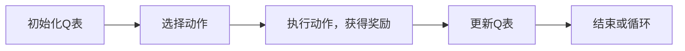
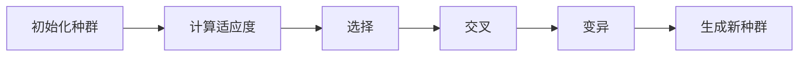
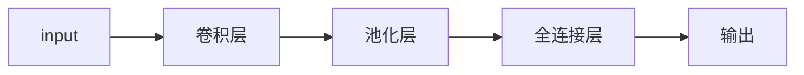
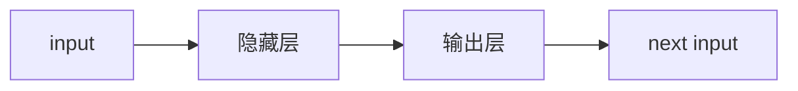
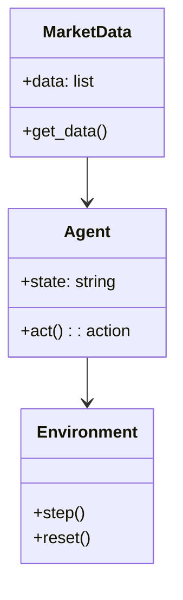
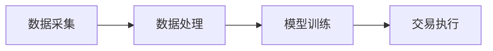

                 


# AI Agent在智能金融市场分析中的应用

> **关键词：** AI Agent, 智能金融市场, 金融市场分析, 加强学习, 金融市场预测, 自动化交易  
> 
> **摘要：**  
> 本文探讨了AI Agent在智能金融市场分析中的应用，从背景、核心概念、算法原理到系统设计和项目实战，全面解析了AI Agent如何赋能金融市场分析。文章通过详细的技术分析和实际案例，展示了AI Agent在股票价格预测、风险评估与管理、自动化交易等场景中的潜力和优势，同时结合数学模型和算法流程图，深入浅出地讲解了其技术实现的复杂性和挑战性。

---

## 第1章: AI Agent与智能金融市场的背景介绍

### 1.1 AI Agent的基本概念

#### 1.1.1 AI Agent的定义  
AI Agent（人工智能代理）是指能够感知环境、自主决策并执行任务的智能实体。它通过传感器获取信息，利用知识库和推理机制解决问题，最终通过执行器与环境交互。AI Agent的核心在于其智能性，能够适应复杂多变的环境。

#### 1.1.2 AI Agent的核心特征  
AI Agent具有以下核心特征：  
- **自主性**：无需外部干预，自主决策。  
- **反应性**：能够实时感知环境并做出反应。  
- **目标导向**：基于目标驱动行为。  
- **学习能力**：通过经验改进性能。  

#### 1.1.3 AI Agent在金融领域的应用背景  
金融市场的复杂性和不确定性为AI Agent的应用提供了丰富的场景。金融市场数据复杂，涉及股票价格、交易量、市场情绪等多种因素，AI Agent能够通过实时数据分析和决策支持，帮助投资者和机构做出更明智的决策。

---

### 1.2 智能金融市场的定义与特点

#### 1.2.1 智能金融市场的概念  
智能金融市场是指通过人工智能、大数据、云计算等技术，实现金融市场数据的智能化分析、决策和交易的市场体系。它利用AI技术优化投资决策、风险管理、交易执行等环节。

#### 1.2.2 智能金融市场的核心特征  
- **数据驱动**：依赖大量数据进行分析和决策。  
- **实时性**：能够实时处理市场数据和交易指令。  
- **自动化**：实现自动化交易和风险管理。  
- **智能化**：通过AI技术实现预测和优化。  

#### 1.2.3 智能金融市场的现状  
目前，智能金融市场的发展迅速，AI Agent在股票交易、量化投资、风险控制等领域得到了广泛应用。然而，市场的复杂性和数据的不完整性仍对AI Agent的应用提出了挑战。

---

### 1.3 AI Agent与智能金融市场的结合

#### 1.3.1 AI Agent在金融市场中的作用  
AI Agent在金融市场中的作用包括：  
- **数据分析**：处理和分析大量市场数据。  
- **预测模型**：建立预测模型，帮助投资者做出决策。  
- **自动化交易**：执行自动化交易策略。  

#### 1.3.2 智能金融市场的技术驱动因素  
- **人工智能技术**：包括机器学习、深度学习等。  
- **大数据技术**：支持海量数据的处理和分析。  
- **云计算**：提供强大的计算能力和存储空间。  

#### 1.3.3 AI Agent在智能金融中的应用前景  
随着AI技术的不断发展，AI Agent在智能金融中的应用前景广阔。它可以帮助投资者捕捉市场机会，降低风险，提高交易效率。

---

## 第2章: AI Agent的核心概念与原理

### 2.1 AI Agent的核心概念

#### 2.1.1 知识表示  
知识表示是AI Agent实现智能的基础。常见的知识表示方法包括：  
- **事实表示**：如“苹果是一家公司”。  
- **规则表示**：如“如果价格下跌，投资者可能会卖出”。  
- **图结构表示**：如知识图谱。  

#### 2.1.2 问题求解  
问题求解是AI Agent的核心任务。常用的方法包括：  
- **搜索算法**：如广度优先搜索（BFS）和深度优先搜索（DFS）。  
- **推理算法**：如逻辑推理和概率推理。  

#### 2.1.3 行为选择  
行为选择是AI Agent根据环境信息做出决策的过程。常见的行为选择方法包括：  
- **基于规则的方法**：如根据预设规则选择行为。  
- **基于学习的方法**：如通过强化学习选择最优行为。  

---

### 2.2 AI Agent的类型

#### 2.2.1 简单反射式Agent  
简单反射式Agent基于当前感知做出反应，适用于环境变化缓慢的场景。  
**示例：**  
```python
def simple_agent(sensor_input):
    if sensor_input == 'high_price':
        return 'sell'
    else:
        return 'hold'
```

#### 2.2.2 基于模型的反射式Agent  
基于模型的反射式Agent不仅依赖当前感知，还依赖内部模型进行决策。  
**示例：**  
```python
def model_based_agent(sensor_input, model):
    prediction = model.predict(sensor_input)
    return 'buy' if prediction > 0.5 else 'sell'
```

#### 2.2.3 目标驱动的Agent  
目标驱动的Agent通过优化目标函数进行决策。  
**示例：**  
```python
def goal_driven_agent(sensor_input, target):
    action = argmax_{a} [utility(a, target)]
    return action
```

#### 2.2.4 情感驱动的Agent  
情感驱动的Agent通过分析市场情绪做出决策。  
**示例：**  
```python
def emotional_agent(market_sentiment):
    if market_sentiment == 'positive':
        return 'buy'
    else:
        return 'hold'
```

---

### 2.3 AI Agent的核心原理

#### 2.3.1 知识表示与推理  
知识表示与推理是AI Agent理解和处理知识的关键。常用的推理方法包括：  
- **逻辑推理**：基于逻辑规则进行推理。  
- **概率推理**：基于概率模型进行推理。  

#### 2.3.2 情感分析与市场情绪预测  
情感分析是通过自然语言处理技术分析文本情感，进而预测市场情绪。  
**示例：**  
```python
def sentiment_analysis(text):
    if 'positive' in text:
        return 'positive'
    else:
        return 'negative'
```

#### 2.3.3 多智能体协同  
多智能体协同是指多个AI Agent协同工作，共同完成任务。  
**示例：**  
```python
def multi_agent_cooperation(agent1, agent2):
    action1 = agent1.decision()
    action2 = agent2.decision()
    return action1 + action2
```

---

## 第3章: AI Agent的算法原理与数学模型

### 3.1 基于强化学习的AI Agent算法

#### 3.1.1 强化学习的基本原理  
强化学习是一种通过试错学习的方法，通过与环境的交互获得奖励，优化策略。  
**数学模型：**  
$$ Q(s, a) = Q(s, a) + \alpha (r + \gamma Q(s', a) - Q(s, a)) $$  
其中，$Q$是Q值函数，$\alpha$是学习率，$\gamma$是折扣因子。

#### 3.1.2 Q-Learning算法  
Q-Learning是一种经典的强化学习算法，适用于离散状态和动作空间。  
**流程图：**  


---

### 3.2 基于遗传算法的AI Agent优化

#### 3.2.1 遗传算法的基本原理  
遗传算法是一种模拟自然选择的优化算法，适用于复杂问题的优化。  
**流程图：**  


#### 3.2.2 适应度函数设计  
适应度函数是衡量个体优劣的标准。  
**示例：**  
$$ f(x) = x^2 $$  

---

### 3.3 基于深度学习的AI Agent

#### 3.3.1 卷积神经网络（CNN）  
CNN适用于图像数据的处理。  
**网络结构：**  


#### 3.3.2 循环神经网络（RNN）  
RNN适用于时间序列数据的处理。  
**网络结构：**  


#### 3.3.3 变换器（Transformer）  
变换器是一种基于自注意力机制的模型。  
**数学模型：**  
$$ \text{Attention}(Q, K, V) = \text{softmax}(\frac{QK^T}{\sqrt{d_k}})V $$  

---

## 第4章: AI Agent的系统分析与架构设计

### 4.1 问题场景介绍  
以股票价格预测为例，设计一个基于AI Agent的智能交易系统。

### 4.2 系统功能设计

#### 4.2.1 领域模型设计  
领域模型是系统功能的抽象表示。  
**类图：**  


### 4.3 系统架构设计

#### 4.3.1 总体架构设计  
系统架构包括数据采集、数据处理、模型训练、交易执行四个模块。  
**架构图：**  


---

## 第5章: 项目实战

### 5.1 环境安装  
安装必要的库：  
```bash
pip install numpy pandas scikit-learn tensorflow
```

### 5.2 系统核心实现

#### 5.2.1 数据采集  
从Yahoo Finance获取股票数据。  
```python
import pandas_datareader as pdr
data = pdr.get_data_yahoo('AAPL', start='2020-01-01', end='2023-01-01')
```

#### 5.2.2 模型训练  
训练一个简单的LSTM模型。  
```python
from tensorflow.keras.models import Sequential
from tensorflow.keras.layers import LSTM, Dense

model = Sequential()
model.add(LSTM(64, input_shape=(timesteps, features)))
model.add(Dense(1))
model.compile(loss='mean_squared_error', optimizer='adam')
```

#### 5.2.3 交易执行  
实现一个基于模型的交易策略。  
```python
def execute_trade(signal):
    if signal == 'buy':
        return 'buy'
    elif signal == 'sell':
        return 'sell'
    else:
        return 'hold'
```

---

## 第6章: 高级应用与未来趋势

### 6.1 高级应用

#### 6.1.1 多模态分析  
结合文本、图像等多种数据源进行分析。  
**示例：**  
```python
def multi_modal_analysis(text, image):
    text_sentiment = analyze_sentiment(text)
    image_recognition = recognize_image(image)
    return text_sentiment + image_recognition
```

#### 6.1.2 实时数据处理  
实现实时数据流处理，提升交易效率。  
**示例：**  
```python
from kafka import KafkaConsumer

consumer = KafkaConsumer('finance_topic')
for message in consumer:
    process_data(message.value)
```

---

## 第7章: 总结与展望

### 7.1 本章总结  
本文详细探讨了AI Agent在智能金融市场分析中的应用，从理论到实践，全面解析了其技术实现和应用前景。

### 7.2 未来展望  
随着AI技术的不断进步，AI Agent在智能金融中的应用将更加广泛和深入。未来的研究方向包括多智能体协同、强化学习优化、实时数据处理等领域。

---

## 作者：AI天才研究院 & 禅与计算机程序设计艺术

**感谢阅读！**

