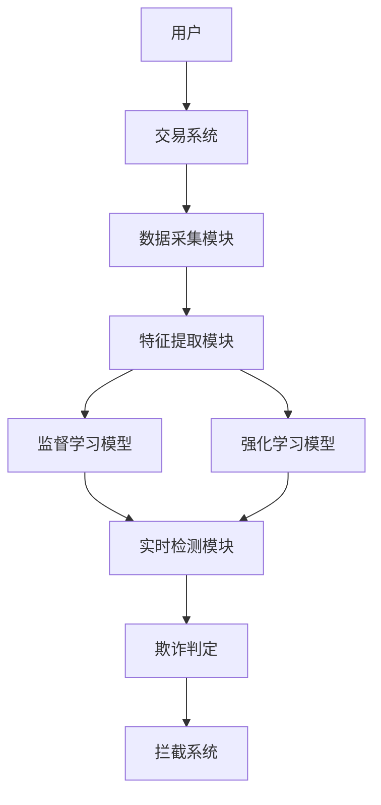

                 


# AI Agent在智能金融欺诈检测中的应用

## 关键词：AI Agent，金融欺诈检测，机器学习，强化学习，实时检测，数据挖掘

## 摘要：  
随着金融交易的日益复杂化和网络化，金融欺诈 detection 的难度也在不断增加。传统的基于规则的检测方法已经难以应对新型的欺诈手段。AI Agent作为一种智能体，能够在复杂环境中自主学习和决策，为金融欺诈 detection 提供了新的解决方案。本文将深入探讨 AI Agent 在金融欺诈 detection 中的应用，分析其核心原理、系统架构、算法实现，并通过实际案例展示其优势。本文还将讨论 AI Agent 在金融欺诈 detection 中的最佳实践和未来发展方向。

---

## 第1章：背景介绍

### 1.1 问题背景  
金融欺诈 detection 是保障金融机构和用户财产安全的重要任务。近年来，金融欺诈手段日益多样化和复杂化，传统的基于规则的检测方法存在效率低、误报率高、难以应对新兴欺诈模式等问题。  

AI Agent 的引入为金融欺诈 detection 带来了新的可能性。AI Agent 是一种智能体，能够通过学习和推理，自主识别异常交易模式，并实时做出决策。  

### 1.2 问题描述  
金融欺诈 detection 的核心挑战在于如何快速、准确地识别异常交易，同时降低误报率和漏报率。传统的基于规则的方法依赖于预先定义的规则，难以应对复杂的新兴欺诈手段。  

AI Agent 的目标是通过机器学习和强化学习等技术，动态学习欺诈模式，并实时做出检测和拦截决策。  

### 1.3 问题解决  
AI Agent 在金融欺诈 detection 中的应用主要体现在以下几个方面：  
1. **实时监控**：通过实时分析交易数据，快速识别潜在的欺诈行为。  
2. **动态学习**：通过机器学习模型，不断更新欺诈检测规则。  
3. **决策优化**：通过强化学习，优化欺诈检测的准确性和效率。  

### 1.4 边界与外延  
AI Agent 的应用范围主要集中在金融交易数据的分析和欺诈 detection 上，但也需要与其他系统（如支付系统、用户身份验证系统）协同工作。  

### 1.5 核心要素与组成  
AI Agent 的核心组成包括感知模块、决策模块和执行模块。感知模块负责收集和分析交易数据；决策模块基于学习模型做出检测决策；执行模块负责拦截欺诈交易并触发报警机制。  

---

## 第2章：核心概念与联系

### 2.1 AI Agent 的核心原理  
AI Agent 的核心原理基于强化学习和监督学习。通过强化学习，AI Agent 能够在与环境的交互中逐步优化决策策略；通过监督学习，AI Agent 能够从历史数据中学习欺诈模式。  

### 2.2 核心概念对比  
| **概念**       | **传统规则引擎**         | **AI Agent**             |  
|----------------|--------------------------|--------------------------|  
| 数据依赖       | 依赖于预先定义的规则     | 依赖于历史数据和实时数据 |  
| 学习能力       | 无法学习新规则           | 具备动态学习能力         |  
| 灵活性          | 较低                     | 较高                     |  

### 2.3 ER 实体关系图  
```mermaid
er
  actor: 用户
  agent: AI Agent
  transaction: 交易记录
  fraud_case: 欺诈案例
  rule: 检测规则
  actor --> transaction: 发起交易
  agent --> transaction: 监测交易
  agent --> fraud_case: 识别欺诈
  fraud_case --> rule: 更新检测规则
```

---

## 第3章：算法原理

### 3.1 算法流程  
AI Agent 在金融欺诈 detection 中的算法流程如下：  
1. **数据收集**：收集交易数据、用户行为数据等。  
2. **特征提取**：提取交易金额、时间、地点等特征。  
3. **模型训练**：使用监督学习（如随机森林、SVM）或强化学习（如DQN）训练检测模型。  
4. **实时检测**：基于训练好的模型，实时分析交易数据，判断是否为欺诈交易。  

### 3.2 算法实现  

#### 3.2.1 监督学习实现  
```python
from sklearn.ensemble import RandomForestClassifier

# 数据预处理
X = df.drop('label', axis=1)
y = df['label']

# 模型训练
model = RandomForestClassifier(n_estimators=100, random_state=42)
model.fit(X, y)

# 模型预测
y_pred = model.predict(X_test)
```

#### 3.2.2 强化学习实现  
```python
import gym
import numpy as np

# 环境定义
class FraudDetectionEnv(gym.Env):
    def __init__(self):
        super(FraudDetectionEnv, self).__init__()
        self.action_space = gym.spaces.Discrete(2)  # 0: 允许交易，1: 拦截交易
        self.observation_space = gym.spaces.Box(low=0, high=1, shape=(1,))  # 特征向量

    def step(self, action):
        # 判断交易是否为欺诈
        if action == 1:
            reward = 1  # 拦截成功
        else:
            reward = -1  # 交易被欺诈
        done = True
        return self.observation_space, reward, done, {}

# 强化学习算法（DQN）
class DQN:
    def __init__(self, state_space, action_space):
        self.state_space = state_space
        self.action_space = action_space
        # 策略网络
        self.model = self.build_model()

    def build_model(self):
        model = Sequential()
        model.add(Dense(32, input_dim=state_space, activation='relu'))
        model.add(Dense(action_space, activation='softmax'))
        model.compile(optimizer='adam', loss='sparse_categorical_crossentropy')
        return model

    def act(self, state):
        return self.model.predict(state)[0]

    def train(self, state, action, reward, next_state):
        self.model.fit(state, action, epochs=1, verbose=0)
```

---

## 第4章：数学模型与公式

### 4.1 监督学习模型  
$$ P(y|x) = \sum_{i=1}^{n} w_i \cdot f_i(x) $$  
其中，$w_i$ 是特征 $f_i(x)$ 的权重，$y$ 是欺诈标签（0 或 1）。  

### 4.2 强化学习模型  
$$ Q(s, a) = r + \gamma \max_{a'} Q(s', a') $$  
其中，$s$ 是当前状态，$a$ 是动作，$r$ 是奖励，$\gamma$ 是折扣因子。  

---

## 第5章：系统分析与架构设计

### 5.1 问题场景  
金融机构需要实时监控交易数据，快速识别欺诈交易，并采取拦截措施。  

### 5.2 系统功能设计  
- 数据采集模块：实时采集交易数据和用户行为数据。  
- 特征提取模块：提取交易金额、时间、地点等特征。  
- 模型训练模块：基于历史数据训练监督学习和强化学习模型。  
- 实时检测模块：基于训练好的模型，实时分析交易数据。  

### 5.3 系统架构设计  


---

## 第6章：项目实战

### 6.1 环境安装  
```bash
pip install numpy scikit-learn gym
```

### 6.2 核心代码实现  

#### 6.2.1 监督学习实现  
```python
from sklearn.ensemble import RandomForestClassifier

# 数据预处理
X = df.drop('label', axis=1)
y = df['label']

# 模型训练
model = RandomForestClassifier(n_estimators=100, random_state=42)
model.fit(X, y)

# 模型预测
y_pred = model.predict(X_test)
```

#### 6.2.2 强化学习实现  
```python
import gym
import numpy as np

# 环境定义
class FraudDetectionEnv(gym.Env):
    def __init__(self):
        super(FraudDetectionEnv, self).__init__()
        self.action_space = gym.spaces.Discrete(2)  # 0: 允许交易，1: 拦截交易
        self.observation_space = gym.spaces.Box(low=0, high=1, shape=(1,))  # 特征向量

    def step(self, action):
        # 判断交易是否为欺诈
        if action == 1:
            reward = 1  # 拦截成功
        else:
            reward = -1  # 交易被欺诈
        done = True
        return self.observation_space, reward, done, {}

# 强化学习算法（DQN）
class DQN:
    def __init__(self, state_space, action_space):
        self.state_space = state_space
        self.action_space = action_space
        # 策略网络
        self.model = self.build_model()

    def build_model(self):
        model = Sequential()
        model.add(Dense(32, input_dim=state_space, activation='relu'))
        model.add(Dense(action_space, activation='softmax'))
        model.compile(optimizer='adam', loss='sparse_categorical_crossentropy')
        return model

    def act(self, state):
        return self.model.predict(state)[0]

    def train(self, state, action, reward, next_state):
        self.model.fit(state, action, epochs=1, verbose=0)
```

---

## 第7章：最佳实践

### 7.1 小贴士  
- 数据预处理是关键：确保数据的完整性和准确性。  
- 模型调优：根据实际业务需求调整模型参数。  
- 实时检测的延迟优化：减少模型推理时间，确保实时性。  

### 7.2 总结  
AI Agent 在金融欺诈 detection 中的应用为金融机构提供了智能化的解决方案，能够显著提高检测效率和准确性。  

### 7.3 注意事项  
- 数据隐私保护：确保交易数据的安全性和合规性。  
- 模型解释性：确保模型决策的可解释性，便于审计和优化。  

### 7.4 拓展阅读  
- 《强化学习：理论与算法》  
- 《机器学习实战》  

---

## 作者：AI天才研究院/AI Genius Institute & 禅与计算机程序设计艺术/Zen And The Art of Computer Programming

