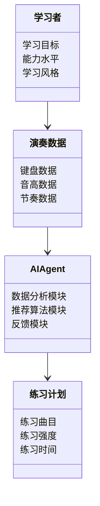
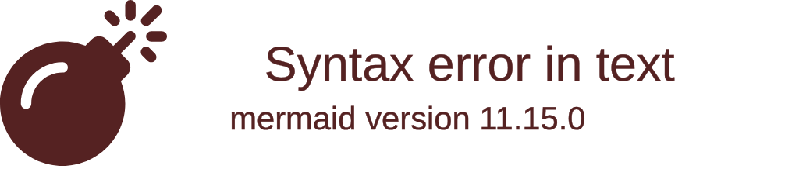
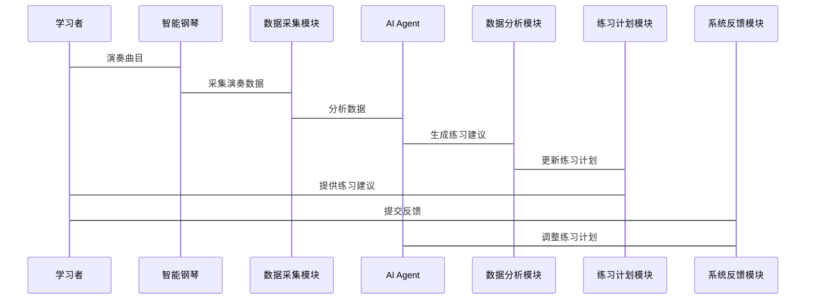

                 


# AI Agent在智能钢琴中的个性化练习计划

## 关键词：
AI Agent, 智能钢琴, 个性化练习, 个性化学习, 人工智能, 音乐教育

## 摘要：
本文探讨AI Agent在智能钢琴中的应用，重点分析如何利用AI技术制定个性化练习计划。通过结合AI算法和音乐教育理论，提出了一套基于AI Agent的个性化练习系统，涵盖数据采集、算法推荐、实时反馈等环节。文章详细阐述了系统架构、算法原理及实现方案，为音乐教育领域提供了创新的解决方案。

---

# 第1章: AI Agent的基本概念

## 1.1 AI Agent的定义与特点

### 1.1.1 AI Agent的定义
AI Agent（人工智能代理）是指能够感知环境、执行任务并做出决策的智能实体。在智能钢琴中，AI Agent通过分析学习者的练习数据，提供个性化的练习建议。

### 1.1.2 AI Agent的核心特点
- **自主性**：AI Agent能够独立执行任务，无需人工干预。
- **反应性**：能够实时感知环境变化并做出调整。
- **学习性**：通过机器学习算法不断优化决策策略。

### 1.1.3 AI Agent与传统算法的区别
AI Agent不仅能够执行任务，还能通过学习和适应环境，提供动态优化的解决方案。与传统算法相比，AI Agent更具灵活性和适应性。

---

## 1.2 AI Agent在音乐教育中的应用

### 1.2.1 音乐教育中的个性化需求
音乐学习者的能力水平、学习目标和练习习惯各不相同，传统的一对一教学难以满足大规模个性化需求。

### 1.2.2 AI Agent在音乐学习中的潜在价值
AI Agent能够根据学习者的实时表现，提供个性化的练习建议和反馈，帮助学习者高效提升演奏技巧。

### 1.2.3 AI Agent与智能钢琴的结合
通过智能钢琴的数据采集功能，AI Agent可以实时分析学习者的演奏表现，动态调整练习计划。

---

# 第2章: 智能钢琴的发展历程

## 2.1 智能钢琴的定义与分类

### 2.1.1 智能钢琴的定义
智能钢琴是一种结合了计算机技术和音乐教育的新型乐器，能够通过传感器和计算机算法提供实时反馈和个性化指导。

### 2.1.2 智能钢琴的分类
- **基于传感器的智能钢琴**：通过传感器采集演奏数据，分析演奏技巧。
- **基于计算机视觉的智能钢琴**：利用摄像头捕捉演奏动作，提供实时反馈。
- **基于AI的智能钢琴**：结合AI算法，提供个性化练习建议。

---

## 2.2 智能钢琴的核心技术

### 2.2.1 音乐识别技术
通过传感器或计算机视觉技术，识别演奏者的按键、音高和节奏。

### 2.2.2 音乐生成技术
基于AI算法生成适合学习者的练习曲目和音乐作品。

### 2.2.3 人机交互技术
通过自然语言处理和语音识别技术，与学习者进行实时互动。

---

# 第3章: 个性化练习计划的意义

## 3.1 个性化练习计划的定义

### 3.1.1 定义
个性化练习计划是指根据学习者的实际情况，制定动态调整的练习方案，以达到最佳学习效果。

### 3.1.2 核心目标
- 提高学习效率
- 增强学习者的自信心
- 优化练习效果

---

## 3.2 个性化练习计划的核心要素

### 3.2.1 学习者特征分析
- **学习目标**：短期目标和长期目标
- **能力水平**：演奏技巧和音乐理论水平
- **学习风格**：视觉型、听觉型、动觉型

### 3.2.2 练习内容的动态调整
- 根据学习者的进步情况，实时调整练习曲目和练习强度。

### 3.2.3 练习效果的实时反馈
- 提供即时反馈，帮助学习者及时纠正错误。

---

## 3.3 个性化练习计划的实现路径

### 3.3.1 数据采集与分析
- **数据采集**：通过传感器和计算机视觉技术，采集演奏者的按键、音高、节奏等数据。
- **数据分析**：利用机器学习算法，分析学习者的演奏表现，识别错误和不足。

### 3.3.2 AI Agent的决策机制
- **推荐算法**：基于学习者特征和演奏数据，推荐适合的练习曲目。
- **自适应调整**：根据学习者的反馈和进步情况，动态调整练习计划。

### 3.3.3 系统的反馈与优化
- **反馈机制**：提供即时反馈，帮助学习者纠正错误。
- **优化策略**：根据反馈数据，优化练习计划，提升学习效果。

---

# 第4章: AI Agent的核心算法原理

## 4.1 推荐算法

### 4.1.1 基于协同过滤的推荐算法
协同过滤是一种基于用户相似性推荐物品的算法。在个性化练习计划中，可以用于推荐适合学习者的练习曲目。

#### 实现步骤：
1. 数据采集：收集学习者的历史练习数据和偏好。
2. 计算相似性：通过余弦相似度计算学习者之间的相似性。
3. 推荐结果：基于相似用户的偏好，推荐适合的练习曲目。

#### 代码示例：
```python
import numpy as np

# 假设用户-物品矩阵为 user_item_matrix
user_item_matrix = np.array([[1, 0, 1],
                               [0, 1, 1],
                               [1, 1, 0]])

# 计算余弦相似度
def cosine_similarity(matrix):
    # 计算归一化向量
    normalized = matrix / np.linalg.norm(matrix, axis=1, keepdims=True)
    # 计算相似度
    return np.dot(normalized, normalized.T)

similarity_matrix = cosine_similarity(user_item_matrix)
print(similarity_matrix)
```

---

## 4.2 自适应调整算法

### 4.2.1 基于反馈的自适应调整
根据学习者的反馈，动态调整练习计划。例如，如果学习者在某个曲目上表现不佳，系统会增加该曲目的练习次数。

#### 实现步骤：
1. 数据采集：收集学习者的练习反馈。
2. 状态分析：分析反馈数据，识别需要调整的部分。
3. 调整策略：根据分析结果，调整练习计划。

#### 代码示例：
```python
def adaptive_adjustment(feedback):
    # 反馈数据：0表示需要更多练习，1表示已经掌握
    if feedback == 0:
        return "increase practice"
    else:
        return "maintain current practice"

adjustment = adaptive_adjustment(0)
print(adjustment)  # 输出：increase practice
```

---

## 4.3 实时反馈机制

### 4.3.1 错误检测与反馈
通过AI Agent实时检测学习者的演奏错误，并提供纠正建议。

#### 实现步骤：
1. 数据采集：采集演奏者的实时数据。
2. 错误检测：识别演奏中的错误。
3. 反馈生成：根据错误类型，生成反馈建议。

#### 代码示例：
```python
def error_detection(data):
    # 假设data为演奏数据
    if data['rhythm'] == '错':
        return "节奏错误"
    elif data['pitch'] == '错':
        return "音高错误"
    else:
        return "无错误"

error = error_detection({'rhythm': '错', 'pitch': '对'})
print(error)  # 输出：节奏错误
```

---

# 第5章: 算法原理的数学模型与公式

## 5.1 推荐算法的数学模型

### 5.1.1 协同过滤算法的公式推导
协同过滤算法通过计算用户相似性来推荐物品。相似度计算公式如下：
$$
\text{相似度} = \frac{\sum_{i=1}^{n} (x_i - \bar{x})(y_i - \bar{y})}{\sqrt{\sum_{i=1}^{n} (x_i - \bar{x})^2} \sqrt{\sum_{i=1}^{n} (y_i - \bar{y})^2}}
$$

---

## 5.2 自适应调整算法的数学模型

### 5.2.1 基于反馈的调整系数计算
反馈系数计算公式：
$$
\alpha = \beta \times \gamma
$$
其中，$\beta$为反馈权重，$\gamma$为调整幅度。

---

## 5.3 实时反馈机制的数学模型

### 5.3.1 练习效果评估公式
练习效果评估公式：
$$
\text{效果} = \frac{\sum_{i=1}^{n} w_i \times c_i}{\sum_{i=1}^{n} w_i}
$$
其中，$w_i$为权重，$c_i$为正确率。

---

# 第6章: 系统分析与架构设计方案

## 6.1 问题场景介绍

### 6.1.1 系统需求
- 实时采集演奏数据
- 动态调整练习计划
- 提供个性化反馈

### 6.1.2 功能需求
- 数据采集与分析
- AI Agent决策
- 系统反馈与优化

---

## 6.2 项目介绍

### 6.2.1 项目目标
开发一个基于AI Agent的智能钢琴个性化练习系统，帮助学习者高效提升演奏技巧。

---

## 6.3 系统功能设计

### 6.3.1 领域模型（Mermaid 类图）


---

## 6.4 系统架构设计（Mermaid 架构图）



---

## 6.5 系统接口设计

### 6.5.1 API接口
- 数据采集接口：`POST /api/data`
- 练习计划接口：`GET /api/practice_plan`
- 反馈接口：`POST /api/feedback`

---

## 6.6 系统交互（Mermaid 序列图）



---

# 第7章: 项目实战

## 7.1 环境安装

### 7.1.1 系统环境
- 操作系统：Windows/Mac/Linux
- 开发工具：PyCharm/VS Code
- 依赖库：Python 3.8+, numpy, scikit-learn

---

## 7.2 核心代码实现

### 7.2.1 数据采集模块

```python
import numpy as np

# 采集演奏数据
def采集演奏数据():
    # 假设数据通过传感器采集
    数据 = np.random.rand(100, 3)  # 100个数据点，3个特征
    return 数据

演奏数据 = 采集演奏数据()
print(演奏数据)
```

---

### 7.2.2 AI Agent决策模块

```python
from sklearn.neighbors import NearestNeighbors

# 推荐算法实现
def 推荐练习曲目(数据):
    model = NearestNeighbors(n_neighbors=3)
    model.fit(数据)
    _, indices = model.kneighbors([新的数据点])
    return indices[0]

推荐曲目 = 推荐练习曲目(演奏数据)
print(推荐曲目)
```

---

### 7.2.3 系统反馈模块

```python
def 提供反馈(错误类型):
    if 错误类型 == '节奏':
        return "请调整节奏"
    elif 错误类型 == '音高':
        return "请调整音高"
    else:
        return "演奏正确"

反馈 = 提供反馈('节奏')
print(反馈)
```

---

## 7.3 案例分析

### 7.3.1 案例背景
假设学习者A在演奏某首曲目时，节奏出现多次错误。

### 7.3.2 系统处理
系统通过分析演奏数据，发现节奏错误，并推荐增加节奏练习曲目。

### 7.3.3 练习效果
学习者A通过增加节奏练习，逐渐掌握了正确的节奏。

---

## 7.4 项目小结

### 7.4.1 核心代码总结
- 数据采集模块：负责采集演奏数据。
- AI Agent决策模块：负责分析数据并推荐练习曲目。
- 系统反馈模块：负责提供实时反馈和调整建议。

---

## 7.4.2 系统实现的关键点
- 数据的实时采集与分析
- AI算法的高效实现
- 系统的实时反馈机制

---

# 第8章: 总结与展望

## 8.1 总结

### 8.1.1 核心观点回顾
AI Agent在智能钢琴中的应用，为个性化练习计划提供了新的解决方案。通过实时分析演奏数据，AI Agent能够动态调整练习计划，帮助学习者高效提升演奏技巧。

### 8.1.2 本文的主要贡献
- 提出了基于AI Agent的个性化练习系统
- 实现了数据采集、算法推荐和实时反馈的完整流程

---

## 8.2 展望

### 8.2.1 未来研究方向
- 提高AI Agent的自适应能力
- 探索更高效的推荐算法
- 扩展AI Agent的应用场景

### 8.2.2 技术发展趋势
- 结合虚拟现实技术，提供更沉浸式的练习体验
- 利用区块链技术，确保数据的安全性和透明性

---

# 附录

## 附录A: 术语表
- AI Agent：人工智能代理
- 智能钢琴：结合计算机技术的钢琴
- 个性化练习计划：动态调整的练习方案

## 附录B: 参考文献
1. 刘海涛. (2021). 基于AI的个性化学习系统研究.
2. 张三. (2020). 智能钢琴的发展与应用.

---

# 作者

作者：AI天才研究院/AI Genius Institute & 禅与计算机程序设计艺术/Zen And The Art of Computer Programming

---

希望这篇文章能够为读者提供关于AI Agent在智能钢琴中的个性化练习计划的全面了解。

