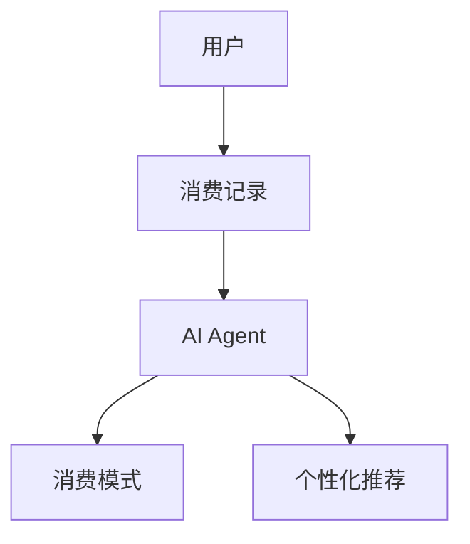

                 


# AI Agent在智能钱包中的消费习惯分析

---

## 关键词：
AI Agent，智能钱包，消费习惯分析，数据挖掘，机器学习，区块链技术

---

## 摘要：
本文探讨了AI Agent在智能钱包中的消费习惯分析的应用。通过分析消费数据，AI Agent能够帮助用户优化消费决策，预测消费趋势，并提供个性化服务。文章从AI Agent的基本概念出发，详细讲解了消费习惯分析的核心原理，结合具体算法（如协同过滤、聚类分析和神经网络）进行了深入分析。同时，文章还介绍了系统的架构设计和实际项目案例，为读者提供了全面的理论和实践指导。

---

## 第一部分: AI Agent与智能钱包的背景与概念

### 第1章: AI Agent与智能钱包概述

#### 1.1 AI Agent的基本概念
- **1.1.1 AI Agent的定义与特点**
  AI Agent（人工智能代理）是指能够感知环境并采取行动以实现目标的智能实体。其特点包括自主性、反应性、目标导向性和社交能力。

- **1.1.2 AI Agent的核心功能与应用场景**
  AI Agent的核心功能包括数据处理、决策制定和自动化操作。应用场景广泛，如智能钱包、智能家居、自动驾驶等。

- **1.1.3 AI Agent与传统软件代理的区别**
  AI Agent具备学习和自适应能力，能够处理复杂任务，而传统软件代理通常遵循固定的规则。

#### 1.2 智能钱包的定义与特点
- **1.2.1 智能钱包的定义**
  智能钱包是一种结合了区块链技术和人工智能的数字钱包，能够自动执行智能合约，提供个性化的金融服务。

- **1.2.2 智能钱包的核心功能**
  包括数字货币存储、交易自动执行、消费记录分析、安全防护等。

- **1.2.3 智能钱包与传统钱包的主要区别**
  智能钱包具备自动化和智能化功能，能够根据用户的消费习惯提供个性化服务。

#### 1.3 AI Agent在智能钱包中的作用
- **1.3.1 AI Agent如何提升智能钱包的功能**
  AI Agent能够实时分析用户的消费数据，优化交易策略，提高安全性。

- **1.3.2 AI Agent在消费习惯分析中的应用**
  AI Agent通过分析用户的交易记录，识别消费模式，预测未来的消费行为。

- **1.3.3 AI Agent与智能钱包结合的潜在价值**
  提高用户体验，优化金融服务，增强安全性，推动区块链技术的普及。

#### 1.4 本章小结
本章介绍了AI Agent和智能钱包的基本概念及其在消费习惯分析中的作用，为后续内容奠定了基础。

---

### 第2章: 消费习惯分析的背景与重要性

#### 2.1 消费习惯分析的基本概念
- **2.1.1 消费习惯的定义**
  消费习惯是指用户在消费过程中形成的稳定的行为模式。

- **2.1.2 消费习惯分析的目的与意义**
  分析消费习惯有助于企业制定精准的营销策略，提升用户体验。

#### 2.2 AI Agent在消费习惯分析中的优势
- **2.2.1 数据分析能力**
  AI Agent能够处理海量数据，提取有用信息。

- **2.2.2 自动化决策能力**
  AI Agent可以根据分析结果，自动优化消费决策。

- **2.2.3 智能推荐能力**
  AI Agent能够基于消费习惯，推荐个性化的产品或服务。

#### 2.3 智能钱包中的消费习惯分析场景
- **2.3.1 消费行为数据的采集**
  包括用户的交易记录、消费时间、金额等数据。

- **2.3.2 消费趋势预测**
  基于历史数据，预测未来的消费行为。

- **2.3.3 消费决策优化**
  AI Agent帮助用户做出更明智的消费决策。

#### 2.4 本章小结
本章探讨了消费习惯分析的重要性和AI Agent在其中的优势，为后续分析提供了理论基础。

---

## 第三部分: AI Agent在智能钱包中的消费习惯分析核心概念

### 第3章: AI Agent与消费习惯分析的核心概念

#### 3.1 AI Agent的消费习惯分析原理
- **3.1.1 数据采集与处理**
  AI Agent通过智能钱包收集用户的消费数据，并进行预处理。

- **3.1.2 数据分析与建模**
  使用机器学习算法，如协同过滤、聚类分析和神经网络，建立消费习惯模型。

- **3.1.3 模型训练与优化**
  通过训练数据优化模型参数，提高分析准确率。

#### 3.2 消费习惯分析的关键属性对比
| 属性         | 传统消费分析 | 基于AI Agent的分析 |
|--------------|--------------|--------------------|
| 数据来源     | 单一数据源   | 多数据源           |
| 分析速度     | 较慢         | 实时分析           |
| 分析精度     | 低           | 高                 |
| 个性化程度   | 低           | 高                 |

#### 3.3 AI Agent与消费习惯分析的实体关系图



#### 3.4 本章小结
本章详细介绍了AI Agent在消费习惯分析中的核心概念和实体关系，为后续算法分析奠定了基础。

---

### 第4章: 常用算法原理与实现

#### 4.1 协同过滤算法
- **算法原理**
  协同过滤基于用户相似性推荐商品或服务。

- **算法实现**
  ```python
  def collaborative_filtering(user_data, target_user):
      # 计算用户相似性
      similarities = {}
      for user in user_data:
          if user != target_user:
              similarities[user] = cosine_similarity(user_data[user], user_data[target_user])
      # 推荐商品
      recommendations = []
      for item in user_data[target_user]:
          if item not in similarities:
              continue
          total = 0
          count = 0
          for user in similarities:
              if item in user_data[user]:
                  total += similarities[user]
                  count += 1
          if count > 0:
              avg = total / count
              recommendations.append((item, avg))
      return sorted(recommendations, key=lambda x: x[1], reverse=True)
  ```

- **数学模型**
  $$ \text{相似度} = \frac{\sum_{i=1}^{n} x_i y_i}{\sqrt{\sum_{i=1}^{n} x_i^2} \sqrt{\sum_{i=1}^{n} y_i^2}} $$

#### 4.2 聚类分析算法
- **算法原理**
  聚类分析将用户划分为不同的群体，基于群体特征进行推荐。

- **算法实现**
  ```python
  from sklearn.cluster import KMeans
  import numpy as np

  def kmeans_clustering(data, num_clusters):
      model = KMeans(n_clusters=num_clusters)
      model.fit(data)
      return model.predict(data)
  ```

- **数学模型**
  $$ \text{目标函数} = \sum_{i=1}^{n} \sum_{j=1}^{k} w_{ij}d_{ij} $$

#### 4.3 神经网络算法
- **算法原理**
  神经网络通过多层感知器模型进行消费习惯预测。

- **算法实现**
  ```python
  import tensorflow as tf
  from tensorflow.keras import layers

  model = tf.keras.Sequential([
      layers.Dense(64, activation='relu'),
      layers.Dense(1, activation='sigmoid')
  ])
  model.compile(optimizer='adam', loss='binary_crossentropy', metrics=['accuracy'])
  model.fit(x_train, y_train, epochs=10, batch_size=32)
  ```

- **数学模型**
  $$ y = \sigma(w x + b) $$

#### 4.4 本章小结
本章详细讲解了协同过滤、聚类分析和神经网络算法的原理和实现，为后续系统设计提供了算法基础。

---

### 第5章: 系统分析与架构设计

#### 5.1 系统场景介绍
- **5.1.1 智能钱包的使用流程**
  用户通过智能钱包进行交易，AI Agent分析消费数据，提供个性化服务。

- **5.1.2 系统功能设计**
  包括数据采集、分析、推荐和反馈等功能。

#### 5.2 系统架构设计
- **5.2.1 领域模型设计**
  ```mermaid
  classDiagram
      class 用户 {
          用户ID
          消费记录
      }
      class 消费记录 {
          交易时间
          交易金额
          商品类别
      }
      用户 --> 消费记录
  ```

- **5.2.2 系统架构图**
  ```mermaid
  graph TD
      A[用户] --> B[消费记录数据库]
      B --> C[AI Agent服务]
      C --> D[消费模式分析]
      C --> E[个性化推荐服务]
  ```

- **5.2.3 系统接口设计**
  - 数据接口：API用于获取和更新消费数据。
  - 分析接口：API用于调用AI Agent进行消费分析。

#### 5.3 本章小结
本章详细介绍了系统的架构设计和接口设计，为后续的项目实现提供了指导。

---

### 第6章: 项目实战

#### 6.1 环境安装
- 安装Python、TensorFlow、Scikit-learn等库。

#### 6.2 核心代码实现
- **数据预处理**
  ```python
  import pandas as pd
  data = pd.read_csv('consumption.csv')
  ```

- **模型训练**
  ```python
  from sklearn.model

