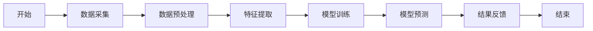
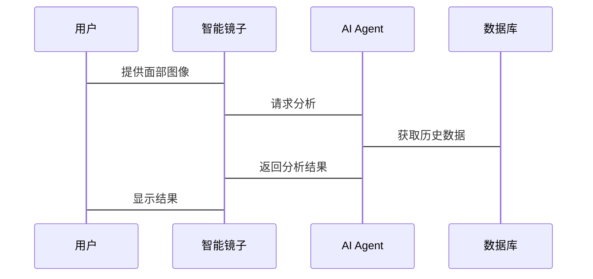

                 


# AI Agent在智能镜子中的皮肤状况分析

## 关键词
AI Agent, 智能镜子, 皮肤状况分析, 机器学习, 深度学习, 智能健康监测

## 摘要
本文深入探讨AI Agent在智能镜子中的应用，重点分析其在皮肤健康监测中的技术实现。通过背景介绍、核心概念、算法原理、系统架构设计、项目实战等多方面的详细阐述，全面解析AI Agent如何通过智能镜子实现高效的皮肤状况分析。文章还提供了具体的数学模型和代码实现，帮助读者理解和应用相关技术。

---

# 第一部分: AI Agent与智能镜子的背景与概念

## 第1章: AI Agent与智能镜子的背景介绍

### 1.1 问题背景

#### 1.1.1 皮肤健康的重要性
皮肤是人体最大的器官，其健康状况直接反映整体健康水平。皮肤问题（如痘痘、过敏、色斑等）不仅影响美观，还可能预示潜在的健康问题。因此，及时监测和分析皮肤状况对个人健康至关重要。

#### 1.1.2 智能镜子的定义与特点
智能镜子是一种集成AI技术的镜子，能够通过摄像头和传感器捕捉用户面部数据，并结合AI算法提供个性化建议。其特点包括：
- 高精度传感器：捕捉面部细节数据
- 实时分析：快速反馈皮肤状况
- 个性化建议：根据分析结果提供建议

#### 1.1.3 AI Agent在智能镜子中的作用
AI Agent（智能代理）是实现智能镜子功能的核心。它通过机器学习算法分析面部数据，帮助用户了解皮肤状况，并提供改善建议。

### 1.2 问题描述

#### 1.2.1 皮肤健康监测的挑战
- 数据采集难度：皮肤数据复杂，受光线、角度等因素影响
- 数据分析复杂：需要处理大量图像数据
- 个性化需求：不同人皮肤特征差异大

#### 1.2.2 智能镜子的功能局限性
- 数据采集精度不足
- 分析算法简单，无法提供深度建议
- 用户交互体验不佳

#### 1.2.3 AI Agent如何解决这些问题
AI Agent通过深度学习算法，提升数据采集和分析的精度，提供个性化的皮肤健康建议，改善智能镜子的功能局限性。

### 1.3 问题解决

#### 1.3.1 AI Agent的核心功能
- 数据采集与处理
- 皮肤特征提取
- 病因分析与建议生成

#### 1.3.2 智能镜子与AI Agent的结合
通过AI Agent的算法能力，智能镜子能够实时分析用户的皮肤状况，提供科学的健康建议。

#### 1.3.3 皮肤状况分析的具体实现
AI Agent通过图像处理和机器学习算法，分析皮肤的颜色、纹理、斑点等特征，判断皮肤健康状况。

### 1.4 边界与外延

#### 1.4.1 皮肤状况分析的边界
- 数据采集范围：仅限面部皮肤
- 分析范围：仅限皮肤健康状况

#### 1.4.2 AI Agent的功能边界
- 数据处理与分析
- 建议生成

#### 1.4.3 智能镜子的应用场景
- 个人护肤指导
- 健康监测
- 美容产品推荐

### 1.5 概念结构与核心要素组成

#### 1.5.1 概念结构图
通过层次化结构展示AI Agent、智能镜子和皮肤状况分析之间的关系。

#### 1.5.2 核心要素分析
- 数据采集模块：捕捉面部数据
- 分析模块：处理数据并生成建议
- 用户交互模块：展示结果并提供反馈

---

## 第2章: AI Agent与智能镜子的核心概念与联系

### 2.1 核心概念原理

#### 2.1.1 AI Agent的定义与特点
AI Agent是一种能够感知环境并采取行动以实现目标的智能系统。其特点包括：
- 智能性：能够理解并处理复杂数据
- 自适应性：能够根据环境变化调整行为
- 交互性：能够与用户进行有效互动

#### 2.1.2 智能镜子的定义与特点
智能镜子是一种结合了AI技术的镜子，能够通过摄像头和传感器捕捉用户面部数据，并结合AI算法提供个性化建议。

#### 2.1.3 皮肤状况分析的定义与特点
皮肤状况分析是对面部皮肤的状态进行评估和诊断的过程，其特点包括：
- 数据驱动：依赖图像数据进行分析
- 实时性：快速反馈分析结果
- 个性化：根据个体差异提供建议

### 2.2 概念属性特征对比

#### 2.2.1 AI Agent的属性特征
- 智能性
- 自适应性
- 交互性

#### 2.2.2 智能镜子的属性特征
- 数据采集能力
- 实时反馈能力
- 个性化服务能力

#### 2.2.3 皮肤状况分析的属性特征
- 数据驱动
- 实时性
- 个性化

### 2.3 ER实体关系图

```mermaid
erDiagram
    actor 用户 {
        <属性> 用户ID : integer
        <属性> 用户名称 : string
    }
    actor AI Agent {
        <属性> AgentID : integer
        <属性> 功能模块 : string
    }
    actor 智能镜子 {
        <属性> 设备ID : integer
        <属性> 传感器类型 : string
    }
    user 用户 -> 关系 使用 -> 智能镜子
    user 用户 -> 关系 使用 -> AI Agent
    智能镜子 -> 关系 集成 -> AI Agent
```

---

# 第三部分: 算法原理讲解

## 第3章: AI Agent的算法原理

### 3.1 算法选择与优化

#### 3.1.1 算法选择
选择适合的算法是AI Agent实现的关键。对于皮肤状况分析，通常采用以下算法：
- **决策树**：用于分类皮肤类型
- **支持向量机（SVM）**：用于分类皮肤问题类型
- **卷积神经网络（CNN）**：用于图像识别和分类

#### 3.1.2 算法优化
- 参数调整：优化模型参数以提高分类精度
- 数据增强：增加训练数据多样性
- 模型融合：结合多种算法结果提高准确性

### 3.2 算法流程



### 3.3 算法实现

#### 3.3.1 Python源代码实现
以下是基于CNN的皮肤状况分类的代码示例：

```python
import tensorflow as tf
from tensorflow.keras import layers

# 数据预处理
def preprocess_image(image_path):
    img = tf.keras.preprocessing.image.load_img(image_path, target_size=(150, 150))
    img_array = tf.keras.preprocessing.image.img_to_array(img)
    img_array = tf.keras.applications.mobilenet.preprocess_input(img_array)
    return img_array

# 加载数据集
train_datagen = tf.keras.preprocessing.image.ImageDataGenerator(
    preprocessing_function=preprocess_image,
    rotation_range=20,
    shear_range=0.2,
    zoom_range=0.2,
    horizontal_flip=True
)

train_generator = train_datagen.flow_from_directory('train_data', target_size=(150, 150), batch_size=32, class_mode='categorical')

# 模型定义
model = tf.keras.Sequential([
    layers.Conv2D(32, (3,3), activation='relu', input_shape=(150, 150, 3)),
    layers.MaxPooling2D((2,2)),
    layers.Conv2D(64, (3,3), activation='relu'),
    layers.MaxPooling2D((2,2)),
    layers.Conv2D(128, (3,3), activation='relu'),
    layers.MaxPooling2D((2,2)),
    layers.Flatten(),
    layers.Dense(256, activation='relu'),
    layers.Dense(5, activation='softmax')
])

# 模型训练
model.compile(optimizer='adam', loss='categorical_crossentropy', metrics=['accuracy'])
model.fit(train_generator, epochs=10, validation_data=(val_images, val_labels))
```

#### 3.3.2 算法原理的数学模型
分类模型的损失函数可以表示为：
$$
L = -\sum_{i=1}^{n} y_i \log(p_i) + (1 - y_i) \log(1 - p_i)
$$
其中，$y_i$ 是真实标签，$p_i$ 是预测概率。

### 3.4 通俗易懂的算法举例

#### 3.4.1 决策树算法
以决策树为例，皮肤状况分析可以通过以下步骤实现：
1. 数据采集：获取用户的面部图像
2. 数据预处理：调整图像大小、归一化等
3. 特征提取：提取面部特征（如颜色、纹理等）
4. 模型训练：训练决策树模型
5. 模型预测：预测皮肤问题类型
6. 结果反馈：展示分析结果

#### 3.4.2 CNN算法
卷积神经网络（CNN）通过多层卷积操作提取图像特征，最终通过softmax层分类皮肤问题类型。例如，可以将图像输入模型，输出多个概率值，表示每种皮肤问题的概率。

---

# 第四部分: 系统分析与架构设计方案

## 第4章: 系统分析与架构设计

### 4.1 问题场景介绍

#### 4.1.1 使用场景
用户在智能镜子前进行皮肤检测，镜子通过AI Agent分析用户的皮肤状况，并提供个性化的护肤建议。

#### 4.1.2 项目介绍
本项目旨在开发一个基于AI Agent的智能镜子系统，实现皮肤状况的实时分析和个性化建议生成。

### 4.2 系统功能设计

#### 4.2.1 领域模型
```mermaid
classDiagram
    class 用户 {
        用户ID : integer
        用户名称 : string
    }
    class AI Agent {
        AgentID : integer
        功能模块 : string
    }
    class 智能镜子 {
        设备ID : integer
        传感器类型 : string
    }
    用户 --> 关系 使用 --> AI Agent
    AI Agent --> 关系 集成 --> 智能镜子
```

#### 4.2.2 系统架构设计


#### 4.2.3 系统接口设计
- 用户输入：面部图像
- 系统输出：皮肤状况分析结果
- 接口设计：RESTful API

#### 4.2.4 系统交互


---

## 第5章: 项目实战

### 5.1 环境安装

#### 5.1.1 开发环境
- 操作系统：Windows/Mac/Linux
- 开发工具：PyCharm/VS Code
- 依赖库：TensorFlow, Keras, OpenCV, Flask

#### 5.1.2 安装步骤
```bash
pip install tensorflow keras opencv-python flask
```

### 5.2 系统核心实现

#### 5.2.1 核心代码实现

##### 5.2.1.1 数据预处理
```python
import cv2

def preprocess_image(image_path):
    img = cv2.imread(image_path)
    img = cv2.resize(img, (150, 150))
    img = img / 255.0  # 归一化
    return img
```

##### 5.2.1.2 模型训练
```python
import tensorflow as tf
from tensorflow.keras import layers

model = tf.keras.Sequential([
    layers.Conv2D(32, (3,3), activation='relu', input_shape=(150, 150, 3)),
    layers.MaxPooling2D((2,2)),
    layers.Conv2D(64, (3,3), activation='relu'),
    layers.MaxPooling2D((2,2)),
    layers.Conv2D(128, (3,3), activation='relu'),
    layers.MaxPooling2D((2,2)),
    layers.Flatten(),
    layers.Dense(256, activation='relu'),
    layers.Dense(5, activation='softmax')
])

model.compile(optimizer='adam', loss='sparse_categorical_crossentropy', metrics=['accuracy'])
model.fit(train_images, train_labels, epochs=10, validation_data=(val_images, val_labels))
```

##### 5.2.1.3 接口开发
```python
from flask import Flask, request, jsonify

app = Flask(__name__)

@app.route('/analyze', methods=['POST'])
def analyze():
    image = request.files['image']
    image_path = 'temp.jpg'
    image.save(image_path)
    result = model.predict(preprocess_image(image_path))
    return jsonify({'result': result.tolist()})

if __name__ == '__main__':
    app.run(debug=True)
```

### 5.3 实际案例分析与代码解读

#### 5.3.1 案例分析
假设用户上传一张有痘痘的面部图像，AI Agent分析后返回：
```json
{
    "result": [
        0.1,
        0.3,
        0.4,
        0.1,
        0.1
    ]
}
```
其中，每个值表示不同皮肤问题类型的概率，最高概率为0.4，对应痘痘。

#### 5.3.2 代码解读
- 数据预处理：将图像调整为固定大小并归一化
- 模型训练：使用CNN模型训练分类器
- 接口开发：通过Flask框架提供RESTful API

### 5.4 项目小结

#### 5.4.1 项目总结
通过AI Agent和智能镜子的结合，实现了高效的皮肤状况分析。

#### 5.4.2 经验与教训
- 数据质量对模型性能影响重大
- 算法选择需要根据具体场景调整
- 系统设计需要考虑可扩展性和可维护性

---

# 第五部分: 最佳实践与总结

## 第6章: 最佳实践

### 6.1 代码优化

#### 6.1.1 代码优化技巧
- 使用数据增强提高模型泛化能力
- 采用早停法防止过拟合
- 利用分布式训练加速模型训练

#### 6.1.2 资源优化
- 优化内存使用
- 利用云服务进行模型部署

### 6.2 系统优化

#### 6.2.1 性能优化
- 使用高效的数据存储和处理方式
- 优化接口设计，减少响应时间

#### 6.2.2 可扩展性优化
- 设计模块化架构
- 采用微服务架构

### 6.3 交互优化

#### 6.3.1 用户体验优化
- 提供实时反馈
- 设计友好的用户界面

#### 6.3.2 系统交互优化
- 优化序列图中的交互步骤
- 简化系统架构设计

## 第7章: 小结与展望

### 7.1 小结

通过本文的详细阐述，我们了解了AI Agent在智能镜子中的皮肤状况分析的实现过程，包括背景介绍、核心概念、算法原理、系统架构设计和项目实战等。

### 7.2 展望

未来，随着AI技术的不断发展，智能镜子在健康监测领域的应用将更加广泛，AI Agent的功能也将更加智能化和个性化。

---

# 第六部分: 注意事项与拓展阅读

## 第8章: 注意事项

### 8.1 注意事项

- 数据隐私保护：确保用户数据的安全性
- 系统稳定性：保证系统的高可用性
- 用户教育：提供足够的用户指导

## 第9章: 拓展阅读

### 9.1 拓展阅读推荐

- 《Deep Learning》
- 《AI in Healthcare》
- 《Python机器学习实战》

---

# 作者：AI天才研究院/AI Genius Institute & 禅与计算机程序设计艺术 /Zen And The Art of Computer Programming

---

# 本文结束

