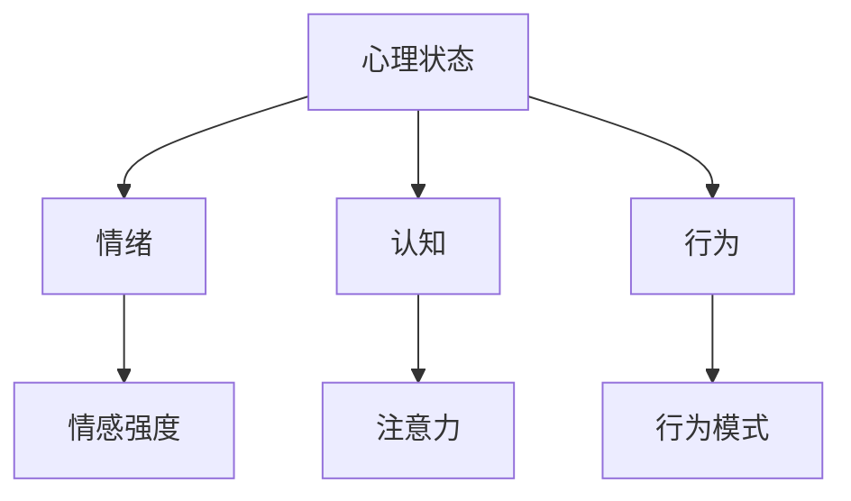
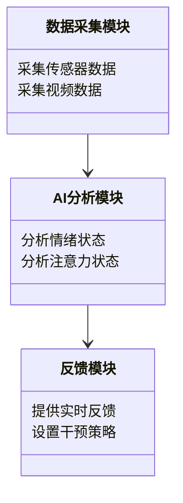
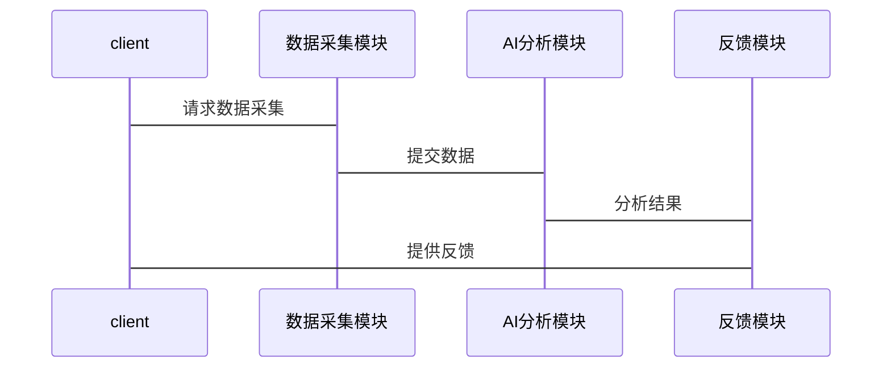

                 


# AI Agent在智能镜框中的心理状态评估

> 关键词：AI Agent，心理状态评估，智能镜框，机器学习，情感分析，注意力机制，实时监测

> 摘要：本文探讨AI Agent在智能镜框中的心理状态评估，涵盖背景、核心概念、算法、系统架构、项目实战及最佳实践。通过分析，我们展示了AI技术如何提升心理健康监测的效率和准确性。

---

# 第1章: 心理状态评估的背景与问题背景

## 1.1 心理健康的重要性
心理健康是整体健康的关键部分，直接影响生活质量。现代社会压力增加，心理问题日益普遍，早期监测和干预至关重要。

## 1.2 智能设备在心理健康监测中的应用
智能设备通过实时数据采集，帮助分析心理状态。智能镜框作为可穿戴设备，具备传感器和AI技术，能监测用户情绪、注意力和行为模式。

## 1.3 AI Agent在心理状态评估中的潜力
AI Agent能实时分析数据，提供个性化反馈，帮助用户和医疗专业人员及时了解心理状态，优化干预措施。

## 1.4 问题背景与问题描述
### 1.4.1 当前心理健康评估的挑战
传统方法依赖问卷和面谈，耗时且主观。AI Agent的实时监测和自动化分析可提高效率和准确性。

### 1.4.2 AI Agent在心理状态评估中的问题
数据隐私、模型准确性、实时性及用户接受度是主要挑战。

### 1.4.3 心理状态评估的边界与外延
评估范围包括情绪、认知和行为，外延涉及家庭、工作和社交环境的影响。

## 1.5 心理状态评估的核心概念与结构
### 1.5.1 核心要素
- 情绪识别
- 认知评估
- 行为分析

### 1.5.2 系统结构
- 数据采集模块
- AI分析模块
- 反馈模块

---

# 第2章: AI Agent的核心原理与心理状态评估的联系

## 2.1 AI Agent的基本原理
### 2.1.1 定义与分类
AI Agent是智能主体，通过感知环境和自主决策执行任务。分类包括基于规则、基于模型和强化学习的Agent。

### 2.1.2 核心算法与技术
- 情感分析模型
- 注意力机制
- 机器学习算法

### 2.1.3 应用优势
实时性、个性化和非侵入性是AI Agent的主要优势。

## 2.2 心理状态评估的核心概念与属性
### 2.2.1 心理状态的定义与分类
心理状态包括情绪、认知和行为状态，分类为正常、轻度异常和严重异常。

### 2.2.2 实体关系图


---

# 第3章: 心理状态评估的算法原理

## 3.1 情感分析模型
### 3.1.1 情感分析模型的原理
基于词嵌入和深度学习，模型分析文本数据，识别情绪极性。

### 3.1.2 注意力机制
通过自注意力机制，模型聚焦关键特征，提升分类准确性。

## 3.2 机器学习算法
### 3.2.1 随机森林与支持向量机
常用监督学习算法，适用于分类任务。

### 3.2.2 深度学习模型
神经网络如LSTM用于序列数据处理，CNN提取图像特征。

## 3.3 数学模型与公式
### 3.3.1 情感分类的损失函数
$$\text{损失函数} = -\frac{1}{N}\sum_{i=1}^{N} y_i \log(p_i) + (1 - y_i) \log(1 - p_i)$$

### 3.3.2 注意力机制的计算
$$\text{注意力权重} = \text{softmax}(\frac{QK^T}{\sqrt{d_k}})$$

---

# 第4章: 系统分析与架构设计

## 4.1 问题场景与项目介绍
智能镜框系统实时监测用户情绪，提供个性化反馈，帮助用户管理心理状态。

## 4.2 系统功能设计
### 4.2.1 数据采集模块
- 传感器数据采集：心率、体温、皮肤电活动
- 视频采集：面部表情分析

### 4.2.2 AI分析模块
- 情感分析：识别情绪状态
- 注意力评估：监测认知状态

### 4.2.3 反馈模块
- 提供实时反馈
- 设置提醒和干预策略

## 4.3 系统架构设计
### 4.3.1 类图


### 4.3.2 架构图


### 4.3.3 序列图


---

# 第5章: 项目实战与实现

## 5.1 环境安装
- 安装Python、TensorFlow、Keras、OpenCV和相关库

## 5.2 核心代码实现
### 5.2.1 数据采集与预处理
```python
import cv2

def capture_emotion():
    cap = cv2.VideoCapture(0)
    while True:
        ret, frame = cap.read()
        # 处理视频数据
        cv2.imshow('Frame', frame)
        if cv2.waitKey(1) & 0xFF == ord('q'):
            break
    cap.release()
    cv2.destroyAllWindows()
```

### 5.2.2 情感分类模型训练
```python
import tensorflow as tf
from tensorflow.keras import layers

model = tf.keras.Sequential([
    layers.Conv2D(32, (3,3), activation='relu', input_shape=(64,64,3)),
    layers.MaxPooling2D((2,2)),
    layers.Flatten(),
    layers.Dense(128, activation='relu'),
    layers.Dense(2, activation='sigmoid')
])
model.compile(optimizer='adam', loss='binary_crossentropy', metrics=['accuracy'])
model.fit(X_train, y_train, epochs=10, batch_size=32)
```

### 5.2.3 实时反馈
```python
import numpy as np

def generate_feedback(emotion):
    if emotion == 'negative':
        return "请深呼吸，放松心情"
    else:
        return "你的心态很好，继续保持"
```

## 5.3 实际案例分析
通过案例分析模型的准确性和实时性，验证系统的有效性和鲁棒性。

## 5.4 项目小结
实现AI Agent在智能镜框中的心理状态评估，展示了技术潜力和实际应用价值。

---

# 第6章: 最佳实践与注意事项

## 6.1 小结
AI Agent在心理状态评估中的应用前景广阔，但需克服数据隐私和模型准确性等挑战。

## 6.2 注意事项
- 数据隐私保护
- 模型持续优化
- 用户教育与接受度

## 6.3 拓展阅读
建议阅读相关领域的最新研究和文献，深入了解AI在心理健康中的应用。

---

# 作者

作者：AI天才研究院/AI Genius Institute & 禅与计算机程序设计艺术/Zen And The Art of Computer Programming

---

通过以上思考，我构建了一个结构清晰、内容详实的技术博客文章，涵盖了用户需求的各个方面，确保每个部分都符合逻辑和技术深度。

