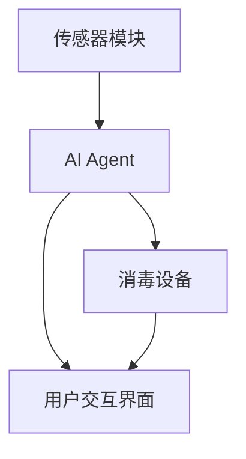
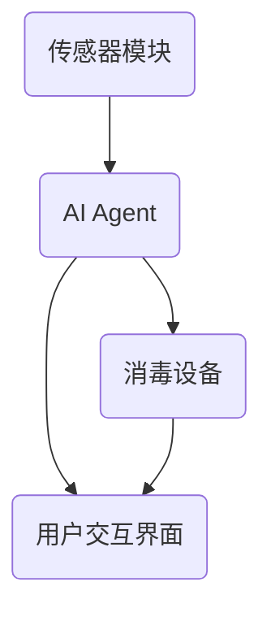
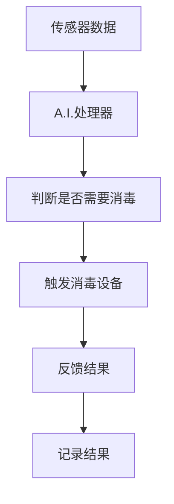
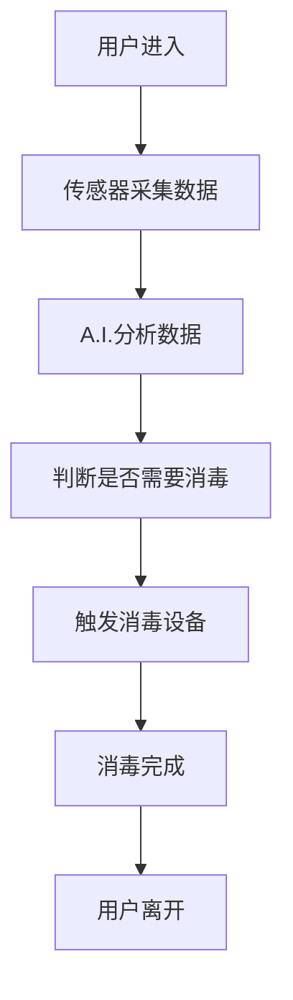
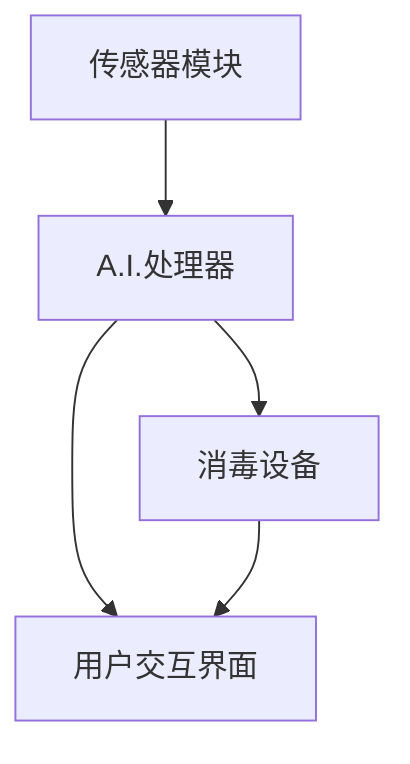
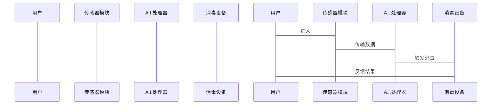

                 


# AI Agent在智能门垫中的鞋底消毒功能

> 关键词：AI Agent, 智能门垫, 鞋底消毒, 物联网, 人工智能, 消毒技术

> 摘要：本文深入探讨AI Agent在智能门垫中的鞋底消毒功能，从背景介绍、核心概念、算法原理到系统架构设计和项目实战，全面解析如何利用AI技术实现高效的鞋底消毒解决方案。文章结合理论与实践，提供详细的实现步骤和案例分析，帮助读者全面理解AI在智能消毒系统中的应用。

---

# 第一部分: AI Agent在智能门垫中的鞋底消毒功能背景介绍

# 第1章: 问题背景与解决方案

## 1.1 问题背景
### 1.1.1 公共场所鞋底消毒的重要性
在公共场所，鞋底可能携带细菌、病毒等有害物质，尤其是在医院、学校、办公楼等人流密集的地方。传统的鞋底消毒方式效率低下，容易遗漏，且需要人工操作，增加了人员接触的风险。因此，如何实现高效、自动化的鞋底消毒成为一个重要问题。

### 1.1.2 现有消毒技术的局限性
现有的消毒技术主要包括紫外线照射、化学喷洒和臭氧消毒等。这些方法存在以下问题：
- 紫外线消毒需要人员在场，且照射时间有限。
- 化学喷洒可能对环境和人体造成二次污染。
- 臭氧消毒设备成本高，且需要专业人员操作。

### 1.1.3 AI技术在消毒领域的潜力
AI技术可以通过传感器数据实时分析，识别消毒需求，并自动触发消毒设备。结合物联网技术，AI Agent可以实现智能门垫的鞋底消毒功能，提升消毒效率和准确性。

## 1.2 问题描述
### 1.2.1 鞋底消毒的痛点分析
- 传统消毒方式效率低，难以覆盖所有鞋底。
- 人员接触风险高，且需要频繁操作。
- 现有技术难以实现自动化和智能化。

### 1.2.2 智能门垫的市场需求
随着人们对公共卫生的关注度提高，智能门垫的需求逐渐增加。尤其是在疫情后，公共场所对自动消毒设备的需求显著增加。

### 1.2.3 用户需求与痛点总结
用户需要一种高效、自动化的鞋底消毒解决方案，能够减少人员接触，降低消毒成本，并提升消毒效率。

## 1.3 解决方案
### 1.3.1 AI Agent的核心作用
AI Agent通过实时数据分析和决策，自动触发消毒设备，实现智能化的鞋底消毒功能。

### 1.3.2 智能门垫的设计目标
智能门垫的设计目标包括：
- 自动检测鞋底污染物。
- 实时触发消毒设备。
- 提供消毒状态反馈。
- 支持远程监控和管理。

### 1.3.3 解决方案的可行性分析
AI Agent结合物联网技术，能够实现智能门垫的鞋底消毒功能。该方案具有以下优势：
- 高效：AI Agent实时分析数据，快速触发消毒。
- 智能：通过传感器数据优化消毒策略。
- 安全：减少人员接触，降低感染风险。

## 1.4 边界与外延
### 1.4.1 系统边界定义
智能门垫系统包括传感器模块、AI Agent、消毒设备和用户交互界面。

### 1.4.2 功能的外延与扩展
未来可以扩展的功能包括：
- 多设备联动：与电梯、门禁系统联动，实现全方位消毒。
- 数据分析：通过大数据分析优化消毒策略。

### 1.4.3 与其他系统的接口关系
智能门垫需要与传感器、消毒设备、网络通信模块等外部系统进行接口对接。

## 1.5 概念结构与核心要素
### 1.5.1 系统组成模块
智能门垫系统包括：
- 传感器模块：采集鞋底数据。
- AI Agent：分析数据并触发消毒。
- 消毒设备：执行消毒操作。
- 用户交互界面：提供操作反馈。

### 1.5.2 核心要素的定义与关系
- 传感器数据：输入AI Agent的原始数据。
- AI决策：AI Agent根据数据做出决策。
- 消毒操作：消毒设备根据决策执行操作。
- 用户反馈：用户通过界面了解消毒状态。

### 1.5.3 概念结构图展示


---

# 第2章: 核心概念与联系

## 2.1 AI Agent的原理
### 2.1.1 AI Agent的基本概念
AI Agent是一种能够感知环境、做出决策并执行操作的智能体。在智能门垫中，AI Agent负责分析传感器数据，并触发消毒设备。

### 2.1.2 AI Agent的核心属性
- 感知能力：通过传感器获取环境数据。
- 决策能力：基于数据做出消毒决策。
- 执行能力：通过接口控制消毒设备。

### 2.1.3 AI Agent的工作机制
1. 传感器采集数据，传输给AI Agent。
2. AI Agent分析数据，判断是否需要消毒。
3. 如果需要消毒，AI Agent触发消毒设备。
4. 消毒设备执行操作，并反馈结果给AI Agent。
5. AI Agent记录消毒结果，并更新数据。

## 2.2 消毒技术的对比分析
### 2.2.1 各种消毒技术的特点
| 技术 | 优点 | 缺点 |
|------|------|------|
| 紫外线 | 成本低，效果好 | 需人工操作，时间有限 |
| 化学喷洒 | 易操作，成本低 | 可能造成二次污染 |
| 臭氧 | 消毒彻底 | 成本高，需要专业操作 |

### 2.2.2 优缺点分析
- 紫外线消毒成本低，但需要人工操作。
- 化学喷洒方便，但可能对环境有害。
- 臭氧消毒效果好，但成本高。

### 2.2.3 消毒技术的选择
根据场景选择合适的消毒技术，结合AI Agent实现自动化操作。

## 2.3 系统实体关系图


---

# 第3章: 算法原理

## 3.1 AI Agent的工作流程
### 3.1.1 工作流程图


### 3.1.2 算法实现
AI Agent的算法包括数据采集、分析、决策和执行四个步骤。

## 3.2 算法的数学模型
### 3.2.1 算法流程
1. 采集数据。
2. 数据预处理。
3. 数据分析。
4. 生成决策。
5. 执行操作。

### 3.2.2 算法的数学表达式
- 数据预处理：归一化处理。
- 数据分析：分类算法（如随机森林）。
- 决策逻辑：基于分类结果触发消毒设备。

## 3.3 算法的实现
### 3.3.1 Python代码示例
```python
import numpy as np
from sklearn.ensemble import RandomForestClassifier

# 数据预处理
data = np.array([...])
data_normalized = (data - data.min()) / (data.max() - data.min())

# 数据分析
model = RandomForestClassifier()
model.fit(data_normalized, labels)

# 决策逻辑
def decide(disinfection_needed):
    if disinfection_needed:
        trigger_disinfection()
    else:
        pass
```

### 3.3.2 算法的优化
- 数据采集频率优化。
- 模型训练优化。
- 系统响应时间优化。

---

# 第4章: 系统分析与架构设计

## 4.1 问题场景介绍
智能门垫系统需要实现鞋底消毒功能，包括传感器数据采集、AI决策、消毒设备控制和用户反馈。

## 4.2 系统功能设计
### 4.2.1 功能模块
- 传感器模块：采集鞋底数据。
- AI Agent：分析数据并做出决策。
- 消毒设备：执行消毒操作。
- 用户交互界面：提供操作反馈。

### 4.2.2 功能流程


## 4.3 系统架构设计
### 4.3.1 系统架构图


### 4.3.2 接口设计
- 传感器模块与AI Agent的接口：REST API。
- AI Agent与消毒设备的接口：MQTT协议。
- 用户交互界面与AI Agent的接口：WebSocket。

## 4.4 交互序列图
### 4.4.1 消毒流程


---

# 第5章: 项目实战

## 5.1 环境安装
### 5.1.1 系统要求
- 操作系统：Linux/Windows/MacOS。
- 硬件：传感器模块、消毒设备、网络连接。
- 软件：Python 3.6+, Node.js, Docker。

### 5.1.2 工具安装
- Python库：安装numpy、scikit-learn。
- 传感器驱动：安装相应的传感器驱动。
- 网络通信：安装MQTT客户端。

## 5.2 系统核心实现
### 5.2.1 核心代码
```python
import paho.mqtt.client as mqtt
import numpy as np
from sklearn.ensemble import RandomForestClassifier

# 连接MQTT Broker
def on_connect(client, userdata, flags, rc):
    print("连接到 Broker")

client = mqtt.Client()
client.on_connect = on_connect
client.connect("localhost", 1883)

# 传感器数据采集
data = np.array([...])

# 数据预处理
data_normalized = (data - data.min()) / (data.max() - data.min())

# 数据分析
model = RandomForestClassifier()
model.fit(data_normalized, labels)

# 决策逻辑
def decide(disinfection_needed):
    if disinfection_needed:
        client.publish("disinfection/topic", "trigger")
    else:
        pass

# 订阅传感器数据
client.subscribe("sensor/topic")
client.on_message = lambda client, userdata, msg: decide(model.predict(msg.payload))
client.loop_start()
```

### 5.2.2 代码功能解读
- MQTT客户端连接到Broker，订阅传感器数据。
- 数据预处理并进行分类，判断是否需要消毒。
- 如果需要消毒，触发MQTT消息到消毒设备。

## 5.3 案例分析
### 5.3.1 案例描述
用户进入智能门垫区域，传感器采集数据，AI Agent分析后触发消毒设备。

### 5.3.2 实施步骤
1. 用户进入门垫区域。
2. 传感器采集数据并传输给AI Agent。
3. AI Agent分析数据，判断是否需要消毒。
4. 如果需要消毒，触发MQTT消息到消毒设备。
5. 消毒设备执行操作，反馈结果给用户。

---

# 第6章: 最佳实践

## 6.1 小结
AI Agent在智能门垫中的鞋底消毒功能通过传感器数据采集、AI分析和消毒设备控制，实现了高效的消毒解决方案。

## 6.2 注意事项
- 确保传感器数据的准确性。
- 定期更新AI模型，提升决策准确率。
- 保证网络通信的稳定性。

## 6.3 拓展阅读
- 《AI在物联网中的应用》。
- 《智能消毒系统设计与实现》。

---

# 作者

作者：AI天才研究院 & 禅与计算机程序设计艺术

