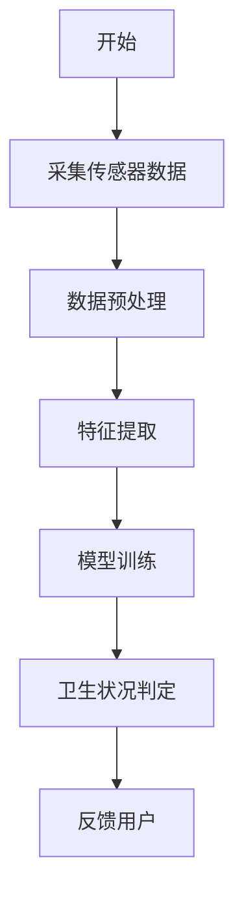
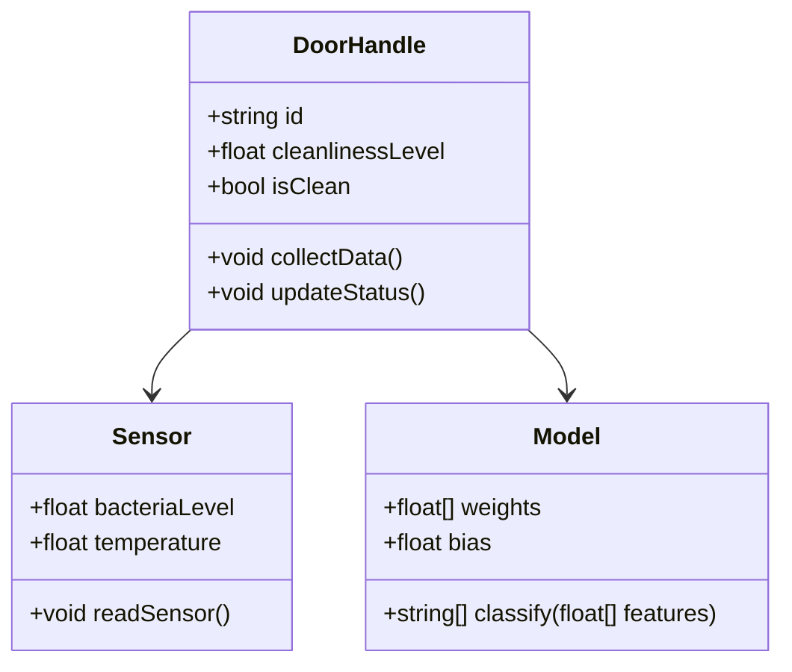
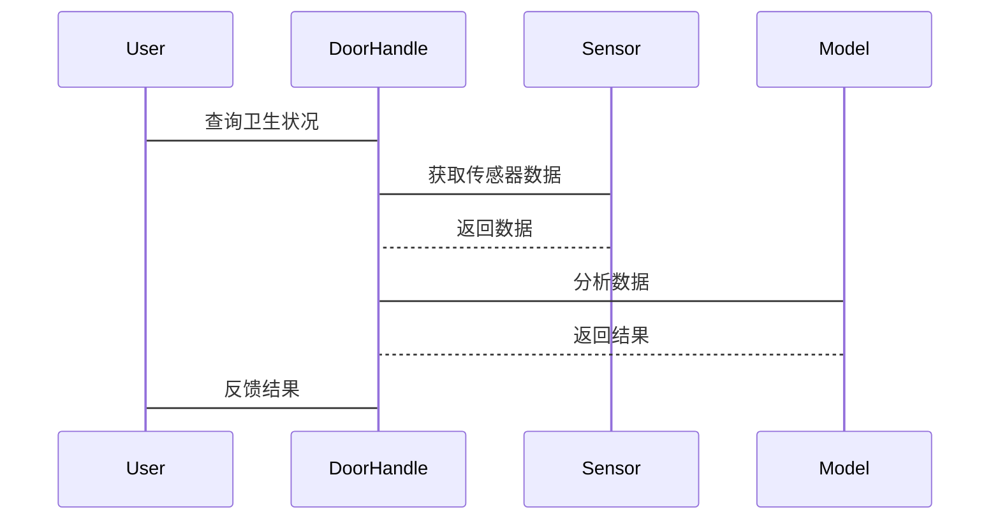

                 


# AI Agent在智能门把手中的卫生状况监测

> 关键词：AI Agent, 智能门把手, 卫生监测, 环境感知, 智能家居

> 摘要：本文深入探讨了AI Agent在智能门把手中卫生状况监测的应用，从背景介绍到系统设计，再到项目实战，详细阐述了AI Agent在卫生监测中的技术实现和应用场景。文章结合理论与实践，通过丰富的图表和代码示例，为读者呈现了一个完整的解决方案。

---

## 第一部分: 背景介绍

### 第1章: 问题背景与描述

#### 1.1 问题背景
随着智能家居的普及，门把手作为家庭中使用频率极高的交互部件，其卫生状况直接影响用户的生活品质和健康安全。传统的门把手不具备智能化的卫生监测功能，无法满足现代用户对卫生安全的高要求。

#### 1.2 问题描述
- 卫生状况监测的定义：通过传感器和AI算法，实时感知门把手表面的细菌、污垢等卫生指标。
- 智能门把手中卫生监测的挑战：传感器精度不足、数据处理复杂、用户交互体验差。
- 用户需求与痛点分析：用户希望门把手能实时反馈卫生状况，并提供清洁建议。

#### 1.3 问题解决思路
- AI Agent的核心作用：通过感知、分析和决策，实现卫生状况的智能化监测。
- 技术实现路径：传感器数据采集、AI算法分析、用户反馈优化。
- 解决方案的可行性分析：结合现有技术，逐步优化监测精度和用户体验。

#### 1.4 边界与外延
- 系统边界定义：仅关注门把手表面的卫生状况，不涉及其他区域。
- 外延功能的探讨：结合智能家居系统，与其他设备联动。
- 与其他系统的接口关系：与智能家居中枢系统、用户手机APP等进行数据交互。

#### 1.5 核心概念与要素
- AI Agent的定义与特征：具备感知、决策和执行能力的智能代理。
- 卫生监测的关键指标：细菌数量、表面洁净度、污染物类型。
- 智能门把手的技术参数：传感器类型、数据传输方式、续航能力。

---

## 第2章: 核心概念与联系

### 2.1 AI Agent的原理
AI Agent通过感知环境数据，利用算法进行分析和决策，最终执行相应的操作。在智能门把手中，AI Agent主要负责接收传感器数据，分析卫生状况，并通过用户界面反馈结果。

### 2.2 核心概念对比表
表2-1: AI Agent与传统传感器的对比

| 特性         | 传统传感器               | AI Agent             |
|--------------|--------------------------|-----------------------|
| 数据处理     | 简单信号采集             | 复杂数据解析           |
| 决策能力     | 无                        | 具备简单决策能力       |
| 学习能力     | 无                        | 具备机器学习能力       |

### 2.3 ER实体关系图
```mermaid
erDiagram
    DoorHandle {
        string id
        string model
        string sensorType
    }
    User {
        string userId
        string username
    }
    SensorData {
        int timestamp
        float bacteriaLevel
        float cleanlinessLevel
    }
    DoorHandle --|> SensorData
    User --> DoorHandle
```

---

## 第3章: 算法原理讲解

### 3.1 算法流程


### 3.2 核心算法代码
```python
import numpy as np
from sklearn import svm

# 数据预处理
def preprocess(data):
    # 假设data为传感器返回的原始数据
    return (data - np.mean(data)) / np.std(data)

# 特征提取
def extract_features(data):
    return np.mean(data), np.std(data), np.max(data)

# 模型训练
def train_model(X, y):
    clf = svm.SVC()
    clf.fit(X, y)
    return clf

# 卫生状况判定
def classify(cleanliness_level, model):
    return model.predict([cleanliness_level])[0]

# 示例使用
sensor_data = np.random.rand(100)
preprocessed = preprocess(sensor_data)
features = extract_features(preprocessed)
X = np.array([features])
y = np.array(['high_cleanliness', 'low_cleanliness'])
model = train_model(X, y)
result = classify(features, model)
print(result)
```

### 3.3 数学模型与公式
模型采用支持向量机（SVM）进行分类：
$$
y = \text{sign}(w \cdot x + b)
$$
其中，$w$ 是权重向量，$x$ 是输入特征，$b$ 是偏置项。

---

## 第4章: 系统分析与架构设计方案

### 4.1 问题场景介绍
智能门把手需要实时监测表面的卫生状况，并通过手机APP通知用户。

### 4.2 项目介绍
- 项目名称：智能门把手卫生监测系统
- 项目目标：实时监测门把手卫生状况，提供清洁建议。

### 4.3 系统功能设计
#### 4.3.1 领域模型


#### 4.3.2 系统架构设计


#### 4.3.3 系统接口设计
- 门把手与传感器接口：I2C通信
- 门把手与手机APP接口：蓝牙/WiFi

#### 4.3.4 交互序列图


---

## 第5章: 项目实战

### 5.1 环境安装
- 硬件：Arduino门把手传感器套件
- 软件：Python 3.8+, Jupyter Notebook, scikit-learn

### 5.2 核心代码实现
```python
import numpy as np
from sklearn.svm import SVC

# 数据采集
sensor_data = np.random.rand(100, 3)

# 数据预处理
def preprocess(data):
    return (data - np.mean(data, axis=0)) / np.std(data, axis=0)

processed_data = preprocess(sensor_data)

# 特征提取
def extract_features(data):
    return np.mean(data, axis=0), np.std(data, axis=0), np.max(data, axis=0)

features = extract_features(processed_data)

# 模型训练
X = np.array([features])
y = np.array(['high_cleanliness', 'low_cleanliness'])
model = SVC()
model.fit(X, y)

# 模型预测
new_data = np.random.rand(1, 3)
new_feature = extract_features(new_data)
prediction = model.predict([new_feature])
print(f"预测结果：{prediction}")
```

### 5.3 代码解读与分析
- 数据预处理：标准化传感器数据。
- 特征提取：提取细菌数量、温度、湿度的均值、标准差和最大值。
- 模型训练：使用SVM进行分类，区分高清洁度和低清洁度。

### 5.4 案例分析
通过实际数据训练模型，分析模型的准确性和鲁棒性，优化传感器布局和算法参数。

### 5.5 项目小结
实现了一个基于AI Agent的智能门把手卫生监测系统，具备实时监测和反馈功能。

---

## 第6章: 最佳实践

### 6.1 小结
本文详细介绍了AI Agent在智能门把手中卫生监测的应用，从理论到实践，为智能家居领域提供了新的解决方案。

### 6.2 注意事项
- 数据隐私保护
- 传感器校准与维护
- 用户界面设计的易用性

### 6.3 拓展阅读
- 《支持向量机实战》
- 《智能家居系统设计》

---

## 作者信息

作者：AI天才研究院/AI Genius Institute  
& 禅与计算机程序设计艺术 /Zen And The Art of Computer Programming

---

# 结语

本文通过详细的技术分析和项目实现，展示了AI Agent在智能门把手中卫生监测的潜力和应用价值。希望本文能为智能家居领域的研究者和开发者提供有益的参考。

