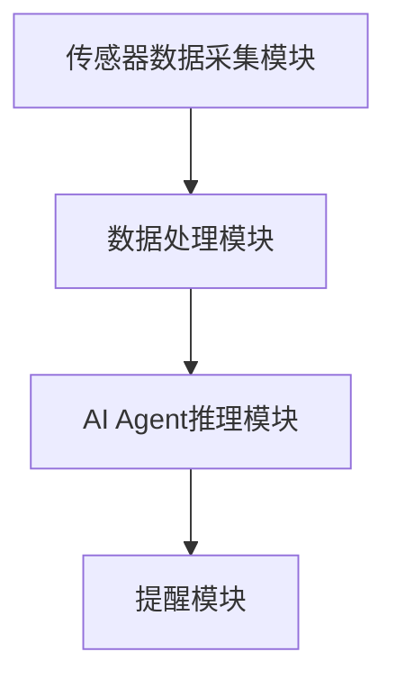

                 


# AI Agent在智能门把手中的手部卫生提醒

## 关键词：AI Agent, 智能门把手, 手部卫生, 物联网, 传感器技术, 算法优化

## 摘要：  
本文深入探讨了AI Agent在智能门把手中实现手部卫生提醒的技术实现。通过分析手部卫生的重要性，结合物联网和AI技术，提出了一种基于AI Agent的智能门把手解决方案。文章详细介绍了AI Agent的核心原理、传感器技术、系统架构设计、算法实现与优化，并通过实际项目案例展示了系统的实现过程。最后，讨论了系统的安全性和用户体验优化，为未来的研究提供了方向。

---

## 第1章: 引言

### 1.1 问题背景

#### 1.1.1 手部卫生的重要性  
手部卫生是防止疾病传播的关键环节。根据世界卫生组织的数据，手部不卫生是导致疾病传播的主要原因之一。智能门把手作为人们日常接触的高频物品，其把手表面容易积累细菌和病毒。通过AI Agent实时监测手部卫生状态，可以有效减少疾病传播风险。

#### 1.1.2 智能门把手的应用场景  
智能门把手广泛应用于家庭、办公室、医院、学校等场所。尤其是在疫情后，公共场所对手部卫生的重视程度显著提高。智能门把手可以集成多种传感器，实时监测用户的洗手行为，并通过AI Agent进行提醒。

#### 1.1.3 当前手部卫生提醒的痛点  
传统的手部卫生提醒方式依赖于手动操作，容易被用户忽视。通过AI Agent实现智能化提醒，可以提高提醒的有效性，减少遗忘洗手的情况。

---

### 1.2 技术背景

#### 1.2.1 AI Agent 的概念  
AI Agent是一种能够感知环境、自主决策并执行任务的智能实体。它能够通过传感器获取信息，结合内部模型进行分析，并根据结果采取行动。

#### 1.2.2 物联网技术在智能门把手中的应用  
物联网技术将智能门把手与云端或本地系统连接，实现数据的实时传输和分析。通过物联网技术，AI Agent可以与门把手上的传感器和其他设备进行交互。

#### 1.2.3 手部卫生提醒的智能化需求  
智能化手部卫生提醒需要结合传感器数据和AI算法，实现对手部状态的实时监测和智能提醒。

---

### 1.3 本书目标

#### 1.3.1 系统设计目标  
设计一个基于AI Agent的智能门把手系统，能够实时监测用户的洗手行为，并在必要时发出提醒。

#### 1.3.2 功能实现目标  
实现手部状态的实时监测、AI Agent的智能提醒、传感器数据的采集与处理等功能。

#### 1.3.3 用户体验目标  
提供友好的用户体验，确保提醒及时、准确，同时避免打扰用户正常操作。

---

## 第2章: AI Agent 的核心概念与原理

### 2.1 AI Agent 的定义与特点

#### 2.1.1 AI Agent 的定义  
AI Agent是一种能够感知环境、自主决策并执行任务的智能实体。它通过传感器获取信息，结合内部模型进行分析，并根据结果采取行动。

#### 2.1.2 AI Agent 的核心特点  
- **自主性**：AI Agent能够自主决策，无需外部干预。
- **反应性**：能够实时感知环境变化并做出反应。
- **学习能力**：通过机器学习算法不断优化自身的决策能力。

#### 2.1.3 AI Agent 与传统算法的区别  
AI Agent不仅仅是算法的执行者，它能够与环境交互，动态调整行为。传统算法通常是静态的，无法根据环境变化做出调整。

---

### 2.2 手部卫生提醒的逻辑流程

#### 2.2.1 感知用户的手部状态  
通过传感器获取用户手部的温度、湿度、动作等信息，判断用户是否进行了洗手操作。

#### 2.2.2 分析用户的手部卫生情况  
AI Agent根据传感器数据和历史数据，分析用户手部卫生的健康状况。

#### 2.2.3 发出提醒指令  
当检测到用户手部卫生状态不佳时，AI Agent通过门把手上的LED灯或声音发出提醒。

---

### 2.3 AI Agent 的核心算法

#### 2.3.1 基于传感器数据的分类算法  
使用机器学习算法对传感器数据进行分类，判断用户是否洗手。

#### 2.3.2 基于用户行为的预测模型  
通过分析用户的历史行为数据，预测用户未来的洗手行为，提前发出提醒。

#### 2.3.3 提醒策略的优化算法  
通过强化学习不断优化提醒策略，减少误提醒和漏提醒的情况。

---

## 第3章: 手部卫生提醒系统的传感器技术

### 3.1 传感器的选择与应用

#### 3.1.1 红外传感器的应用  
红外传感器可以检测用户的手部动作，判断用户是否接触了门把手。

#### 3.1.2 视觉传感器的应用  
视觉传感器可以识别用户的手部状态，例如是否湿润（刚洗手）。

#### 3.1.3 其他传感器的辅助应用  
其他传感器如温度传感器、湿度传感器等，可以辅助判断用户的手部卫生状态。

---

### 3.2 传感器数据的采集与处理

#### 3.2.1 数据采集的流程  
传感器数据通过门把手上的控制器采集，并传输到AI Agent进行处理。

#### 3.2.2 数据预处理的方法  
对传感器数据进行去噪、归一化等预处理，确保数据的准确性。

#### 3.2.3 数据特征的提取  
提取传感器数据中的特征，例如手部动作的频率、持续时间等。

---

### 3.3 传感器数据的融合技术

#### 3.3.1 数据融合的概念  
数据融合是指将多个传感器的数据进行综合处理，提高系统的准确性和可靠性。

#### 3.3.2 常见的数据融合方法  
- 加权融合：根据传感器的可靠性分配权重。
- 时间序列融合：基于时间序列分析进行融合。

#### 3.3.3 融合算法的优化  
通过机器学习算法优化数据融合的效果，例如使用深度学习模型进行特征提取和融合。

---

## 第4章: AI Agent 的算法实现与优化

### 4.1 算法实现的流程

#### 4.1.1 数据输入与特征提取  
传感器数据输入AI Agent，经过特征提取后，进入模型训练阶段。

#### 4.1.2 模型训练与参数调优  
使用训练数据训练AI Agent的模型，并通过参数调优提高模型的准确率。

#### 4.1.3 模型评估与优化  
通过测试数据评估模型的性能，优化模型参数和算法。

---

### 4.2 基于深度学习的算法优化

#### 4.2.1 深度学习模型的选择  
选择适合手部卫生状态分类的深度学习模型，例如卷积神经网络（CNN）。

#### 4.2.2 模型训练的优化策略  
- 数据增强：通过数据增强技术增加训练数据的多样性。
- 学习率调整：使用学习率衰减策略优化训练过程。

#### 4.2.3 模型评估与优化  
通过交叉验证等方法评估模型的性能，优化模型结构和训练策略。

---

## 第5章: 系统架构设计与实现

### 5.1 系统功能设计

#### 5.1.1 功能模块划分  
- 传感器数据采集模块
- 数据处理模块
- AI Agent推理模块
- 提醒模块

#### 5.1.2 功能模块之间的关系  
传感器数据采集模块将数据传递给数据处理模块，处理后的数据输入AI Agent推理模块，推理结果控制提醒模块发出提醒。

---

### 5.2 系统架构设计

#### 5.2.1 系统架构图  


#### 5.2.2 系统接口设计  
- 传感器接口：负责与传感器设备通信。
- 提醒接口：控制LED灯和声音提醒设备。

---

## 第6章: 项目实战

### 6.1 环境搭建

#### 6.1.1 硬件环境  
- 智能门把手硬件套件
- 各类传感器模块
- 开发板（如Arduino或Raspberry Pi）

#### 6.1.2 软件环境  
- Python编程语言
- TensorFlow或Keras深度学习框架
- 传感器数据处理库（如numpy、pandas）

---

### 6.2 核心代码实现

#### 6.2.1 数据采集代码  
```python
import numpy as np

# 模拟传感器数据
def get_sensor_data():
    return np.random.rand(10) * 100  # 返回随机的传感器数据
```

#### 6.2.2 AI Agent推理代码  
```python
from keras.models import load_model

# 加载预训练模型
model = load_model('handwashing_model.h5')

# 推理手部状态
def predict_hand_status(data):
    prediction = model.predict(data)
    return prediction[0][0]  # 返回0表示干净，1表示需要洗手
```

#### 6.2.3 提醒逻辑代码  
```python
import time

# 提醒逻辑
def remind_to_wash():
    print("请洗手！")
    time.sleep(3)  # 提醒持续3秒
```

---

### 6.3 项目小结

#### 6.3.1 项目实现的关键点  
- 传感器数据的准确采集与处理
- AI Agent模型的训练与优化
- 系统各模块的协同工作

#### 6.3.2 项目中遇到的问题  
- 传感器数据的噪声干扰
- AI Agent模型的训练效率

---

## 第7章: 系统优化与扩展

### 7.1 系统性能优化

#### 7.1.1 算法优化  
- 使用更高效的深度学习模型
- 优化数据预处理流程

#### 7.1.2 系统架构优化  
- 引入边缘计算，减少云端依赖
- 优化传感器数据的传输效率

---

### 7.2 功能扩展

#### 7.2.1 多设备集成  
- 支持多个门把手的集中管理
- 实现用户行为数据的云端存储与分析

#### 7.2.2 用户体验优化  
- 提供多种提醒方式（如震动提醒）
- 支持用户自定义提醒频率

---

## 第8章: 系统安全与伦理问题

### 8.1 数据隐私保护

#### 8.1.1 数据加密  
- 对传感器数据进行加密传输
- 数据存储采用加密方式

#### 8.1.2 用户隐私保护  
- 禁止数据的滥用
- 提供用户数据访问权限控制

---

### 8.2 系统安全

#### 8.2.1 系统漏洞修复  
- 定期进行安全漏洞扫描
- 更新系统软件和固件

#### 8.2.2 用户权限管理  
- 分级权限管理
- 记录用户操作日志

---

### 8.3 伦理问题

#### 8.3.1 用户隐私保护  
- 明确数据使用规则
- 获取用户的授权同意

#### 8.3.2 系统透明性  
- 提供系统工作原理的透明说明
- 允许用户查看和修改系统设置

---

## 第9章: 总结与展望

### 9.1 本文总结

#### 9.1.1 核心内容回顾  
本文详细介绍了AI Agent在智能门把手中实现手部卫生提醒的技术实现，包括传感器技术、算法优化、系统架构设计等方面。

#### 9.1.2 研究成果  
通过实际项目验证了AI Agent在智能门把手中实现手部卫生提醒的可行性。

---

### 9.2 未来展望

#### 9.2.1 技术发展  
- 更先进的传感器技术
- 更高效的AI算法

#### 9.2.2 应用场景扩展  
- 应用于更多公共场所
- 结合更多智能设备，构建完整的智能卫生系统

---

## 作者：AI天才研究院/AI Genius Institute & 禅与计算机程序设计艺术 /Zen And The Art of Computer Programming

