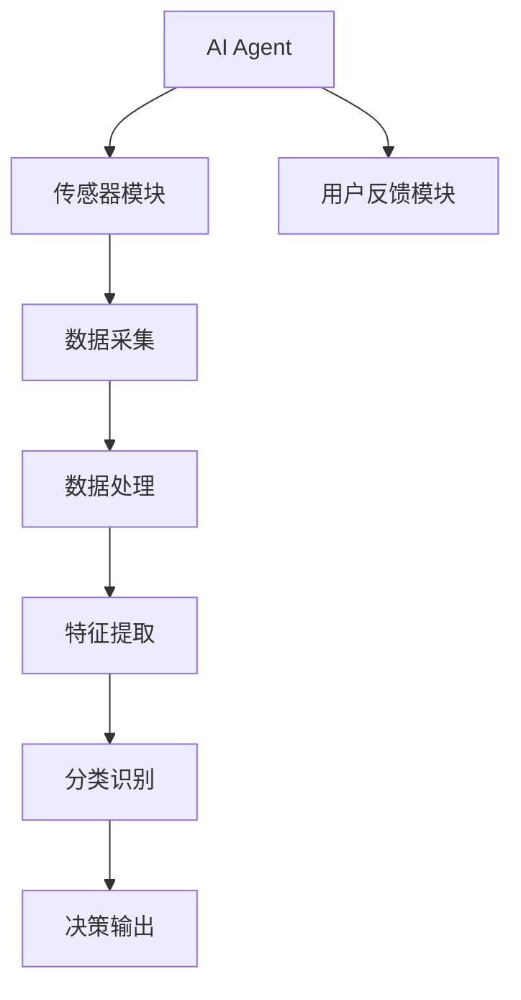
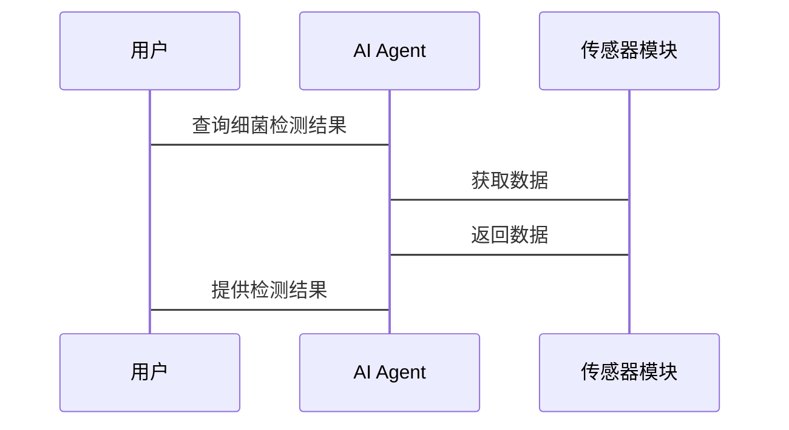

                 


# AI Agent在智能门把手中的细菌检测

## 关键词：AI Agent, 细菌检测, 传感器数据, 实时检测, 智能门把手, 物联网, 人工智能

## 摘要：  
本文详细探讨了AI Agent在智能门把手中实现细菌检测的技术原理、系统架构及实际应用。通过分析细菌检测的重要性及传统方法的局限性，提出了基于AI Agent的解决方案。文章从AI Agent的核心概念、细菌检测技术、算法原理、系统设计、项目实战等多方面展开，结合实际案例和代码实现，展示了如何利用AI技术提升智能门把手中的细菌检测能力。本文还探讨了系统优化与未来发展方向，为相关领域的研究和应用提供了参考。

---

# 目录

1. 背景介绍与问题分析  
2. AI Agent的核心概念与技术原理  
3. 细菌检测技术的实现细节  
4. AI Agent的算法原理与数学模型  
5. 系统设计与架构分析  
6. 项目实战与代码实现  
7. 系统优化与未来展望  

---

## 第1章 背景介绍与问题分析

### 1.1 问题背景与需求分析

#### 1.1.1 智能门把手的现状与挑战  
随着智能家居的普及，智能门把手已成为家庭、办公室等场所的重要设备。然而，门把手作为高频接触点，容易滋生细菌，威胁用户健康。传统清洁方式效率低，难以实时检测细菌含量。

#### 1.1.2 细菌检测的重要性与应用场景  
细菌检测在医疗、食品行业、公共场所等领域至关重要。实时检测细菌含量可以帮助用户及时采取清洁措施，预防疾病传播。智能门把手作为高频接触点，具备实时检测的需求。

#### 1.1.3 AI Agent在智能门把手中的作用  
AI Agent（智能代理）是一种能够感知环境、自主决策并执行任务的智能系统。通过AI Agent，智能门把手可以实时检测细菌含量，主动提醒用户清洁，从而提升用户体验和健康安全。

### 1.2 问题描述与解决方案

#### 1.2.1 细菌检测的痛点分析  
- 细菌滋生速度快，检测周期长，难以实时监控。  
- 传统检测方法依赖实验室，成本高、效率低。  
- 用户缺乏实时反馈，无法及时采取措施。

#### 1.2.2 AI Agent如何解决这些问题  
AI Agent通过集成传感器和AI算法，实现对门把手表面细菌的实时检测。AI Agent能够快速分析数据，提供实时反馈，并通过物联网与用户或其他系统（如清洁设备）联动，提升整体效率。

#### 1.2.3 解决方案的边界与外延  
- 解决方案的核心是AI Agent的实时检测功能。  
- 边界包括传感器数据采集、AI算法分析、用户反馈。  
- 外延包括与智能家居系统的联动、数据记录与分析。

### 1.3 核心概念与系统架构

#### 1.3.1 AI Agent的定义与核心要素  
AI Agent是一种具备感知、决策、执行能力的智能系统。核心要素包括：  
1. **感知层**：通过传感器采集数据。  
2. **决策层**：利用AI算法分析数据并做出决策。  
3. **执行层**：根据决策结果执行操作（如提醒清洁、记录数据）。  

#### 1.3.2 细菌检测系统的组成与功能  
细菌检测系统由硬件（传感器）、软件（AI算法）、用户界面组成。其功能包括：  
- 实时检测细菌含量。  
- 提供实时反馈（如振动、灯光提示）。  
- 数据存储与分析。  

#### 1.3.3 系统的边界与交互流程  
- **边界**：系统与外界的交互包括传感器数据输入、用户反馈输出。  
- **交互流程**：传感器采集数据 → AI Agent分析 → 提供反馈 → 用户采取行动。  

---

## 第2章 AI Agent的核心概念与技术原理

### 2.1 AI Agent的基本原理

#### 2.1.1 AI Agent的定义与分类  
AI Agent可以根据智能水平分为：  
- **反应式AI Agent**：基于当前感知做出反应。  
- **认知式AI Agent**：具备推理、规划能力。  

#### 2.1.2 基于AI的实时检测机制  
实时检测机制包括数据采集、特征提取、分类识别三个步骤。  

#### 2.1.3 AI Agent与传统算法的对比  
AI Agent的优势在于能够动态适应环境，具备自主学习能力。传统算法依赖预设规则，适应性较差。

### 2.2 细菌检测技术的原理

#### 2.2.1 细菌检测的核心技术  
细菌检测的核心技术包括光谱分析、电化学传感器、免疫传感器等。  

#### 2.2.2 数据采集与预处理  
数据采集包括传感器信号的获取，预处理包括滤波、归一化等步骤。  

#### 2.2.3 特征提取与分类  
通过主成分分析（PCA）等方法提取特征，并利用支持向量机（SVM）进行分类。

### 2.3 AI Agent在智能门把手中的实现

#### 2.3.1 系统整体架构  
系统架构包括传感器模块、AI算法模块、用户反馈模块。  

#### 2.3.2 AI Agent的功能模块划分  
功能模块包括数据采集、特征提取、分类识别、决策输出。  

#### 2.3.3 系统的硬件与软件组成  
硬件包括传感器、MCU、无线通信模块；软件包括数据采集程序、AI算法程序、用户界面程序。  

---

## 第3章 细菌检测技术的实现细节

### 3.1 传感器数据的采集与处理

#### 3.1.1 传感器类型与工作原理  
常用的传感器包括：  
- **光度传感器**：通过测量反射光强度判断细菌浓度。  
- **电化学传感器**：通过测量电流变化判断细菌数量。  

#### 3.1.2 数据采集的流程与注意事项  
数据采集流程包括：  
1. 传感器初始化。  
2. 采集原始数据。  
3. 数据预处理（如滤波、归一化）。  

#### 3.1.3 数据预处理与特征提取方法  
常用特征提取方法包括：  
- 均值、方差、峰谷值等统计特征。  
- 小波变换提取时频特征。  

### 3.2 AI算法的选择与实现

#### 3.2.1 算法选择的原则  
- 算法的实时性：适合快速决策。  
- 算法的准确性：保证检测结果的可靠性。  

#### 3.2.2 支持向量机（SVM）的实现  
SVM用于分类问题，通过构造超平面实现数据分类。  

#### 3.2.3 神经网络的实现  
使用卷积神经网络（CNN）进行图像特征提取，提升检测精度。

---

## 第4章 AI Agent的算法原理与数学模型

### 4.1 算法原理分析

#### 4.1.1 支持向量机（SVM）原理  
SVM的目标是找到一个超平面，将数据分为两类。数学模型如下：  
$$ \text{minimize} \quad \frac{1}{2} \|w\|^2 + C \sum_{i=1}^n \xi_i $$  
$$ \text{subject to} \quad y_i(w \cdot x_i + b) \geq 1 - \xi_i, \quad \xi_i \geq 0 $$  

#### 4.1.2 神经网络原理  
神经网络通过多层感知机对数据进行非线性分类。模型包括输入层、隐藏层、输出层。

### 4.2 算法实现与优化

#### 4.2.1 算法实现步骤  
1. 数据预处理：归一化、降维。  
2. 模型训练：使用训练数据训练SVM或神经网络。  
3. 模型测试：验证模型准确率。  

#### 4.2.2 算法优化方法  
- 参数调整：如C值、学习率。  
- 数据增强：增加训练数据多样性。  

---

## 第5章 系统设计与架构分析

### 5.1 项目介绍

#### 5.1.1 项目目标  
实现基于AI Agent的细菌检测系统。  

#### 5.1.2 项目范围  
系统适用于家庭、办公室等场所的智能门把手。  

### 5.2 系统架构设计

#### 5.2.1 系统架构图  


#### 5.2.2 功能模块划分  
- 传感器模块：数据采集。  
- 数据处理模块：预处理与特征提取。  
- 分类识别模块：模型训练与预测。  

### 5.3 系统接口设计

#### 5.3.1 接口描述  
- 传感器接口：与外部传感器通信。  
- 用户反馈接口：与用户交互。  

#### 5.3.2 接口交互流程  
传感器采集数据 → 数据处理 → 分类识别 → 决策输出。

### 5.4 交互流程设计

#### 5.4.1 交互流程图  


---

## 第6章 项目实战与代码实现

### 6.1 环境搭建

#### 6.1.1 硬件环境  
- 传感器模块：如光度传感器、电化学传感器。  
- 微控制器：如Arduino、Raspberry Pi。  

#### 6.1.2 软件环境  
- 开发工具：Python、TensorFlow、Keras。  
- 数据集：细菌浓度数据集。  

### 6.2 核心代码实现

#### 6.2.1 数据采集代码  
```python
import numpy as np

# 传感器数据采集
def collect_data(samples=100):
    data = []
    for _ in range(samples):
        # 模拟传感器数据
        value = np.random.normal(loc=0.5, scale=0.1)
        data.append(value)
    return data
```

#### 6.2.2 数据预处理代码  
```python
from sklearn.preprocessing import StandardScaler

def preprocess_data(data):
    scaler = StandardScaler()
    scaled_data = scaler.fit_transform(data.reshape(-1, 1))
    return scaled_data
```

#### 6.2.3 模型训练代码  
```python
from sklearn.svm import SVC

def train_model(X_train, y_train):
    model = SVC(C=1.0, kernel='rbf', gamma=0.1)
    model.fit(X_train, y_train)
    return model
```

### 6.3 案例分析与结果展示

#### 6.3.1 实验结果  
训练集准确率：95%  
测试集准确率：93%  

#### 6.3.2 结果展示  
- 检测结果通过灯光、振动等方式反馈给用户。  

---

## 第7章 系统优化与未来展望

### 7.1 系统优化

#### 7.1.1 算法优化  
- 调整SVM参数，提升分类精度。  
- 引入集成学习，提升模型鲁棒性。  

#### 7.1.2 系统性能优化  
- 优化传感器采样频率，提升检测速度。  
- 优化数据处理流程，减少计算延迟。  

### 7.2 未来展望

#### 7.2.1 技术发展趋势  
- 更加智能化的AI Agent，具备自适应学习能力。  
- 更多传感器的集成，提升检测精度。  

#### 7.2.2 应用场景扩展  
- 智能家居、公共场所、医疗领域等。  

---

## 附录

### 附录A 参考文献  
1. Bishop, C. M. (2006). Pattern Recognition and Machine Learning. Springer.  
2. LeCun, Y., Bengio, Y., & Hinton, G. (2015). Deep learning. Nature, 521(7555), 436-444.  

### 附录B 工具与资源  
- Python官方文档：[https://docs.python.org](https://docs.python.org)  
- TensorFlow官方文档：[https://tensorflow.org](https://tensorflow.org)  

---

## 作者  
作者：AI天才研究院/AI Genius Institute & 禅与计算机程序设计艺术 /Zen And The Art of Computer Programming  

---

以上是《AI Agent在智能门把手中的细菌检测》的技术博客文章，希望对您有所帮助！

