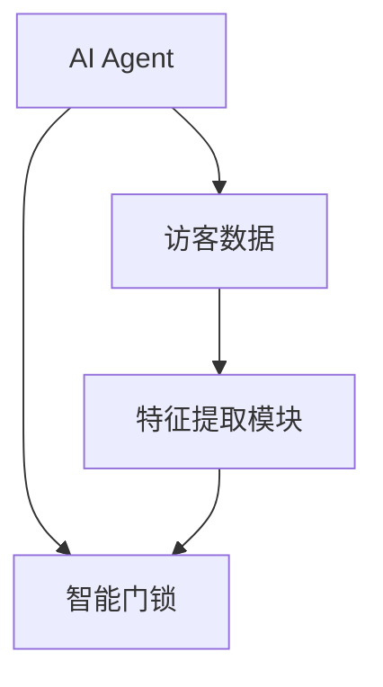
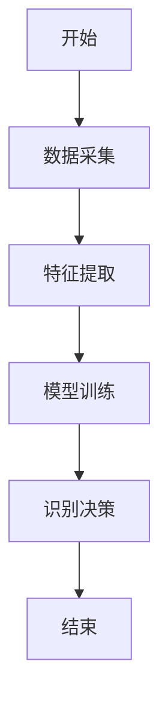
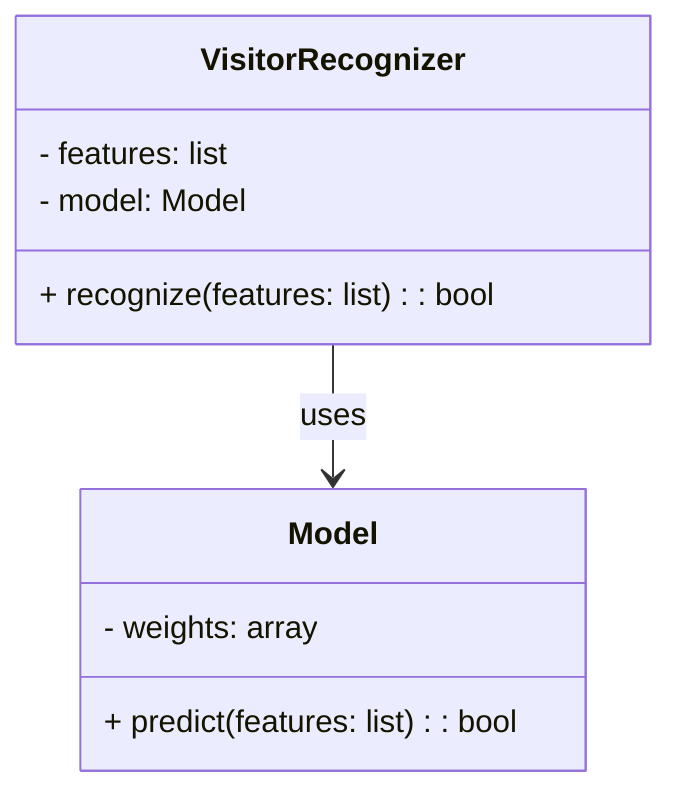
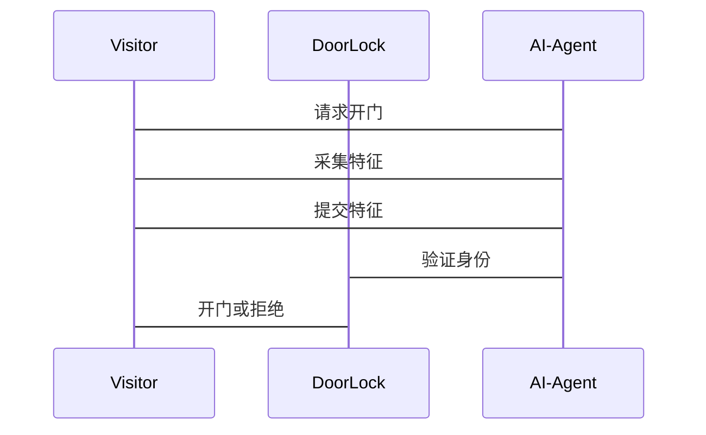

                 


# AI Agent在智能门把手中的访客识别

> 关键词：AI Agent, 智能门锁, 访客识别, 机器学习, 算法原理

> 摘要：本文探讨AI Agent在智能门锁中的应用，重点分析访客识别的核心算法原理、系统架构设计以及实际项目实现。通过详细的技术分析和实例说明，揭示AI Agent如何提升智能门锁的安全性和智能化水平。

---

## 第一部分: AI Agent在智能门把手中的访客识别背景介绍

### 第1章: 智能门锁与AI Agent概述

#### 1.1 智能门锁的发展历程

- 1.1.1 传统门锁的局限性
  - 机械锁的钥匙易丢失或被盗
  - 无法记录开锁记录
  - 无法远程控制

- 1.1.2 智能门锁的定义与特点
  - 集成电子技术、网络通信和智能算法
  - 支持多种开门方式（指纹、密码、卡片、远程授权）
  - 具备联网功能，可远程监控和管理

- 1.1.3 AI Agent在智能门锁中的应用前景
  - 提供智能化的访客识别服务
  - 实现主动决策和自适应优化
  - 打造更加安全和便捷的门禁系统

#### 1.2 访客识别问题背景

- 1.2.1 访客识别的核心问题
  - 如何准确识别合法访客
  - 如何快速响应和处理访客请求
  - 如何确保识别过程的安全性和隐私性

- 1.2.2 访客识别的场景与需求
  - 家庭用户：访客授权开门
  - 商业场景：访客登记与访问权限管理
  - 公共场所：陌生人识别与预警

- 1.2.3 访客识别的技术挑战
  - 多模态数据的融合与处理
  - 实时性与准确性之间的平衡
  - 系统的可扩展性和灵活性

### 第2章: AI Agent与智能门锁的结合

#### 2.1 AI Agent的基本概念

- 2.1.1 AI Agent的定义
  - 具备感知、推理、学习和执行能力的智能体
  - 可以根据环境信息做出决策并采取行动

- 2.1.2 AI Agent的核心特征
  - 主动性：无需外部触发，主动执行任务
  - 智能性：具备问题解决和自适应能力
  - 社会性：能够与其他系统或用户进行交互

- 2.1.3 AI Agent与传统算法的区别
  - 传统算法：基于规则的被动执行
  - AI Agent：具备主动决策和学习能力

#### 2.2 AI Agent在智能门锁中的应用

- 2.2.1 访客识别的智能化需求
  - 快速识别访客身份
  - 自动判断访客权限
  - 提供个性化的访客服务

- 2.2.2 AI Agent在访客识别中的角色
  - 数据采集与处理：收集访客信息
  - 模式识别与分类：判断访客身份
  - 决策与反馈：根据识别结果执行操作

- 2.2.3 AI Agent与智能门锁的交互流程
  - 访客触发开门请求
  - AI Agent采集并分析访客信息
  - 根据分析结果决定是否开门
  - 反馈结果并记录日志

---

## 第二部分: AI Agent在访客识别中的核心概念与联系

### 第3章: 核心概念与原理

#### 3.1 AI Agent的核心原理

- 3.1.1 感知与决策机制
  - 通过传感器或网络接口获取环境信息
  - 利用机器学习模型进行分析和判断
  - 根据判断结果做出决策

- 3.1.2 学习与推理能力
  - 使用监督学习、无监督学习或强化学习算法
  - 基于历史数据优化识别模型
  - 推理访客意图和行为

- 3.1.3 自适应优化算法
  - 根据新数据动态调整识别模型
  - 自动优化识别准确率和响应速度
  - 适应不同场景和用户需求

#### 3.2 访客识别的核心原理

- 3.2.1 特征提取与匹配
  - 从访客信息中提取关键特征（如指纹、人脸、声音等）
  - 通过特征匹配确定访客身份
  - 支持多种特征的融合识别

- 3.2.2 模式识别与分类
  - 利用分类算法（如支持向量机、随机森林、神经网络）判断访客类别
  - 对异常行为进行预警和处理
  - 实现高准确率和低误报率

- 3.2.3 多模态数据融合
  - 综合使用多种数据源（如图像、声音、传感器数据）提高识别精度
  - 通过数据融合技术优化识别结果
  - 提供更可靠的访客识别服务

### 第4章: 核心概念对比与实体关系

#### 4.1 AI Agent与传统算法对比

| 特性                | AI Agent                          | 传统算法                          |
|---------------------|-----------------------------------|-----------------------------------|
| 决策能力            | 具备主动决策能力                  | 仅执行预设规则                    |
| 学习能力            | 能够学习和优化                    | 无法学习和优化                    |
| 处理复杂性          | 能处理非结构化和动态数据          | 适用于结构化和静态数据            |
| 灵活性              | 高度灵活，适应不同场景            | 灵活性较低，需针对特定场景定制    |

#### 4.2 实体关系图



---

## 第三部分: AI Agent在访客识别中的算法原理

### 第5章: 算法原理与实现

#### 5.1 访客识别算法流程



#### 5.2 算法实现代码

```python
# 示例代码：AI Agent驱动的访客识别
class VisitorRecognizer:
    def __init__(self, model):
        self.model = model

    def recognize(self, features):
        return self.model.predict(features)
```

### 第6章: 数学模型与公式

#### 6.1 特征提取模型

$$ y = f(x) $$

#### 6.2 分类算法

$$ P(y|x) = \prod_{i=1}^{n} P(x_i|y)P(y) $$

#### 6.3 模型优化

$$ \theta = \arg \min \sum (y - \hat{y})^2 $$

---

## 第四部分: 系统分析与架构设计

### 第7章: 系统分析与架构设计

#### 7.1 问题场景介绍

- 系统需要实现访客识别功能
- 系统需要支持多种识别方式
- 系统需要具备高安全性和实时性

#### 7.2 项目介绍

- 项目目标：开发一个基于AI Agent的智能门锁系统
- 项目范围：设计访客识别模块，实现访客身份验证
- 项目技术选型：Python、TensorFlow、Kafka

#### 7.3 系统功能设计

##### 7.3.1 领域模型



##### 7.3.2 系统架构设计


#### 7.4 系统接口设计

- 访客识别接口：`/api/visitor/recognize`
- 访客授权接口：`/api/visitor/authorize`
- 状态查询接口：`/api/visitor/status`

#### 7.5 系统交互流程图



---

## 第五部分: 项目实战

### 第8章: 项目实战

#### 8.1 环境安装

- 安装Python 3.8+
- 安装TensorFlow、Keras、Mermaid
- 安装其他依赖库（如Pillow、numpy）

#### 8.2 核心代码实现

```python
# 示例代码：AI Agent驱动的访客识别
class VisitorRecognizer:
    def __init__(self, model):
        self.model = model

    def recognize(self, features):
        return self.model.predict(features)

# 示例代码：模型训练
from tensorflow.keras.models import Sequential
from tensorflow.keras.layers import Dense, Activation

model = Sequential()
model.add(Dense(64, activation='relu', input_dim=10))
model.add(Dense(1, activation='sigmoid'))
model.compile(optimizer='adam', loss='binary_crossentropy', metrics=['accuracy'])
model.fit(X_train, y_train, epochs=10, batch_size=32)
```

#### 8.3 实际案例分析

- 案例1：家庭访客识别
  - 父母通过手机授权访客开门
  - 系统记录访客开门时间
  - 提供开门记录查询功能

- 案例2：商务场景应用
  - 客户预约访问企业，系统自动授权
  - 访客到达后自动开门
  - 访问结束后自动撤销权限

#### 8.4 项目小结

- 项目实现的关键点
  - 数据采集与处理
  - 模型训练与优化
  - 系统集成与测试

---

## 第六部分: 总结与展望

### 第9章: 总结与展望

#### 9.1 项目总结

- 项目目标的实现情况
- 系统的优缺点分析
- 实际应用中的效果评估

#### 9.2 注意事项

- 数据安全与隐私保护
- 系统的可扩展性和可维护性
- 算法的实时性和准确性

#### 9.3 拓展阅读

- 更深入的AI Agent理论
- 其他智能门锁相关技术
- 最新的访客识别算法研究

---

## 作者：AI天才研究院/AI Genius Institute & 禅与计算机程序设计艺术 /Zen And The Art of Computer Programming

---

这篇文章涵盖了从理论到实践的各个方面，详细讲解了AI Agent在智能门锁中的应用，特别是访客识别的核心算法原理、系统架构设计以及实际项目实现。通过丰富的代码示例和直观的图形展示，帮助读者深入理解技术细节。

